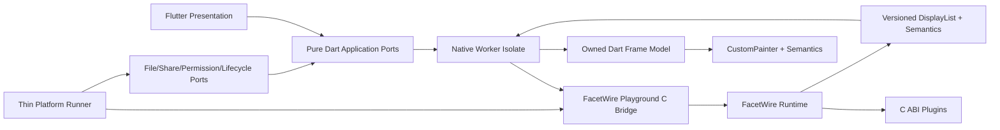

# ADR-0001：FacetWire Playground 跨平台 UI 技术选型

| 项目 | 内容 |
| --- | --- |
| 状态 | 有条件接受（必须通过 UI Spike/P0 PoC） |
| 决策日期 | 2026-08-21 |
| 决策范围 | FacetWire Playground 应用外壳、交互界面、DisplayList 回放和 UI 自动化 |
| 不影响范围 | FacetWire C ABI、插件 ABI、场景格式、Placeholder Renderer |
| 选定方案 | Flutter stable + Dart + `dart:ffi` + 薄平台 Runner |
| 回退顺序 | Qt Quick → Avalonia；重新评估时必须新建 ADR |
| 复审触发 | PoC 失败、目标平台变化、重大许可变化、框架停止支持目标平台 |

本文不是“先选熟悉的框架再补理由”。它冻结选型标准、证据、评分、风险和必须运行的
原型。只有第 10 章的 PoC 全部通过后，状态才能改为“接受”。

## 1. 问题与上下文

FacetWire Playground 不是普通表单应用。它同时是：

1. Windows、Linux、macOS、iOS、Android 五平台参考宿主；
2. C11 FacetWire Runtime 和静态/动态插件的调试前端；
3. Canvas/Page/Layer/Zone 场景检查器；
4. 平台无关 DisplayList 的参考回放器；
5. 参数 Schema 自动 UI、可访问性树、命中区域和性能诊断工具；
6. 可进行 Unit、Component、Golden、Integration 和 Native Contract 测试的样例应用。

因此，“能画出跨平台界面”只满足最小条件。选型还必须证明 C ABI、确定性绘制、语义
映射、测试隔离、受限平台静态链接和开源许可可以同时成立。

### 本章检查

- 问题包含平台、ABI、渲染、调试、测试和许可，不把选型缩减为 UI 风格偏好；
- C ABI 和文件标准被排除在 UI 选型影响范围之外，避免应用框架反向污染标准。

## 2. 硬性门槛

候选方案必须同时满足：

| Gate | 硬性要求 | 验证方式 |
| --- | --- | --- |
| G1 五平台 | 同一主线正式支持五个目标平台 | 官方支持矩阵 + 五平台 CI |
| G2 C ABI | 能安全调用 C11 ABI，支持结构、Buffer、回调或事件轮询 | 生成 Binding + Native 合同测试 |
| G3 部署 | 桌面共享库、五平台静态库/framework 均可接入 | PoC 打包与真机运行 |
| G4 绘制 | 可高效回放自定义 2D DisplayList，支持裁剪、文本、图像和离屏截图 | Render Spike |
| G5 语义 | 自定义绘制可产生可测试的 Semantics/Accessibility 树 | 五平台辅助技术检查 |
| G6 自动化 | 业务逻辑、组件、视觉和端到端测试均有稳定入口 | CI Spike |
| G7 许可 | 可用于 MPL-2.0 开源 Playground，不强迫 FacetWire 插件采用同一许可 | SPDX/依赖审计 |
| G8 隔离 | 插件不必依赖所选 UI 框架，也不能向宿主注入任意 UI 对象 | API 审查与负向测试 |

任何 Gate 未通过都不能靠加分项抵消。缺少官方承诺但技术上“可能运行”视为风险，不视为
正式支持。

### 本章检查

- 每个 Gate 都能由官方资料、构建或自动化测试验证；
- 许可和插件隔离是硬门槛，不会被性能分数掩盖；
- 受限移动平台只要求静态接入，不错误要求任意动态代码加载。

## 3. 加权评价模型

通过资料初筛的候选按 0～5 分评价；总分为 `Σ(权重 × 分数 / 5)`。

| 维度 | 权重 | 5 分定义 |
| --- | ---: | --- |
| 五平台成熟度 | 20 | 五平台为正式支持且有清晰版本矩阵 |
| C ABI 与部署适配 | 18 | 同一窄桥可覆盖桌面动态与全平台静态接入 |
| 自定义渲染与截图 | 16 | 自有 Canvas、离屏绘制、像素读取和性能工具完整 |
| 自动化测试 | 14 | Unit/Component/Golden/Integration 均为一等能力 |
| 无障碍 | 12 | 五平台语义映射和辅助技术路径清楚 |
| 开源许可 | 10 | 宽松许可、分发义务低、第三方模块易审计 |
| 单代码库维护 | 6 | UI、状态和测试高度共享，平台代码可测量 |
| 工具与性能分析 | 4 | 有稳定分析器、调试器和发布工具链 |

评分用于解释取舍，不代替 Gate 和 PoC。分数保留一位小数；证据不足时向下取值。

### 本章检查

- 权重合计 100；
- FacetWire 特有的 ABI、绘制和测试共占 48%，高于一般 UI 便利性；
- 评分规则允许复审时重算，不依赖隐含主观顺序。

## 4. 候选方案事实基线

### 4.1 Flutter + Dart

- 官方发布矩阵覆盖 Android、iOS、Windows、macOS、Debian/Ubuntu Linux；
- Dart Native 通过 `dart:ffi` 调用 C API，并提供 `ffigen` 和 Native Assets/Build Hooks；
- Flutter 自带 Unit、Widget、Integration 测试分层；
- 自定义绘制使用 Canvas/CustomPainter，语义使用 Semantics；
- Flutter SDK 为 BSD-3-Clause，Playground 原创文件可保持 MPL-2.0；
- 风险是桌面复杂工具控件、Linux 辅助技术和 Native/Isolate 边界仍需 PoC 证明。

### 4.2 Qt 6 + Qt Quick/QML

- Qt 正式覆盖五平台，Qt Quick 是官方推荐的新 UI 技术；
- C++ 可直接调用 C ABI，CMake 和原生库接入最自然；
- Qt Quick、QPainter/QQuickItem、Qt Accessibility 和 Qt Test 能覆盖主要需求；
- Qt 的商业/LGPLv3/GPL 多许可和模块差异增加分发、替换链接与第三方审计成本；
- QML + C++ 双层所有权和移动发布仍需专项规范。

### 4.3 Compose Multiplatform

- Android、iOS 和 Desktop(JVM) UI 当前为 Stable，版本页列出五目标系统；
- Kotlin/Native 支持 C interop，但 Desktop(JVM) 需要 JNI/JNA 或额外 Native Bridge，
  同一 FFI 实现路径不如 Dart/Qt 直接；
- Common UI、语义和测试能力良好；
- 官方桌面无障碍状态明确写明 Linux 当前不支持，未通过 G5；
- 因此 0.1 不选，待 Linux Accessibility 正式支持后可复评。

### 4.4 Avalonia

- 官方覆盖 Windows、macOS、Linux、iOS、Android 和 WebAssembly，采用 MIT 许可；
- .NET P/Invoke/LibraryImport 对 C ABI 友好，XAML/MVVM 适合 Inspector 类工具；
- 桌面能力成熟，但当前移动端支持跟随 .NET/MAUI 生命周期，支持层级和最低 .NET
  版本变化较快；
- 五平台自定义绘制、Golden 和无障碍一致性需要比 Flutter 更多项目自建验证。

### 4.5 Tauri 2 + Rust + Web Frontend

- Tauri 2 提供桌面与 Android/iOS 构建路径，Rust 调用 C ABI 直接；
- 前端生态、开发工具和宽松许可有优势；
- 各平台系统 WebView、Canvas/Text 实现和版本不同，不利于把 Playground 作为
  DisplayList 的确定性参考回放器；
- WebView ↔ Rust IPC 又增加一条安全、复制和性能边界；0.1 不采用。

### 本章检查

- 每个候选都按相同五类事实描述，没有只列优点；
- Compose 的淘汰来自官方 Linux 无障碍状态，不是语言偏好；
- Qt 和 Avalonia 保留为有效回退，而不是虚构为不可用。

## 5. 评分结果

| 候选 | 平台 20 | C ABI 18 | 绘制 16 | 测试 14 | 无障碍 12 | 许可 10 | 维护 6 | 工具 4 | 总分 | Gate |
| --- | ---: | ---: | ---: | ---: | ---: | ---: | ---: | ---: | ---: | --- |
| Flutter | 20.0 | 16.2 | 16.0 | 14.0 | 10.8 | 10.0 | 5.4 | 4.0 | **96.4** | 条件通过 |
| Qt Quick | 20.0 | 18.0 | 16.0 | 11.2 | 12.0 | 5.0 | 4.2 | 4.0 | **90.4** | 条件通过 |
| Avalonia | 18.0 | 14.4 | 12.8 | 11.2 | 8.4 | 10.0 | 4.8 | 3.2 | **82.8** | 条件通过 |
| Tauri 2 | 18.0 | 16.2 | 8.0 | 11.2 | 8.4 | 10.0 | 4.2 | 3.2 | **79.2** | G4 风险过高 |
| Compose MP | 20.0 | 10.8 | 14.4 | 9.8 | 4.8 | 10.0 | 4.8 | 3.2 | **77.8** | G5 未通过 |

“条件通过”表示资料满足初筛，仍必须通过本项目 PoC。Flutter 相对 Qt 的主要优势是许可、
单 UI/测试语言和现成组件测试；Qt 的主要优势是 C ABI 与原生图形直接性。

### 本章检查

- 每行加权总分可由第 3 章公式复算；
- 未通过 Gate 的候选不会因总分进入最终方案；
- Flutter 与 Qt 的差异来自项目约束，不宣称普遍优劣。

## 6. 决策

0.1 Playground 有条件选择：

```text
Flutter stable（评估基线 3.47.1）
└── Dart（版本由所固定的 Flutter SDK 决定）
    ├── Domain/Application：纯 Dart、不可变模型、Ports
    ├── Presentation：Flutter Widget + CustomPainter + Semantics
    ├── Native Worker Isolate：批量 C Bridge 调用
    └── Platform Runner：静态注册、文件、分享、权限、生命周期
```

工具链不允许使用 `latest` 漂移。仓库通过 `toolchains.lock.json` 固定 Flutter commit、
Dart、ffigen、CMake 和平台构建工具；升级必须运行 PoC 回归矩阵。

FacetWire 插件不得：

- 引用 Dart/Flutter 类型；
- 返回 Widget、BuildContext、Canvas 或平台 View；
- 从插件线程回调 Dart UI；
- 假定 Flutter 的颜色、字体、坐标或事件模型。

插件只交换 C ABI 数据、DisplayList、Semantics、HitRegion、Action Intent 和受控资源。

### 本章检查

- 选择结果、版本策略和禁止依赖均明确；
- Flutter 只属于 Playground，不成为 FacetWire 标准或插件 ABI 的依赖；
- 版本由锁文件管理，文档中的评估版本不会成为隐式浮动依赖。

## 7. 选定后的架构边界



关键规则：

1. UI Isolate 不执行阻塞 FFI；
2. 一帧只跨边界传一个版本化 Buffer 集合，不逐条 FFI 绘制；
3. Worker 复制完成后立即释放 Native Buffer；
4. CustomPainter 只回放已验证命令，不执行插件代码；
5. Semantics 与同一 Frame/scene revision 一起发布；
6. Runner 不包含业务判断，平台差异通过 Capability Port 表达；
7. Native CTest 不启动 Flutter，Dart Unit 不加载 Native 库，Widget 使用 Fake Port。

### 本章检查

- UI、应用、FFI、Runtime、插件和平台适配的依赖方向单向；
- 每个跨边界对象都有复制和释放点；
- 测试可在相邻层用 Fake 截断，不要求所有测试都启动五平台应用。

## 8. 被否决或延期的替代方案

| 方案 | 0.1 结论 | 重新考虑条件 |
| --- | --- | --- |
| Qt Quick | 首选回退 | Flutter PoC 的 FFI、绘制或五平台无障碍 Gate 失败 |
| Avalonia | 第二回退 | 团队转向 .NET，且移动 Tier/NativeAOT/无障碍 PoC 通过 |
| Compose MP | 延期 | 官方 Linux 桌面无障碍转为支持且 Desktop C Bridge 原型通过 |
| Tauri 2 | 不作为参考渲染器 | DisplayList 移出 WebView，或 WebView 差异不再影响验收 |
| 五套原生 UI | 否决 | 只有共享 UI 框架均无法满足 Gate 时才另立 ADR |

不选择某候选不阻止未来开发非参考宿主；第三方仍可用 Qt、SwiftUI、Compose、Web 或其他
技术消费同一 FacetWire C ABI 和文件格式。

### 本章检查

- 每个替代方案都有可观察的复审条件；
- Playground 参考实现的选型不限制生态中的其他宿主技术。

## 9. 已知风险与缓解

| ID | 风险 | 影响 | 缓解/验证 |
| --- | --- | --- | --- |
| F-01 | Linux 原生 Semantics 与 Orca 行为不足 | G5 失败 | PoC 真机检查；失败转 Qt Quick |
| F-02 | 大 DisplayList 在 Dart 解码/绘制中过慢 | 参考渲染器失真 | 批量二进制、命令上限、Profiler；失败评估 Native Texture 路径 |
| F-03 | 自定义文本与平台字体差异 | Golden 不稳定 | 固定测试字体；语义与像素基线分离 |
| F-04 | iOS 静态符号/FFI 裁剪 | 插件不可发现 | Runner 显式注册表、linker keep 规则、真机测试 |
| F-05 | Desktop 动态插件卸载后悬空 | 崩溃/安全 | C Bridge 引用计数、Session 禁卸载、ASan 合同测试 |
| F-06 | Flutter Desktop 工具控件不足 | 开发成本 | 自建轻量 Dock/Tree；PoC 验证键盘和大列表 |
| F-07 | SDK 升级破坏 Golden/FFI | 发布漂移 | commit 锁定、升级 PR 跑完整 Spike |
| F-08 | 插件试图注入 Flutter UI | 标准被耦合 | Schema-only Inspector + ABI 负向测试 |

### 本章检查

- 每个高风险项有触发信号和缓解动作；
- 关键 Gate 失败时有明确回退，不用无限修补选定框架。

## 10. UI Spike/P0 PoC 验收

PoC 代码建议位于 `apps/playground_spike/`，不得直接演化成生产目录，避免原型捷径进入
正式架构。必须完成以下场景：

### 10.1 五平台构建与启动

- 五平台显示同一内置 Placeholder 场景；
- 记录 Flutter/Dart/编译器/OS/架构/渲染后端；
- iOS 和 Android 使用静态链接插件；三桌面额外测试动态插件加载；
- Release 包不依赖开发机绝对路径。

### 10.2 C ABI 与线程

- `ffigen` 从同一 C Header 生成 Binding；
- UI Isolate → Worker Isolate → C Bridge → Frame Buffer 完成一轮；
- 1000 次创建/渲染/销毁无泄漏、double free 或 UI 卡死；
- Native 错误、取消、超时和插件崩溃隔离路径可观察；
- 禁止一条 DisplayCommand 对应一次 FFI 调用。

### 10.3 DisplayList 与交互

- 回放矩形、圆角、裁剪、路径、图像、UTF-8 文本、透明度和变换；
- 支持 DPR 1/1.25/2/3、缩放、平移、RTL、字体 200%；
- 1000 条典型命令在基准设备 p95 paint 不超过 12 ms；
- 10000 条压力命令不崩溃，且能显示降级/超限诊断；
- 离屏 PNG 与屏幕回放使用同一 Decoder/Player。

### 10.4 Semantics 与输入

- 同一 Frame 发布 Semantics 和 HitRegion；
- 键盘、鼠标、触控、滚轮、拖动和焦点顺序正确；
- Windows/NVDA、macOS/VoiceOver、Linux/Orca、iOS/VoiceOver、Android/TalkBack
  完成检查表；
- 自定义绘制的按钮、树节点、参数滑块均可被识别和操作。

### 10.5 测试与发布

- Pure Dart Unit、Widget、Golden、Integration、CTest 全部有一条成功和一条失败用例；
- Widget 测试可用 FakeNativeRuntimeClient，不加载 C 库；
- 五平台产物生成 SBOM 和第三方许可清单；
- SDK 锁定后重新构建结果可复现；
- CI 中没有依赖人工点击的核心验收。

### 10.6 Gate 判定函数

```text
acceptFlutter(results) =
    every(G1..G8 == PASS)
    && every(requiredPlatform.build == PASS)
    && every(requiredA11yChecklist == PASS)
    && nativeLeakCount == 0
    && unresolvedCriticalRiskCount == 0
```

任一硬 Gate 失败时 ADR 状态改为“已拒绝”，以相同 Spike 场景测试 Qt Quick；性能数字
可以按设备分档，但不得在运行后为某框架单独放宽。

### 本章检查

- PoC 覆盖构建、FFI、绘制、输入、语义、测试、性能和许可；
- 验收包含成功、失败、资源清理和真机辅助技术，不只是截图；
- 判定规则可机器汇总，Gate 失败不会被平均分隐藏。

## 11. 对现有文档的约束

ADR 通过后：

1. Playground 详细设计可以使用 Dart/Flutter 类型，但必须保持 NativeRuntimeClient Port；
2. Placeholder 详细设计不得增加 Flutter 依赖，只能描述 Playground 映射；
3. Playground 需求文档继续保持技术中立，并引用本 ADR 作为当前实现决定；
4. DisplayList、Semantics 和 Parameter Schema 规范必须独立成 UI-neutral 文档；
5. 所有 Flutter 专用 API 必须位于 Presentation 或 Infrastructure Adapter；
6. 若未来替换 UI，Domain 语义和 C Bridge 函数合同保持不变。

### 本章检查

- ADR 对需求、Playground 设计、Placeholder 设计和独立规范的影响均明确；
- 框架替换面被限制在应用内部，不要求重写插件或文件。

## 12. 官方证据与复审记录

本次评估使用以下官方资料，访问日期均为 2026-08-21：

- [Flutter 支持平台](https://docs.flutter.dev/reference/supported-platforms)
- [Dart C interop 与 ffigen](https://dart.dev/interop/c-interop)
- [Flutter 测试分层](https://docs.flutter.dev/testing/overview)
- [Flutter Accessibility](https://docs.flutter.dev/ui/accessibility)
- [Flutter Assistive Technologies](https://docs.flutter.dev/ui/accessibility/assistive-technologies)
- [Flutter BSD-3-Clause License](https://github.com/flutter/flutter/blob/master/LICENSE)
- [Qt 平台支持](https://doc.qt.io/qt-6/supported-platforms.html)
- [Qt Quick 介绍](https://doc.qt.io/qt-6/qt-intro.html)
- [Qt Accessibility](https://doc.qt.io/qt-6/accessible.html)
- [Qt Test](https://doc.qt.io/qt-6/qttest-index.html)
- [Qt Licensing](https://doc.qt.io/qt-6/licensing.html)
- [Compose Multiplatform 平台稳定性](https://kotlinlang.org/docs/multiplatform/supported-platforms.html)
- [Compose Multiplatform 版本与平台](https://kotlinlang.org/docs/multiplatform/compose-compatibility-and-versioning.html)
- [Compose Multiplatform Accessibility](https://kotlinlang.org/docs/multiplatform/compose-accessibility.html)
- [Compose Desktop Accessibility 状态](https://kotlinlang.org/docs/multiplatform/compose-desktop-accessibility.html)
- [Kotlin C interop 配置](https://kotlinlang.org/docs/multiplatform/multiplatform-configure-compilations.html)
- [Avalonia 平台支持](https://docs.avaloniaui.net/docs/supported-platforms)
- [Avalonia MIT License](https://github.com/AvaloniaUI/Avalonia/blob/main/licence.md)
- [Tauri 2 介绍](https://v2.tauri.app/start/)
- [Tauri 2 平台前置条件](https://v2.tauri.app/start/prerequisites/)

复审必须更新访问日期、当前稳定版本、平台状态、许可和评分；不得只改最终结论。

### 本章检查

- 关键事实均可回到候选方案官方文档或官方仓库；
- 版本和访问日期明确，未来可以判断结论是否过期；
- 本 ADR 已完成问题、门槛、评分、决策、风险、PoC 和文档影响闭环。
