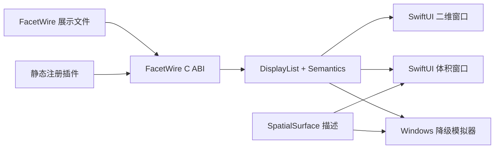

# ADR-0002：visionOS 宿主策略（visionOS Host Strategy）

| 项目 | 决策 |
| --- | --- |
| 状态 | 已接受，用于 Spike 验证 |
| 日期 | 2026-08-22 |
| 范围 | visionOS 宿主、空间展示降级、静态插件部署 |
| 不变范围 | FacetWire Core C ABI、现有二维 DisplayList v1、插件内存所有权规则 |

## 1. 背景

Flutter 当前没有官方 visionOS 部署目标，因此 FacetWire 的原生 visionOS 支持不能依赖 Flutter Runner。现有 FacetWire C ABI 使用宿主无关的数据结构、明确所有权的缓冲区和标准化 DisplayList，适合由 SwiftUI、RealityKit 或其他原生宿主回放。

## 2. 决策

FacetWire 通过独立的原生 Apple 宿主适配器支持 visionOS：

现有 Canvas/Page/Layer/Zone 模型继续保持二维。新增版本化的 `SpatialSurface` 描述，用于把二维 Canvas 放入普通窗口、体积窗口（Volume）或沉浸空间（Immersive Space）。`SwiftUI.View`、`RealityKit.Entity`、Metal 资源和平台手势对象不得跨越插件 ABI。

首个 Spike 只验证二维窗口和体积 Surface 放置。完整沉浸空间、立体媒体、手部追踪和空间音频作为未来的可选能力族处理。

## 3. 部署策略

visionOS 插件必须随应用一起编译、签名，以静态库或带 visionOS slice 的 XCFramework 形式接入。规范不承诺运行时安装任意可执行插件。声明式内容和纯数据扩展仍可在宿主安全策略允许时安装。

## 4. 验证层级

1. Windows 模拟验证 Schema、降级策略、C ABI 所有权、DisplayList 回放和不透明度语义。
2. visionOS Simulator 验证 Swift/C 桥接、二维/体积窗口生命周期、注视焦点和窗口调整。
3. Vision Pro 真机验证可读性、舒适性、间接捏合、无障碍和持续性能。

Windows 模拟通过是必要条件，但不能据此宣称已经原生支持 visionOS。

## 5. 影响

- Flutter 继续作为 Windows、Linux、macOS、iOS、Android 五个平台的参考 Playground。
- visionOS 使用小型原生 SwiftUI 宿主，同时复用相同 Runtime、插件和渲染合同。
- 如果 Flutter 未来正式支持 visionOS，可以新增另一种宿主，而无需改变文件格式和插件 ABI。
- 闭源第三方依赖必须独立提供兼容的 visionOS 二进制 slice。

## 6. 官方参考

- [Flutter 官方支持平台](https://docs.flutter.dev/reference/supported-platforms)
- [Flutter visionOS 支持提案](https://github.com/flutter/flutter/issues/128313)
- [Apple：判断是否将应用带到 visionOS](https://developer.apple.com/documentation/visionos/determining-whether-to-bring-your-app-to-visionos)

## 7. 一致性检查

本决策保持 ADR-0001 的 UI 隔离原则：Flutter 只是应用层选型，不属于 FacetWire 标准。静态注册与现有 iOS 部署模型一致。空间元数据包装而不替换二维排版，因此不支持空间能力的宿主仍能按照明确的 fallback 规则渲染内容。
