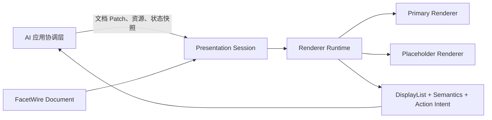

# ADR-0003：文档、展示会话与渲染运行时边界

- 状态：Accepted
- 日期：2026-08-24
- 决策范围：FacetWire 0.1、Placeholder Renderer 0.1

## 背景

FacetWire 将被用于分层运行的 AI 应用：随身设备负责轻量交互、通知和展示，远端
服务器或 PC 执行模型、解析、转码等重型任务。任务完成后，用户可以选择在任意
受信任且具备所需能力的设备上按需展示结果。

FacetWire 的目标不是成为任务调度器，而是提供 AI 亲和、跨平台、可降级的富媒体
文档结构与展示运行时。如果把远程队列、网络协议、通知和设备发现写入 Renderer
ABI，插件将无法保持确定性、轻量和跨平台一致。

## 决策

系统明确划分三个 FacetWire 层次和一个外部应用层：

### FacetWire Document

- 是可保存、打包、传输、签名和版本化的持久内容；
- 描述 Canvas、Page、Layer、Zone、布局、语义、资源引用和 Capability 要求；
- 使用稳定对象 ID，支持 AI 生成的语义化原子 Patch；
- 默认不保存瞬时任务进度、在线状态、设备地址或授权令牌。

### Presentation Session

- 将文档投影到当前设备、窗口、字体、媒介和能力集合；
- 接收应用协调层提供的资源可用性快照；
- 负责丢弃乱序 revision、标记陈旧快照并触发重新渲染；
- 只向 Renderer 暴露完成展示所需的最小脱敏数据。

### Renderer Runtime

- 根据 Capability 选择真实 Renderer 或 Placeholder Renderer；
- 向插件提供纯数据请求及受限 DisplayList、Text 和 Semantics 服务；
- 不要求插件知道资源来自本机、PC、服务器或其他设备；
- 主内容可用后在同一个 Zone 原位替换占位输出。

### AI 应用协调层（FacetWire 范围外）

- 负责远程任务、消息传输、Artifact 存储、通知、设备发现和授权；
- 把任务状态投影成版本化 Availability Snapshot，而不是暴露内部任务对象；
- 解释并授权 Action Intent；Renderer 不直接执行网络、文件或系统操作。

## Availability Snapshot

Placeholder Renderer 0.1 在请求尾部接收运行态展示字段：

- `presentation_revision`：由宿主维护的单调版本；
- `phase`：排队、运行、等待、传输或等待展示设备等通用展示阶段；
- `progress`：无进度、不确定进度或整数分数；
- `stale`：快照是否可能过期。

这些字段描述“当前可展示性”，不是远程任务协议。Renderer 不比较服务器时间、
不轮询状态、不持久化进度，也不根据任务 ID 访问外部系统。

## Placeholder Renderer 边界

Placeholder Renderer 可以：

- 保留 Zone 几何；
- 根据 reason、phase、progress 和 stale 生成视觉与语义；
- 输出由宿主授权的 Action Intent；
- 在相同输入下产生确定结果。

Placeholder Renderer 不可以：

- 启动、取消或查询 AI 任务；
- 发现设备、发送通知或下载 Artifact；
- 接收 Prompt、模型响应、访问令牌或未脱敏服务器错误；
- 修改 FacetWire Document 或保存 Presentation Session 状态。

复杂任务时间线、日志和调度控制应由独立 `task-status-renderer` 或应用界面实现，
不能持续扩张 Placeholder Renderer 的职责。

## 后果

### 正面影响

- 同一 Renderer 代码可用于随身设备、桌面和无界面服务器；
- 文件格式不会绑定某种云服务、消息协议或 AI 框架；
- 离线、传输中和能力缺失可以共享稳定占位路径；
- AI 可以通过稳定 ID 和原子 Patch 修改展示，而无需操作平台 UI。

### 代价

- 宿主必须实现 Presentation Session 和状态投影；
- 任务状态与文档状态需要独立 revision；
- Artifact 交接与通知需要另行定义应用层协议；
- 完整任务控制不能仅靠 Placeholder Renderer 完成。

## 验证要求

1. 同一请求在 Windows、Linux 和 macOS 产生结构一致的 DisplayList；
2. 改变 `presentation_revision` 不改变布局，只改变缓存身份；
3. 乱序快照由 Session 拒绝，Renderer 无需维护历史；
4. `stale`、phase 和 progress 可进入 Semantics，但不得泄露任务内部信息；
5. 插件测试在无网络、无文件系统、无窗口条件下全部通过；
6. 主 Renderer 恢复后使用相同 Zone 几何替换占位结果。

## 一致性检查

- 持久文档、瞬时展示状态和外部任务状态具有单一所有者；
- Placeholder Renderer 仍是无 I/O、无隐藏任务、确定性的基础插件；
- 分层 AI 应用可以注入状态，但不会把 FacetWire 变成调度框架；
- 该边界可同时支持手机、手表、PC、服务器和空间计算设备。
