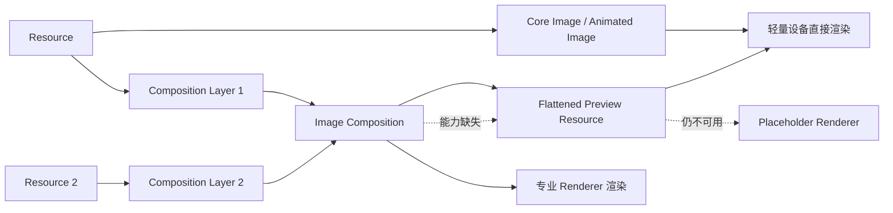

# ADR-0004：基础图像渲染与专业图像合成分级

- 状态：Accepted
- 日期：2026-08-25
- 决策范围：FacetWire Core Content Profile 0.1 及后续图像能力

## 背景

FacetWire 既要让轻量随身设备可靠显示普通图片、GIF，也希望未来支持羽化、渐变透明度、
颜色通道、色阶、饱和度、混合模式、多图层合成和 AI 图像处理。如果把这些能力一次性
放入 `image` Renderer，基础插件会同时依赖复杂像素管线、色彩管理和图层编辑模型，难以
保持小型、确定、跨平台和易降级。

### 本章检查

- 基础展示与专业编辑的复杂度来源已经识别。
- 分级目标同时覆盖轻量设备和专业桌面宿主。

## 决策

图像能力分为两个独立 Profile 和 Capability，不以一个不断膨胀的 `image` 对象承载全部
专业编辑语义。

### Core Image Profile

Core Image 沿用 Core Content 0.1 的 `image` 和 `animated-image`：

- 单一 Resource；
- Zone 内 Placement、裁剪、采样和方向；
- 保留资源 Alpha；
- 整体 `opacity`，取值为任意 0–1 小数；
- 静态图片与 GIF/APNG/动态 WebP 的基础展示；
- 动态图片的播放初始策略与 `reduce-motion` 降级；
- `alt`、Semantics、资源失败和 Placeholder 路径。

Core Image 0.1 明确不包含：渐变透明度、蒙版、羽化、混合模式、通道混合、色阶、曲线、
色相/饱和度、滤镜栈、多源图层合成、像素编辑和 AI 任务调用。

### Image Composition Profile

后续独立的 `image-composition` Profile 负责专业能力。该 Profile 必须：

- 使用稳定的 Composition、Layer、Mask 和 Effect ID；
- 使用有序、非破坏式 Effect 栈，原始 Resource 不被原位改写；
- 明确工作色彩空间、Alpha 模式、采样边界和效果计算顺序；
- 允许图层引用静态图片、动态图片或其他被标准允许的合成结果；
- 为合成对象提供可选 `previewResource`，供低能力设备展示扁平预览；
- 使用独立 Capability `facetwire.renderer.image-composition`；
- 在专业 Renderer 缺失时优先展示 `previewResource`，再降级到 Placeholder。

0.1 不冻结专业版字段细节。必须先通过色彩一致性、资源限制、循环引用和跨平台效果
一致性 Spike，才可发布 Image Composition Schema。

### AI 图像处理边界

Renderer 不调用模型、不提交远程任务，也不持有 Prompt。AI 应用协调层完成处理后：

1. 生成新的不可变 Resource；
2. 在同一事务中登记 Resource 并更新目标 Layer 的引用；
3. 保留来源、生成参数和授权所需的 Provenance；
4. 在结果未就绪时保留原 Zone 几何，以 Placeholder 或旧预览原位展示；
5. 需要扁平交付时生成新的输出 Resource，而不是破坏原合成结构。

### 本章检查

- Core 与 Composition 的类型、Capability 和 fallback 路径没有重叠。
- AI 任务属于应用协调层，Renderer 仍是确定性展示插件。
- 预览是独立 Resource，不会覆盖源图层或原始素材。

## 后果

### 正面影响

- 基础插件可以小型化，并在所有目标平台保持一致接入和开发体验；
- 专业图像能力可独立演进，不破坏 Core Image ABI；
- 轻量设备无需实现完整效果管线也能显示扁平预览；
- AI 编辑具有稳定图层目标、可回滚历史和明确资源血缘。

### 代价

- 专业文档可能同时保存源图层和预览，增加包体积；
- 宿主需要维护 Capability 路由和预览失效规则；
- 动态图层合成、色彩管理和效果一致性需要单独标准化；
- 从 Core Image 升级为 Composition 是内容类型迁移，不是简单追加一个字段。

### 本章检查

- 轻量实现收益与包体积、宿主复杂度代价均已记录。
- 代价可由预览失效规则和独立一致性测试控制。

## 验证要求

1. Core Image 插件在不链接专业图像库时完成静态图片与 GIF 基础展示；
2. `opacity=0`、`0.1`、`0.99`、`1` 均按连续值处理；
3. 资源 Alpha 与整体 opacity 相乘，透明区域不得自动填白；
4. 专业 Capability 缺失时，具有 `previewResource` 的合成保持原 Zone 几何并显示预览；
5. 预览缺失或失效时转到 Placeholder，不得改变兄弟 Zone 布局；
6. AI 更新通过新增 Resource 和原子引用 Patch 完成，Renderer 测试不依赖网络或模型。

### 本章检查

- 连续 opacity、Alpha 合成、低能力降级和 AI 更新均有直接测试入口。
- 验证覆盖 Core 插件与未来 Composition Profile 的接口边界。

## 一致性检查

- Core 与专业版只有一个清晰的能力分界，没有重复定义同一效果；
- 分级方式兼容 ASP Resource、Zone、Presentation Session 和 Placeholder 边界；
- 专业能力可通过新 Profile、插件和版本扩展，不要求修改基础 Renderer；
- 降级路径在桌面、移动、受限 Apple 平台和无界面环境中均成立。
