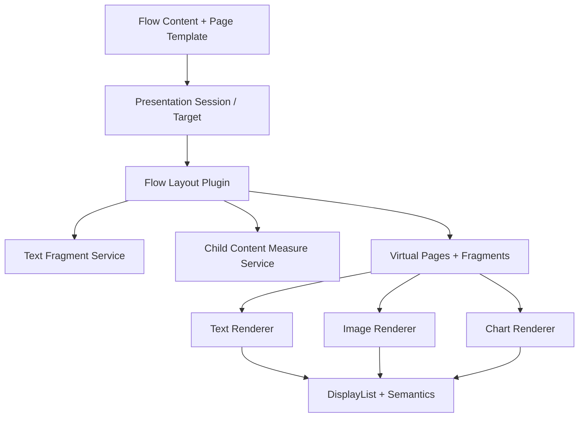

# ADR-0005：流式排版、虚拟页与内容 Renderer 的职责边界

- 状态：Accepted
- 日期：2026-08-26
- 决策范围：FacetWire Flow Content、Text/Image/Chart Renderer、Presentation Session

## 背景

静态富媒体文档需要在文本之间插入图片或图表、让文字绕排、跨页拆分长段落，并针对
手机、平板、桌面和打印媒介重新分页。若把这些能力放入 Text Renderer，文本插件将拥有
图片测量、图表路由、兄弟顺序、分页和响应式选择，最终变成不可替换的完整文档引擎。

### 本章检查

- 问题涉及多个内容 Renderer，而不是单个文本 Zone 的绘制。
- 响应式重排和分页依赖当前 Target，不能全部预先固化为文本属性。

## 决策

新增独立 Capability `facetwire.layout.flow`。它负责 Flow Item 的顺序、占位元素、绕排、
分页和派生 Fragment；Text、Image、Chart Renderer 只在获得的矩形或文本片段中渲染。

### 内容关系

Flow 0.1 定义以下关系：

- `block`：占用独立块，默认关系；
- `inline`：作为文本行内替换元素并参与 baseline；
- `float-start` / `float-end`：产生矩形排除区，后续文本绕排；
- `overlay`：不占用文本流，只在锚定位置叠加，必须显式声明。

图片、GIF、图表和未来可测量内容对布局器统一表现为 Replaced Element：提供 intrinsic
size、约束、aspect ratio、break policy 和 fallback size。布局器不理解其像素或数据模型。

### 页面类型

- `Authored Page` 是 ASP 中保存的 Page，拥有稳定文档 ID 和显式 Layer/Zone；
- `Virtual Page` 是 Flow Layout 对某一 Target/Profile 的派生结果，只在 Layout Plan 和
  Presentation Session 中存在；
- 一个源 Text Item 可以产生多个 Text Fragment，分布在多个 Virtual Page；
- Fragment ID 只在同一 layout revision 内稳定，AI Patch 必须定位源 Flow Item ID。

### Text Renderer 边界

Text Renderer v1 继续负责矩形内的基础文本测量、绘制和 Semantics。Flow Layout 使用新增
Text Fragment Service 获取可放入某个流区域的文本范围、行数、使用尺寸和断点。字符级
塑形仍由宿主文本后端完成，Flow Layout 不自行实现 Unicode BiDi 或字体回退。

### 本章检查

- Flow Layout、文本塑形和子内容绘制分别具有单一所有者。
- 图片/图表以通用占位元素参与布局，不要求布局器依赖具体 Renderer。
- Authored Page 与 Virtual Page 的持久性和 ID 语义没有冲突。

## 后果

### 正面影响

- Text Renderer 保持轻量并可独立测试；
- 图片、图表、未来 Visio/脑图可以复用同一 Flow Placement；
- 不同设备可重排同一源内容，不需要缩放整张桌面页面；
- 页面、片段和 fallback 都能保持来源追踪。

### 代价

- 宿主需要保存 Layout Plan，并协调多个 Renderer；
- 文本片段服务必须保证测量与绘制使用同一字体解析结果；
- float、inline object、widow/orphan 会增加一致性测试规模；
- Virtual Page 不能直接作为长期 AI Patch 目标。

### 本章检查

- 收益与实现成本均已记录。
- 新复杂度集中在可替换的 layout capability，而非扩散到每个内容插件。

## 验证要求

1. 同一源 Flow、Target、字体解析结果产生结构一致的 Virtual Page/Fragment Plan；
2. font scale 或 viewport 改变触发 reflow，而不是对旧页面做隐式等比缩放；
3. block、inline、float-start/end、overlay 都有几何和顺序测试；
4. 文本跨页后所有 UTF-8 范围连续、无重叠、无丢失，并位于标量边界；
5. 子 Renderer 缺失时使用相同 fragment bounds 调用 Placeholder；
6. Layout 插件无需网络、文件系统、GPU、平台 Widget 或具体图像/图表库。

### 本章检查

- 确定性、响应式、文本完整性、降级和沙箱边界均有测试入口。
- 验证可以使用 Fake Text/Child Measure Service 完成。

## 一致性检查

- 决策符合 ADR-0003：文档保存策略，Session 保存当前投影和交互状态。
- 与 ASP 现有 Page 不冲突；Virtual Page 是派生对象而非第三种持久层级。
- 与 Core Content 一致；Image/Chart Renderer 不负责移动兄弟内容。
- 与 Placeholder 一致；失败只替换对应 Fragment/Item 的内容，不放弃整页。
- 后续分页、分栏、脚注和专业出版可通过新 Flow Profile/接口版本扩展。
