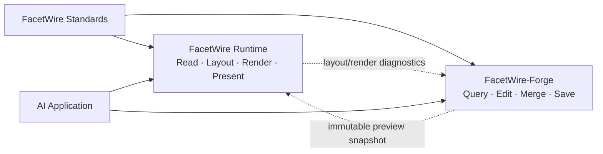

# ADR-0006：FacetWire 与未来 FacetWire-Forge 的兼容边界

- 状态：Accepted
- 日期：2026-08-29
- 决策范围：FacetWire Runtime、Layout、Renderer、ASP 投影与未来创作引擎

## 背景

AI 应用最终需要查询、修改、替换、合并和保存富媒体文档。若把事务、冲突合并、历史记录、
包写入和加密能力直接加入 FacetWire Runtime，渲染进程将同时拥有读写权限和复杂可变状态，
也会让轻量随身设备必须携带只在远端创作节点需要的能力。

### 本章检查

- 展示与创作具有不同的权限、状态和部署成本。
- 随身设备与远端服务器可以使用同一文档标准，但不需要加载相同运行时能力。

## 决策

FacetWire 继续只负责标准化输入的解析投影、测量、布局、渲染和展示。AI 创作能力将在独立
仓库 `FacetWire-Forge` 中实现。两个项目共享版本化文件标准和语义合同，但依赖方向固定：

- FacetWire 不依赖 FacetWire-Forge，也不暴露文档写入接口；
- Forge 可以选择调用 FacetWire 生成预览，但渲染失败不能导致事务被隐式提交；
- 两者通过不可变 Document Snapshot、稳定源 ID、显式 revision、Resource ID/digest 和
  版本化 Profile 交换数据；
- Flow Layout 的 Virtual Page/Fragment 是派生结果，不能成为持久编辑、合并或保存目标；
- Renderer/布局诊断必须引用稳定源 ID，便于 Forge 将反馈映射回可编辑对象；
- Presentation Session revision、layout revision 与 document revision 保持独立；
- ABI 结构继续采用 `struct_size + versioned tail`，未知扩展必须可拒绝或安全忽略；
- FacetWire 插件不得持有可变 Document Snapshot、跨调用指针或执行文件写入。

### 本章检查

- FacetWire 的安全边界没有因未来编辑需求扩大。
- Forge 所需的稳定定位、并发控制和预览入口已有明确的数据基础。
- 依赖是单向可选关系，不会形成 Runtime 与 Forge 的循环链接。

## 兼容合同

FacetWire 后续接口和格式设计必须满足以下约束：

1. 持久对象使用稳定、文档域内唯一的源 ID；重新排版不得修改源 ID。
2. 每个可缓存结果显式声明其输入 document/layout/session revision。
3. 派生 ID 必须带有明确作用域，不得伪装成持久 ID。
4. 输入 Snapshot 在一次调用期间只读；输出通过 caller-owned 结构或同步 Sink 复制。
5. 未识别字段、内容类型和插件能力具有确定的降级或错误语义。
6. 诊断至少包含稳定 diagnostic key；需要定位内容时包含 source ID 和可选逻辑范围。
7. Renderer 不解析 Forge ChangeSet，也不负责事务、撤销、合并或原子保存。
8. 文件格式扩展必须通过版本/Profile/capability 声明，不能依赖某个宿主的私有内存布局。

### 本章检查

- 兼容合同覆盖身份、版本、所有权、降级、诊断和扩展六个长期风险。
- 合同不预先锁定 Forge 的内部语言、存储引擎或同步算法。

## 后续 Forge 边界

独立仓库优先设计以下能力：Document Query、Transaction、语义 ChangeSet、Diff、三方合并、
冲突对象、历史/撤销、Package Reader/Writer、原子保存、压缩/加密和远端同步。第一版不要求
CRDT；以稳定源 ID、base revision、语义操作和三方合并建立可验证基线。

FacetWire 仓库可以记录跨项目兼容 fixture 和规范链接，但不得临时实现 Forge 的写操作。

### 本章检查

- Forge 的最小职责完整，且没有重新吞并渲染职责。
- “先继续 FacetWire、后建 Forge”不会造成协议空白或提前耦合实现。

## 一致性检查

- 符合 ADR-0003 的 Document/Presentation Session revision 分离。
- 符合 ADR-0005：AI 修改定位源 Flow Item，而非 Virtual Page/Fragment。
- 与插件沙箱目标一致：Renderer/Layout 保持无文件写入、无网络和调用级无状态。
- 与跨平台目标一致：轻量设备只需 Runtime；重型创作、专有适配与加密可部署在远端。
- 后续可将共享规范拆为独立标准包，但当前不为此增加第三个仓库或运行时依赖。
