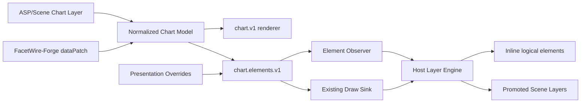
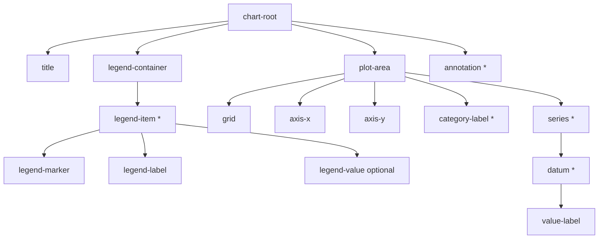

# FacetWire Chart Element Layering 0.2 详细设计

状态：**Experimental Draft**
需求：[Chart Element Layering 0.2](../requirements/chart-element-layering-requirements-v0.2.md)

## 1. 架构与兼容边界



`facetwire.renderer.chart.v1` 完全保留。新接口只复用相同模型和算法，不引入文件 I/O、
UI 框架或 Scene 持久化。普通 render 不带覆盖；元素 render 在命令到达 v1 Draw Sink 前
应用 presentation，并把当前元素报告给 observer。

### 本章检查

- 旧 Host、旧 Sink 和旧场景无需知道元素接口。
- Forge 修改源模型，Renderer 只消费模型和展示覆盖。

## 2. 公共 ABI

新增 `include/facetwire/chart_element_layer.h`：

```c
#define FW_CHART_ELEMENT_INTERFACE_ID \
    "facetwire.renderer.chart.elements.v1"

typedef struct fw_chart_element_ref_v1 {
    uint32_t struct_size;
    fw_chart_element_role role;
    fw_string_view chart_id;
    fw_string_view series_id;
    fw_string_view category_id;
    uint32_t part_index;
    uint32_t flags;
} fw_chart_element_ref_v1;
```

复合引用是 ABI 内的稳定身份；canonical ID 是它的可序列化表示。`part_index` 用于同一
datum 内可独立寻址的 body、wick 或其他子部件，`UINT32_MAX` 仅在 selector 中表示通配。

`fw_chart_element_descriptor_v1` 包含 ref、parent、normalized_bounds、z_index、capabilities、
label 和 flags。所有字符串在同步回调期间借用 request。

### 本章检查

- ABI 没有平台对象、堆所有权或可变全局状态。
- 复合引用比拼接字符串更适合 C、Swift、Kotlin、Dart 和 Rust FFI。

## 3. 元素角色与父子关系



系列、datum、图例项和图例子部件的引用复用源 `series.id/category.id`。父引用不拥有内存。
图例组合模型、设计令牌和响应式约束由
[Chart Legend Composition Profile 0.1](../../spec/chart-legend-composition-profile-v0.1.zh-CN.md)
统一规定；Core Renderer 从可见系列生成默认模板。
绘图区和装饰 bounds 可精确计算；部分高级图形的 datum bounds 首版允许标记
`BOUNDS_APPROXIMATE`，但 canonical ID 与数据绑定仍然精确。

### 本章检查

- 同一数据节点不会因图表类型切换而丢失 series/category 身份。
- bounds 精度通过 flag 显式表达，不伪装成精确几何。

## 4. Canonical ID 编码

格式：

```text
chart/{chartId}/{role}[/{seriesId}][/{categoryId}][/{partIndex}]
```

角色使用固定 ASCII 名称。ID 字节只保留 RFC 3986 unreserved 字符；其他 UTF-8 字节按
大写 `%HH` 编码。`format_element_id`：

```c
fw_status format_element_id(
    fw_plugin_handle plugin,
    const fw_chart_element_ref_v1 *ref,
    char *buffer,
    size_t capacity,
    size_t *out_required_length);
```

当 `buffer == NULL/capacity == 0` 时返回 `BUFFER_TOO_SMALL` 并输出不含 NUL 的所需长度；
容量至少为 `length+1` 时写入 NUL 结尾字符串并返回 `OK`。

### 本章检查

- 两阶段调用不需要插件分配内存。
- 任意合法 UTF-8 ID 可无歧义地序列化。

## 5. 覆盖模型与级联

`fw_chart_element_override_v1` 包含 selector、field mask 和字段值：

```text
visible | opacity | color | translate | uniformScale |
rotation | anchor | zOffset | promotion
```

匹配规则：

1. `chart-root` 匹配所有后代；
2. `series` 匹配同 series 的 series/datum/value-label/legend-item/legend-marker/
   legend-label/legend-value；
3. `datum` 匹配同 series/category 的 datum/value-label；
4. `legend-container` 匹配全部 legend-item 及其子部件；
5. `legend-item` 匹配同 series 的 marker/label/value；
6. 其他 role 精确匹配；
7. selector 中空 series/category 是通配；
8. overrides 按数组顺序合并，后项逐字段覆盖前项。

元素 opacity、visible、颜色和变换均采用最后一个匹配且显式指定该字段的值；Chart Layer
整体 opacity 仍在 begin_chart 阶段与元素/图元 Alpha 相乘。图例项缩放或旋转使用该项
bounds 中心作为 marker/label/value 的共同隐式锚点，保证组合关系不被破坏。首版限制
每次请求 256 个覆盖。

### 本章检查

- 级联可表达“整个系列 50%，但 Q2 恢复 100%”。
- field mask 保留显式 `opacity=0`、`translation=0` 等合法意图。

## 6. 几何应用

每个命令进入 Host Sink 前执行：

```text
p' = anchor + R(rotation) × scale × (p - anchor) + translation
```

- rect 在旋转为 0 时仍输出 rect；非零旋转改发四点 polygon；
- line/polygon 逐点变换；
- circle 半径与 sector 内外半径乘统一 scale，sector start 增加 rotation；
- label anchor 变换，fontSize 乘 scale；
- color override 替换 RGB 后保留目标 Alpha，再乘 effective opacity；
- visible=false 或有效 opacity=0 时跳过图元。

元素坐标仍位于 Chart 未旋转 `[0,1]` 空间，最后统一通过 Chart `VisualTransform` 映射。
因此元素变换和整个图表旋转不会互相复制算法。

### 本章检查

- 透明度、元素变换和 Chart VisualTransform 的执行顺序唯一。
- 插件不填充旋转后出现的空白区域。

## 7. 枚举函数

```c
fw_status enumerate(
    fw_plugin_handle plugin,
    const fw_chart_renderer_request_v1 *request,
    const fw_chart_element_enum_sink_v1 *sink,
    fw_chart_element_enum_result_v1 *out_result);
```

输入先走 Chart 统一验证；随后按固定顺序同步调用 `sink->visit`。回调返回非 OK 时立即停止
并返回 `SINK_REJECTED`。结果包含 emitted、virtualized 和 promotable 数量。枚举不调用绘制
Sink、不改变缓存、不分配元素数组。

### 本章检查

- Host 可选择流式消费、复制少量元素或构建自己的索引。
- 枚举失败不会留下半初始化的插件对象。

## 8. 带覆盖渲染与 Observer

```c
fw_status render(
    fw_plugin_handle plugin,
    const fw_chart_renderer_request_v1 *request,
    const fw_chart_element_override_v1 *overrides,
    size_t override_count,
    fw_rect_f32 bounds,
    const fw_chart_services_v1 *services,
    const fw_chart_element_observer_v1 *observer,
    fw_chart_render_result_v1 *out_result);
```

内部使用适配 Sink 包装现有 v1 Sink。适配器从 series/category 与显式 common-element
选择状态得到 ref，计算有效 presentation，先调用 observer，再变换图元并转发。普通
`chart.v1.render` 继续直接使用原 Sink，因此没有覆盖时命令完全兼容。

Observer 可把同一 canonical ID 的命令聚合成独立绘制批次，并按 zOffset 排序；不支持
捕获的 Host 仍可获得插件已应用的几何、颜色与透明度。

### 本章检查

- 元素元数据一定先于对应命令到达宿主。
- observer 与 draw sink 失败都遵循 begin/end 平衡规则。

## 9. 提升、虚拟化和 Scene 映射

`promotion=promoted` 不直接创建 Scene Layer，而是提示 Host：

1. 以 canonical ID 建立或复用子层；
2. 聚合同 ID 的命令；
3. 使用 Chart Layer 为相对坐标和裁剪父级；
4. 保留元素语义与数据绑定；
5. 保存时将 presentationOverride 写回场景描述，而非修改原数据。

对超大数据，Host 可以只保存 selector/override，在视口命中后捕获目标命令。0.2 Demo
数据规模较小，完整枚举全部 datum 以验证行为。

### 本章检查

- 按需物化与用户感知的独立 Layer 行为一致。
- 大数据场景不依赖 UI Widget 数量线性增长。

## 10. 错误、缓存与生命周期

- 非法结构、selector 或字段：`INVALID_ARGUMENT`；
- 覆盖/元素预算超限：`RESOURCE_LIMIT`；
- observer/draw 拒绝：`SINK_REJECTED`；
- canonical 缓冲不足：`BUFFER_TOO_SMALL`；
- 不存在的 exact selector：验证返回 `NOT_FOUND`；通配 selector 可匹配零个元素。

带覆盖 Cache Key 在原 Chart Key 后按顺序哈希 selector、mask 和所有已指定字段。API 不
保留任何调用方指针。插件 load/unload 分配策略与 Chart 0.1 相同。

### 本章检查

- 展示覆盖改变后不会复用旧帧。
- 所有失败均有稳定状态码和可单测路径。

## 11. Playground 与测试设计

Playground Native Bridge 枚举元素，JSON 输出 `elements[]` 和每条命令的 `elementId`、
`zOffset`、`promoted`。Flutter Inspector 提供：元素选择、不透明度、X/Y 平移、缩放、
旋转和提升开关；Painter 按 zOffset 稳定排序。

测试层次：

| 层 | 覆盖 |
| --- | --- |
| C contract | 全角色、ID、级联、非法输入、透明、几何、observer 顺序 |
| Native bridge | 元素 JSON、选择索引、真实插件接口、释放 |
| Dart parser | elements/commands 字段、异常输入 |
| Widget | 选择元素与所有控件、刷新、透明效果 |
| Lifecycle/ASan | load/query/render/unload、无泄漏与越界 |
| Release smoke | Windows 原生 DLL/静态嵌入、Flutter FFI 全链路 |

### 本章检查

- API 的每个输入、输出和失败模式都映射到测试。
- Demo 展示真实插件行为，不用 Dart 重新实现覆盖算法。

## 12. 后续扩展

0.3 可增加 R-tree 元素索引、动画插值、智能标签碰撞、双轴/多 plot、annotation 编辑、
GPU retained layers 和增量数据 revision。FacetWire-Forge 负责生成、合并和保存
`presentationOverride`/`dataPatch`；Renderer 继续保持无状态和确定性。

### 本章检查

- 当前接口能承载未来编辑器，但不提前绑定其事务或文件保存实现。
- 图表元素模型可在后续与 Image/Graph 的通用 Element Layer Profile 对齐。

## 13. 需求追踪矩阵

| 需求范围 | ABI/实现 | 自动化证据 | 用户入口 |
| --- | --- | --- | --- |
| CEL-SCP-* | `chart_element_layer.h`、伴随接口查询 | manifest、runtime、旧 `chart.v1` 回归 | 用户手册第 1、7 节 |
| CEL-ID-* | element ref、枚举器、canonical formatter | C contract 唯一性与两阶段缓冲测试 | Inspector 元素列表 |
| CEL-OVR-* | override mask、级联解析、变换 Sink | C contract 级联/透明/隐藏/Cache Key | Inspector 的透明、位移、缩放、旋转、颜色 |
| CEL-PRO-* | observer、zOffset、promotion | C contract 与 Native Bridge | “提升为独立 Layer”开关 |
| CEL-PERF-* | maxElements、流式回调、256 覆盖预算 | 预算与生命周期测试 | 用户手册第 9 节 |
| CEL-A11Y-* | element ref、语义标签、命令前 observer | hit-test、semantics、observer 测试 | canonical ID 与数据关系 |
| CEL-SAFE-* | 结构/数值校验、无保留指针 | CTest、Lifecycle、MSVC ASan | 用户手册故障排查 |

跨平台构建使用同一 `plugin.c`：Windows/Linux 可动态加载，Apple/Android 通过静态注册
或应用内 framework 接入。Flutter 层只消费 Bridge 结果，不复制元素匹配或几何算法。

### 本章检查

- 每一组规范性需求都有 ABI、实现、自动化证据和用户入口。
- 追踪关系未把 Playground 的临时 UI 行为误写为 Renderer ABI 承诺。
