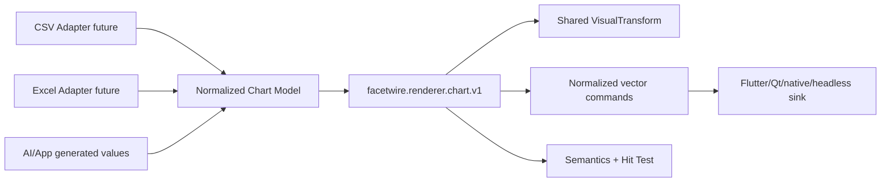

# FacetWire Core Chart Renderer 0.1 函数级详细设计

状态：**Experimental Draft**
需求：[Core Chart Renderer 0.1 需求](../requirements/core-chart-renderer-requirements-v0.1.md)

## 1. 分层结构

`chart_renderer.h` 是公共 C ABI；`plugins/core_chart_renderer/src/plugin.c` 是唯一参考算法；
宿主 Sink 负责把规范化命令投影到 Skia、CoreGraphics、Canvas、SVG 或测试记录器。

### 本章检查

- 数据读取、图表算法、视觉变换和平台绘制分别只有一个所有者。
- 任意宿主 UI 框架均不进入插件 ABI。

## 2. 公共数据结构

- `fw_chart_category_v1`：稳定 ID、显示标签。
- `fw_chart_value_v1`：主值、x/size、箱线五数与 OHLC 复合字段、显式 missing。
- `fw_chart_series_v1`：稳定 ID、标签、值数组、颜色、显隐和组合图 mark。
- `fw_chart_style_v1`：轴、网格、图例、类别/值标签、方向、堆叠、填充与环孔比例。
- `fw_chart_budget_v1`：类别、系列、点、命令的硬上限；0 使用安全默认值。
- `fw_chart_renderer_request_v1`：完整模型、opacity、固有尺寸、Transform、约束和 Target。

所有结构均以 `struct_size` 开头，所有数组和字符串只在当前同步调用期间借用。

### 本章检查

- 模型能由 JSON/CSV/Excel/Agent 输出独立映射。
- ABI 中不存在文件路径、工作簿句柄或平台对象。

## 3. 函数合同

### `validate`

输入：插件句柄、完整请求、调用方提供的结果。
输出：`status`、规范化标记和稳定 diagnostic key。
错误：结构、UTF-8、ID、值、枚举或几何错误返回 `INVALID_ARGUMENT`；预算超限返回
`RESOURCE_LIMIT`。副作用：无。

### `measure`

输入：已通过相同验证的请求。
输出：固有尺寸和约束后的建议尺寸。默认固有尺寸 640×360。
复杂度：验证 O(series×categories)，测量本身 O(1)。副作用：无。

### `render`

输入：请求、Zone viewport、`fw_chart_services_v1` 和调用方结果。
输出：共享 Transform、命令/系列/值数量、透明标记和 128-bit Cache Key。
副作用：只同步调用宿主 Sink；不保留指针。Sink 失败统一映射为 `SINK_REJECTED`。

### `build_semantics`

输入：请求和最终 bounds。
输出：Chart role、标题/ID、摘要、系列数和值数。
副作用：无；返回字符串仍由请求拥有。

### `hit_test`

输入：请求、viewport 和 viewport 坐标点。
输出：是否命中、元素种类、系列/类别索引和 ID、原始 double 值、逆变换后的规范化点。
未命中仍返回 `OK` 且 `hit=0`。

### `get_parameter_schema`

输入：有效插件句柄。输出：插件拥有的只读静态 JSON，至少声明 opacity、kind、fit 与
quarter-turn rotation。插件卸载前有效。

### 本章检查

- 每个函数的输入、输出、所有权、错误和副作用均可直接单测。
- validate 与执行函数使用同一验证路径，不发生“声明支持但执行接受不同模型”。

## 4. 命令 Sink 与坐标

`begin_chart(transform, opacity)` 建立一次批次；随后命令坐标均为未旋转 `[0,1]`：

- `fill_rect`：柱；
- `stroke_line`：轴、网格和折线；
- `fill_circle`：折线数据点；
- `fill_sector`：饼/环形/仪表盘扇区，含内外半径，弧度制；
- `fill_polygon`：面积、雷达和漏斗填充；
- `draw_label`：标题、类别、值和图例；
- `end_chart`：批次终止。

Sink 根据 `fw_visual_transform_result_v1` 同时处理 destination、clip、cover/contain 和旋转。
插件绝不产生背景命令。begin 成功后 end 必须恰好一次，即使中间命令失败。

### 本章检查

- 命令记录器和真实 GPU/Canvas Sink 消费同一结构。
- 旋转不会要求柱、线和扇区算法各自复制坐标逻辑。

## 5. 确定性算法

柱状图使用固定 plot rect `(0.12,0.12,0.78,0.70)`；数值域包含 0。每个类别占一个
group，可见系列按 source order 均分 group 内宽度。

折线图的 x 位于类别单元中心，y 复用相同数值映射；missing 清除 previous point，从而
断开折线。每个有效值产生一个圆点。

饼图中心 `(0.5,0.46)`、半径 `0.34`，从 `-π/2` 开始按 source order 顺时针生成扇区。
0.1 的类别色由显式系列色和类别 ordinal 确定性派生。

柱/面积通过 orientation 与 stack mode 派生横向、普通堆叠和百分比堆叠。散点/气泡读取
x/value/size；箱线读取 minimum/Q1/median/Q3/maximum；K 线读取 OHLC。雷达和漏斗输出
多边形，环形与仪表盘输出含 inner radius 的扇区；组合图按每个系列的 mark 顺序绘制。

Cache Key 组合 Chart ID、kind、opacity、Transform、Style、viewport、revision、类别/系列
ID、颜色、显隐和值；不得混入指针地址。

### 本章检查

- 相同输入在不同平台产生相同命令顺序和几何。
- 字体栅格差异被留在宿主 Label Sink，不改变数据节点几何。

## 6. 命中测试

先用共享 Transform 将 viewport 点逆变换为规范化坐标。0/90/180/270° 分别采用固定逆
映射；clip 开启时 viewport 外立即未命中。

- 柱：点在柱矩形内；
- 折线：点到数据点中心距离小于 `max(pointRadius,0.025)`，选择最近节点；
- 饼图：半径内按 `atan2` 得到角度，再查找累计扇区。

返回的 ID 直接借用请求，宿主如需跨调用保存必须复制。

### 本章检查

- 视觉旋转和命中旋转是一套 Transform 的正逆关系。
- 重叠命中具有固定 source-order/nearest 规则。

## 7. 失败、预算与生命周期

默认预算：4096 类别、64 系列、262144 点、1048576 命令。预算在任何绘制前检查。
插件 render 路径无堆分配；仅 load 用 `calloc` 创建 context，unload 清 magic 后释放。

宿主 Sink 不完整、bounds 非有限、输出结构过小均返回 `INVALID_ARGUMENT`。命令 Sink
失败时停止后续内容命令、平衡 end，并返回 `SINK_REJECTED`。opacity=0 不进入 Sink。

### 本章检查

- 恶意模型不能导致无界循环、命令膨胀或隐式 I/O。
- 所有分配与释放存在单一、可审计的所有者。

## 8. 测试与跨平台接入

原生合同与 Bridge 循环覆盖 21 个展示变体、measure、透明、旋转、semantics、hit-test、预算、NaN、
Sink 失败和平衡。统一 memory lifetime 测试注册六个插件并销毁 Runtime。

正式 Playground 的 Native Asset 同时编译 Chart 插件与共享 VisualTransform；Chart Bridge
把规范化命令序列化为 JSON，Flutter CustomPainter 只做宿主投影。Windows/Linux 可动态
加载；macOS/iOS/visionOS/Android 可静态注册同一 C 源码。

### 本章检查

- 测试同时覆盖算法合同和跨 ABI 生命周期。
- Apple 受限平台不依赖任意外部动态库仍能获得相同行为。

## 9. 扩展路线

0.2 已通过兼容伴随接口 `facetwire.renderer.chart.elements.v1` 增加元素树、稳定 ID、展示覆盖
与按需提升语义。后续可增加轴格式化、双轴、标签碰撞计划、显式类别颜色、空间索引和
增量数据 revision。CSV/Excel Adapter 输出相同 Chart Model；
Visio、脑图和亿图进入独立 Graph Model，不伪装成 Chart Renderer 输入。

### 本章检查

- 0.1 Renderer ABI 保持兼容，元素能力通过独立查询接口演进。
- 数据、Chart、Graph 和专业 Image Composition 的演进顺序保持清晰。
