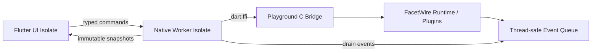

# FacetWire Playground 详细设计 0.1

| 属性 | 值 |
| --- | --- |
| 状态 | Draft / ADR-0001 有条件设计，PoC 通过后可实现 |
| 版本 | 0.1.0 |
| 对应需求 | `docs/requirements/facetwire-playground-requirements-v0.1.md` |
| 技术决策 | `docs/adr/0001-cross-platform-ui-framework.md` |
| 应用名称 | FacetWire Playground |
| UI 技术基线 | Flutter stable / Dart（有条件接受） |
| Native 接口 | FacetWire C ABI + Playground C Bridge |
| 目标平台 | Windows、Linux、macOS、iOS、Android |
| 许可证 | MPL-2.0 |

本文把 Playground 需求落实为 Native Bridge、Dart Domain/Application API、Flutter
UI 边界及可执行测试合同。文中列出的 public 函数和方法构成 0.1 单元测试边界；
Widget 的私有构建辅助方法不属于稳定合同。

技术选择、候选评分、风险、回退和 PoC Gate 以
[`ADR-0001`](../adr/0001-cross-platform-ui-framework.md) 为唯一决策来源。本文仅描述
ADR 有条件接受 Flutter 后的实现设计，不反向证明选型。项目以仓库锁文件固定经过 CI
验证的 Flutter commit 及其内置 Dart，不使用未固定的 `latest`。

- <https://docs.flutter.dev/reference/supported-platforms>
- <https://dart.dev/interop/c-interop>
- <https://docs.flutter.dev/testing/overview>

## 1. 架构决策

### 1.1 UI 与业务层

### 1.0 ADR 状态与实施门禁

在 ADR-0001 状态仍为“有条件接受”时，仅允许实现：五平台 UI Spike、UI-neutral
C Bridge、生成 Binding 的实验配置以及各层 Fake。不得开始依赖 Flutter 的生产 Widget、
不得承诺发布计划，也不得把 Spike 代码直接迁入 `apps/playground`。

只有 ADR 第 10 章 G1～G8、五平台构建、辅助技术、FFI 泄漏和 DisplayList 性能全部
通过后，维护者才可将 ADR 状态改为“接受”并进入第 36 章生产实施顺序。若失败，本文
保持 Draft，并以同一验收集评估 Qt Quick；Native Bridge 函数合同不随 UI 候选改变。

- Flutter 负责跨平台窗口内容、响应式布局、Inspector 和调试面板；
- Dart Domain/Application 层负责不可变模型、命令、工作区和 UI 状态；
- FacetWire Runtime、插件、渲染路由和 DisplayList 生成保留在 C/C++ 可调用层；
- Dart 通过生成的 FFI Binding 调用一个窄的 Playground C Bridge；
- 平台 Channel 只用于文件选择、分享、权限、窗口和应用生命周期；
- 插件不得直接返回 Flutter Widget 或平台 View。

### 1.2 线程模型



- UI Isolate 不执行阻塞 FFI、文件解析或插件加载；
- Native Worker Isolate 串行化同一个 Session 的命令；
- C Bridge Context 可管理多个 Session，不同 Session 可以并发；
- 插件回调只写入 C Bridge 线程安全事件队列，不直接调用 Dart；
- Worker 把 Native 输出复制成 Dart immutable model 后立即释放 Native Buffer；
- Flutter `Canvas` 绘制只在 UI Isolate 执行。

### 1.3 Render Surface 路径

0.1 使用标准化 DisplayList Snapshot：Native 生成、Dart 解码、Flutter CustomPainter
回放。视频和外部纹理在未来通过版本化 External Surface Command 扩展，不得在 0.1
Bridge 中传递裸平台 View。

### 本章检查

- 技术栈覆盖五个平台并直接调用当前 C ABI。
- 阻塞 Native 调用与 UI Isolate 分离。
- 插件输出仍经过 FacetWire DisplayList，不形成 Flutter 专用插件协议。

- 本章实现路径受 ADR PoC Gate 约束，没有把候选方案假设当作已验证事实。
- Flutter 失败时 C Bridge、Frame 和 Port 合同可被 Qt/Avalonia Adapter 复用。
## 2. 仓库与代码目录

UI Spike 与生产代码必须物理隔离。建议在 FacetWire 单仓库中增加：

```text
toolchains.lock.json
spikes/playground_ui/              ADR-0001 一次性五平台验证，不作为生产依赖

apps/playground/
├── pubspec.yaml
├── analysis_options.yaml
├── lib/
│   ├── main.dart
│   └── src/
│       ├── bootstrap/
│       ├── domain/
│       │   ├── models/
│       │   ├── commands/
│       │   └── ports/
│       ├── application/
│       │   ├── app_controller.dart
│       │   ├── workspace_controller.dart
│       │   ├── plugin_controller.dart
│       │   ├── scene_controller.dart
│       │   ├── render_controller.dart
│       │   ├── inspector_controller.dart
│       │   ├── debug_controller.dart
│       │   └── compare_controller.dart
│       ├── infrastructure/
│       │   ├── native_bridge/
│       │   ├── workspace/
│       │   ├── settings/
│       │   ├── export/
│       │   └── platform/
│       └── presentation/
│           ├── shell/
│           ├── home/
│           ├── render_surface/
│           ├── scene_tree/
│           ├── inspector/
│           ├── plugins/
│           ├── debug/
│           └── compare/
├── native/
│   ├── include/facetwire_playground_bridge.h
│   ├── src/
│   └── tests/
├── test/
│   ├── unit/
│   ├── widget/
│   ├── golden/
│   └── fakes/
├── integration_test/
└── assets/
    ├── demos/
    ├── schemas/
    └── l10n/
```

平台 Runner 由 Flutter 工具生成，平台自定义代码放在各 Runner 的薄 Adapter 中。
业务代码不得导入 `dart:io`，文件和平台能力通过 Port 注入。

### 本章检查

- Domain、Application、Infrastructure、Presentation 分层清晰。
`toolchains.lock.json` 至少记录 Flutter Git commit、Dart、ffigen、CMake、Ninja、测试
字体哈希和五平台构建工具版本。Spike 验收报告写入 `docs/verification/ui-spike/`。

- C Bridge 有独立头文件、实现和测试。
- Unit、Widget、Golden、Integration 测试位置确定。

## 3. Native Bridge ABI 约定

建议文件：`apps/playground/native/include/facetwire_playground_bridge.h`。

### 3.1 导出与句柄
- Spike、生产应用、工具链锁和验证报告位置分离。
- 生产目录的创建受 ADR 接受状态约束。

```c
typedef struct fwpg_context fwpg_context;
typedef struct fwpg_session fwpg_session;
typedef struct fwpg_frame fwpg_frame;

typedef struct fwpg_byte_view {
    const uint8_t *data;
    uint64_t length;
} fwpg_byte_view;

typedef struct fwpg_string_view {
    const char *data;
    uint64_t length;
} fwpg_string_view;

typedef struct fwpg_owned_buffer {
    uint8_t *data;
    uint64_t length;
    void *owner;
} fwpg_owned_buffer;
```

- Context、Session、Frame 是 Native 不透明句柄；
- `byte_view/string_view` 只在调用期间借用；
- `owned_buffer` 成功返回后必须调用 `fwpg_buffer_release`；
- 失败时 owned buffer 必须为 `{NULL,0,NULL}`；
- Bridge 不向 Dart 暴露 `fw_plugin_handle` 或插件函数指针。

### 3.2 Bridge 状态

```c
typedef uint32_t fwpg_status;
#define FWPG_OK                    0u
#define FWPG_INVALID_ARGUMENT      1u
#define FWPG_INCOMPATIBLE_ABI      2u
#define FWPG_NOT_FOUND             3u
#define FWPG_ALREADY_EXISTS        4u
#define FWPG_IO_ERROR              5u
#define FWPG_PARSE_ERROR           6u
#define FWPG_PLUGIN_ERROR          7u
#define FWPG_CANCELLED             8u
#define FWPG_TIMEOUT               9u
#define FWPG_RESOURCE_LIMIT       10u
#define FWPG_INVALID_STATE        11u
#define FWPG_UNSUPPORTED          12u
#define FWPG_OUT_OF_MEMORY        13u
#define FWPG_INTERNAL_ERROR       14u
```

Bridge 把 `fw_status` 映射为 `fwpg_status`，详细的 FacetWire 状态保存在错误详情 JSON
中。不得把平台 errno 或异常值直接暴露为公共数值。

### 3.3 编码格式

- 可演进的管理快照使用 UTF-8 JSON，根对象必须包含 `schemaVersion`；
- 场景、Patch 和 DisplayList 使用各自规范定义的二进制格式；
- JSON 仅是 Playground Bridge 诊断格式，不是 FacetWire 插件协议；
- Bridge 输入设置 64 MiB 默认上限，具体操作可以更严格；
- 输出 Buffer 长度使用 uint64，但 Dart 复制前必须检查平台可分配范围。

### 本章检查

- 句柄、Buffer、状态和可变数据编码都有稳定规则。
- Dart 不需要直接管理插件内部内存。
- Playground JSON 与正式插件/场景协议明确分离。

## 4. Native Bridge 生命周期函数

### 4.1 `fwpg_context_create`

```c
typedef struct fwpg_context_config_v1 {
    uint32_t struct_size;
    uint32_t event_capacity;
    uint32_t plugin_capacity;
    uint32_t session_capacity;
    uint32_t developer_mode;
    uint64_t max_owned_buffer_bytes;
    uint32_t flags;
} fwpg_context_config_v1;

fwpg_status fwpg_context_create(
    const fwpg_context_config_v1 *config,
    fwpg_context **out_context);
```

输入：有效配置。0 容量使用安全默认值。输出：成功时非空 Context。失败时输出 NULL。
创建 FacetWire Runtime、事件队列和 Buffer Tracker，不加载外部插件。

测试：默认/自定义配置、NULL、结构过小、容量超限、每个分配点失败。

### 4.2 `fwpg_context_destroy`

```c
void fwpg_context_destroy(fwpg_context *context);
```

NULL 无操作。按 Frame→Session→Plugin→Runtime→Queue 顺序释放。调用前必须停止 Worker
提交新命令。测试断言所有 Native 资源计数归零。

### 4.3 `fwpg_context_get_snapshot`

```c
fwpg_status fwpg_context_get_snapshot(
    fwpg_context *context,
    fwpg_owned_buffer *out_json);
```

返回 Runtime、ABI、平台、架构、构建模式、插件/Session 数量和资源上限 JSON。
字符串 UTF-8，不包含绝对用户路径。

测试：空 Context、插件后变化、JSON Schema、Buffer 释放。

### 4.4 `fwpg_buffer_release`

```c
void fwpg_buffer_release(fwpg_owned_buffer *buffer);
```

NULL 或空 Buffer 无操作。成功释放后必须把三个字段归零。Buffer 必须由同一 Bridge
创建；重复释放归零后的结构安全。

测试：正常、NULL、空、重复归零结构、Context 销毁前后跟踪。

### 4.5 `fwpg_copy_last_error`

```c
fwpg_status fwpg_copy_last_error(
    fwpg_context *context,
    fwpg_owned_buffer *out_error_json);
```

返回当前调用线程在该 Context 上最近一次失败的稳定错误对象：code、messageKey、
facetwireStatus、pluginId、zoneId、traceId 和已脱敏 detail。读取后不清除。

测试：无错误返回空 error、每种映射、线程隔离、脱敏字段。

### 本章检查

- Context 和 Buffer 生命周期完整配对。
- 每个函数定义失败输出和资源测试。
- 错误详情可诊断但不会把平台异常变成 ABI。

## 5. Native Bridge 插件函数

### 5.1 静态注册

```c
fwpg_status fwpg_register_static_plugin(
    fwpg_context *context,
    fw_plugin_query_fn query);
```

只由平台 Runner 在启动阶段调用；Dart 不传函数指针。成功后事件队列加入
`plugin.registered`。重复 ID 返回 ALREADY_EXISTS。

测试：正常、重复、ABI 不兼容、无效 query、事件内容。

### 5.2 动态加载

```c
fwpg_status fwpg_load_dynamic_plugin(
    fwpg_context *context,
    fwpg_string_view canonical_path,
    fwpg_owned_buffer *out_plugin_id_utf8);
```

仅 Developer 桌面构建支持。输入必须是平台 Adapter 已规范化和授权的绝对路径。
Bridge 检查扩展名、文件、签名策略、ABI 和重复 ID。iOS/Release 返回 UNSUPPORTED。

测试：成功、路径非法、文件缺失、签名拒绝、ABI、重复、平台禁用、模块卸载清理。

### 5.3 卸载

```c
fwpg_status fwpg_unload_plugin(
    fwpg_context *context,
    fwpg_string_view plugin_id);
```

仅动态插件可卸载。若 Session 正在使用，返回 INVALID_STATE；调用者先切换路由或
销毁 Session。静态插件返回 UNSUPPORTED。

测试：动态正常、静态、不存在、活跃引用、卸载事件、模块句柄释放。

### 5.4 启用状态

```c
fwpg_status fwpg_set_plugin_enabled(
    fwpg_context *context,
    fwpg_string_view plugin_id,
    uint32_t enabled);
```

只改变 Playground 路由策略，不卸载模块。0=false，非 0=true。变化后受影响 Session
标记 dirty，下一帧重新路由。

测试：开/关、重复设置幂等、未知 ID、Session dirty、Placeholder 回退。

### 5.5 路由首选项

```c
fwpg_status fwpg_set_capability_route(
    fwpg_context *context,
    fwpg_string_view capability_id,
    fwpg_string_view preferred_plugin_id);
```

空 preferred ID 表示恢复自动选择。插件必须声明该 Capability，否则 INVALID_ARGUMENT。

测试：设置、清除、不匹配、禁用插件、路由解释事件。

### 5.6 插件快照

```c
fwpg_status fwpg_plugins_get_snapshot(
    fwpg_context *context,
    fwpg_owned_buffer *out_json);
```

返回插件、Capability、接口、许可、来源、状态、依赖、路由和错误的不可变 JSON
快照。Schema 根版本 `facetwire.playground.plugins/1`。

测试：空、静态、动态、不兼容记录、JSON 排序确定、脱敏路径。

### 本章检查

- 静态、动态、启停、路由和浏览函数完整。
- 移动与 Release 限制由 Native 强制，不只隐藏 UI。
- 每个变化都能产生可观察事件并单测。

## 6. Native Bridge Session 与场景函数

### 6.1 创建和销毁 Session

```c
typedef struct fwpg_session_config_v1 {
    uint32_t struct_size;
    fwpg_string_view session_id;
    uint32_t deterministic_mode;
    uint64_t memory_limit_bytes;
    uint32_t flags;
} fwpg_session_config_v1;

fwpg_status fwpg_session_create(
    fwpg_context *context,
    const fwpg_session_config_v1 *config,
    fwpg_session **out_session);

void fwpg_session_destroy(fwpg_session *session);
```

Session ID 在 Context 内唯一。destroy 等待或取消活动 render，释放 Scene、Frame 引用
和参数覆盖。Frame 必须在 Session destroy 前释放；否则 destroy 使其失效并记录警告。

测试：正常、重复 ID、容量、内存上限、活动任务取消、泄漏 Frame。

### 6.2 设置场景快照

```c
typedef uint32_t fwpg_scene_encoding;
#define FWPG_SCENE_ENCODING_CANONICAL_BINARY 1u
#define FWPG_SCENE_ENCODING_DEBUG_JSON       2u

fwpg_status fwpg_session_set_scene(
    fwpg_session *session,
    fwpg_scene_encoding encoding,
    fwpg_byte_view scene_bytes);
```

成功时原子替换 Scene；失败保留旧 Scene。Bridge 复制或解析输入，不保存 Dart 指针。
Debug JSON 只在 Developer 构建允许。

测试：有效、空、未知编码、损坏、超限、失败保持旧 Scene、递归上限。

### 6.3 应用场景 Patch

```c
fwpg_status fwpg_session_apply_scene_patch(
    fwpg_session *session,
    fwpg_byte_view patch_bytes,
    uint64_t expected_scene_revision,
    uint64_t *out_new_revision);
```

Patch 具有事务性。revision 不匹配返回 INVALID_STATE。成功返回严格递增 revision。

测试：正常、多操作、revision 冲突、Patch 中途失败回滚、未知字段。

### 6.4 获取场景树

```c
fwpg_status fwpg_session_get_scene_tree(
    fwpg_session *session,
    fwpg_owned_buffer *out_json);
```

返回 Canvas/Page/Layer/Zone 树、几何摘要、路由和错误，不包含原始大内容。节点按场景
顺序稳定输出。

测试：空 Scene、嵌套、分页、Placeholder、递归截断、JSON 确定性。

### 6.5 选择对象

```c
fwpg_status fwpg_session_set_selection(
    fwpg_session *session,
    fwpg_string_view node_id);

fwpg_status fwpg_session_get_selection(
    fwpg_session *session,
    fwpg_owned_buffer *out_node_id_utf8);
```

空 ID 清除选择。选择不修改 Scene revision。未知 ID 返回 NOT_FOUND 并保留原选择。

测试：选择、清除、未知、场景替换后自动清除事件。

### 6.6 参数覆盖

```c
fwpg_status fwpg_session_set_parameter_json(
    fwpg_session *session,
    fwpg_string_view node_id,
    fwpg_string_view parameter_id,
    fwpg_byte_view canonical_json_value,
    uint64_t expected_parameter_revision,
    uint64_t *out_new_parameter_revision);

fwpg_status fwpg_session_reset_parameter(
    fwpg_session *session,
    fwpg_string_view node_id,
    fwpg_string_view parameter_id,
    uint64_t *out_new_parameter_revision);
```

Bridge 根据插件 Parameter Schema 验证类型、范围和权限。值是临时覆盖，不默认写回
Scene。失败不改变 revision。

测试：各参数类型、范围、未知、只读、revision 冲突、布局 dirty 与 paint dirty 区分。

### 本章检查

- Session、Scene、Patch、树、选择和参数形成完整调试状态 API。
- 所有写操作具有事务或 revision 冲突保护。
- Dart Buffer 生命周期不会跨调用泄漏到 Native。

## 7. Native Bridge Viewport 与渲染函数

### 7.1 Viewport

```c
typedef struct fwpg_viewport_v1 {
    uint32_t struct_size;
    float logical_width;
    float logical_height;
    float device_pixel_ratio;
    float font_scale;
    float zoom;
    float pan_x;
    float pan_y;
    uint32_t orientation;
    uint32_t theme;
    uint32_t high_contrast;
    uint32_t reduce_motion;
    uint32_t medium;
    uint32_t flags;
} fwpg_viewport_v1;

fwpg_status fwpg_session_set_viewport(
    fwpg_session *session,
    const fwpg_viewport_v1 *viewport);
```

所有 float 必须有限；尺寸、DPR、font scale、zoom > 0。pan 可为负。成功使布局或
绘制 dirty，重复相同值幂等。

测试：正常、NaN/Infinity、零、极值、重复、只变 pan 不重新 layout。

### 7.2 Debug Options

```c
typedef struct fwpg_debug_options_v1 {
    uint32_t struct_size;
    uint32_t show_canvas_bounds;
    uint32_t show_page_bounds;
    uint32_t show_layer_bounds;
    uint32_t show_zone_bounds;
    uint32_t show_clip;
    uint32_t show_hit_regions;
    uint32_t show_repaint_regions;
    uint32_t show_plugin_labels;
    uint32_t include_overlay_in_export;
    uint32_t flags;
} fwpg_debug_options_v1;

fwpg_status fwpg_session_set_debug_options(
    fwpg_session *session,
    const fwpg_debug_options_v1 *options);
```

只影响 Host Overlay，不改变插件 DisplayList 和 Scene revision。

### 7.3 Render

```c
typedef struct fwpg_render_request_v1 {
    uint32_t struct_size;
    uint64_t request_id;
    uint64_t scene_revision;
    uint64_t parameter_revision;
    uint64_t monotonic_time_ms;
    uint32_t wait_for_stable;
    uint32_t include_semantics;
    uint32_t include_metrics;
    uint32_t flags;
} fwpg_render_request_v1;

fwpg_status fwpg_session_render(
    fwpg_session *session,
    const fwpg_render_request_v1 *request,
    fwpg_frame **out_frame);
```

同步 Native 操作，但只能从 Worker Isolate 调用。revision 不匹配返回 INVALID_STATE。
成功返回不可变 Frame。`wait_for_stable` 仍受 Session 超时限制。失败输出 NULL。

测试：空 Scene、Placeholder Scene、revision、取消、超时、插件失败降级、确定时间、
多 Session 并发、同 Session 串行保护。

### 7.4 Frame 元数据和内容

```c
fwpg_status fwpg_frame_get_info(
    const fwpg_frame *frame,
    fwpg_owned_buffer *out_json);

fwpg_status fwpg_frame_copy_display_list(
    const fwpg_frame *frame,
    fwpg_owned_buffer *out_binary);

fwpg_status fwpg_frame_copy_semantics(
    const fwpg_frame *frame,
    fwpg_owned_buffer *out_json);

fwpg_status fwpg_frame_copy_metrics(
    const fwpg_frame *frame,
    fwpg_owned_buffer *out_json);

void fwpg_frame_destroy(fwpg_frame *frame);
```

Frame info 包含 request/revision、logical size、stable、fallback count、command count、
cache stats 和 trace ID。未请求 semantics/metrics 时相应函数返回 NOT_FOUND。destroy
NULL 无操作。

测试：每个 Snapshot、未请求项、Buffer 释放、Frame 后不可用、重复 destroy 不要求、
结构确定性。

### 本章检查

- Viewport、调试、Render 和 Frame 生命周期完整。
- Revision、时间和稳定条件保证可复现。
- DisplayList、语义和指标可独立复制、释放和测试。

## 8. Native Bridge 事件与故障注入

### 8.1 事件 Drain

```c
fwpg_status fwpg_events_drain(
    fwpg_context *context,
    uint32_t maximum_count,
    fwpg_owned_buffer *out_json_lines,
    uint32_t *out_event_count,
    uint32_t *out_remaining_count);
```

每行一个 JSON event，按全局 sequence 递增。maximum=0 使用默认批量。队列溢出时
插入 `events.dropped` 汇总，不阻塞渲染线程。

测试：空、单个、批量、顺序、溢出、多生产线程、Buffer 释放。

### 8.2 故障注入

```c
fwpg_status fwpg_fault_set_json(
    fwpg_session *session,
    fwpg_string_view target_id,
    fwpg_byte_view fault_json);

fwpg_status fwpg_fault_clear(
    fwpg_session *session,
    fwpg_string_view target_id);

fwpg_status fwpg_fault_clear_all(fwpg_session *session);
```

仅 Developer/Conformance 构建支持。Fault 包含 type、phase、count、delay、status；未知
字段忽略，未知 type 拒绝。Release 返回 UNSUPPORTED。

测试：设置/替换/清除、目标不存在、计数耗尽、延迟取消、Release 禁止、工作区快照。

### 本章检查

- Native 异步信息通过可控事件队列进入 Dart。
- 队列溢出不会阻塞或静默丢失。
- 故障注入由 Native 构建模式强制限制。

## 9. Native Bridge 单元测试矩阵

| 模块 | Fake/注入 | 核心断言 |
| --- | --- | --- |
| Context | Allocator、Runtime Factory | 失败清理、容量、错误隔离 |
| Buffer | Buffer Tracker | 归零、重复空释放、上限 |
| Plugins | Fake Query、Fake Loader | ABI、重复、卸载、路由 |
| Session | Fake Scene Parser | 原子替换、revision、容量 |
| Parameters | Fake Schema | 类型、范围、dirty 分类 |
| Render | Fake Renderer/Clock | revision、fallback、Frame |
| Events | 多线程 Producer | 顺序、溢出、批量 |
| Faults | Fake Build Policy | Release 禁用、触发次数 |
| Errors | Fake Platform Errors | 状态映射、脱敏、线程局部 |

Native 测试不得启动 Flutter。它们由 CTest 独立运行，并在 ASan/UBSan 可用平台运行。

### 本章检查

- 每个 Native 模块都有可替换依赖和明确断言。
- Flutter 之外即可验证资源、线程和错误行为。
- 单元测试不依赖实际动态插件文件，动态装载另做集成夹具。

## 10. Dart Domain 模型

所有 Domain 对象不可变、实现值相等，禁止保存 FFI Pointer。

```dart
typedef PluginId = String;
typedef CapabilityId = String;
typedef SessionId = String;
typedef NodeId = String;

final class RuntimeSnapshot {
  final String runtimeVersion;
  final int abiMajor;
  final int abiMinor;
  final String platform;
  final String architecture;
  final bool developerMode;
  final int pluginCount;
  final int sessionCount;
}

final class PluginSnapshot { /* identity, capabilities, state, route */ }
final class SceneTree { /* immutable nodes indexed by NodeId */ }
final class ViewportState { /* logical size, DPR, zoom, pan, theme */ }
final class ParameterValue { /* tagged immutable value */ }
final class RenderFrame { /* decoded display list + semantics + metrics */ }
final class DebugEvent { /* sequence, timestamp, category, trace */ }
final class Workspace { /* versioned debug workspace */ }
```

每个 JSON/Binary Parser 返回 `Result<T, PlaygroundFailure>`，不得抛出未分类 Format
异常到 Controller。

### 本章检查

- Domain 不依赖 Flutter Widget、FFI 和文件系统。
- 模型值相等支持精确状态测试。
- 所有外部数据解析错误统一进入 Failure 类型。

## 11. Dart Result、Failure 与取消

```dart
sealed class Result<T> {
  const Result();
  R fold<R>(R Function(T) ok, R Function(PlaygroundFailure) error);
}

final class Ok<T> extends Result<T> { final T value; }
final class Err<T> extends Result<T> { final PlaygroundFailure error; }

final class PlaygroundFailure {
  final String code;
  final String messageKey;
  final String? pluginId;
  final String? nodeId;
  final String? traceId;
  final Map<String, Object?> safeDetails;
}

abstract interface class CancellationToken {
  bool get isCancelled;
  void throwIfCancelled();
}
```

Application Port 使用 `Future<Result<T>>` 表示 I/O/Native 操作。纯函数直接返回
`Result<T>`。取消映射为 code=`cancelled`，不得显示成插件错误。

### 本章检查

- 成功、失败和取消是显式类型。
- Controller 不依赖异常字符串判断流程。
- Failure 只携带安全细节并适合 Widget 显示与测试。

## 12. Dart NativeRuntimeClient 接口

```dart
abstract interface class NativeRuntimeClient {
  Future<Result<RuntimeSnapshot>> initialize(RuntimeConfig config);
  Future<Result<void>> dispose();
  Future<Result<RuntimeSnapshot>> getRuntimeSnapshot();

  Future<Result<List<PluginSnapshot>>> listPlugins();
  Future<Result<PluginId>> loadDynamicPlugin(String canonicalPath);
  Future<Result<void>> unloadPlugin(PluginId pluginId);
  Future<Result<void>> setPluginEnabled(PluginId pluginId, bool enabled);
  Future<Result<void>> setCapabilityRoute(
    CapabilityId capabilityId,
    PluginId? preferredPluginId,
  );

  Future<Result<SessionId>> createSession(SessionConfig config);
  Future<Result<void>> destroySession(SessionId sessionId);
  Future<Result<void>> setScene(SessionId sessionId, ScenePayload scene);
  Future<Result<int>> applyScenePatch(
    SessionId sessionId,
    ScenePatch patch,
    int expectedRevision,
  );
  Future<Result<SceneTree>> getSceneTree(SessionId sessionId);
  Future<Result<void>> setSelection(SessionId sessionId, NodeId? nodeId);
  Future<Result<NodeId?>> getSelection(SessionId sessionId);
  Future<Result<int>> setParameter(
    SessionId sessionId,
    NodeId nodeId,
    String parameterId,
    ParameterValue value,
    int expectedRevision,
  );
  Future<Result<int>> resetParameter(
    SessionId sessionId,
    NodeId nodeId,
    String parameterId,
  );
  Future<Result<void>> setViewport(SessionId sessionId, ViewportState value);
  Future<Result<void>> setDebugOptions(SessionId sessionId, DebugOptions value);
  Future<Result<RenderFrame>> render(
    SessionId sessionId,
    RenderRequest request,
    CancellationToken cancellation,
  );

  Future<Result<void>> setFault(SessionId sessionId, FaultSpec fault);
  Future<Result<void>> clearFault(SessionId sessionId, String targetId);
  Future<Result<void>> clearAllFaults(SessionId sessionId);
  Stream<DebugEvent> events();
}
```

实现 `FfiNativeRuntimeClient` 把每个方法发送到 Native Worker Isolate。initialize 只能
成功一次；dispose 幂等，dispose 后其他方法返回 `runtime_disposed`。

单元测试使用 `FakeNativeRuntimeClient`：可为每个方法排队 Result、记录调用参数、
控制 Future 完成顺序和推送 DebugEvent。

### 本章检查

- Native Bridge 的全部能力都有 Dart 类型化入口。
- 方法输入输出不泄漏 Pointer/Buffer。
- Fake 能覆盖成功、失败、取消、乱序和事件。

## 13. Platform 与持久化 Port

```dart
abstract interface class FilePickerPort {
  Future<Result<String?>> pickOpenFile(FileTypeFilter filter);
  Future<Result<String?>> pickSaveFile(String suggestedName);
  Future<Result<String?>> pickDirectory();
}

abstract interface class BinaryStore {
  Future<Result<Uint8List>> read(String canonicalPath, int maxBytes);
  Future<Result<void>> writeAtomic(String canonicalPath, Uint8List bytes);
  Future<Result<bool>> exists(String canonicalPath);
  Future<Result<void>> delete(String canonicalPath);
}

abstract interface class SettingsStore {
  Future<Result<Map<String, Object?>>> load();
  Future<Result<void>> save(Map<String, Object?> settings);
  Future<Result<void>> clear();
}

abstract interface class SharePort {
  Future<Result<void>> shareFiles(List<String> canonicalPaths);
}

abstract interface class Clock {
  DateTime nowUtc();
  int monotonicMilliseconds();
}

abstract interface class IdGenerator {
  String nextId();
}
```

Domain/Application 只依赖这些 Port。测试使用 MemoryBinaryStore、FakeClock、
SequenceIdGenerator 和 Fake Picker。

### 本章检查

- 文件、设置、分享、时间和 ID 都可替换。
- 单元测试无真实磁盘、系统对话框和时间随机性。
- 平台 Channel 被限制在 Infrastructure Adapter。

## 14. WorkspaceRepository 函数

```dart
abstract interface class WorkspaceRepository {
  Future<Result<Workspace>> create(String displayName);
  Future<Result<Workspace>> open(String canonicalPath);
  Future<Result<void>> save(Workspace workspace, String canonicalPath);
  Future<Result<void>> autosave(Workspace workspace);
  Future<Result<Workspace?>> recoverLatest();
  Future<Result<void>> discardRecovery();
  Future<Result<String>> exportReproductionBundle(
    Workspace workspace,
    ReproductionBundleOptions options,
  );
}
```

### 14.1 函数合同

- `create`：生成 version=1、稳定 ID、空场景集合；不写磁盘；
- `open`：限制大小、解析、迁移、规范化路径；失败不改变当前工作区；
- `save`：先序列化验证，再临时文件+原子替换；成功更新 savedRevision；
- `autosave`：写应用恢复区，不改变用户文件和 savedRevision；
- `recoverLatest`：无恢复返回 Ok(null)，损坏返回 Err；
- `discardRecovery`：不存在时幂等成功；
- `exportReproductionBundle`：先经 RedactionService 和 LicensePolicy，返回生成路径。

单元测试：正常、损坏、未知版本、迁移、磁盘失败、原子写、恢复、脱敏和不可分发
资源拒绝。

### 本章检查

- 工作区所有持久化入口都有事务和失败语义。
- 自动恢复与用户保存分离。
- 复现包强制经过脱敏和许可策略。

## 15. AppController 函数

```dart
final class AppController {
  Stream<AppState> get states;
  AppState get current;

  Future<Result<void>> start(AppLaunchRequest request);
  Future<Result<void>> shutdown();
  Future<Result<void>> changeMode(PlaygroundMode mode);
  Future<Result<void>> changeLocale(String localeTag);
  Future<Result<void>> changeTheme(AppThemeMode theme);
  Future<Result<void>> resetPanelLayout();
  Future<Result<void>> handleLifecycle(AppLifecycleValue value);
}
```

- `start`：加载设置→初始化 Runtime→注册内置插件→恢复工作区→启动事件订阅；
- 任一步失败进入可诊断 degraded state，并释放已创建资源；
- `shutdown`：停止新命令→autosave→销毁 Session→dispose Runtime→保存设置；幂等；
- change 函数先更新状态，持久化失败则保留当前运行状态但产生 warning；
- lifecycle background 触发 autosave 和动画暂停，resume 请求新帧。

单元测试：每个启动阶段失败、释放顺序、重复 start/shutdown、设置失败、生命周期。

### 本章检查

- 应用启动和关闭具有确定顺序与失败清理。
- 全局设置和生命周期可以独立单测。
- Degraded 状态允许打开诊断而不是白屏退出。

## 16. WorkspaceController 函数

```dart
final class WorkspaceController {
  Stream<WorkspaceState> get states;
  WorkspaceState get current;

  Future<Result<void>> newWorkspace(String displayName);
  Future<Result<void>> openWorkspace(String canonicalPath);
  Future<Result<void>> save();
  Future<Result<void>> saveAs(String canonicalPath);
  Future<Result<void>> close({required bool discardUnsaved});
  Future<Result<void>> importDemo(DemoId demoId);
  Future<Result<void>> undo();
  Future<Result<void>> redo();
  Future<Result<void>> resetTransientOverrides();
}
```

Controller 使用 CommandStack。open/new 先在临时状态验证，成功后才关闭当前 Session。
close 有未保存内容且 discard=false 返回 `unsaved_changes`。undo/redo 只处理 Playground
调试命令，不隐式改写外部资源。

单元测试：所有成功路径、未保存保护、open 失败保持旧工作区、CommandStack 边界、
Demo 缺插件仍可导入并 Placeholder。


### 本章检查

- WorkspaceController 的打开、保存、关闭和 dirty 状态转换均有唯一责任边界；
- I/O 失败、取消、并发完成乱序和未保存保护均能通过 Fake Repository 测试。
## 17. PluginController 函数

```dart
final class PluginController {
  Stream<PluginState> get states;
  PluginState get current;

  Future<Result<void>> refresh();
  Future<Result<void>> loadDynamic(String canonicalPath);
  Future<Result<void>> unload(PluginId pluginId);
  Future<Result<void>> setEnabled(PluginId pluginId, bool enabled);
  Future<Result<void>> setPreferredRoute(
    CapabilityId capabilityId,
    PluginId? pluginId,
  );
  Future<Result<void>> reloadDynamic(PluginId pluginId);
  PluginRouteExplanation explainRoute(CapabilityId capabilityId);
  List<DemoDescriptor> visibleDemos(PlatformCapabilities platform);
}
```

- `refresh` 原子替换快照并保留当前选择（若仍存在）；
- load/unload/reload 完成后自动 refresh；
- reload 顺序：保存路径→确认无活跃引用→卸载→加载；加载失败尝试恢复原模块；
- `explainRoute` 是纯函数；
- `visibleDemos` 过滤 Capability、平台和许可，不执行插件代码。

单元测试：快照、平台禁用、活跃 Session、reload 回滚、路由优先级、Demo 过滤。


### 本章检查

- PluginController 不直接持有 Native 句柄，所有变化经 NativeRuntimeClient 完成；
- 加载、卸载、启停、路由、平台限制和刷新失败均有状态序列测试。
## 18. SceneController 函数

```dart
final class SceneController {
  Stream<SceneState> get states;
  SceneState get current;

  Future<Result<void>> attach(SessionId sessionId, ScenePayload scene);
  Future<Result<void>> detach();
  Future<Result<void>> refreshTree();
  Future<Result<void>> select(NodeId? nodeId, SelectionOrigin origin);
  Future<Result<void>> setNodeVisibility(NodeId nodeId, bool visible);
  Future<Result<void>> isolate(NodeId? nodeId);
  Future<Result<void>> applyPatch(ScenePatch patch);
  SceneNode? nodeById(NodeId nodeId);
  List<SceneNode> filteredNodes(SceneFilter filter);
}
```

`nodeById` 和 `filteredNodes` 为纯读取。选择更新必须防止 Render Surface 与 Tree 互相
触发循环：相同 selection revision 不重复提交。

单元测试：attach/detach、树刷新、双向选择、未知节点、过滤、Patch revision、失败
保持旧树、场景替换清除选择。


### 本章检查

- SceneController 的树、选择和 revision 由单一状态源维护；
- 双向选择防循环，Patch 冲突、未知节点和场景替换均有测试。
## 19. ParameterSchemaService 与 InspectorController

### 19.1 Schema Service

```dart
abstract interface class ParameterSchemaService {
  Result<ParameterSchema> parse(Uint8List utf8Json);
  Result<ParameterValue> validate(
    ParameterDefinition definition,
    ParameterValue input,
  );
  ParameterValue defaultValue(ParameterDefinition definition);
  bool isVisible(
    ParameterDefinition definition,
    Map<String, ParameterValue> values,
  );
  List<ParameterDefinition> orderedVisibleParameters(
    ParameterSchema schema,
    Map<String, ParameterValue> values,
  );
}
```

parse 拒绝脚本、远程 UI、重复 ID、循环 visible 条件和深度超限。validate 不做隐式
字符串到数字转换。ordered 输出按 group/order/id 稳定排序。

### 19.2 Inspector Controller

```dart
final class InspectorController {
  Stream<InspectorState> get states;
  InspectorState get current;

  Future<Result<void>> inspect(NodeId? nodeId);
  Future<Result<void>> setParameter(
    String parameterId,
    ParameterValue value,
    UpdateIntent intent,
  );
  Future<Result<void>> commitPreview();
  Future<Result<void>> cancelPreview();
  Future<Result<void>> resetParameter(String parameterId);
  Future<Result<void>> resetAll();
  Future<Result<void>> undo();
  Future<Result<void>> redo();
}
```

`UpdateIntent.preview` 合并高频值，最多每帧提交一次；commit 加入 CommandStack；失败
回滚最后有效值。opacity 在 Domain 中只保存 0..1，不单独保存 transparency。

单元测试：Schema 各类型、范围、可见条件、预览节流、commit/cancel、失败回滚、
undo/redo、opacity 转换、选择切换取消未提交预览。

### 本章检查

- 插件参数解析、验证、可见性和排序都是纯函数。
- Inspector 预览、提交、撤销和回滚边界清晰。
- 任意 UI/脚本注入在 Parser 层被拒绝。

## 20. RenderController 函数

```dart
final class RenderController {
  Stream<RenderState> get states;
  RenderState get current;

  Future<Result<void>> attach(SessionId sessionId);
  Future<Result<void>> detach();
  Future<Result<void>> setViewport(ViewportState viewport);
  Future<Result<void>> setDebugOptions(DebugOptions options);
  Future<Result<RenderFrame>> requestFrame(RenderReason reason);
  Future<Result<RenderFrame>> waitForStable(Duration timeout);
  Future<Result<Uint8List>> capturePng(CaptureOptions options);
  HitTestResult hitTest(Offset logicalPoint);
  void pause();
  void resume();
}
```

请求合并规则：

- 同一帧多个 paint reason 合并；layout reason 覆盖 paint；scene reason 覆盖全部；
- 新请求取消尚未开始的旧请求；正在 Native 执行的请求标记取消并丢弃过期结果；
- 只有 requestId、sceneRevision、parameterRevision 与当前一致的 Frame 才能发布；
- `capturePng` 默认不包含调试 Overlay；Flutter 层从当前 DisplayList 重放到离屏图；
- `hitTest` 使用当前 Frame 的结构，不发起 Native I/O；
- pause 停止动画帧但保留显式 requestFrame。

单元测试：合并优先级、过期结果、取消、稳定超时、pause/resume、viewport dirty 分类、
截图 Overlay 选项、hit test 边界。


### 本章检查

- RenderController 合并高频请求且只发布最新有效 revision 的 Frame；
- 取消、过期完成、命中选择、Resize 与 Native 失败均可确定性测试。
## 21. DisplayListDecoder 与 Player

```dart
abstract interface class DisplayListDecoder {
  Result<FwDisplayList> decode(Uint8List bytes);
}

abstract interface class DisplayListPlayer {
  void paint(
    Canvas canvas,
    Size logicalSize,
    FwDisplayList displayList,
    PlaybackOptions options,
  );

  HitTestResult hitTest(FwDisplayList displayList, Offset logicalPoint);
  Rect computeBounds(FwDisplayList displayList);
}
```

Decoder 验证 magic/version/长度/指令数/字符串表/嵌套深度/save-restore；拒绝未知必须
理解 opcode，跳过标记为 optional 的未知 opcode。Player 不做插件路由或文本解析，
只回放已验证对象。

测试：每个 opcode、截断 Buffer、错误长度、未知版本、深度、64K 指令上限、
save/restore、颜色/opacity、裁剪、Golden、hit test 与 bounds。

### 本章检查

- 解码和绘制分离，可纯测 Decoder 并用 Widget/Golden 测 Player。
- 非法 DisplayList 在进入 Canvas 前被拒绝。
- Hit Test 和 bounds 使用同一解析模型。

## 22. DebugController 函数

```dart
final class DebugController {
  Stream<DebugState> get states;
  DebugState get current;

  Future<Result<void>> start();
  Future<Result<void>> stop();
  Future<Result<void>> clear(DebugCategory? category);
  Future<Result<void>> setFilter(DebugFilter filter);
  Future<Result<void>> startRecording(RecordingOptions options);
  Future<Result<DebugRecording>> stopRecording();
  Future<Result<String>> exportRecording(
    DebugRecording recording,
    String canonicalPath,
  );
  List<DebugEvent> visibleEvents();
  DebugEvent? eventBySequence(int sequence);
}
```

start 订阅 Native events；stop 取消订阅但不清空。Ring Buffer 达上限丢弃最旧并增加
dropped count。filter/visibleEvents 是确定性纯筛选；记录受时长和字节上限限制。

单元测试：start/stop 幂等、事件顺序、溢出、过滤组合、记录上限、导出脱敏、查找。


### 本章检查

- DebugController 的过滤和派生统计不改变原始事件顺序或安全字段；
- 环形容量、暂停、恢复、清空、导出和事件乱序均有边界测试。
## 23. FaultController 函数

```dart
final class FaultController {
  Stream<FaultState> get states;
  FaultState get current;

  Future<Result<void>> setFault(FaultSpec spec);
  Future<Result<void>> removeFault(String targetId);
  Future<Result<void>> clearAll();
  Future<Result<void>> loadFromWorkspace(List<FaultSpec> faults);
}
```

Controller 必须在 UI 显示全局“故障注入中”标识。Release 中所有写函数返回
`unsupported`；loadFromWorkspace 忽略并警告，而不是执行。

单元测试：Developer/Release、替换、清除、工作区恢复、Native 失败保持旧状态。


### 本章检查

- FaultController 只管理声明式故障配置，不模拟插件内部未授权状态；
- 设置、替换、清除、全清、Session 销毁和 Native 拒绝均有测试。
## 24. CompareService 函数

```dart
abstract interface class CompareService {
  Future<Result<StructureDiff>> compareStructure(
    RenderFrame left,
    RenderFrame right,
    CompareOptions options,
  );

  Future<Result<PixelDiff>> comparePixels(
    Uint8List leftRgba,
    Uint8List rightRgba,
    PixelCompareOptions options,
    CancellationToken cancellation,
  );

  Future<Result<DisplayListDiff>> compareDisplayLists(
    FwDisplayList left,
    FwDisplayList right,
    CompareOptions options,
  );

  Future<Result<String>> exportReport(
    CompareReport report,
    String canonicalPath,
  );
}
```

结构比较优先按稳定 node ID，缺失时按路径。像素比较验证尺寸和颜色空间，支持阈值
和 ignore regions。DisplayList 比较先规范化非语义 ID，不忽略几何、颜色和顺序。

单元测试：相同、增加/删除/修改、顺序、阈值、ignore、尺寸不匹配、取消、报告脱敏。


### 本章检查

- CompareService 对相同输入产生确定差异，阈值和颜色空间显式；
- 尺寸不匹配、透明像素、容差边界和超大图片拒绝均有测试。
## 25. Redaction 与导出服务

```dart
abstract interface class RedactionService {
  String redactText(String input, RedactionPolicy policy);
  Map<String, Object?> redactJson(
    Map<String, Object?> input,
    RedactionPolicy policy,
  );
  Result<Uint8List> redactWorkspace(
    Workspace workspace,
    RedactionPolicy policy,
  );
  RedactionReport scanBundle(List<BundleEntry> entries);
}

abstract interface class ExportService {
  Future<Result<String>> exportScreenshot(
    RenderFrame frame,
    ScreenshotOptions options,
  );
  Future<Result<String>> exportDisplayList(RenderFrame frame);
  Future<Result<String>> exportDiagnostics(DebugState state);
  Future<Result<String>> exportReproductionBundle(
    ReproductionBundleRequest request,
  );
}
```

Redaction 必须处理用户目录、URL query、token/key 模式、环境变量和设备 ID；不得依赖
单个正则覆盖全部路径。scanBundle 返回 blocked/warning/included 分类。Export 在
blocked 非空时要求显式用户决定，自动化默认失败。

单元测试：Windows/Unix 路径、URL、密钥、中文路径、误报 allowlist、二进制项、
自动化拒绝、导出原子写。

### 本章检查

- Debug、Fault、Compare、Redaction 和 Export 公共函数完整。
- 高风险导出默认失败安全。
- 比较服务不把平台像素差当作唯一语义差异。

## 26. CommandStack 函数

```dart
abstract interface class PlaygroundCommand {
  String get id;
  Future<Result<void>> execute();
  Future<Result<void>> undo();
  bool canMerge(PlaygroundCommand newer);
  PlaygroundCommand merge(PlaygroundCommand newer);
}

final class CommandStack {
  bool get canUndo;
  bool get canRedo;
  Future<Result<void>> pushAndExecute(PlaygroundCommand command);
  Future<Result<void>> undo();
  Future<Result<void>> redo();
  void clear();
  void markSaved();
  bool get hasUnsavedChanges;
}
```

execute 失败不入栈；undo 失败保持栈位置并报告；新命令清空 redo；可合并预览提交只
保留首个 before 和最后 after。栈有命令数和内存上限。

单元测试：push、失败、undo/redo、redo 清空、merge、saved marker、上限和异步顺序。


### 本章检查

- CommandStack 的 execute/undo/redo 状态迁移原子化且容量有界；
- 合并、失败回滚、redo 清空、不可撤销命令和并发禁入均有测试。
## 27. Controller 状态发布规则

所有 Controller：

- 构造后立即有 `current`；
- 每个公开命令最多发布 loading、success/error 两阶段；
- 相等状态不重复发布；
- 错误保留最后有效数据，并设置 `lastFailure`；
- dispose 后关闭 Stream，命令返回 disposed；
- 不在构造函数启动异步任务；
- 所有依赖从构造函数注入；
- 状态对象不可变并带递增 revision。

测试公共 Helper：

```dart
Future<List<T>> recordStates<T>(
  Stream<T> stream,
  Future<void> Function() action,
);
```

每个 Controller 测试必须断言状态序列，而不只断言最终状态。

### 本章检查

- Controller 异步行为可预测并能精确测试状态序列。
- 错误不会清空最后有效界面。
- 依赖注入和显式 start 防止测试时隐藏副作用。

## 28. Flutter Widget 边界

关键 Widget：

```dart
final class PlaygroundApp extends StatelessWidget;
final class AdaptivePlaygroundShell extends StatelessWidget;
final class RenderSurfaceView extends StatefulWidget;
final class SceneTreeView extends StatelessWidget;
final class InspectorPanel extends StatelessWidget;
final class ParameterEditor extends StatelessWidget;
final class PluginBrowser extends StatelessWidget;
final class DebugPanel extends StatelessWidget;
final class CompareView extends StatelessWidget;
```

规则：

- Widget 只订阅 Controller State 并发送用户 Intent；
- 不在 `build` 中调用 Native、文件或 Controller 写命令；
- 所有交互 Widget 使用稳定 Key，例如 `parameter.opacity.slider`；
- RenderSurfaceView 的 Painter 只接收 immutable RenderFrame；
- 桌面/平板/手机布局共用 State 和 Intent；
- 可访问性 label 使用 localization key，不把 debug ID 当用户文案。

Widget 测试：loading/error/empty/data、键盘、触控、字体放大、LTR/RTL、窄/宽布局、
面板折叠、参数验证、Semantics Tree。Golden 只测试稳定组件和 Fake DisplayList。

### 本章检查

- Widget 没有业务或 Native 副作用。
- 稳定 Key 支持 Widget 和集成测试。
- 响应式与无障碍状态可用 Fake Controller 完整覆盖。

## 29. Bootstrap 与依赖装配函数

```dart
Future<Result<AppDependencies>> buildDependencies(
  BootstrapEnvironment environment,
);

Future<int> runPlayground(
  List<String> args,
  BootstrapEnvironment environment,
);

void main(List<String> args);
```

`buildDependencies` 创建 Platform Ports、Store、FFI Client、Repositories、Services 和
Controllers，但不启动 AppController。任一失败反向 dispose 已创建依赖。

`runPlayground` 解析桌面参数、构建依赖、调用 start、启动 Flutter；自动化模式完成
任务后返回 0/2/3/4（成功/测试失败/配置错误/内部错误）。移动端 args 为空。

`main` 只初始化 Flutter Binding、构造真实 Environment 并调用 run；不含业务逻辑。

单元测试：依赖构建每点失败、释放顺序、CLI 参数、退出码、移动环境、Developer
开关不能由普通 CLI 在 Release 打开。


### 本章检查

- Bootstrap 依赖方向从 Infrastructure 指向 Port 实现，不让 Domain 依赖 Flutter/FFI；
- 初始化部分失败会逆序释放已创建资源，Fake 装配可供纯单元测试使用。
## 30. 单元测试 Fake 设计

```dart
final class FakeNativeRuntimeClient implements NativeRuntimeClient {
  final List<RecordedCall> calls;
  void enqueueResult(String method, Result<Object?> result);
  void emitEvent(DebugEvent event);
}

final class MemoryBinaryStore implements BinaryStore { /* path->bytes */ }
final class FakeFilePicker implements FilePickerPort { /* queued paths */ }
final class FakeClock implements Clock { void advance(Duration value); }
final class SequenceIdGenerator implements IdGenerator { /* deterministic */ }
final class FakeWorkspaceRepository implements WorkspaceRepository;
final class FakeCompareService implements CompareService;
```

Fake 必须支持：记录顺序、阻塞 Future、乱序完成、注入 Failure、取消和资源计数。
不得通过 Mockito 的宽泛 `any` 掩盖关键参数；revision、ID、路径和 Buffer 必须精确
匹配。

### 本章检查

- Native、I/O、时间、ID、工作区和比较均有 Fake。
- 并发与乱序场景可以确定复现。
- 测试强调精确参数，而不只验证方法被调用。

## 31. 逐函数 Dart 单元测试矩阵

| API | 正常路径 | 错误/并发路径 | 核心断言 |
| --- | --- | --- | --- |
| NativeClient initialize/dispose | 启停 | 重复、阶段失败 | 调用/释放顺序 |
| PluginController refresh | 新快照 | 解析失败、选择消失 | 原子 State |
| load/unload/reload | 动态成功 | 平台禁用、回滚 | 路由和列表 |
| WorkspaceRepository | create/open/save | 损坏、I/O、迁移 | 原子写、旧状态 |
| WorkspaceController | new/open/close | 未保存、失败 | Session 与 State |
| SceneController | attach/select/patch | revision、未知节点 | 双向选择无循环 |
| SchemaService | parse/validate | 注入、循环、范围 | Result 与稳定排序 |
| InspectorController | preview/commit | 节流、失败、切换 | 回滚和 Command |
| RenderController | frame/stable | 合并、取消、过期 | 只发布最新 Frame |
| DisplayListDecoder | 每 opcode | 截断、深度、版本 | 拒绝非法 Buffer |
| DisplayListPlayer | paint/hit | clip/transform | Golden 与 bounds |
| DebugController | start/filter/record | 溢出、导出失败 | 顺序、dropped |
| FaultController | set/clear | Release、Native 失败 | 状态一致 |
| CompareService | 三种 diff | 取消、尺寸、阈值 | 差异结构 |
| RedactionService | path/url/token | allowlist、二进制 | 无敏感泄漏 |
| ExportService | 四类导出 | blocked、I/O | 原子输出 |
| CommandStack | push/undo/redo | 失败、merge、上限 | 栈位置和 dirty |
| AppController | start/shutdown | 每阶段失败 | degraded/清理 |
| Bootstrap | run/CLI | 配置/内部错误 | 退出码 |

测试命名：`Class_method_condition_expectedResult`，例如
`RenderController_requestFrame_staleRevision_discardsFrame`。

### 本章检查

- 所有 Dart public service/controller 函数有正常、错误和断言方向。
- 并发、取消、revision 和原子状态受到重点覆盖。
- UI 之外的大部分行为可以用纯 Dart 单测完成。

## 32. Widget、Golden 与集成测试

### 32.1 Widget

- Shell 的桌面、平板、手机断点；
- SceneTree 展开、筛选、选择、键盘；
- Inspector 每种 Schema 控件、错误和只读；
- Plugin Browser 平台能力和路由解释；
- Debug Panel 过滤、虚拟列表和定位；
- Compare View 模式切换；
- Semantics、RTL、200% 字体。

### 32.2 Golden

- Placeholder 四模式、全部状态和尺寸密度；
- 浅色、深色、高对比度、透明背景；
- Render Surface Overlay 开/关；
- Inspector 参数类型；
- Golden 固定 Flutter、字体、DPR 和颜色空间。

### 32.3 Integration

1. 启动应用并显示内置 Placeholder Demo；
2. 选择 Zone，调节 opacity，验证 Frame revision；
3. 注入 renderer_missing，验证占位和日志；
4. 切换视口和主题；
5. 导出截图和脱敏调试包；
6. 桌面加载测试动态插件，再卸载回退；
7. iOS/Android 验证静态注册与相同 Demo Descriptor。

Flutter 官方将测试分为 unit、widget、integration；本项目对应使用三层，并额外保留
Native CTest 和结构快照。

### 本章检查

- 单元、组件视觉、端到端和 Native 测试层次完整。
- Golden 环境固定，避免无意义波动。
- 五平台关键路径共享相同 Demo 和测试描述。

## 33. 性能测试点

```dart
abstract interface class PerformanceProbe {
  void beginSpan(String name, Map<String, Object?> attributes);
  void endSpan(String name, Map<String, Object?> attributes);
  void counter(String name, int delta);
  PerformanceSnapshot snapshot();
}
```

必须测量：Native command latency、scene parse、layout、plugin measure/render、DisplayList
decode、Flutter paint、frame publish、event drain、Inspector 参数延迟和内存。

基准：1/100/1,000/10,000 Zone；调试关/开；Placeholder 最小/标准/诊断；桌面和移动
分别记录。性能测试用 FakeClock 不足以测真实耗时，需在固定设备集运行。

### 本章检查

- 性能点覆盖 Native 到 Flutter 整条路径。
- 基准按场景规模和调试模式分层。
- 单元时钟与真实设备性能测试用途分离。

## 34. 安全设计点

- FFI Decoder 在 Native 与 Dart 两侧都验证长度和版本；
- 所有 Native Owned Buffer 有 Context 总量上限；
- Dynamic Load 只接受 Platform Adapter 授权后的 canonical path；
- Release Native 编译时移除或硬禁用热载与故障注入；
- Workspace/Schema/DisplayList Parser 有深度、数量、字符串和字节上限；
- Parameter Schema 不支持脚本、HTML、远程 Widget 或反射调用；
- Export 必须经过 Redaction 和 LicensePolicy；
- Debug Event 默认不含完整内容；
- 插件崩溃后的隔离能力由未来 FacetWire Daemon/IPC 承担，Playground 显示状态并
  Placeholder 回退。

安全单测必须覆盖整数溢出、长度截断、UTF-8、路径穿越、Zip Bomb 元数据、Schema
循环、DisplayList 深度和 Buffer 泄漏。

### 本章检查

- FFI、文件、插件、Schema、DisplayList 和导出边界都有防护。
- UI 隐藏不是安全控制，Release Native 强制限制。
- 未来 Daemon 有清晰位置，但不阻塞 0.1 进程内参考实现。

## 35. 构建与 CI

建议命令：

```text
cmake --build build --target facetwire_playground_bridge_tests
dart run tool/verify_ui_selection_gate.dart
flutter analyze
flutter test test/unit
flutter test test/widget
flutter test test/golden
flutter test integration_test -d <platform>
```

CI：

- Windows/Linux/macOS：Native static/shared + Dart unit/widget + Desktop integration；
- macOS Runner：iOS Simulator build/integration；
- Android Runner：emulator build/integration；
- Flutter SDK 固定到 Git commit，Dart 版本由该 SDK 决定；ffigen、CMake、编译器和
  测试字体哈希同时写入 `toolchains.lock.json`；
- ADR 未接受时只运行 Spike/Bridge 流水线，生产发布 Job 必须硬失败；
- 五平台辅助技术检查结果作为带证据的 Gate artifact 保存；
- 生成 FFI Binding 后检查工作树无差异；
- Debug/Release/Conformance 三种构建策略分别验证。

覆盖率不作为唯一质量指标；Domain/Application 目标分支覆盖 90%，C Bridge 和
Placeholder 核心目标分支覆盖 95%，高风险 Parser 要求模糊测试。

### 本章检查

- 五平台均有构建或运行测试位置。
- Native、Dart、Widget、Golden 和集成测试都有 CI 入口。
- 生成代码和固定工具链保证可复现。

## 36. 实施顺序

```mermaid
flowchart LR
    S["ADR-0001 UI Spike：G1～G8"] --> A
    A["C Bridge Context/Buffer/Error"] --> B["Dart FFI Client + Fake"]
    B --> C["App Shell + Plugin Browser"]
- CI 能区分“选型验证”和“产品验证”，ADR 未接受时不会误发生产包。
- SDK、Binding、字体和辅助技术证据均可追溯到同一工具链锁。
    C --> D["Session/Scene/Viewport Bridge"]
    D --> E["DisplayList Decoder/Player"]
    E --> F["Placeholder Demo + Inspector"]
    F --> G["Debug Events + Faults"]
    G --> H["Workspace + Export + Compare"]
    H --> I["Desktop Dynamic Loading"]
    I --> J["iOS/Android Integration"]
```

每阶段必须先实现 Fake 与单元测试，再实现真实 Adapter；不允许 UI 直接调用尚未包装
的 FFI 函数。

### 本章检查

- 顺序先建立资源安全 Bridge 和 Fake，再开发 UI。
- Placeholder 是第一个完整端到端渲染案例。
- 移动集成在 0.1 前完成，不留作不确定的后续移植。

`S` 通过且 ADR 状态更新为“接受”之前，`A` 只能作为 UI-neutral Bridge/CTest 工作，
不得启动后续生产 Widget 阶段。

## 37. 与 Placeholder 设计的交叉合同

| Placeholder 设计 | Playground 对接点 |
| --- | --- |
| `get_parameter_schema` | ParameterSchemaService + Inspector |
| `measure` | Native Session layout |
| `render` | DisplayList Snapshot → Decoder/Player |
- UI 选型验证先于生产实施，并复用同一 C Bridge 合同。
- Spike 失败时回退不会丢弃 Native 合同和 CTest 投资。
| `build_semantics` | Frame semantics → Flutter Semantics |
| `hit_test` | Frame hit regions → RenderController.hitTest |
| normalization flags | Inspector Diagnostics + Debug Event |
| cache key | Frame metrics + Compare |
| reason/mode/action | Demo controls + Fault injection |
| opacity 0..1 | ParameterValue 与 Flutter 控件 |
| Text Service Fake | Native Placeholder 单元测试，不依赖 Flutter 字体 |

两份设计共享：逻辑尺寸、opacity、reason、mode、action、DisplayList version 和
Parameter Schema 语义。任何一方修改必须运行合同生成/验证测试。

### 本章检查

- Placeholder 每个公共输出都有 Playground 消费位置。
- UI 不重新计算 Placeholder 的布局或操作区域。
- 共享枚举和 Schema 防止两套语义漂移。

## 38. 设计一致性与完成检查

### 38.1 函数完备性

- Native Context/Buffer/Error 5 个函数已定义；
- 插件管理 6 个函数已定义；
- Session/Scene/Selection/Parameter 10 个函数已定义；
- Viewport/Debug/Render/Frame 9 个函数已定义；
- Event/Fault 4 个函数已定义；
- Dart Native Client、Ports、Repositories、Controllers 和 Services 的 public 方法已
  全部列出；
- 每组函数都有输入、输出、错误、生命周期和测试要求。

### 38.2 需求一致性

- 五平台、四模式、Render Surface、场景树、Inspector 和六类调试工具有实现位置；
- Demo Descriptor 与 Parameter Schema 支持插件自动扩展；
- 静态全平台和桌面动态插件路径分离；
- Compare、故障、复现包、自动化和无障碍均有 API；
- opacity 语义与 Placeholder 完全一致。

### 38.3 可测试性

- C Bridge 可以不启动 Flutter 单测；
- Dart Controller 可以不加载 Native 库单测；
- Widget 使用 Fake Controller；
- Render 使用 Fake DisplayList；
- I/O、时间、ID、分享和平台能力均通过 Port；
- 状态序列、revision、资源释放和调用参数均可精确断言。

### 38.4 扩展性

- 新插件通过 Manifest/Demo/Schema 加入；
- 新 Renderer 复用 Session/Frame/DisplayList；
- 新平台只增加 Adapter；
- IPC/Daemon 可以实现相同 NativeRuntimeClient Port；
- Web/Wasm 可以替换 FFI Infrastructure 而保持 Domain/Application/Presentation。

### 38.5 完成定义

Playground 0.1 详细设计实现完成必须满足：

1. ADR-0001 的 G1～G8 和 UI Spike 全部通过，状态已改为“接受”；
2. 所有列出的 Native public 函数实现并有 CTest；
3. 所有 Dart public Port/Service/Controller 实现并有单元测试；
4. Placeholder Demo 端到端可调、可诊断、可导出；
5. 参数 Schema 无需修改 UI 即生成控件；
6. Static 五平台、Dynamic 三桌面测试通过；
7. Unit/Widget/Golden/Integration/Native 测试通过；
8. Buffer、Session、Frame、Text Handle 和插件模块无泄漏；
9. Release 安全限制由 Native 验证；
10. 工作区、日志、截图和复现包通过脱敏与许可测试；
11. 文档、工具链锁、生成 Binding 和实现版本一致。


### 本章检查

- 需求、Native Bridge、Dart Port、Controller、Widget 与测试层已形成双向映射；
- 所有跨线程、跨语言和跨插件边界均有所有权、错误与取消规则；
- 本章结论已由第 39 至 41 章补充接口纳入最终完成条件。

## 39. 规范性发现接口补充

本章补齐 Inspector 与 Demo Browser 所需的发现接口；本章为规范性内容，若与前文
“浏览函数”概述冲突，以本章函数签名为准。

### 39.1 获取 Parameter Schema

- 完成定义显式包含 ADR 接受状态，不能以“Flutter 能构建”替代选型验收。
- 选型失败时需求和 Native 合同保持有效，只有 Presentation/Adapter 需要重做。
```c
fwpg_status fwpg_plugin_get_parameter_schema(
    fwpg_context *context,
    fwpg_string_view plugin_id,
    fwpg_string_view interface_id,
    fwpg_owned_buffer *out_schema_json);
```

输入：

- `context`：已初始化且未销毁的 Context；
- `plugin_id`：精确插件 ID，UTF-8，不允许空；
- `interface_id`：插件已发布的 Renderer/Tool 接口 ID，UTF-8，不允许空；
- `out_schema_json`：非空输出地址，调用前可包含任意值。

输出与所有权：函数进入后先把 `out_schema_json` 置零；成功时返回
`facetwire.parameter-schema/1` UTF-8 JSON 的独占副本，调用者必须且只能调用一次
`fwpg_buffer_release`。Bridge 必须在插件卸载前复制 Schema，返回 Buffer 不依赖插件
内存。

错误：空指针/空 ID 返回 INVALID_ARGUMENT；未知插件或接口返回 NOT_FOUND；插件未
加载返回 INVALID_STATE；插件 Schema 非法返回 DATA_ERROR；分配失败返回
OUT_OF_MEMORY。任何失败均保持空 Buffer。

线程：只允许 Native Worker 线程；与卸载串行化。

单元测试：成功复制、未知插件、未知接口、非法 UTF-8、非法 JSON、重复参数 ID、
插件返回静态内存后立即卸载、分配失败、失败输出清零、Buffer 只释放一次。

### 39.2 枚举 Demo Descriptor

```c
fwpg_status fwpg_demos_get_snapshot(
    fwpg_context *context,
    fwpg_string_view capability_filter,
    fwpg_owned_buffer *out_json);
```

`capability_filter` 为空表示全部；非空时只返回声明该 Capability 的 Demo。成功返回
根版本 `facetwire.playground.demos/1` 的确定性 JSON：先按 `pluginId`、再按 `demoId`
升序。结果只包含已加载且兼容插件；禁用插件的 Demo 保留并标记 `enabled=false`，
不兼容插件只出现在插件快照，不进入 Demo 快照。

所有权、清零和线程规则与 39.1 相同。错误包括 INVALID_ARGUMENT、INVALID_STATE、
DATA_ERROR 和 OUT_OF_MEMORY。

单元测试：空集合、全部、按 Capability 过滤、禁用插件、重复 Demo ID、资源路径越界、
排序确定、插件卸载后的快照独立性、分配失败和 Buffer 释放。

### 39.3 Dart NativeRuntimeClient 增量合同

以下方法必须加入第 12 章的 `NativeRuntimeClient`，并由 Fake 完整实现：

```dart
Future<Result<ParameterSchema>> getParameterSchema(
  PluginId pluginId,
  String interfaceId,
);

Future<Result<List<DemoDescriptor>>> listDemos({
  CapabilityId? capabilityId,
});
```

`getParameterSchema` 在 Worker Isolate 复制 Buffer 后立即释放 Native Buffer，再在
Isolate 中解析并验证，最后只把不可变 Domain 对象发回 UI Isolate。`listDemos` 的
空字符串过滤不得和 null 混淆：null 表示全部，非空字符串表示过滤，空字符串作为
调用参数返回 `invalid_argument`。

单元测试：Native 状态映射、Buffer 在解析成功/失败时均释放、解析错误分类、过滤参数、
事件乱序不改变返回值、dispose 后拒绝、Fake 调用记录。

### 39.4 DemoCatalogService 与 DemoController

```dart
abstract interface class DemoAssetResolver {
  Future<Result<Uint8List>> readAsset(
    PluginId pluginId,
    String relativePath,
    CancellationToken cancellation,
  );
}

abstract interface class DemoCatalogService {
  Result<List<DemoDescriptor>> parse(Uint8List utf8Json);
  List<DemoDescriptor> filter(
    List<DemoDescriptor> input,
    DemoFilter filter,
  );
  Future<Result<ScenePayload>> loadScene(
    DemoDescriptor descriptor,
    DemoAssetResolver assets,
    CancellationToken cancellation,
  );
}

final class DemoController {
  Stream<DemoState> get states;
  DemoState get current;

  Future<Result<void>> refresh({CapabilityId? capabilityId});
  Future<Result<void>> select(String? demoId);
  Future<Result<SessionId>> openSelected();
  Future<Result<void>> retry();
  List<DemoDescriptor> visibleDemos(DemoFilter filter);
}
```

`parse` 为纯函数，验证根版本、全局 `(pluginId,demoId)` 唯一、相对资源路径、必需字段、
参数预设类型和上限；失败不返回部分列表。`filter` 为纯函数，按关键字、标签、Capability、
插件和 enabled 状态过滤，保持输入稳定顺序。`loadScene` 只允许访问 Descriptor 声明的
资源；取消后不再读取新资源。`openSelected` 必须依次 loadScene、createSession、
setScene；后两步失败时销毁已创建 Session。`retry` 重放最后一次失败的 refresh 或
openSelected，不重放成功操作。

单元测试：合法/非法 Descriptor、重复 ID、`../` 和绝对路径、稳定过滤、取消、资源缺失、
选择清除、无选择打开、create/setScene 失败清理、retry 目标、状态发布次序。

### 本章检查

- Inspector 从 `getParameterSchema` 获得 Schema，不再假设插件快照嵌入 Schema；
- Demo Browser 从 `listDemos` 获得 Descriptor，不再读取插件私有目录；
- Native、Dart、Fake 和测试矩阵一一对应；
- 插件卸载后返回对象仍有效，不保留插件所有的字符串或指针。

## 40. 规范性 Domain 数据结构

第 10 章中的省略模型必须至少包含以下字段；序列化时未知字段忽略，缺少 required 字段
失败。所有集合在构造时复制并包装为只读集合。

```dart
enum PluginSource { staticLinked, dynamicLibrary }
enum PluginLifecycleState { discovered, loaded, disabled, incompatible, failed }
enum SignatureState { notApplicable, unverified, verified, rejected }

final class PluginSnapshot {
  final PluginId id;
  final String version;
  final String displayNameKey;
  final PluginSource source;
  final PluginLifecycleState state;
  final bool enabled;
  final bool compatible;
  final List<CapabilityId> capabilities;
  final List<String> interfaceIds;
  final Set<CapabilityId> preferredFor;
  final String licenseSpdx;
  final SignatureState signatureState;
  final PlaygroundFailure? diagnostic;
}

final class DemoDescriptor {
  final String id;
  final PluginId pluginId;
  final String titleKey;
  final String descriptionKey;
  final bool enabled;
  final Set<CapabilityId> requiredCapabilities;
  final String sceneAsset;
  final List<String> declaredAssets;
  final ViewportState defaultViewport;
  final Map<String, ParameterValue> parameterPreset;
  final Set<String> tags;
  final String? baselineAsset;
}

final class ParameterSchema {
  final String schemaVersion;
  final PluginId pluginId;
  final String interfaceId;
  final List<ParameterDefinition> parameters;
}

final class ParameterDefinition {
  final String id;
  final ParameterType type;
  final String labelKey;
  final String? descriptionKey;
  final ParameterValue defaultValue;
  final ParameterValue? minimum;
  final ParameterValue? maximum;
  final ParameterValue? step;
  final List<ParameterValue> enumValues;
  final String? groupId;
  final int order;
  final bool affectsLayout;
  final bool sensitive;
  final VisibilityExpression? visibleWhen;
}

final class SceneTree {
  final int revision;
  final List<NodeId> rootIds;
  final Map<NodeId, SceneNode> nodes;
}

final class SceneNode {
  final NodeId id;
  final NodeId? parentId;
  final List<NodeId> childIds;
  final String nodeType;
  final String rendererInterfaceId;
  final String? routedPluginId;
  final Rect logicalBounds;
  final bool visible;
  final Map<String, ParameterValue> effectiveParameters;
  final List<String> diagnosticCodes;
}

final class ViewportState {
  final double logicalWidth;
  final double logicalHeight;
  final double devicePixelRatio;
  final double zoom;
  final Offset pan;
  final Brightness brightness;
  final String locale;
  final TextDirection textDirection;
  final bool reducedMotion;
  final bool highContrast;
}

final class RenderFrame {
  final int frameId;
  final SessionId sessionId;
  final int sceneRevision;
  final int displayListVersion;
  final List<DisplayCommand> commands;
  final SemanticsSnapshot semantics;
  final List<HitRegion> hitRegions;
  final FrameMetrics metrics;
  final List<PlaygroundFailure> diagnostics;
}

final class FrameMetrics {
  final Duration total;
  final Duration layout;
  final Duration pluginRender;
  final Duration displayListBuild;
  final int commandCount;
  final int semanticsNodeCount;
  final int cacheHitCount;
  final int cacheMissCount;
  final int nativeBytes;
}

final class DebugEvent {
  final int sequence;
  final DateTime timestampUtc;
  final String category;
  final String name;
  final String traceId;
  final SessionId? sessionId;
  final PluginId? pluginId;
  final NodeId? nodeId;
  final Map<String, Object?> safePayload;
}

final class Workspace {
  final String formatVersion;
  final String name;
  final DateTime updatedAtUtc;
  final DemoDescriptor? sourceDemo;
  final ScenePayload scene;
  final ViewportState viewport;
  final DebugOptions debugOptions;
  final NodeId? selectedNodeId;
  final Map<CapabilityId, PluginId> routes;
  final Map<String, ParameterValue> parameterOverrides;
}
```

`ParameterValue` 是 `nullValue/boolValue/intValue/doubleValue/stringValue/colorValue/
lengthValue/enumValue/listValue/objectValue` 的封闭 tagged union；Parser 必须拒绝 tag 与
payload 不匹配、非有限浮点、超过深度 32、单字符串超过 1 MiB、集合元素超过 100000。

`DisplayCommand` 不得包含 Native Pointer 或 `fw_text_layout_handle`。文本命令必须
携带可重放数据（规范化 UTF-8、字形与位置、字体资源 ID 中至少一种由 DisplayList
版本明确规定的表示）。`fwpg_frame_copy_display_list` 返回的数据必须在 Frame 销毁后
仍能由 Dart Buffer 独立解析；`fwpg_frame_destroy` 不等待 Flutter 绘制。

### 40.1 Domain Parser 单元测试

每个模型 Parser 至少覆盖：最小合法、完整合法、缺 required、错误类型、未知字段、
非法 UTF-8、非有限数、深度/长度上限、重复键、枚举未知值、稳定排序和值相等。
RenderFrame 额外覆盖未知 DisplayList 版本、命令截断、非法资源引用、Text Handle
数值伪装；Workspace 额外覆盖版本迁移、路由插件缺失和敏感参数剔除。

### 40.2 Text Handle 生命周期合同测试

Native 合同测试顺序必须是：Fake Text Service 创建句柄 → Placeholder 调用
`draw_text_layout` → Sink 在回调内复制自包含文本 → Placeholder 释放句柄 → render
返回 → `fwpg_frame_copy_display_list` → 销毁 Frame → Dart Decoder 重放。任何阶段
访问已释放句柄都使测试失败。另测 Sink 拒绝复制时返回 SINK_REJECTED 且句柄仍释放。

### 本章检查

- Native JSON/Binary 输出的每个字段都有不可变 Domain 落点；
- Domain 对象足以精确断言 Controller 状态与 Frame 内容；
- Pointer、插件字符串和 Text Handle 均不会跨越所有权边界；
- 大小、深度和有限数约束使 Parser 可模糊测试且不会无界分配。

## 41. 补充后的函数计数与完成条件

Native Plugin/Discovery 函数总数由 6 增至 8；Native public 函数总数由 34 增至 36。
Dart NativeRuntimeClient 增加 2 个发现方法，并新增 DemoAssetResolver 1 个方法、
DemoCatalogService 3 个方法、DemoController 6 个 public 成员/方法。实现、Fake、Binding、
CTest 和 Dart 单元测试必须同时包含这些新增项，缺少任一项即不满足第 38.5 节完成定义。

### 本章检查

- 新增接口已纳入实现计数和 Definition of Done；
- Inspector 与 Demo Browser 的数据来源闭环；
- 两份详细设计在 Text Handle、Schema、Demo 和 Buffer 所有权上无未决断点。

此外，新增函数的完成不能绕过 ADR-0001：只有 UI Spike 证明所选 Binding、Worker、
DisplayList 和 Semantics 路径在五平台成立，Dart/Flutter public API 才从条件设计升级为
生产合同。
- 函数计数完备性与 UI 选型 Gate 同时成立，二者不能互相替代。
- UI 框架替换只实现相同 Port，不改变 36 个 Native public 函数。
