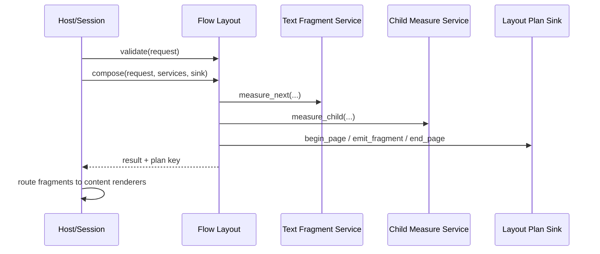

# FacetWire Flow Layout 0.1 函数级详细设计

状态：**Experimental Draft**
对应标准：`spec/flow-content-profile-v0.1.zh-CN.md`
对应需求：`docs/requirements/flow-layout-renderer-requirements-v0.1.md`

实现状态：0.1 参考实现已覆盖 block、inline、float、overlay、显式 break、keepTogether、
有界 keepWithNext 和普通段落 orphan/widow。不能满足的美观约束通过诊断位暴露。

## 1. 组件与调用链

参考插件 `org.facetwire.reference.flow-layout` 只生成 Layout Plan。宿主解析 Flow、选择响应式
模板、绑定内容 ID，并提供 Text Fragment 与 Child Measure Service。



### 本章检查

- 插件不拥有 Parser、Session 或 child Renderer。
- Plan 生成与最终绘制可以分别单元测试。

## 2. 文件规划

| 文件 | 责任 |
| --- | --- |
| `include/facetwire/flow_layout.h` | Layout v1 请求、结果、Sink、API |
| `include/facetwire/text_fragment_service.h` | 文本片段测量/重放合同 |
| `include/facetwire/child_measure_service.h` | Replaced Element 测量合同 |
| `plugins/flow_layout/flow_layout.c` | 主分页算法 |
| `plugins/flow_layout/flow_validate.c` | 结构和图引用验证 |
| `plugins/flow_layout/flow_break.c` | break/keep/widow/orphan 决策 |
| `plugins/flow_layout/flow_key.c` | 128-bit Plan key |
| `tests/fakes/fake_text_fragment_service.c` | 可控分行、零消费和 fingerprint |
| `tests/fakes/fake_child_measure_service.c` | intrinsic/fallback/失败注入 |
| `tests/fakes/fake_layout_plan_sink.c` | 记录 Page/Fragment 和失败注入 |

### 本章检查

- ABI、算法、策略与测试替身分离。
- 参考插件不链接字体、图片或图表库。

## 3. 核心枚举

```c
#define FW_FLOW_LAYOUT_CAPABILITY_ID "facetwire.layout.flow"
#define FW_FLOW_LAYOUT_INTERFACE_ID "facetwire.layout.flow.v1"
#define FW_FLOW_LAYOUT_INTERFACE_VERSION 1u

typedef uint32_t fw_flow_item_kind;
#define FW_FLOW_ITEM_PARAGRAPH 1u
#define FW_FLOW_ITEM_OBJECT    2u

typedef uint32_t fw_flow_segment_kind;
#define FW_FLOW_SEGMENT_TEXT   1u
#define FW_FLOW_SEGMENT_OBJECT 2u

typedef uint32_t fw_flow_placement_mode;
#define FW_FLOW_PLACE_BLOCK       1u
#define FW_FLOW_PLACE_INLINE      2u
#define FW_FLOW_PLACE_FLOAT_START 3u
#define FW_FLOW_PLACE_FLOAT_END   4u
#define FW_FLOW_PLACE_OVERLAY     5u

typedef uint32_t fw_flow_page_mode;
#define FW_FLOW_CONTINUOUS    1u
#define FW_FLOW_VIRTUAL_PAGES 2u
#define FW_FLOW_COLUMNS       3u

typedef uint32_t fw_flow_fragment_kind;
#define FW_FLOW_FRAGMENT_TEXT        1u
#define FW_FLOW_FRAGMENT_OBJECT      2u
#define FW_FLOW_FRAGMENT_PLACEHOLDER 3u
```

未知枚举返回 `INVALID_ARGUMENT`。发布后的数字不复用。

### 本章检查

- Profile 字符串枚举可一一映射 C ABI。
- Item、Segment、Placement、Page 和 Fragment 是正交维度。

## 4. 输入结构

```c
typedef struct fw_flow_break_policy_v1 {
    uint32_t struct_size;
    uint32_t break_before;
    uint32_t break_after;
    uint32_t keep_together;
    uint32_t keep_with_next;
    uint32_t orphans;
    uint32_t widows;
    uint32_t flags;
} fw_flow_break_policy_v1;

typedef struct fw_flow_placement_v1 {
    uint32_t struct_size;
    fw_flow_placement_mode mode;
    fw_edge_insets_f32 margins;
    float requested_width;   /* 0 = auto */
    float requested_height;  /* 0 = auto */
    float min_width;
    float min_height;
    float max_width;         /* FLT_MAX = unbounded */
    float max_height;
    float offset_x;
    float offset_y;
    int32_t z;
    uint32_t allow_scale_down;
    uint32_t allow_scale_up;
    uint32_t flags;
} fw_flow_placement_v1;

typedef struct fw_flow_segment_v1 {
    uint32_t struct_size;
    fw_flow_segment_kind kind;
    fw_string_view text;           /* TEXT only */
    fw_string_view object_item_id; /* OBJECT only */
    uint32_t baseline_mode;
    uint32_t flags;
} fw_flow_segment_v1;

typedef struct fw_flow_item_v1 {
    uint32_t struct_size;
    fw_string_view id;
    fw_flow_item_kind kind;
    const fw_flow_segment_v1 *segments;
    size_t segment_count;
    fw_string_view content_id;   /* OBJECT only; host context key */
    fw_string_view content_kind; /* image/chart/... */
    fw_text_style_v1 text_style; /* PARAGRAPH only */
    fw_text_direction direction;
    fw_flow_placement_v1 placement;
    fw_flow_break_policy_v1 break_policy;
    uint32_t decorative;
    uint32_t flags;
    fw_string_view overlay_anchor_item_id;
    int32_t overlay_reading_order;
    uint32_t overlay_has_reading_order;
} fw_flow_item_v1;
```

所有数组/字符串由宿主拥有，只在调用期间有效。`content_id` 是宿主绑定键，不是路径或平台对象。inline object 使用 Segment 引用同一请求内 Object Item；其 Placement 必须为 inline，主 Item 循环必须跳过该定义，避免重复 Fragment。

`overlay_anchor_item_id` 必须引用请求中更早出现的 block Paragraph/Object；overlay 不能作为
另一个 overlay 的 anchor。非 decorative overlay 必须设置
`overlay_has_reading_order=1`。这些字段追加在实验版 `fw_flow_item_v1` 尾部，宿主和插件
仍必须按 `struct_size` 协商；0.1 尚未承诺冻结二进制布局。

### 本章检查

- 结构能够表达 block/inline/float/overlay 和统一样式 Paragraph。
- ABI 不传 JSON DOM、文件路径或 Renderer handle。

## 5. Page Template、预算与请求

```c
typedef struct fw_flow_page_template_v1 {
    uint32_t struct_size;
    fw_flow_page_mode mode;
    fw_size_f32 page_size;
    fw_edge_insets_f32 margins;
    uint32_t column_count;
    float column_gap;
    float page_gap;
    float minimum_text_width;
    uint32_t flags;
} fw_flow_page_template_v1;

typedef struct fw_flow_budget_v1 {
    uint32_t struct_size;
    uint32_t max_items;
    uint32_t max_segments;
    uint32_t max_pages;
    uint32_t max_fragments;
    uint32_t max_active_floats;
    uint32_t max_backtrack_items;
    uint32_t max_iterations;
    uint32_t flags;
} fw_flow_budget_v1;

typedef struct fw_flow_layout_request_v1 {
    uint32_t struct_size;
    uint64_t request_id;
    fw_string_view flow_id;
    const fw_flow_item_v1 *items;
    size_t item_count;
    fw_flow_page_template_v1 page_template;
    fw_flow_budget_v1 budget;
    fw_render_target_profile_v1 target;
    uint64_t document_revision;
    uint64_t layout_revision;
    fw_string_view profile_key;
    uint32_t flags;
} fw_flow_layout_request_v1;
```

Host 在调用前选择模板。`layout_revision` 在任何影响 Plan 的 Session 投影变化时递增；viewer
zoom 不进入请求。预算 0 表示使用规范默认值，不表示无限。

### 本章检查

- Template、Target、revision 和预算均显式输入。
- zoom 与 reflow 没有混在 Layout 请求中。

## 6. Text Fragment Service

```c
typedef struct fw_text_exclusion_rect_v1 {
    uint32_t struct_size;
    fw_rect_f32 rect;
    uint32_t flags;
} fw_text_exclusion_rect_v1;

typedef uint32_t fw_text_fragment_part_kind;
#define FW_TEXT_FRAGMENT_PART_TEXT 1u
#define FW_TEXT_FRAGMENT_PART_OBJECT 2u

#define FW_TEXT_FRAGMENT_SERVICE_INLINE_PARTS (1u << 0)

typedef struct fw_text_inline_object_v1 {
    uint32_t struct_size;
    fw_string_view item_id;
    size_t text_offset_utf8_byte;
    fw_size_f32 size;
    fw_edge_insets_f32 margins;
    float offset_x;
    float offset_y;
    fw_flow_baseline_mode baseline_mode;
    uint64_t layout_fingerprint_high;
    uint64_t layout_fingerprint_low;
    uint32_t flags;
} fw_text_inline_object_v1;

typedef struct fw_text_fragment_part_v1 {
    uint32_t struct_size;
    fw_text_fragment_part_kind kind;
    size_t inline_object_index; /* OBJECT only */
    fw_rect_f32 bounds;
    size_t text_start_utf8_byte; /* TEXT only */
    size_t text_end_utf8_byte;   /* TEXT only */
    uint32_t flags;
} fw_text_fragment_part_v1;

typedef struct fw_text_fragment_request_v1 {
    uint32_t struct_size;
    fw_string_view paragraph_id;
    const fw_flow_segment_v1 *segments;
    size_t segment_count;
    size_t start_utf8_byte;
    fw_text_style_v1 style;
    fw_text_direction direction;
    fw_rect_f32 region;
    const fw_text_exclusion_rect_v1 *exclusions;
    size_t exclusion_count;
    uint32_t max_lines; /* 0 = fit region */
    uint32_t flags;
    const fw_text_inline_object_v1 *inline_objects;
    size_t inline_object_count;
    size_t start_inline_object_index;
    fw_text_fragment_part_v1 *parts; /* caller-owned output buffer */
    size_t part_capacity;
} fw_text_fragment_request_v1;

typedef struct fw_text_fragment_metrics_v1 {
    uint32_t struct_size;
    size_t end_utf8_byte;
    fw_rect_f32 used_bounds;
    uint32_t line_count;
    uint32_t reached_end;
    uint32_t break_flags;
    uint64_t fingerprint_high;
    uint64_t fingerprint_low;
    uint32_t flags;
    size_t end_inline_object_index;
    size_t part_count;
} fw_text_fragment_metrics_v1;

typedef struct fw_text_fragment_service_v1 {
    uint32_t struct_size;
    void *user_data;
    fw_status(FW_CALL *measure_next)(
        void *user_data,
        const fw_text_fragment_request_v1 *request,
        fw_text_fragment_metrics_v1 *out_metrics);
    fw_status(FW_CALL *draw_exact)(
        void *user_data,
        const fw_text_fragment_request_v1 *request,
        const fw_text_fragment_metrics_v1 *expected,
        const fw_display_list_sink_v1 *display_list);
    uint32_t flags;
} fw_text_fragment_service_v1;
```

`measure_next` 返回能完整放入 region/exclusions 的最大前缀。未结束时必须消费至少一个
UTF-8 字节、一个 inline object，或返回明确错误；端点必须是合法标量/Segment 边界。
Block-only Service 可保持旧结构尺寸且不声明能力；含 Object Segment 的请求要求完整结构
尺寸并声明 `FW_TEXT_FRAGMENT_SERVICE_INLINE_PARTS`，否则 compose 在打开 Page 前返回
`UNSUPPORTED`。

Flow 先通过 Child Measure Service 测量每个 inline Object，把确定尺寸、margin、baseline、
offset 和 fingerprint 传给 Text Service。Text Service 是行内塑形、BiDi、换行和 baseline
几何的唯一所有者，并在调用方提供的有界 `parts` 缓冲区中返回本次前缀的有序 Text/Object
部件。Flow 校验 byte range、object index、顺序、bounds、尺寸和进度后，再把部件转换成统一
Fragment Plan。对象部件允许在不消费 UTF-8 字节时推进 `end_inline_object_index`，因此不会
被错误判定为零进展。`draw_exact` 重新塑形并验证 fingerprint/end/used bounds；不一致返回
`INVALID_STATE`，宿主废弃 Plan 后 reflow。

### 本章检查

- 测量结果不保存平台 layout handle，所有输出缓冲区由调用方拥有。
- block-only 旧 Service 与 inline-capable Service 可通过结构尺寸和 flags 明确协商。
- 行内对象的几何所有权唯一，Flow 不复制一套近似文字排版算法。
- 绘制阶段能够检测字体或后端变化导致的漂移。

## 7. Child Measure Service

```c
typedef struct fw_child_measure_request_v1 {
    uint32_t struct_size;
    fw_string_view item_id;
    fw_string_view content_id;
    fw_string_view content_kind;
    fw_layout_constraints_v1 constraints;
    fw_render_target_profile_v1 target;
    uint32_t flags;
} fw_child_measure_request_v1;

typedef struct fw_child_measure_result_v1 {
    uint32_t struct_size;
    fw_size_f32 intrinsic_size;
    fw_optional_f32 aspect_ratio;
    fw_size_f32 fallback_size;
    uint32_t has_intrinsic_size;
    uint32_t splittable;
    uint32_t used_fallback;
    uint64_t fingerprint_high;
    uint64_t fingerprint_low;
    uint32_t flags;
} fw_child_measure_result_v1;

typedef struct fw_child_measure_service_v1 {
    uint32_t struct_size;
    void *user_data;
    fw_status(FW_CALL *measure_child)(
        void *user_data,
        const fw_child_measure_request_v1 *request,
        fw_child_measure_result_v1 *out_result);
} fw_child_measure_service_v1;
```

Service 可以路由实际 Renderer 的 measure，但不得 render。`NOT_FOUND` 且具有文档 fallback
size 时宿主 Service 返回 OK + `used_fallback=1`；Layout 插件不读取 Resource。

### 本章检查

- 图片、图表和未来内容共享最小测量合同。
- 资源解析和 Capability 路由仍由宿主控制。

## 8. Layout Plan Sink 与 Fragment

```c
typedef struct fw_flow_page_v1 {
    uint32_t struct_size;
    uint32_t page_index;
    fw_string_view derived_page_id;
    fw_size_f32 size;
    fw_rect_f32 content_bounds;
    uint32_t column_count;
    uint32_t flags;
} fw_flow_page_v1;

typedef struct fw_flow_fragment_v1 {
    uint32_t struct_size;
    fw_flow_fragment_kind kind;
    fw_string_view derived_fragment_id;
    fw_string_view source_item_id;
    fw_string_view content_kind;
    uint32_t page_index;
    uint32_t column_index;
    fw_rect_f32 bounds;
    fw_rect_f32 clip;
    int32_t z;
    size_t text_start_utf8_byte;
    size_t text_end_utf8_byte;
    uint32_t continuation_before;
    uint32_t continuation_after;
    uint64_t layout_fingerprint_high;
    uint64_t layout_fingerprint_low;
    uint32_t flags;
} fw_flow_fragment_v1;

typedef struct fw_flow_plan_sink_v1 {
    uint32_t struct_size;
    void *user_data;
    fw_status(FW_CALL *begin_page)(void *, const fw_flow_page_v1 *);
    fw_status(FW_CALL *emit_fragment)(void *, const fw_flow_fragment_v1 *);
    fw_status(FW_CALL *end_page)(void *, uint32_t page_index);
} fw_flow_plan_sink_v1;
```

Sink 必须在回调返回前复制所有 string view/结构。Page 必须按 index 输出；同页 Fragment
按 flow order 后 z 排序，阅读顺序由 source metadata 单独维护。begin 成功后即使中途失败，
插件也调用一次 end；保留首个错误。

### 本章检查

- 变长 Plan 不需要跨 ABI 共享 allocator。
- Page/Fragment 生命周期、顺序和错误平衡可由 Fake Sink 断言。

## 9. 结果与函数表

```c
typedef struct fw_flow_validation_result_v1 {
    uint32_t struct_size;
    fw_status status;
    uint64_t diagnostic_flags;
    fw_string_view diagnostic_key;
} fw_flow_validation_result_v1;

typedef struct fw_flow_layout_result_v1 {
    uint32_t struct_size;
    uint32_t page_count;
    uint32_t fragment_count;
    uint32_t text_fragment_count;
    uint32_t object_fragment_count;
    fw_size_f32 continuous_extent;
    uint64_t plan_key_high;
    uint64_t plan_key_low;
    uint64_t diagnostic_flags;
    uint32_t complete;
    uint32_t flags;
} fw_flow_layout_result_v1;

typedef struct fw_flow_layout_services_v1 {
    uint32_t struct_size;
    const fw_text_fragment_service_v1 *text;
    const fw_child_measure_service_v1 *children;
    uint32_t flags;
} fw_flow_layout_services_v1;

typedef struct fw_flow_layout_api_v1 {
    uint32_t struct_size;
    uint32_t interface_version;
    fw_status(FW_CALL *validate)(fw_plugin_handle,
        const fw_flow_layout_request_v1 *, fw_flow_validation_result_v1 *);
    fw_status(FW_CALL *compose)(fw_plugin_handle,
        const fw_flow_layout_request_v1 *, const fw_flow_layout_services_v1 *,
        const fw_flow_plan_sink_v1 *, fw_flow_layout_result_v1 *);
    fw_status(FW_CALL *get_parameter_schema)(
        fw_plugin_handle, fw_string_view *out_schema_json);
} fw_flow_layout_api_v1;
```

### 函数合同

- `validate`：只检查结构、枚举、范围、ID/引用/单一所有权和预算；不调用 Service/Sink。
- `compose`：从 Item 0 开始生成完整 Plan；成功要求 `complete=1`。任何不完整结果返回非 OK，
  `complete=0`，宿主不得把已输出前缀发布为完整页面集合。
- `get_parameter_schema`：返回插件静态 UTF-8 Schema，生命周期至 unload；不分配内存。

### 本章检查

- 每个函数输入、输出、调用服务、副作用和完整性语义明确。
- 失败前缀不能被误发布为完整文档。

## 10. 核心分页算法

```text
select selected template (host already resolved)
initialize page/column cursor and active float exclusions
for each top-level item in source order, excluding placement=inline object definitions:
  apply breakBefore and keep-chain lookahead within budget
  if paragraph:
    premeasure referenced inline objects once through Child Measure Service
    require Text Service INLINE_PARTS when object segments are present
    while text bytes or inline objects remain:
      region = remaining column minus active exclusions
      metrics, parts = text.measure_next(
          paragraph, byte_offset, inline_object_index, region,
          exclusions, measured_inline_objects)
      if no progress: advance below nearest float or open next column/page
      validate ordered text ranges/object indexes/bounds/fingerprints
      emit one text/object/placeholder fragment for each part
      byte_offset = metrics.end_utf8_byte
      inline_object_index = metrics.end_inline_object_index
      enforce orphan/widow with bounded rollback
  if object block/float/overlay:
    child = children.measure_child(...)
    resolve size from requested/intrinsic/fallback constraints
    place or advance column/page exactly once
    emit object/placeholder fragment
  apply breakAfter; expire floats below cursor
finish page, compute counts and plan key
```

Margin 0.1 规则：相邻 block 的垂直 margin 取最大值，不处理负 margin；inline 不参与 block
margin；float margin 属于 exclusion bounds；overlay margin 不改变 cursor。

overlay 0.1 规则：对象以 anchor 的首个 Fragment 左上角为原点应用 margin、offset 与 z，
继承 anchor 的 page、column 和 clip，并设置 `FW_FLOW_FRAGMENT_FLAG_OVERLAY`。它不改变
flow cursor、相邻 margin 或后续 Item 的布局。当前参考实现要求 anchor 的页面尚未关闭；
跨已关闭历史页的反向覆盖返回 `FW_STATUS_UNSUPPORTED`，避免缓存整份历史页面几何。

分页控制 0.1 规则：

- `breakBefore` 在当前区域已有内容时推进到下一栏/页，并在下一个 Fragment 设置
  `FW_FLOW_FRAGMENT_FLAG_BREAK_BEFORE`；`breakAfter` 对后继 Fragment 设置
  `FW_FLOW_FRAGMENT_FLAG_BREAK_AFTER_PREVIOUS`。
- continuous 模式保留同一画布和 cursor，只输出上述分段标记，不制造白纸间隔。
- `keepTogether` 和 orphan 下限先在当前区域预排；若会拆分且完整内容可放入一个新区域，
  则整体移至新区域，否则继续排版并设置对应 relaxation diagnostic。
- `keepWithNext` 从当前 Item 向前看连续链，最多检查 `max_backtrack_items`。0.1 对普通
  Paragraph 与 block Object 做确定性预排；inline、float、overlay 或超预算链设置
  `KEEP_WITH_NEXT_RELAXED` / `BACKTRACK_LIMIT`。
- 普通 Paragraph 在尾页不足 `widows` 时，通过 Text Fragment Service 的
  `max_lines` 有界重测上一片段；带 inline object 的段落保持 replacement object 原子性，
  当前无法安全重放时设置 `WIDOW_ORPHAN_RELAXED`。

inline 0.1 规则：Object 是不可拆 replacement segment；空间不足时 Text Service 必须把完整
对象留给下一行/区域。continuous 不得隐式新增页，virtual-pages/columns 按“下一栏后下一页”
推进。baseline 支持 alphabetic、middle、text-top、text-bottom；LTR/RTL 的视觉坐标由 Text
Service 决定，Fragment 的 source/文本 byte range 仍按逻辑顺序输出。

### 本章检查

- 每个循环分支要么消费源内容、移动 cursor、打开新页，要么返回错误。
- float、keep 和 widow/orphan 回溯均受预算约束。

## 11. ID、fingerprint 与 Plan key

派生 ID 推荐：`vp:<flow-hash>:<layout-revision>:<page-index>` 和
`vf:<source-id>:<layout-revision>:<ordinal>`。它们用于调试/Session，不承诺跨 revision 稳定。

Plan key 对规范化 Item/Segment/style/placement/break、Template、Target reflow 字段、文档与
layout revision、Text/Child fingerprints、插件实现版本按固定字节序哈希。指针、plugin
handle、时间和 viewer zoom 不进入 key。

### 本章检查

- 字体或 intrinsic size 变化会使 Plan 失效。
- AI 稳定 ID 与派生调试 ID 不混用。

## 12. 错误映射与清理

| 条件 | 状态 | 宿主行为 |
| --- | --- | --- |
| 非法结构/UTF-8/引用 | `INVALID_ARGUMENT` | Flow Zone Placeholder |
| Text Fragment Service 缺失 | `UNSUPPORTED` | Flow Zone/flattened preview |
| 单个 child 缺失且有 fallback | OK + Placeholder Fragment | 继续布局 |
| 单个 child 无尺寸 | `NOT_FOUND` | Flow Zone Placeholder 或策略 fallback |
| 预算耗尽 | `RESOURCE_LIMIT` | 不发布不完整 Plan |
| Service 内部错误 | `PLUGIN_ERROR` | 隔离当前 Flow |
| Sink 拒绝 | `SINK_REJECTED` | 停止并关闭当前 page |
| draw fingerprint 漂移 | `INVALID_STATE` | 丢弃 Plan、更新 revision、reflow |

输出结构入口清零并写 `struct_size`。清理保留首个错误，不继续调用 measure/emit。

### 本章检查

- 局部 child fallback 与整体布局失败可区分。
- 任何失败都不会发布结构不完整的页面集合。

## 13. 单元测试接口与用例

Fake Text Service 使用固定 em 宽度并支持 exclusion、指定每页行数、RTL、零消费、fallback
和 fingerprint 漂移。Fake Child Service 按 content ID 返回 intrinsic/fallback/错误。Fake
Sink 记录精确回调序列并可在第 N 次拒绝。

建议测试：

- `flow_block_preserves_source_order`
- `flow_inline_object_participates_in_baseline_and_wrap`
- `flow_inline_object_supports_four_baselines`
- `flow_inline_object_rtl_preserves_logical_order`
- `flow_inline_object_crosses_pages_and_columns_atomically`
- `flow_inline_object_requires_service_capability`
- `flow_inline_object_rejects_invalid_parts`
- `flow_legacy_block_text_service_tail_is_compatible`
- `flow_float_start_resolves_against_rtl`
- `flow_text_moves_below_too_narrow_float`
- `test_overlay_anchors_without_advancing_flow`
- `test_explicit_breaks`
- `test_keep_together_moves_whole_paragraph`
- `test_orphans_move_paragraph_to_fresh_page`
- `test_widows_rebalance_previous_fragment`
- `test_keep_with_next_moves_chain`
- `flow_paragraph_ranges_are_contiguous_across_pages`
- `flow_keep_chain_backtracking_is_bounded`
- `flow_oversized_object_does_not_create_empty_page_loop`
- `flow_child_missing_uses_same_bounds_placeholder`
- `flow_zero_text_progress_returns_invalid_state`
- `flow_sink_failure_balances_page`
- `flow_zoom_does_not_change_plan_key`
- `flow_font_scale_changes_plan_key_and_fragments`
- `flow_pointer_addresses_do_not_change_plan`

### 本章检查

- 几何、文本完整性、终止性、清理和确定性均可直接断言。
- Fake 规则不会被误当作真实 Unicode 排版规范。

## 14. 实现顺序

1. 评审 Flow Profile 和 ADR-0005；
2. 新增三个公共 Header 和 ABI 编译测试；
3. 实现 validate/graph ownership；
4. 实现 Fake Services/Sink；
5. 实现 continuous block layout；
6. 实现 virtual pages 与 columns；
7. 实现 inline object、Text Service 能力协商和跨区域续排；
8. 已实现 float、overlay 与 keep/widow/orphan 参考切片；
9. Playground 已展示源 Item、Virtual Page、Fragment、overlay、分页约束与降级；
10. Windows/Linux 动态与 Apple/Android 静态注册验证。

### 本章检查

- 从最小 block flow 开始，每阶段都有可运行门禁。
- 复杂能力不会阻塞基础文本和图片排版验证。

## 15. 整体关联与扩展性检查

- Flow Content 是持久源；Layout Plan 是 Session 派生；DisplayList 是 Frame 输出。
- Text Fragment Service 可由 Text Renderer 插件共同提供，但接口独立版本化。
- Child Measure Service 隔离 Image/Chart/Video/Document 的内部模型。
- Virtual Page 坐标不含 viewer zoom，兼容现有递归 Canvas 1:1 语义。
- 后续可增加多边形 exclusion、Rich Segment、脚注、表格和专业分页，而 v1 block/inline
  数据仍可被新实现读取。

### 本章检查

- 已推导 Document → Session → Layout → Fragment → Renderer → DisplayList 全链路。
- 已解决 Text Renderer 膨胀、Page 名称冲突、子 Renderer 耦合和测量/绘制漂移风险。
