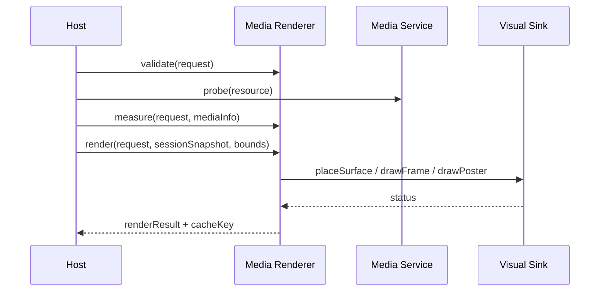

# FacetWire Audio/Video Renderer 0.1 详细设计

状态：**Experimental Draft**
配套需求：`media-renderers-requirements-v0.1.md`

## 1. 设计结论

0.1 采用“无状态 Renderer + 宿主 Media Service + 声明式 Visual Sink + 宿主 Session”的
组合。插件不拥有播放器，不直接解码，不返回平台纹理；同一接口协商三种输出：实时外部
表面、同步解码帧、海报/封面。实时播放与无窗口导出因此共用内容模型和测试入口。



### 本章检查

- ABI 中只有值、字符串视图、数组和 opaque token。
- Renderer 不保留跨调用可变状态。
- 静态导出不依赖实时播放器窗口。

## 2. 公共标识与枚举

新头文件：`include/facetwire/media_renderer.h`。

```c
#define FW_VIDEO_RENDERER_CAPABILITY_ID "facetwire.renderer.video"
#define FW_VIDEO_RENDERER_INTERFACE_ID  "facetwire.renderer.video.v1"
#define FW_AUDIO_RENDERER_CAPABILITY_ID "facetwire.renderer.audio"
#define FW_AUDIO_RENDERER_INTERFACE_ID  "facetwire.renderer.audio.v1"
#define FW_MEDIA_RENDERER_INTERFACE_VERSION 1u

typedef uint32_t fw_media_kind;
#define FW_MEDIA_KIND_VIDEO 1u
#define FW_MEDIA_KIND_AUDIO 2u

typedef uint32_t fw_media_output_mode;
#define FW_MEDIA_OUTPUT_EXTERNAL_SURFACE (1u << 0)
#define FW_MEDIA_OUTPUT_DECODED_FRAME    (1u << 1)
#define FW_MEDIA_OUTPUT_POSTER_ONLY      (1u << 2)

typedef uint32_t fw_media_fit;
#define FW_MEDIA_FIT_NONE    0u
#define FW_MEDIA_FIT_CONTAIN 1u
#define FW_MEDIA_FIT_COVER   2u
#define FW_MEDIA_FIT_FILL    3u

typedef uint32_t fw_media_session_state;
#define FW_MEDIA_STATE_IDLE       0u
#define FW_MEDIA_STATE_PREPARING  1u
#define FW_MEDIA_STATE_READY      2u
#define FW_MEDIA_STATE_PLAYING    3u
#define FW_MEDIA_STATE_PAUSED     4u
#define FW_MEDIA_STATE_SEEKING    5u
#define FW_MEDIA_STATE_BUFFERING  6u
#define FW_MEDIA_STATE_ENDED      7u
#define FW_MEDIA_STATE_FAILED     8u

typedef uint32_t fw_media_controls_mode;
#define FW_MEDIA_CONTROLS_AUTO    0u
#define FW_MEDIA_CONTROLS_VISIBLE 1u
#define FW_MEDIA_CONTROLS_HIDDEN  2u
```


#define FW_MEDIA_REQUEST_REDUCE_DATA           (1u << 0)
#define FW_MEDIA_REQUEST_ALLOW_POSTER_FALLBACK (1u << 1)
所有未识别枚举在 v1 返回 `FW_STATUS_INVALID_ARGUMENT`。未来值只能通过新 interface
version 或明确 feature bit 协商。

### 本章检查

- Capability 名称与 Core Content Profile 完全一致。
- audio/video 共享结构但保留独立路由能力。
- 输出模式不是 codec 枚举。

## 3. 请求值结构

```c
typedef struct fw_media_placement_v1 {
    uint32_t struct_size;
    fw_media_fit fit;
    float alignment_x;
    float alignment_y;
    uint32_t clip;
    uint32_t flags;
} fw_media_placement_v1;

typedef struct fw_media_playback_policy_v1 {
    uint32_t struct_size;
    uint32_t autoplay;
    uint32_t loop;
    uint32_t muted;
    float volume;
    float playback_rate;
    uint64_t start_offset_ms;
    uint64_t end_offset_ms;
    uint32_t has_end_offset;
    fw_media_controls_mode controls;
    uint32_t flags;
} fw_media_playback_policy_v1;

typedef struct fw_media_track_v1 {
    uint32_t struct_size;
    fw_string_view resource_id;
    fw_string_view kind;
    fw_string_view language;
    fw_string_view label;
    uint32_t is_default;
    uint32_t flags;
} fw_media_track_v1;

typedef struct fw_media_renderer_request_v1 {
    uint32_t struct_size;
    uint64_t request_id;
    fw_media_kind kind;
    fw_string_view zone_id;
    fw_string_view resource_id;
    fw_string_view label;
    fw_string_view title;
    fw_string_view poster_or_artwork_resource_id;
    float opacity;
    fw_media_placement_v1 placement;
    fw_media_playback_policy_v1 playback;
    const fw_media_track_v1 *tracks;
    size_t track_count;
    fw_layout_constraints_v1 constraints;
    fw_render_target_profile_v1 target;
    uint64_t presentation_revision;
    uint32_t flags;
} fw_media_renderer_request_v1;
```

输入字符串和 Track 数组由宿主拥有，只在函数调用期间有效。audio 的 placement 仅应用于
artwork/宿主视觉 viewport；video 必须提供 placement。`end_offset_ms` 只有
`has_end_offset=1` 时有效。

### 本章检查

- optional 字段不依赖 NULL string 指针表达。
- bool 使用 uint32_t，避免跨编译器 ABI 差异。
- 请求不含本地路径、URL、平台句柄或播放器对象。

## 4. Media Service v1

```c
typedef uint64_t fw_media_resource_token;
typedef uint64_t fw_media_frame_token;

typedef struct fw_media_probe_request_v1 {
    uint32_t struct_size;
    fw_string_view resource_id;
    fw_media_kind kind;
    uint32_t requested_output_modes;
    fw_render_target_profile_v1 target;
    uint32_t flags;
} fw_media_probe_request_v1;

typedef struct fw_media_info_v1 {
    uint32_t struct_size;
    fw_string_view media_type;
    fw_size_f32 intrinsic_visual_size;
    uint64_t duration_ms;
    uint32_t has_duration;
    uint32_t available_output_modes;
    uint32_t has_audio;
    uint32_t has_video;
    uint32_t protected_content;
    uint32_t track_count;
    uint64_t fingerprint_high;
    uint64_t fingerprint_low;
    uint32_t flags;
} fw_media_info_v1;

typedef struct fw_media_open_request_v1 {
    uint32_t struct_size;
    fw_string_view resource_id;
    fw_media_kind kind;
    fw_media_output_mode output_mode;
    uint64_t position_ms;
    fw_render_target_profile_v1 target;
    uint32_t flags;
} fw_media_open_request_v1;

typedef struct fw_media_frame_info_v1 {
    uint32_t struct_size;
    fw_size_f32 visual_size;
    uint64_t timestamp_ms;
    uint64_t duration_ms;
    uint32_t has_alpha;
    uint32_t flags;
} fw_media_frame_info_v1;

typedef struct fw_media_service_v1 {
    uint32_t struct_size;
    void *user_data;
    fw_status (FW_CALL *probe)(void *, const fw_media_probe_request_v1 *,
        fw_media_info_v1 *);
    fw_status (FW_CALL *open)(void *, const fw_media_open_request_v1 *,
        fw_media_resource_token *);
    void (FW_CALL *close)(void *, fw_media_resource_token);
    fw_status (FW_CALL *acquire_frame)(void *, fw_media_resource_token,
        uint64_t position_ms, fw_media_frame_token *, fw_media_frame_info_v1 *);
    void (FW_CALL *release_frame)(void *, fw_media_frame_token);
} fw_media_service_v1;
```

### 4.1 `probe`

输入：Resource ID、媒体种类、目标和请求输出模式位集。输出：完整 `fw_media_info_v1`。
不得创建长期播放实例；可以使用宿主元数据缓存。未知时长由 `has_duration=0` 表示。

### 4.2 `open` / `close`

`open` 解析宿主 Resource Context 并创建当前调用所需资源 token；成功返回非零 token。
每个成功 token 在所有路径恰好 `close` 一次。token 不等于 Presentation Session，也不得
跨进程或序列化。

### 4.3 `acquire_frame` / `release_frame`

仅 decoded-frame 模式合法。成功时 frame token 非零，timestamp 位于请求片段范围；
Visual Sink 必须在 release 前同步消费。受保护内容返回 `FW_STATUS_UNSUPPORTED`，同时由
宿主诊断通道提供稳定 key `media.permission_denied`。

### 本章检查

- Resource token、frame token 和 session_id 是三个不同概念。
- handle 生命周期可以由 fake service 计数测试。
- 服务可用硬解码、软解码或缓存而不改变插件 ABI。

## 5. Presentation Session Snapshot

```c
typedef struct fw_media_session_snapshot_v1 {
    uint32_t struct_size;
    uint64_t session_id;
    uint64_t revision;
    fw_media_session_state state;
    uint64_t position_ms;
    uint64_t duration_ms;
    uint64_t buffered_until_ms;
    float playback_rate;
    float effective_volume;
    uint32_t muted;
    fw_string_view selected_track_resource_id;
    uint32_t user_initiated_play;
    uint32_t hidden_from_semantics;
    uint32_t flags;
} fw_media_session_snapshot_v1;
```

Renderer request 与 snapshot 分开传入，使相同 Document request 可以在多个 Session 中
复用。`revision` 必须不小于 request 的 `presentation_revision`；否则返回
`FW_STATUS_INVALID_STATE`，由宿主重取 snapshot。

`role`、action mask 和 state 的公共取值在实现前应抽取到
`include/facetwire/semantics.h`。现有 Placeholder 接口保留兼容别名，Media 接口不得
直接包含 `placeholder_renderer.h`，以避免生产 Renderer 依赖 fallback 插件。

### 本章检查

- 当前播放状态不进入持久请求。
- 用户显式播放可覆盖 reduce-motion autoplay 抑制。
- selected Track 使用稳定 Resource ID。

## 6. Media Visual Sink v1

```c
typedef struct fw_media_surface_command_v1 {
    uint32_t struct_size;
    uint64_t session_id;
    fw_string_view zone_id;
    fw_rect_f32 viewport;
    fw_rect_f32 destination;
    fw_rect_f32 source_normalized;
    float opacity;
    uint32_t clip_to_viewport;
    uint32_t show_poster_until_ready;
    uint32_t flags;
} fw_media_surface_command_v1;

typedef struct fw_media_visual_sink_v1 {
    uint32_t struct_size;
    void *user_data;
    fw_status (FW_CALL *place_external_surface)(void *,
        const fw_media_surface_command_v1 *);
    fw_status (FW_CALL *draw_frame)(void *, fw_media_frame_token,
        const fw_media_surface_command_v1 *);
    fw_status (FW_CALL *draw_poster)(void *, fw_string_view resource_id,
        const fw_media_surface_command_v1 *);
} fw_media_visual_sink_v1;
```

`source_normalized` 使用 0–1 坐标表示 cover/clip 后的采样区；`destination` 使用 Canvas
逻辑坐标。Sink 立即复制 command，不保留字符串视图。外部表面由 session_id 关联宿主
播放器，不把纹理句柄传给插件。

### 本章检查

- 三种视觉输出共享同一几何命令。
- normalized source 与 Canvas destination 不混用。
- Surface 生命周期仍由宿主控制。

## 7. Renderer 函数表

```c
typedef struct fw_media_services_v1 {
    uint32_t struct_size;
    const fw_media_service_v1 *media;
    const fw_media_visual_sink_v1 *visual;
    uint32_t flags;
} fw_media_services_v1;

typedef struct fw_media_validation_result_v1 {
    uint32_t struct_size;
    fw_status status;
    uint32_t normalization_flags;
    fw_string_view diagnostic_key;
} fw_media_validation_result_v1;

typedef uint64_t fw_media_semantics_action_mask;
#define FW_MEDIA_ACTION_PLAY          (1ull << 0)
#define FW_MEDIA_ACTION_PAUSE         (1ull << 1)
#define FW_MEDIA_ACTION_SEEK_RELATIVE (1ull << 2)
#define FW_MEDIA_ACTION_SEEK_TO       (1ull << 3)
#define FW_MEDIA_ACTION_SET_RATE      (1ull << 4)
#define FW_MEDIA_ACTION_SET_MUTED     (1ull << 5)
#define FW_MEDIA_ACTION_SET_VOLUME    (1ull << 6)
#define FW_MEDIA_ACTION_SELECT_TRACK  (1ull << 7)

typedef struct fw_media_semantics_v1 {
    uint32_t struct_size;
    uint32_t role;
    fw_string_view label;
    fw_rect_f32 bounds;
    fw_media_session_state state;
    uint64_t position_ms;
    uint64_t duration_ms;
    uint32_t has_duration;
    const fw_media_track_v1 *tracks;
    size_t track_count;
    fw_string_view selected_track_resource_id;
    fw_media_semantics_action_mask actions;
    uint32_t hidden;
    uint32_t flags;
} fw_media_semantics_v1;
typedef struct fw_media_measure_result_v1 {
    uint32_t struct_size;
    fw_size_f32 size;
    fw_size_f32 intrinsic_visual_size;
    fw_media_output_mode selected_output_mode;
    fw_media_normalization_flags normalization_flags;
    uint32_t flags;
} fw_media_measure_result_v1;

typedef struct fw_media_render_result_v1 {
    uint32_t struct_size;
    fw_media_output_mode output_mode;
    fw_rect_f32 destination;
    fw_rect_f32 source_normalized;
    uint32_t command_count;
    uint64_t session_revision;
    uint64_t cache_key_high;
    uint64_t cache_key_low;
    fw_media_normalization_flags normalization_flags;
    uint32_t flags;
} fw_media_render_result_v1;

typedef struct fw_media_renderer_api_v1 {
    uint32_t struct_size;
    uint32_t interface_version;
    fw_status (FW_CALL *validate)(fw_plugin_handle,
        const fw_media_renderer_request_v1 *, fw_media_validation_result_v1 *);
    fw_status (FW_CALL *measure)(fw_plugin_handle,
        const fw_media_renderer_request_v1 *, const fw_media_services_v1 *,
        fw_media_measure_result_v1 *);
    fw_status (FW_CALL *render)(fw_plugin_handle,
        const fw_media_renderer_request_v1 *,
        const fw_media_session_snapshot_v1 *, fw_rect_f32,
        const fw_media_services_v1 *,
        fw_media_render_result_v1 *);
    fw_status (FW_CALL *build_semantics)(fw_plugin_handle,
        const fw_media_renderer_request_v1 *,
        const fw_media_session_snapshot_v1 *, fw_rect_f32,
        fw_media_semantics_v1 *);
    fw_status (FW_CALL *get_parameter_schema)(
        fw_plugin_handle, fw_string_view *out_schema_json);
} fw_media_renderer_api_v1;
```

### 7.1 `validate`

输入 request；输出 status、normalization flags 和稳定 diagnostic key。不得调用
Service/Sink。检查所有 bool、枚举、UTF-8、opacity、volume、rate、offset、Track 数和唯一默认 Track。

### 7.2 `measure`

调用 Service `probe` 一次，选择输出模式并计算约束尺寸。成功写满 result；失败时 result
清零。audio 无视觉固有尺寸时使用 constraints 的确定性最小尺寸或已分配 viewport。

### 7.3 `render`

验证 snapshot revision，计算 Placement，按协商模式调用 Visual Sink 恰好一次或在
opacity=0/audio 无视觉时零次。decoded-frame 严格执行 open→acquire→draw→release→close；
任何失败路径保持平衡。

### 7.4 `build_semantics`

输出 media role、label、bounds、state、position/duration、Track 和允许动作。视觉透明不
自动隐藏语义。函数不调用 Media Service。

### 7.5 `get_parameter_schema`

通过插件长期有效的 borrowed `fw_string_view` 返回 UTF-8 JSON Schema，描述运行时可调整
参数和 Intent 参数；其生命周期与现有 Text/Image Renderer v1 一致。

### 本章检查

- 每个函数的输入、输出、副作用和服务调用边界明确。
- measure 和 render 的资源生命周期可独立测试。
- Semantics 不依赖解码成功才存在。

## 8. 输出模式选择算法

优先级由 Target 和宿主能力共同决定：

1. 静态导出、截图、`FW_MEDIA_REQUEST_REDUCE_DATA`：poster-only；无 poster 时 decoded-frame。
2. 交互实时且 external-surface 可用：external-surface。
3. 无平台表面但 decoded-frame 可用：decoded-frame。
4. 只有 poster/artwork：poster-only，并设置 degraded。
5. 无任何可用模式：`UNSUPPORTED`，Runtime 路由 Placeholder。

protected content 禁止 decoded-frame；external-surface 是否允许由服务 probe 决定。

### 本章检查

- 选择算法确定且可由 fake feature bits 覆盖。
- export 与实时播放不需要两个文件格式。
- DRM 不会被软件帧路径意外绕过。

## 9. Placement 算法

输入固有尺寸 `(iw,ih)` 与 viewport `(vw,vh)`：none 使用 1；contain 使用
`min(vw/iw,vh/ih)`；cover 使用 `max`；fill 分别使用 x/y。alignment 计算剩余空间偏移，
cover 再反算 0–1 `source_normalized`。所有中间值必须有限，最终 destination 可超出
viewport，但 `clip=true` 时 Sink 必须裁剪。

audio artwork 使用同一算法；无 artwork 时不合成隐式背景。

### 本章检查

- 与 Core Image Renderer 的 Placement 数学一致。
- cover 的源裁剪和目标裁剪均有清晰坐标系。
- 固定 1:1 Playground 模式不会进入算法输入。

## 10. 缓存与确定性

cache key 包含：规范化请求、Resource fingerprint、selected output mode、Target、
Placement 结果、poster/artwork fingerprint 和结构 Session 状态。实时帧的 position 不进入
可长期复用视觉缓存；poster-only 可以缓存。字符串按内容哈希，不按指针地址。

### 本章检查

- 相同内容不同内存地址生成相同 key。
- 播放中的每一毫秒不会污染长期缓存。
- Resource 更新通过 fingerprint 失效。

## 11. 插件、宿主与平台映射

| 平台 | Media Service 候选 | 接入 |
| --- | --- | --- |
| Windows | Media Foundation | DLL 或静态测试注册 |
| macOS/iOS/visionOS | AVFoundation | framework/static registration |
| Android | Media3/ExoPlayer | NDK bridge + 应用内静态注册 |
| Linux | GStreamer | `.so` 或静态注册 |

平台适配只实现 Service/Sink；`plugins/core_media_renderer` 为 audio/video 两个 Capability 使用同一
标准 C 核心代码和 fake 测试。平台 codec 差异通过 probe 体现，不通过条件编译改变文件语义。

### 本章检查

- 插件开发体验保持一套 C ABI 和一套测试。
- 受限平台不承诺任意下载动态库。
- 平台播放器替换不影响标准文件。

## 12. 单元测试接口与故障注入

fake Media Service 记录 probe/open/acquire/release/close 次数，可配置 media info、支持模式、
第 N 次失败、protected content、未知时长和 frame timestamp。fake Visual Sink 记录 command，
可在第 N 条拒绝。fake Session 使用手动 clock 和 revision。

必须直接断言：

- validate 不调用服务；
- measure probe 恰好一次；
- decoded-frame 成功/每个失败点 handle 平衡；
- external-surface 不 acquire frame；
- poster-only 不 open 主媒体；
- opacity 0 零视觉命令但保留语义；
- 800×600 与 1400×900 Playground 窗口不改变 fixed 1:1 的 Renderer 请求；
- 相同字符串内容不同指针产生相同 cache key。

### 本章检查

- 所有平台无须真实 codec 即可跑核心测试。
- 生命周期、错误清理和确定性都有精确断言。
- UI 测试与插件 ABI 测试职责分离。

## 13. 实现顺序与完成定义

1. 提交 `media_renderer.h` 和编译期 ABI layout 测试。
2. 实现共享规范化/Placement 模块及 fake Service/Sink。
3. 实现 Video Renderer 的 poster-only、decoded-frame、external-surface。
4. 实现 Audio Renderer 的语义、artwork/title 和 surface-less Session 投影。
5. 在 Playground 加入小型本地 MP4、音频、poster、artwork 和独立控制 Layer。
6. 完成 Windows/Linux 动态、Apple/Android 静态注册与真机验证。

完成定义包括：需求、设计、公共 ABI、一个双 Capability Manifest、参数 Schema、单元测试、fixture、
Playground 演示、跨平台记录和 Placeholder 映射全部一致。

### 本章检查

- 可从最小 poster-only 垂直切片逐步迭代。
- 每一步均有独立可运行门禁。
- 设计未提前承诺 HLS/DRM/空间媒体细节。

## 14. 整体关联推导

Document Resource 由宿主解析；Host Projection 合并 Document 初始策略与 Session snapshot；
Renderer 调用 Media Service 获取能力事实，再通过 Visual Sink 声明画面；Controls/Subtitle
Layer 通过 session_id 与视频关联。失败时 Runtime 在原 Zone 降级 Placeholder，兄弟 Zone
和页面几何不变。

不存在以下冲突：播放器状态不会写回 ASP；平台对象不会穿过插件 ABI；audio 无视觉时仍
有语义；poster 与首帧共享 Placement；根预览缩放不改变 Renderer 输入；受限 Apple/Android
平台通过静态注册仍使用同一插件代码。

### 本章检查

- 数据、状态、视觉、交互和平台服务形成单向依赖。
- 没有组件同时拥有 Document 与 Session 状态。
- v2 可扩展流媒体、DRM、空间输出，而无需破坏 v1 基础结构。
