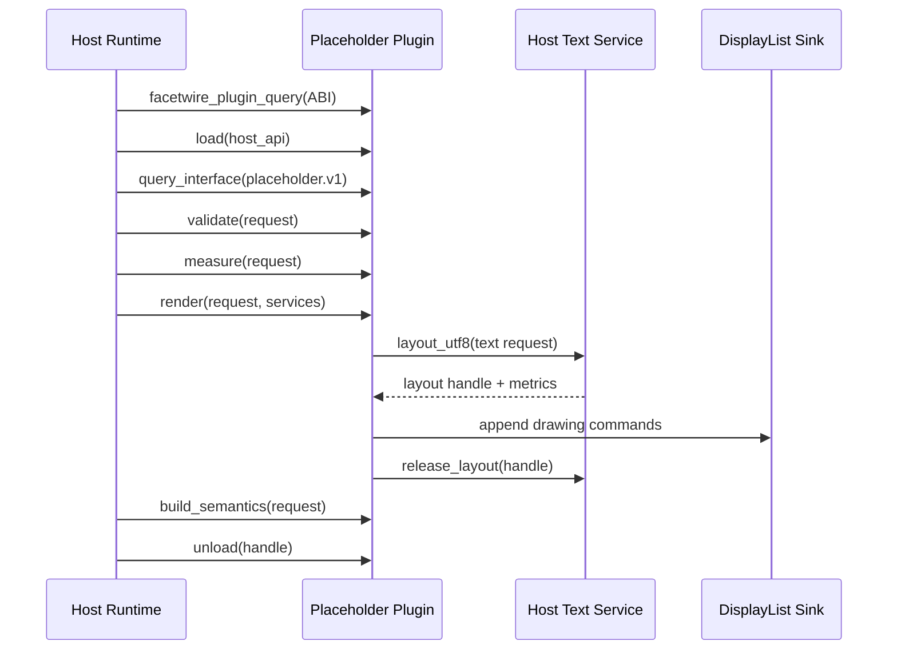
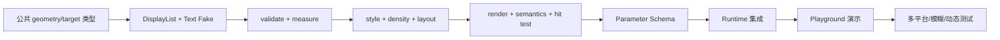

# FacetWire Placeholder Renderer 详细设计 0.1

| 属性 | 值 |
| --- | --- |
| 状态 | Draft / 可实现设计 |
| 版本 | 0.1.0 |
| UI 技术关系 | UI-neutral；参考宿主选型见 `docs/adr/0001-cross-platform-ui-framework.md` |
| 对应需求 | `docs/requirements/placeholder-renderer-requirements-v0.1.md` |
| 语言与 ABI | C11 / FacetWire C ABI v1 |
| 插件 ID | `org.facetwire.reference.placeholder-renderer` |
| Capability ID | `facetwire.renderer.placeholder` |
| 接口 ID | `facetwire.renderer.placeholder.v1` |
| 许可证 | MPL-2.0 |

本文把 Placeholder Renderer 需求落实为可编译、可模拟、可单元测试的函数合同。
本文中的 C 声明是 0.1 设计基线；实现时应拆入版本化公共头文件。除非单独说明，
所有指针仅在函数调用期间借用，任何一方均不得释放另一方的内存。


[`ADR-0001`](../adr/0001-cross-platform-ui-framework.md) 只决定 FacetWire Playground
的 UI 实现，不改变本插件的类型、生命周期或测试边界。即使 Playground 从 Flutter
回退到 Qt Quick/Avalonia，本文件所有 C 函数签名和行为仍必须成立。
## 1. 设计目标与边界

Placeholder Renderer 是无资源 I/O、无平台 UI、确定性的 Zone 降级渲染插件。
它接收宿主已解析的几何、状态、主题和文本服务，通过宿主提供的 DisplayList Sink
生成绘制指令，并单独输出可访问性和操作语义。

核心调用链：



插件不得：

- 读取或解码原始内容资源；
- 创建线程、计时器、窗口或 GPU 设备；
- 保存宿主请求中的临时指针；
- 自行安装、重启或发现其他插件；
- 修改 Canvas、Page、Layer、Zone 或原场景；
- 在渲染失败时递归调用自身。

### 本章检查

- 职责覆盖验证、测量、绘制、语义和命中，不包含资源与平台职责。
- 所有外部能力通过显式宿主服务进入，便于 Fake 和单元测试。
- 调用链与当前 FacetWire 插件生命周期兼容。

## 2. 文件与模块规划

```text
include/facetwire/
├── geometry.h                         公共几何与约束类型
├── render_target.h                    渲染目标、主题和媒介
├── display_list.h                     DisplayList Sink 合同
├── text_service.h                     文本布局宿主服务
├── renderer.h                         通用 Renderer 基础类型
└── placeholder_renderer.h             Placeholder 公共接口

plugins/placeholder_renderer/
├── CMakeLists.txt
├── include/facetwire_placeholder_export.h
├── src/
│   ├── plugin.c                       插件入口与生命周期
│   ├── placeholder_api.c              公共函数表适配
│   ├── validate.c                     输入验证与归一化
│   ├── measure.c                      尺寸回退算法
│   ├── visual_density.c               尺寸级别选择
│   ├── style.c                        主题与透明度处理
│   ├── copy.c                         标题、状态键、操作选择
│   ├── render.c                       DisplayList 发射
│   ├── semantics.c                    可访问性输出
│   ├── hit_test.c                     操作命中
│   ├── cache_key.c                    确定性缓存键
│   └── internal/*.h                   纯函数内部接口
└── tests/
    ├── fake_display_list_sink.c
    ├── fake_text_service.c
    ├── plugin_contract_test.c
    ├── validate_test.c
    ├── measure_test.c
    ├── visual_density_test.c
    ├── style_test.c
    ├── render_test.c
    ├── semantics_test.c
    ├── hit_test_test.c
    └── cache_key_test.c
```

公共头文件不得依赖插件私有头文件。内部纯函数可以被插件单元测试直接链接，但
不得安装到 SDK。

### 本章检查

- 每个可测试职责有独立实现文件和测试文件。
- 公共类型可被未来文本、图片等 Renderer 复用。
- 插件私有算法不会污染稳定 SDK。

## 3. ABI 与通用约定

### 3.1 状态码扩展

当前 `fw_status` 需要追加以下值，不得修改已有数值：

```c
typedef enum fw_status_extension_v1 {
    FW_STATUS_BUFFER_TOO_SMALL = 9,
    FW_STATUS_CANCELLED = 10,
    FW_STATUS_UNSUPPORTED = 11,
    FW_STATUS_INVALID_STATE = 12,
    FW_STATUS_RESOURCE_LIMIT = 13,
    FW_STATUS_SINK_REJECTED = 14
} fw_status_extension_v1;
```

追加状态仍由 `fw_status_name` 返回稳定英文标识。

### 3.2 数值规则

- 几何统一使用 IEEE-754 `float`；
- 输入 NaN、正负无穷必须标记无效；
- `-0.0f` 必须归一化为 `0.0f`；
- 宽度、高度、圆角和描边不得为负数；
- `opacity` 限制到 `[0, 1]`，非有限值使用安全默认值并设置归一化标记；
- 颜色通道使用非预乘线性值 `[0, 1]`，DisplayList 后端负责目标颜色空间转换；
- 枚举底层类型固定为 `uint32_t`，公共结构中不得直接使用编译器大小不确定的 C
  `enum` 字段。

### 3.3 结构版本

所有可扩展结构第一个字段必须是 `uint32_t struct_size`。读取者只能访问
`struct_size` 覆盖的字段。0.1 实现接受大于等于当前已知最小尺寸的结构并忽略尾部。

### 3.4 字符串和所有权

- 所有字符串均为 UTF-8 `fw_string_view`，可以不以 NUL 结尾；
- 输入字符串由宿主持有，调用期间有效；
- 描述符、接口表和 Parameter Schema 由插件持有，从加载成功到卸载前有效；
- 文本布局句柄由 Text Service 创建并由同一个 Text Service 释放；
- DisplayList 指令内需要持久化的字符串必须由 Sink 复制。

### 3.5 线程

- 插件函数可以从任意宿主工作线程调用；
- 同一个 `fw_plugin_handle` 上的 `measure`、`render`、`build_semantics` 和
  `hit_test` 必须可并发；
- `unload` 只允许在所有调用结束后执行；
- 插件实现不得使用可变全局渲染状态；
- Fake Sink 和测试可以检测并发重入，但 0.1 不要求同一 Sink 并发安全。

### 本章检查

- 数值、字符串、结构、所有权和线程规则足以避免跨编译器歧义。
- 状态扩展保持当前 ABI 数值稳定。
- 规则可以直接转化为输入验证和并发测试。

## 4. 公共几何类型

建议文件：`include/facetwire/geometry.h`。

```c
typedef struct fw_point_f32 {
    float x;
    float y;
} fw_point_f32;

typedef struct fw_size_f32 {
    float width;
    float height;
} fw_size_f32;

typedef struct fw_rect_f32 {
    float x;
    float y;
    float width;
    float height;
} fw_rect_f32;

typedef struct fw_optional_size_f32 {
    uint32_t has_value;
    fw_size_f32 value;
} fw_optional_size_f32;

typedef struct fw_optional_f32 {
    uint32_t has_value;
    float value;
} fw_optional_f32;

typedef struct fw_layout_constraints_v1 {
    uint32_t struct_size;
    float min_width;
    float max_width;
    float min_height;
    float max_height;
    float em_size;
    float line_height;
    uint32_t flags;
} fw_layout_constraints_v1;
```

约束规则：

- `0 <= min_width <= max_width`；
- `0 <= min_height <= max_height`；
- 无界最大值使用 `FLT_MAX`，不得使用无穷；
- `em_size > 0`，无效时归一化为宿主默认值 `16.0f`；
- `line_height > 0`，无效时取 `1.2f * em_size`；
- 可选值只有 `has_value == 1` 时读取；其他值按无值处理并记录归一化。

### 本章检查

- 类型只包含 ABI 稳定字段。
- 未知、约束、固有和已解析尺寸都能表达。
- 无界值不依赖 NaN/Infinity，方便序列化与模糊测试。

## 5. 状态、模式和标志

建议文件：`include/facetwire/placeholder_renderer.h`。

```c
typedef uint32_t fw_placeholder_reason;
#define FW_PLACEHOLDER_REASON_LOADING                1u
#define FW_PLACEHOLDER_REASON_RENDERER_MISSING       2u
#define FW_PLACEHOLDER_REASON_UNSUPPORTED_TYPE       3u
#define FW_PLACEHOLDER_REASON_RESOURCE_MISSING       4u
#define FW_PLACEHOLDER_REASON_RESOURCE_UNAVAILABLE   5u
#define FW_PLACEHOLDER_REASON_PARSE_FAILED           6u
#define FW_PLACEHOLDER_REASON_DECODE_FAILED          7u
#define FW_PLACEHOLDER_REASON_POLICY_BLOCKED         8u
#define FW_PLACEHOLDER_REASON_PERMISSION_REQUIRED    9u
#define FW_PLACEHOLDER_REASON_RESOURCE_LIMITED      10u
#define FW_PLACEHOLDER_REASON_PLUGIN_FAILED         11u
#define FW_PLACEHOLDER_REASON_UNKNOWN               12u

typedef uint32_t fw_placeholder_mode;
#define FW_PLACEHOLDER_MODE_HIDDEN       1u
#define FW_PLACEHOLDER_MODE_MINIMAL      2u
#define FW_PLACEHOLDER_MODE_STANDARD     3u
#define FW_PLACEHOLDER_MODE_DIAGNOSTIC   4u

typedef uint32_t fw_placeholder_action_mask;
#define FW_PLACEHOLDER_ACTION_NONE                0u
#define FW_PLACEHOLDER_ACTION_RETRY         (1u << 0)
#define FW_PLACEHOLDER_ACTION_SHOW_DETAILS  (1u << 1)
#define FW_PLACEHOLDER_ACTION_LOCATE        (1u << 2)
#define FW_PLACEHOLDER_ACTION_PERMISSION    (1u << 3)
#define FW_PLACEHOLDER_ACTION_FIND_PLUGIN   (1u << 4)
#define FW_PLACEHOLDER_ACTION_ALTERNATIVE   (1u << 5)

typedef uint32_t fw_placeholder_normalization_flags;
#define FW_PH_NORMALIZED_NONE                 0u
#define FW_PH_NORMALIZED_REASON        (1u << 0)
#define FW_PH_NORMALIZED_MODE          (1u << 1)
#define FW_PH_NORMALIZED_CONSTRAINTS   (1u << 2)
#define FW_PH_NORMALIZED_INTRINSIC     (1u << 3)
#define FW_PH_NORMALIZED_STYLE         (1u << 4)
#define FW_PH_NORMALIZED_TEXT          (1u << 5)
#define FW_PH_NORMALIZED_ACTIONS       (1u << 6)
#define FW_PH_NORMALIZED_AVAILABILITY  (1u << 7)
```

未知 reason 映射为 `UNKNOWN`；未知 mode 映射为 `STANDARD`。未知 action 位必须清零。

### 本章检查

- 所有需求状态和操作均有稳定数值。
- 未知值具有安全前向兼容行为。
- 标志允许单元测试精确判断是否发生归一化。

## 6. 主题、样式与目标类型

```c
typedef struct fw_color_rgba_f32 {
    float red;
    float green;
    float blue;
    float alpha;
} fw_color_rgba_f32;

typedef struct fw_placeholder_style_v1 {
    uint32_t struct_size;
    fw_color_rgba_f32 background;
    fw_color_rgba_f32 border;
    fw_color_rgba_f32 icon;
    fw_color_rgba_f32 primary_text;
    fw_color_rgba_f32 secondary_text;
    fw_color_rgba_f32 action;
    float opacity;
    float border_width;
    float corner_radius;
    float content_padding;
    float gap;
    float icon_size;
    uint32_t flags;
} fw_placeholder_style_v1;

typedef uint32_t fw_render_medium;
#define FW_RENDER_MEDIUM_SCREEN       1u
#define FW_RENDER_MEDIUM_PRINT        2u
#define FW_RENDER_MEDIUM_EXPORT       3u
#define FW_RENDER_MEDIUM_HEADLESS     4u

typedef struct fw_render_target_profile_v1 {
    uint32_t struct_size;
    float device_pixel_ratio;
    float font_scale;
    fw_render_medium medium;
    uint32_t prefers_dark;
    uint32_t high_contrast;
    uint32_t reduce_motion;
    uint32_t supports_alpha;
    uint32_t flags;
} fw_render_target_profile_v1;
```

默认 Style 由宿主主题生成后传入；插件只提供最后安全默认值。安全默认背景 Alpha 为
`0.0f`，不得默认生成不透明白底。最终指令 Alpha 为
`color.alpha * style.opacity`。

### 本章检查

- 颜色、几何样式和媒介能力完整可传入。
- 默认透明背景满足需求基线。
- Style 是纯数据，Fake 和快照测试无需平台主题对象。

## 7. Placeholder 请求与结果

```c
typedef struct fw_placeholder_request_v1 {
    uint32_t struct_size;
    uint64_t request_id;
    fw_string_view zone_id;
    fw_string_view content_kind;
    fw_string_view required_capability_id;
    fw_string_view accessible_label;
    fw_string_view diagnostic_code;
    fw_placeholder_reason reason;
    fw_placeholder_mode mode;
    fw_placeholder_action_mask permitted_actions;
    fw_optional_size_f32 resolved_size;
    fw_optional_size_f32 intrinsic_size;
    fw_optional_f32 intrinsic_aspect_ratio;
    fw_layout_constraints_v1 constraints;
    fw_placeholder_style_v1 style;
    fw_render_target_profile_v1 target;
    uint32_t fragment_index;
    uint32_t fragment_count;
    uint64_t presentation_revision;
    fw_placeholder_phase phase;
    fw_placeholder_progress_v1 progress;
    uint32_t stale;
    uint32_t flags;
} fw_placeholder_request_v1;

typedef uint32_t fw_placeholder_measure_source;
#define FW_PH_MEASURE_RESOLVED             1u
#define FW_PH_MEASURE_EXPLICIT_CONSTRAINT  2u
#define FW_PH_MEASURE_WIDTH_AND_RATIO      3u
#define FW_PH_MEASURE_HEIGHT_AND_RATIO     4u
#define FW_PH_MEASURE_INTRINSIC             5u
#define FW_PH_MEASURE_KIND_FALLBACK         6u
#define FW_PH_MEASURE_GENERIC_FALLBACK      7u

typedef struct fw_placeholder_measure_result_v1 {
    uint32_t struct_size;
    fw_size_f32 size;
    fw_placeholder_measure_source source;
    fw_placeholder_normalization_flags normalization_flags;
    uint32_t flags;
} fw_placeholder_measure_result_v1;

typedef uint32_t fw_placeholder_visual_density;
#define FW_PH_VISUAL_NONE       0u
#define FW_PH_VISUAL_OUTLINE    1u
#define FW_PH_VISUAL_ICON       2u
#define FW_PH_VISUAL_TITLE      3u
#define FW_PH_VISUAL_DETAIL     4u
#define FW_PH_VISUAL_ACTIONS    5u

typedef struct fw_placeholder_render_result_v1 {
    uint32_t struct_size;
    uint32_t emitted_command_count;
    fw_placeholder_visual_density visual_density;
    fw_placeholder_action_mask visible_actions;
    fw_placeholder_normalization_flags normalization_flags;
    uint64_t cache_key_high;
    uint64_t cache_key_low;
    uint32_t flags;
} fw_placeholder_render_result_v1;
```

`zone_id` 可以为空但不得无效。`diagnostic_code` 只允许宿主传入已经脱敏的稳定代码。
`fragment_count == 0` 归一化为 1；`fragment_index >= fragment_count` 是结构错误。
`presentation_revision`、`phase`、`progress` 和 `stale` 是 Presentation Session 注入的
运行态展示投影，不属于持久文档或远程任务协议；其类型、归一化和缓存规则见
`spec/presentation-session-projection-v0.1.md` 与 ADR-0003。

### 本章检查

- 一个请求包含测量、绘制、语义和命中所需全部稳定数据。
- 结果提供尺寸来源、归一化、指令数量、操作和缓存键，便于精确断言。
- 敏感诊断对象没有跨 ABI。

## 8. DisplayList Sink 合同

建议文件：`include/facetwire/display_list.h`。0.1 Placeholder 只依赖以下最小子集。

```c
typedef void *fw_text_layout_handle;

typedef struct fw_stroke_style_v1 {
    uint32_t struct_size;
    fw_color_rgba_f32 color;
    float width;
    uint32_t dashed;
} fw_stroke_style_v1;

typedef struct fw_display_list_sink_v1 {
    uint32_t struct_size;
    void *user_data;
    fw_status (FW_CALL *save)(void *user_data);
    fw_status (FW_CALL *restore)(void *user_data);
    fw_status (FW_CALL *clip_rect)(void *user_data, fw_rect_f32 rect);
    fw_status (FW_CALL *fill_rounded_rect)(
        void *user_data,
        fw_rect_f32 rect,
        float radius,
        fw_color_rgba_f32 color);
    fw_status (FW_CALL *stroke_rounded_rect)(
        void *user_data,
        fw_rect_f32 rect,
        float radius,
        const fw_stroke_style_v1 *style);
    fw_status (FW_CALL *draw_symbol)(
        void *user_data,
        fw_string_view symbol_id,
        fw_rect_f32 rect,
        fw_color_rgba_f32 color);
    fw_status (FW_CALL *draw_text_layout)(
        void *user_data,
        fw_text_layout_handle layout,
        fw_point_f32 origin,
        fw_color_rgba_f32 color);
} fw_display_list_sink_v1;
```

每个成功调用计为一条指令。`save` 成功后必须对应一次 `restore`。任一 Sink 调用返回
非 OK 时，插件停止发射，尽力恢复已保存状态，并返回 `FW_STATUS_SINK_REJECTED`。
Sink 必须复制其需要在调用后保留的数据。
`draw_text_layout` 的 `layout` 仅在回调期间有效。需要跨越 `render` 返回边界的 Sink
实现必须在回调内将布局展开为自包含的字形、位置、字体资源引用或等价可移植文本
指令；禁止把 `fw_text_layout_handle` 的数值写入 DisplayList。若无法完成复制，回调
返回非 OK，Placeholder 按 Sink 失败路径终止。这一规则保证 Playground 在 Native
释放 Text Handle 后仍可安全复制和重放 Frame。

### 本章检查

- Placeholder 所需原语有限且可由 Fake Sink 完整记录。
- 错误传播和 save/restore 平衡具有确定规则。
- 接口不暴露 Skia、Flutter Canvas、Qt 对象、.NET 对象或平台 GPU 句柄。

## 9. Text Service 合同

```c
typedef struct fw_text_layout_request_v1 {
    uint32_t struct_size;
    fw_string_view text;
    fw_string_view locale;
    float font_size;
    float max_width;
    uint32_t max_lines;
    uint32_t direction;
    uint32_t ellipsize;
    uint32_t flags;
} fw_text_layout_request_v1;

typedef struct fw_text_layout_metrics_v1 {
    uint32_t struct_size;
    fw_size_f32 size;
    float baseline;
    uint32_t line_count;
    uint32_t did_truncate;
} fw_text_layout_metrics_v1;

typedef struct fw_text_service_v1 {
    uint32_t struct_size;
    void *user_data;
    fw_status (FW_CALL *layout_utf8)(
        void *user_data,
        const fw_text_layout_request_v1 *request,
        fw_text_layout_handle *out_layout,
        fw_text_layout_metrics_v1 *out_metrics);
    void (FW_CALL *release_layout)(
        void *user_data,
        fw_text_layout_handle layout);
} fw_text_service_v1;
```

`layout_utf8` 成功时必须返回非空句柄；失败时输出句柄为 NULL。Placeholder 必须在
同一次 `render` 返回前释放所有布局。Fake Text Service 通过输入字符串和宽度返回
固定指标，以使单元测试独立于系统字体。

### 本章检查

- 字体与本地化布局由宿主处理，插件保持平台无关。
- 句柄创建和释放成对，可用计数器检测泄漏。
- Fake 服务可产生确定性视觉密度和指令序列。

## 10. 可访问性与命中类型

```c
typedef uint32_t fw_semantics_role;
#define FW_SEMANTICS_ROLE_CONTENT_UNAVAILABLE  1u
#define FW_SEMANTICS_ROLE_IMAGE                 2u
#define FW_SEMANTICS_ROLE_MEDIA                 3u
#define FW_SEMANTICS_ROLE_DOCUMENT              4u
#define FW_SEMANTICS_ROLE_CHART                 5u

typedef struct fw_placeholder_semantics_v1 {
    uint32_t struct_size;
    fw_semantics_role role;
    fw_string_view accessible_label;
    fw_string_view status_localization_key;
    fw_placeholder_action_mask available_actions;
    fw_rect_f32 bounds;
    uint32_t hidden_visually;
    uint32_t stale;
    fw_placeholder_phase phase;
    uint32_t flags;
} fw_placeholder_semantics_v1;

typedef struct fw_placeholder_hit_test_request_v1 {
    uint32_t struct_size;
    fw_placeholder_request_v1 placeholder;
    fw_rect_f32 bounds;
    fw_point_f32 point;
} fw_placeholder_hit_test_request_v1;

typedef struct fw_placeholder_hit_test_result_v1 {
    uint32_t struct_size;
    uint32_t hit;
    uint32_t action;
    uint32_t flags;
} fw_placeholder_hit_test_result_v1;
```

`status_localization_key` 指向插件静态字符串，从加载到卸载有效。操作区域布局由与
`render` 相同的纯函数计算，避免视觉和命中不一致。

### 本章检查

- 可访问性不依赖像素推断。
- hidden 模式可以不可见但仍输出语义。
- 命中测试使用同一几何算法，能够逐点单元测试。

## 11. Placeholder 宿主服务集合

```c
typedef struct fw_placeholder_services_v1 {
    uint32_t struct_size;
    const fw_display_list_sink_v1 *display_list;
    const fw_text_service_v1 *text;
    fw_string_view locale;
    uint32_t text_direction;
    uint64_t monotonic_time_ms;
    uint32_t flags;
} fw_placeholder_services_v1;
```

`display_list` 在 `render` 中必须存在；`text` 在需要文字但不可用时允许降级到图标
或轮廓。`monotonic_time_ms` 只用于确定加载动画帧，不允许插件创建计时器；
`reduce_motion` 为真时必须忽略时间并产生静态图标。

### 本章检查

- 所有副作用服务显式集中并可以替换为 Fake。
- 文本服务失败有视觉降级路径。
- 动画由宿主时间驱动，单元测试可注入固定时间。

## 12. 公共 Placeholder 接口函数表

```c
#define FW_PLACEHOLDER_RENDERER_INTERFACE_ID \
    "facetwire.renderer.placeholder.v1"
#define FW_PLACEHOLDER_RENDERER_INTERFACE_VERSION 1u

typedef struct fw_placeholder_validation_result_v1 {
    uint32_t struct_size;
    fw_status status;
    fw_placeholder_normalization_flags normalization_flags;
    fw_string_view diagnostic_key;
} fw_placeholder_validation_result_v1;

typedef struct fw_placeholder_renderer_api_v1 {
    uint32_t struct_size;
    uint32_t interface_version;

    fw_status (FW_CALL *validate)(
        fw_plugin_handle plugin,
        const fw_placeholder_request_v1 *request,
        fw_placeholder_validation_result_v1 *out_result);

    fw_status (FW_CALL *measure)(
        fw_plugin_handle plugin,
        const fw_placeholder_request_v1 *request,
        fw_placeholder_measure_result_v1 *out_result);

    fw_status (FW_CALL *render)(
        fw_plugin_handle plugin,
        const fw_placeholder_request_v1 *request,
        fw_rect_f32 bounds,
        const fw_placeholder_services_v1 *services,
        fw_placeholder_render_result_v1 *out_result);

    fw_status (FW_CALL *build_semantics)(
        fw_plugin_handle plugin,
        const fw_placeholder_request_v1 *request,
        fw_rect_f32 bounds,
        fw_placeholder_semantics_v1 *out_semantics);

    fw_status (FW_CALL *hit_test)(
        fw_plugin_handle plugin,
        const fw_placeholder_hit_test_request_v1 *request,
        fw_placeholder_hit_test_result_v1 *out_result);

    fw_status (FW_CALL *get_parameter_schema)(
        fw_plugin_handle plugin,
        fw_string_view *out_schema_json);
} fw_placeholder_renderer_api_v1;
```

以下章节逐个定义函数合同。

### 本章检查

- 函数表覆盖验证、测量、绘制、语义、命中和 Playground 参数发现。
- 每个函数都带插件句柄和显式输出，适合 C Fake 与 FFI。
- 接口可以通过当前 `query_interface` 返回，不修改插件基础生命周期。

## 13. 基础插件生命周期函数

### 13.1 `facetwire_plugin_query`

```c
const fw_plugin_api_v1 *FW_CALL
facetwire_plugin_query(fw_abi_version requested_abi);
```

输入：宿主请求的 ABI 主、次版本。

输出：

- 主版本不等或宿主次版本低于插件最低版本：返回 NULL；
- 兼容：返回进程生命周期内稳定的只读 `fw_plugin_api_v1`。

副作用：无。线程安全：是。

单元测试：兼容版本、主版本过高/过低、次版本不足、重复调用地址稳定。

### 13.2 `ph_get_descriptor`

```c
static const fw_plugin_descriptor_v1 *FW_CALL ph_get_descriptor(void);
```

输入：无。输出：静态只读插件描述符。Capability 数组必须包含
`facetwire.renderer.placeholder`。副作用：无。

单元测试：ID、版本、Vendor、Capability、结构尺寸和所有字符串有效。

### 13.3 `ph_load`

```c
static fw_status FW_CALL ph_load(
    const fw_host_api_v1 *host,
    fw_plugin_handle *out_handle);
```

输入：有效 Host API；输出：成功时非空不透明句柄。插件只复制 Host API 中允许长期
保存的函数表值，不保存指向调用栈结构的指针。

错误：NULL、结构过小或 ABI 不兼容返回 `FW_STATUS_INVALID_ARGUMENT`；分配失败返回
`FW_STATUS_OUT_OF_MEMORY`。失败时 `*out_handle = NULL`。

单元测试：正常、NULL、结构过小、ABI 不兼容、分配失败注入、日志可选。

### 13.4 `ph_unload`

```c
static void FW_CALL ph_unload(fw_plugin_handle handle);
```

输入：`ph_load` 返回的句柄或 NULL。NULL 为无操作。输出：无。释放插件私有上下文，
不得释放任何宿主服务。宿主保证没有并发调用。

单元测试：NULL、正常释放、资源计数归零；双重卸载属于宿主错误，不要求容忍。

### 13.5 `ph_query_interface`

```c
static fw_status FW_CALL ph_query_interface(
    fw_plugin_handle handle,
    fw_string_view interface_id,
    uint32_t minimum_version,
    const void **out_interface);
```

输入：插件句柄、接口 ID、最低版本。输出：兼容时返回静态
`fw_placeholder_renderer_api_v1`；未知 ID 或版本过高返回 `FW_STATUS_NOT_FOUND`，并
设置 `*out_interface = NULL`。

单元测试：精确 ID、非 NUL 字符串、未知 ID、版本 0/1/2、NULL 输出、无效句柄。

### 本章检查

- 当前 FacetWire 基础函数均有精确输入、输出、错误和测试。
- 生命周期内存归属明确。
- query_interface 是 Placeholder 功能的唯一公共发现入口。

## 14. `validate` 函数合同

```c
fw_status FW_CALL ph_validate(
    fw_plugin_handle plugin,
    const fw_placeholder_request_v1 *request,
    fw_placeholder_validation_result_v1 *out_result);
```

前置条件：三个指针非空，结构尺寸达到 v1 最小值。

行为：

1. 将 `out_result` 初始化为失败安全状态；
2. 检查所有嵌套结构尺寸；
3. 检查字符串 `(data,length)` 合法性和长度上限；
4. 检查 reason、mode、action 位；
5. 检查尺寸、约束、比例、样式、目标和片段；
6. 对可归一化问题返回 `FW_STATUS_OK` 并设置 normalization flags；
7. 对结构错误返回 `FW_STATUS_INVALID_ARGUMENT`；
8. 对长度或数量超限返回 `FW_STATUS_RESOURCE_LIMIT`。

输出：`status` 与函数返回值相同；`diagnostic_key` 为静态英文键，例如
`placeholder.invalid_constraints`，不得包含用户内容。

线程与副作用：纯读取、线程安全、无分配。

单元测试：每个字段的 NULL、过小结构、非法 UTF-8、超长文本、未知枚举、NaN、
Infinity、负尺寸、反向约束、非法片段、未知 action 位以及全有效请求。


### 本章检查

- validate 只检查并报告，不修改输入或产生绘制副作用；
- 每一种非法字段、归一化标志和失败输出状态均有可独立断言的测试。
## 15. `measure` 函数合同

```c
fw_status FW_CALL ph_measure(
    fw_plugin_handle plugin,
    const fw_placeholder_request_v1 *request,
    fw_placeholder_measure_result_v1 *out_result);
```

前置条件：指针和结构有效。函数内部必须执行与 `validate` 相同的验证，调用者不需要
先调用 `validate`。

确定算法：

1. 若 `resolved_size` 有效，约束后返回，source=`RESOLVED`；
2. 若 min 与 max 在某轴相等，视为该轴明确；两轴明确时 source=`EXPLICIT`；
3. 已知宽度和有效 ratio：`height = width / ratio`；
4. 已知高度和有效 ratio：`width = height * ratio`；
5. 固有宽高均有效：使用 intrinsic；
6. 根据 `content_kind` 从只读表选择回退比例与 em 尺寸；
7. 未知类型使用 `16em × 9em`；行内 flag 使用 `1em × 1em`；
8. 每步最终调用 `ph_constrain_size`；
9. 输出不得包含 NaN、Infinity 或负值。

输出初始化：失败时 size=`{0,0}`、source=0、flags 保留检测到的归一化。

线程与副作用：纯函数语义、无外部服务、无分配。

单元测试：七种 source、宽/高+ratio、ratio 0/负/NaN、极端约束、行内、em 回退、
零尺寸、FLT_MAX、优先级冲突和重复调用位级一致性。


### 本章检查

- measure 的尺寸优先级、约束顺序和归一化语义无循环依赖；
- 有界、无界、冲突约束和非有限数均有确定输出与单元测试。
## 16. `render` 函数合同

```c
fw_status FW_CALL ph_render(
    fw_plugin_handle plugin,
    const fw_placeholder_request_v1 *request,
    fw_rect_f32 bounds,
    const fw_placeholder_services_v1 *services,
    fw_placeholder_render_result_v1 *out_result);
```

前置条件：request、services、display_list、out_result 有效；bounds 有限且宽高非负。

处理顺序：

1. 初始化输出；
2. 验证并归一化 request；
3. bounds 零面积或 mode=hidden：不发射指令，返回 OK；
4. 计算视觉密度；
5. 解析 Style、状态图标和本地化键；
6. 调用 Sink `save`、`clip_rect`；
7. 背景 Alpha > 0 时发射 fill；
8. density >= OUTLINE 时发射边框；
9. density >= ICON 时发射 symbol；
10. density >= TITLE 且 Text Service 可用时布局并绘制标题；
11. density >= DETAIL 时布局并绘制状态/诊断摘要；
12. density >= ACTIONS 时绘制允许的操作标签；
13. 调用 `restore`；
14. 释放所有文本布局；
15. 填写指令数、density、visible_actions、normalization 和缓存键。

任何 Sink 失败：停止新增命令、释放布局、尽力 restore，返回
`FW_STATUS_SINK_REJECTED`。Text Service 失败不是整个 render 失败；降级到更低
density，并记录结果 flag。

mode=diagnostic 只显示已脱敏 `diagnostic_code`、content kind 和 Capability ID；超长
内容必须经 Text Service 省略。

线程与副作用：只调用传入服务；不保存服务指针；不进行 I/O。

单元测试：四种 mode、六个 density、默认透明背景、opacity 0/1、每一种 reason 的
symbol、Text Service 缺失/失败、Sink 在每条指令失败、save/restore 平衡、布局释放、
action 过滤、diagnostic 脱敏输入、零 bounds、并发 100 次和指令上限 64。


### 本章检查

- render 仅消费已验证请求，并对 Sink/Text Service 的每条失败路径完成清理；
- 指令顺序、句柄释放、save/restore 平衡和结果统计均可由 Fake 精确断言。
## 17. `build_semantics` 函数合同

```c
fw_status FW_CALL ph_build_semantics(
    fw_plugin_handle plugin,
    const fw_placeholder_request_v1 *request,
    fw_rect_f32 bounds,
    fw_placeholder_semantics_v1 *out_semantics);
```

行为：

- 根据 content kind 映射 role；未知使用 CONTENT_UNAVAILABLE；
- 原始 accessible label 原样借用；不自行拼接本地化句子；
- 根据 reason 返回静态 localization key；
- available actions = permitted actions 与 reason 支持动作的交集；
- bounds 原样返回；
- mode=hidden 设置 `hidden_visually=1`，但仍返回语义；
- 零面积仍返回语义，宿主可以根据媒介策略过滤。

错误：结构/数值无效返回 INVALID_ARGUMENT；未知 reason 归一化而非失败。

单元测试：每个 content kind/role、每个 reason/key、hidden、action 交集、零面积、
accessible label 借用地址与长度、未知值。


### 本章检查

- semantics 与同一归一化布局共享边界，不另行推导视觉几何；
- hidden、无文本、操作变化和 Buffer 容量不足均有可测试行为。
## 18. `hit_test` 函数合同

```c
fw_status FW_CALL ph_hit_test(
    fw_plugin_handle plugin,
    const fw_placeholder_hit_test_request_v1 *request,
    fw_placeholder_hit_test_result_v1 *out_result);
```

行为：

- hidden、零面积、无 visible action：返回 OK、hit=0；
- 点不在 bounds：hit=0；边界采用左上包含、右下不包含；
- 根据与 render 相同的 `ph_compute_action_rects` 计算操作区域；
- 命中多个区域时按视觉顺序第一个；
- 返回 action 稳定枚举位对应的单值；
- 不触发 Action Intent，只报告命中。

线程与副作用：纯函数、无分配。

单元测试：每个边界点、负坐标、操作数量 0/1/多、RTL 顺序、小尺寸无 action、
hidden、与 render Fake Sink 记录的操作矩形一致。


### 本章检查

- hit_test 使用与 render 相同的可见操作和矩形，不会产生不可见命中区域；
- 边界点、重叠优先级、RTL、越界点和 hidden 模式测试完整。
## 19. `get_parameter_schema` 函数合同

```c
fw_status FW_CALL ph_get_parameter_schema(
    fw_plugin_handle plugin,
    fw_string_view *out_schema_json);
```

返回插件持有的 UTF-8 JSON Schema 子集，从 load 到 unload 有效。0.1 至少公开：

- `mode` enum；
- `opacity` number `[0,1]`；
- `borderWidth` number；
- `cornerRadius` number；
- `showDiagnosticCode` boolean；
- `animationEnabled` boolean；
- `fallbackInlineSizeEm` 和 `fallbackBlockAspectRatio` 只在 Developer 构建可调。

Schema 必须声明参数 ID、类型、默认值、范围、步长、本地化键、是否影响布局和是否
敏感。返回内容必须是有效 UTF-8 和有效 JSON，不包含平台条件脚本。

单元测试：非空、UTF-8、JSON 可解析、ID 唯一、默认值通过自身约束、opacity 语义、
Release/Developer 暴露差异由宿主策略过滤而非修改 Schema。

### 本章检查

- 六个公共函数全部具有前置条件、行为、输出、错误、线程和测试定义。
- 单元测试可以只用 Fake Sink/Text Service，不依赖窗口和字体。
- Parameter Schema 与 Playground 自动参数面板直接对接。

## 20. 内部纯函数设计

建议内部头：`plugins/placeholder_renderer/src/internal/placeholder_internal.h`。

### 20.1 验证与归一化

```c
fw_status ph_validate_request(
    const fw_placeholder_request_v1 *request,
    fw_placeholder_normalization_flags *out_flags,
    fw_string_view *out_diagnostic_key);

fw_status ph_normalize_request(
    const fw_placeholder_request_v1 *input,
    fw_placeholder_request_v1 *out_normalized,
    fw_placeholder_normalization_flags *out_flags);

int ph_is_finite_nonnegative(float value);
float ph_clamp_unit(float value, uint32_t *out_changed);
```

`ph_normalize_request` 只浅复制字符串视图，不延长生命周期。

### 20.2 测量

```c
fw_size_f32 ph_constrain_size(
    fw_size_f32 value,
    const fw_layout_constraints_v1 *constraints);

fw_status ph_resolve_size(
    const fw_placeholder_request_v1 *request,
    fw_placeholder_measure_result_v1 *out_result);

fw_size_f32 ph_kind_fallback_size(
    fw_string_view content_kind,
    float em_size,
    uint32_t inline_content);
```

### 20.3 视觉布局

```c
fw_placeholder_visual_density ph_select_visual_density(
    fw_rect_f32 bounds,
    const fw_placeholder_style_v1 *style,
    fw_placeholder_mode mode,
    fw_placeholder_action_mask actions);

typedef struct ph_visual_layout_v1 {
    fw_rect_f32 content_rect;
    fw_rect_f32 icon_rect;
    fw_rect_f32 title_rect;
    fw_rect_f32 detail_rect;
    fw_rect_f32 action_rects[6];
    uint32_t action_count;
} ph_visual_layout_v1;

fw_status ph_compute_visual_layout(
    fw_rect_f32 bounds,
    const fw_placeholder_style_v1 *style,
    fw_placeholder_visual_density density,
    fw_placeholder_action_mask actions,
    uint32_t text_direction,
    ph_visual_layout_v1 *out_layout);
```

### 20.4 状态映射

```c
fw_string_view ph_reason_localization_key(fw_placeholder_reason reason);
fw_string_view ph_reason_symbol_id(fw_placeholder_reason reason);
fw_placeholder_action_mask ph_supported_actions(
    fw_placeholder_reason reason);
fw_semantics_role ph_role_for_content_kind(fw_string_view content_kind);
```

所有返回字符串均为静态常量。

### 20.5 Style 与颜色

```c
fw_status ph_normalize_style(
    const fw_placeholder_style_v1 *input,
    const fw_render_target_profile_v1 *target,
    fw_placeholder_style_v1 *out_style,
    fw_placeholder_normalization_flags *out_flags);

fw_color_rgba_f32 ph_apply_opacity(
    fw_color_rgba_f32 color,
    float opacity);
```

### 20.6 绘制、语义与缓存

```c
fw_status ph_emit_display_list(
    const fw_placeholder_request_v1 *request,
    fw_rect_f32 bounds,
    const fw_placeholder_services_v1 *services,
    const ph_visual_layout_v1 *layout,
    fw_placeholder_visual_density density,
    fw_placeholder_render_result_v1 *out_result);

fw_placeholder_action_mask ph_visible_actions(
    fw_placeholder_reason reason,
    fw_placeholder_action_mask permitted,
    fw_placeholder_visual_density density);

void ph_compute_cache_key(
    const fw_placeholder_request_v1 *request,
    fw_rect_f32 bounds,
    fw_placeholder_visual_density density,
    uint64_t *out_high,
    uint64_t *out_low);
```

缓存键使用固定版本的 128 位非加密哈希；不得包含指针值、用户路径或未显示的敏感
诊断正文。

### 本章检查

- 公共函数被拆成可独立测试的纯函数。
- 内部函数输入输出没有隐藏全局状态。
- 测量、视觉、状态、样式、发射和缓存各自可定位故障。

## 21. 确定性绘制算法

### 21.1 Visual Density 阈值

阈值基于 `em_size`、padding 和 icon size：

```text
NONE:    mode=hidden 或零面积
OUTLINE: 任一轴不足 1em
ICON:    能容纳 icon + 2*padding
TITLE:   ICON 条件 + 至少 2.5em 宽、1 行文字高
DETAIL:  TITLE 条件 + 至少 2 行文字高
ACTIONS: DETAIL 条件 + 至少 1 行操作高度，且存在允许操作
```

同一个 bounds 在不同设备像素比下必须选择相同 density；只有逻辑尺寸、字体缩放和
Style 影响选择。

### 21.2 指令顺序

固定顺序：

```text
save
clip_rect
fill_rounded_rect?       背景 alpha > 0
stroke_rounded_rect?     density >= OUTLINE
draw_symbol?             density >= ICON
draw_text_layout(title)? density >= TITLE
draw_text_layout(detail)?density >= DETAIL
draw_text_layout(action)*density >= ACTIONS
restore
```

此顺序是结构快照测试的一部分。增加新装饰指令必须提升接口或快照版本。

### 21.3 加载状态

`LOADING` 且未减少动态效果时，symbol ID 可以根据
`(monotonic_time_ms / 100) % frame_count` 选择静态帧。相同时间输入产生相同输出。

### 本章检查

- Density 和指令顺序完全确定，能够进行结构快照测试。
- 设备像素比不会不合理改变逻辑内容密度。
- 加载动画没有私有时钟，测试可复现。

## 22. Fake 与测试夹具设计

### 22.1 Fake DisplayList Sink

```c
typedef struct ph_fake_command_v1 {
    uint32_t opcode;
    fw_rect_f32 rect;
    fw_point_f32 point;
    fw_color_rgba_f32 color;
    fw_string_view string_value;
    uint64_t handle_value;
} ph_fake_command_v1;

typedef struct ph_fake_sink_v1 {
    fw_display_list_sink_v1 api;
    ph_fake_command_v1 commands[64];
    uint32_t command_count;
    uint32_t save_depth;
    uint32_t fail_at_call;
} ph_fake_sink_v1;

void ph_fake_sink_init(ph_fake_sink_v1 *sink);
```

Fake 复制字符串到内部固定缓冲区；超限返回 RESOURCE_LIMIT。`fail_at_call` 从 1 开始
注入错误。

### 22.2 Fake Text Service

```c
typedef struct ph_fake_text_service_v1 {
    fw_text_service_v1 api;
    uint32_t layout_count;
    uint32_t release_count;
    uint32_t fail_at_call;
    float glyph_width_em;
    float line_height_em;
} ph_fake_text_service_v1;

void ph_fake_text_service_init(ph_fake_text_service_v1 *service);
```

宽度按 Unicode scalar 数量乘固定 glyph width 估算；测试不追求真实排版，只验证
服务交互和几何。

### 22.3 请求 Builder

```c
fw_placeholder_request_v1 ph_test_request_default(void);
fw_placeholder_services_v1 ph_test_services_default(
    ph_fake_sink_v1 *sink,
    ph_fake_text_service_v1 *text);
```

Builder 返回完全有效的 Standard 请求；单个测试只修改需要覆盖的字段。

### 本章检查

- Fake 能记录调用、注入每个失败点并检测资源平衡。
- 测试不需要真实字体、GPU、窗口、文件或网络。
- 默认 Builder 降低测试重复并保持单一有效基线。

## 23. 逐函数单元测试矩阵

| 函数 | 正常测试 | 边界/错误测试 | 必须断言 |
| --- | --- | --- | --- |
| `facetwire_plugin_query` | ABI 1.0 | 主/次不兼容 | NULL 或稳定表地址 |
| `ph_load` | 有/无 log | NULL、ABI、OOM | handle 和资源计数 |
| `ph_unload` | 正常/NULL | 活跃调用由宿主禁止 | 私有资源归零 |
| `ph_query_interface` | placeholder.v1 | 未知 ID、v2 | 状态和 NULL 输出 |
| `ph_validate` | 默认请求 | 每个非法字段 | diagnostic + flags |
| `ph_measure` | 七种 source | NaN、ratio、约束 | 尺寸、source、有限值 |
| `ph_render` | 四模式六密度 | Sink/Text 每点失败 | 指令序列、释放、状态 |
| `ph_build_semantics` | 每种 reason/kind | hidden、unknown | role、key、actions |
| `ph_hit_test` | 每个 action | 边界、RTL、无操作 | hit/action 精确值 |
| `ph_get_parameter_schema` | 解析 Schema | 默认值/重复 ID | JSON、范围、稳定地址 |
| `ph_constrain_size` | 常规 | min=max、FLT_MAX | 约束后结果 |
| `ph_select_visual_density` | 阈值中心 | 阈值 ± epsilon | density 精确值 |
| `ph_compute_visual_layout` | LTR/RTL | 极小/零/大尺寸 | 矩形均在 bounds |
| `ph_normalize_style` | 默认主题 | 非有限、负数、Alpha | 安全值和 flags |
| `ph_apply_opacity` | 0/0.5/1 | 超界 | RGBA 精确值 |
| `ph_reason_*` | 12 状态 | 未知 | 静态键/符号 |
| `ph_supported_actions` | 12 状态 | unknown | 位掩码 |
| `ph_emit_display_list` | 完整序列 | 64 上限、Sink 错 | 平衡、无泄漏 |
| `ph_compute_cache_key` | 相同输入 | 单字段变更 | 稳定/变化/无指针因素 |

测试命名规范：`function_condition_expectedResult`，例如
`ph_measure_widthAndRatio_returnsDerivedHeight`。

### 本章检查

- 每个公共与关键内部函数都有正常、边界和断言定义。
- 错误注入覆盖外部服务每个失败点。
- 几何、指令、资源、缓存和 ABI 均可自动验证。

## 24. 集成与一致性测试

### 24.1 插件集成测试

1. 创建真实 `fw_runtime`；
2. 静态注册 Placeholder 插件；
3. 查询描述符和接口；
4. 使用 Fake Host Services 测量、渲染、语义和命中；
5. 销毁 Runtime；
6. 断言 load/unload、Text handle 和 Sink 状态全部平衡。

### 24.2 DLL/SO/dylib 测试

桌面动态加载器完成后，对同一测试向量运行动态插件，要求描述符、状态、尺寸、指令
快照和缓存键与静态注册一致。

### 24.3 跨平台结构快照

使用规范化文本表示记录 DisplayList，不记录地址。Windows、Linux、macOS、iOS、
Android 对相同输入必须产生相同 opcode 和逻辑几何；真实字体像素不作为本插件
结构测试的一部分。

### 24.4 模糊与属性测试

- 任意字节请求反序列化不得崩溃；
- 任意有限约束输出必须有限且满足约束；
- opacity 输出 Alpha 必在 `[0,1]`；
- 所有视觉矩形位于 bounds；
- command_count 不超过 64；
- 每个成功 save 最终 restore；
- 相同规范化输入缓存键相同。

### 本章检查

- 单元、Runtime 集成、动态装载、跨平台快照和模糊测试形成完整测试金字塔。
- 字体像素差异不会污染 Placeholder 结构一致性判断。
- 属性测试覆盖大量手写案例之外的输入空间。

## 25. 错误与清理矩阵

| 失败点 | 返回值 | 必须清理 | 是否允许部分指令 |
| --- | --- | --- | ---: |
| 请求结构无效 | INVALID_ARGUMENT | 输出归零 | 否 |
| 字符串/指令超限 | RESOURCE_LIMIT | 输出归零/已建布局 | 否或已提交前缀 |
| Text layout 失败 | OK，降级 | 已建布局 | 是 |
| Sink save 失败 | SINK_REJECTED | 无 | 否 |
| Sink 中途失败 | SINK_REJECTED | Text handle、尽力 restore | 是 |
| Host 取消 | CANCELLED | Text handle、尽力 restore | 是 |
| 插件上下文失效 | INVALID_STATE | 输出归零 | 否 |
| 内存不足 | OUT_OF_MEMORY | 全部临时资源 | 否 |

插件不负责回滚 Sink 已接受的指令；宿主必须把一次 render 记录在可丢弃的事务性
DisplayList Builder 中，失败时丢弃整个 Builder。

### 本章检查

- 每个外部失败点都有状态、清理和部分输出规则。
- DisplayList 原子性由宿主 Builder 保证，插件不假装能撤销已提交回调。
- 资源清理可以由 Fake 计数器验证。

## 26. 构建与测试入口

建议 CMake：

```text
FACETWIRE_BUILD_PLACEHOLDER_PLUGIN=ON
FACETWIRE_PLACEHOLDER_BUILD_TESTS=ON
FACETWIRE_PLACEHOLDER_SANITIZERS=OFF
```

目标：

```text
FacetWire::placeholder_renderer
facetwire_placeholder_unit_tests
facetwire_placeholder_contract_tests
facetwire_placeholder_fuzz_tests
```

CTest 标签：`unit;placeholder`、`contract;placeholder`、`fuzz;placeholder`。CI 至少运行
MSVC、Clang、GCC；静态和共享模式都运行合同测试。

### 本章检查

- 插件可独立启用和测试。
- 单元、合同、模糊测试具有明确目标和标签。
- 构建矩阵覆盖项目承诺的编译器与链接方式。

## 27. 实施顺序



每一步必须先提交对应测试，再将新公共头安装到 SDK。公共类型变更需要同步更新插件
合同规范和 Playground Bridge。

### 本章检查

- 实施从纯类型和 Fake 开始，避免先写平台 UI。
- 每阶段都有可执行测试结果。
- Playground 只在插件公共接口稳定后接入。

## 28. 设计一致性与完成检查

### 28.1 与需求一致性

- 默认背景 Alpha 为 0，避免不透明白底；
- opacity 0 完全透明、1 完全不透明；
- 已解析尺寸优先且不改变外部布局；
- hidden 模式保留尺寸与可访问性；
- 12 个稳定状态（含 unknown）和 6 个操作均已定义；
- 安全、资源、文本、本地化和动画通过宿主服务控制。

### 28.2 函数完备性

- 插件基础生命周期 5 个函数已定义；
- Placeholder 公共功能 6 个函数已定义；
- 关键内部纯函数已定义；
- 每个函数有输入、输出、错误、线程、所有权和测试规则；
- Fake、Builder、错误注入和结构快照均已定义。

### 28.3 扩展性

- 新字段通过 struct_size 尾部追加；
- 新 reason/action 使用未知值安全回退；
- 新绘制能力通过 DisplayList 接口升级；
- IPC/Wasm 可以序列化 request/result，而不序列化函数指针；
- Presentation Session 投影通过版本化尾部字段扩展，并与文档 revision、任务协议分离；
- 相同 Renderer、Text、DisplayList 合同可供后续基础插件复用。

### 28.4 完成定义

Placeholder Renderer 0.1 实现完成必须满足：

1. 本文所有公共函数已实现；
2. 逐函数单元测试和合同测试通过；
3. Fake 服务检测无句柄泄漏和 save/restore 失衡；
4. 静态和共享构建通过；
5. Windows、Linux、macOS 结构快照一致；
6. iOS/Android 静态注册测试通过；
7. ASan/UBSan 和模糊测试无已知缺陷；
8. Playground 可通过 Parameter Schema 调节并显示所有模式与状态；
9. ABI 和接口文档与实现同步；
10. 许可证和测试资产检查完成。

### 本章检查

- 需求、ABI、函数、Fake、测试矩阵和完成定义之间已逐项映射；
- 当前版本没有未定义的公共输出、悬空所有权或依赖平台 UI 的单元测试前提。

## 29. UI 技术选型影响与中立性合同

Placeholder Renderer 位于 UI 框架选择的下游不可知边界。参考宿主可以把同一输出映射
到 Flutter CustomPainter/Semantics、Qt Quick/QPainter/Accessibility 或其他后端，插件
不得观察或分支选择宿主 UI 框架。

| Placeholder 输出 | UI-neutral 语义 | 当前 Playground 映射（非 ABI） |
| --- | --- | --- |
| DisplayList Sink | 版本化绘制命令 | Flutter Decoder + CustomPainter |
| Semantics Snapshot | 角色、标签、状态、顺序、操作 | Flutter Semantics |
| HitRegion | 逻辑坐标与 Action Intent | Pointer/Keyboard Intent |
| Parameter Schema | 无脚本声明式参数 | Dart Inspector Widget |
| Text Layout Handle | 调用期宿主句柄 | Native Sink 内复制为自包含命令 |

中立性必须由以下合同测试证明：

1. Placeholder CTest 只链接 C Fake Host，不链接 Flutter、Dart、Qt、.NET 或平台 UI；
2. 头文件依赖扫描拒绝 UI 框架和平台窗口头；
3. DisplayList Snapshot 可由独立命令行 Decoder 解析；
4. Golden 的语义基线与具体像素基线分离；
5. Playground UI Spike 只验证“某宿主能消费合同”，不修改插件期望值迎合框架；
6. 未来增加第二参考 Player 时，无需重新编译 Placeholder 插件即可运行同一场景。

若 ADR-0001 PoC 失败，允许修改 Playground Presentation、Worker Binding 或 Player，
不得以 UI 框架限制为理由修改 Placeholder 的 reason、mode、opacity、布局、DisplayList
或 Semantics 语义。只有发现 UI-neutral 合同本身不可实现时，才另立 FacetWire Core ADR，
并同时更新全部宿主合同测试。

### 本章检查

- UI 选型影响被限制在宿主映射，不进入插件 ABI；
- Flutter、Qt 和 Avalonia 都可消费相同逻辑输出；
- C Fake、依赖扫描和独立 Decoder 可在没有 UI 框架时验证插件；
- UI Spike 失败具有明确修改边界，不会反向污染 Placeholder 标准。
