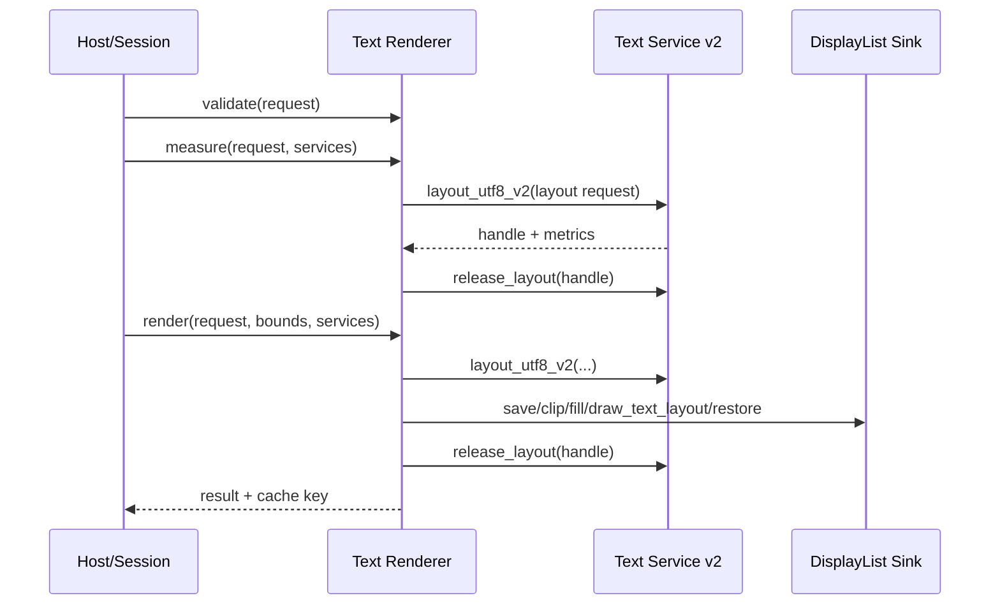
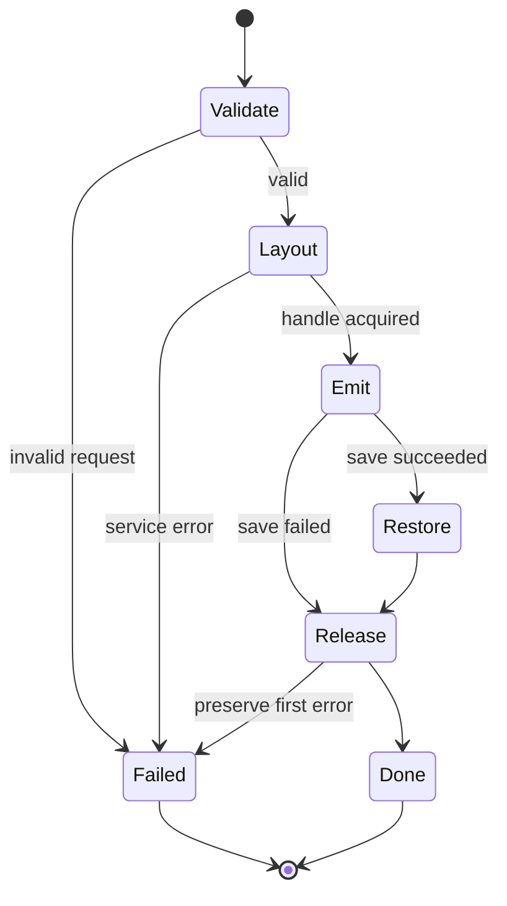

# FacetWire Text Renderer 0.1 详细设计

状态：**Experimental Draft**
对应需求：`docs/requirements/text-renderer-requirements-v0.1.md`

## 1. 设计结论

参考实现是无状态 C 插件 `org.facetwire.reference.text-renderer`。插件接收已由宿主从 Core
Content 投影出的纯数据 Request，使用 `fw_text_service_v2` 生成短生命周期 layout，再向
`fw_display_list_sink_v1` 发出结构化命令。插件不解析 ASP、不读取字体文件、不创建平台
Widget，也不保存滚动或选择状态。



### 本章检查

- 设计满足 Document/Session/Renderer 分层。
- 只有宿主 Text Service 接触具体字体与塑形后端。
- layout handle 的创建、消费和释放闭合在单次调用中。

## 2. 文件与组件规划

| 路径 | 责任 |
| --- | --- |
| `include/facetwire/text_renderer.h` | Renderer v1 公共 ABI |
| `include/facetwire/text_service_v2.h` | 正式文本布局宿主服务 ABI，不修改 v1 |
| `plugins/text_renderer/plugin.c` | 插件生命周期、descriptor、query_interface |
| `plugins/text_renderer/text_renderer.c` | validate/measure/render/semantics/schema |
| `plugins/text_renderer/text_normalize.c` | 默认值、有限值、UTF-8/LF、约束规范化 |
| `plugins/text_renderer/text_cache_key.c` | 稳定 128-bit 结构哈希 |
| `plugins/text_renderer/facetwire.plugin.json` | Manifest 与 Capability |
| `tests/text_renderer_test.c` | 行为和失败路径单元测试 |
| `tests/fakes/fake_text_service_v2.c` | 确定性分行、失败注入、handle 计数 |
| `tests/fakes/fake_display_list.c` | 命令记录、失败注入、save/restore 检查 |

参考插件不链接 ICU、HarfBuzz、CoreText、DirectWrite 或 Skia；平台宿主可用任意后端实现
Text Service v2。需要像素一致的环境必须使用相同字体文件和兼容塑形后端。

### 本章检查

- 公共 ABI、参考逻辑和测试替身分离。
- 插件本身保持轻量且可静态或动态链接。
- 真实平台后端可独立替换，不进入插件公共接口。

## 3. 公共常量与枚举

```c
#define FW_TEXT_RENDERER_CAPABILITY_ID "facetwire.renderer.text"
#define FW_TEXT_RENDERER_INTERFACE_ID "facetwire.renderer.text.v1"
#define FW_TEXT_RENDERER_INTERFACE_VERSION 1u

typedef uint32_t fw_text_direction;
#define FW_TEXT_DIRECTION_AUTO 0u
#define FW_TEXT_DIRECTION_LTR  1u
#define FW_TEXT_DIRECTION_RTL  2u

typedef uint32_t fw_text_horizontal_align;
#define FW_TEXT_ALIGN_START   0u
#define FW_TEXT_ALIGN_CENTER  1u
#define FW_TEXT_ALIGN_END     2u
#define FW_TEXT_ALIGN_JUSTIFY 3u

typedef uint32_t fw_text_vertical_align;
#define FW_TEXT_ALIGN_TOP    0u
#define FW_TEXT_ALIGN_MIDDLE 1u
#define FW_TEXT_ALIGN_BOTTOM 2u

typedef uint32_t fw_text_wrap_mode;
#define FW_TEXT_WRAP 0u
#define FW_TEXT_NO_WRAP 1u

typedef uint32_t fw_text_overflow;
#define FW_TEXT_OVERFLOW_VISIBLE  0u
#define FW_TEXT_OVERFLOW_CLIP     1u
#define FW_TEXT_OVERFLOW_ELLIPSIS 2u
#define FW_TEXT_OVERFLOW_SCROLL   3u

typedef uint32_t fw_text_font_style;
#define FW_TEXT_FONT_NORMAL  0u
#define FW_TEXT_FONT_ITALIC  1u
#define FW_TEXT_FONT_OBLIQUE 2u

typedef uint32_t fw_text_decoration_mask;
#define FW_TEXT_DECORATION_NONE         0u
#define FW_TEXT_DECORATION_UNDERLINE    (1u << 0)
#define FW_TEXT_DECORATION_LINE_THROUGH (1u << 1)
```

所有 enum 以 `uint32_t` 穿越 ABI；未知值由 `validate` 拒绝。枚举数字发布后不复用。

### 本章检查

- JSON 枚举可确定映射到 C 数字。
- direction-aware start/end 与绝对 left/right 没有混淆。
- 未来可追加枚举，不改变现有数值。

## 4. Text Service v2 ABI

现有 `fw_text_service_v1` 保持不变，继续供 Placeholder Renderer 使用。正式 Text Renderer
新增 `include/facetwire/text_service_v2.h`；不得把字段追加到 v1 后再要求旧实现提供更大的
`struct_size`。

```c
typedef struct fw_text_layout_request_v2 {
    uint32_t struct_size;
    fw_string_view text;                 /* borrowed UTF-8 */
    fw_string_view language;             /* borrowed BCP 47, may be empty */
    const fw_string_view *font_families;  /* borrowed array */
    size_t font_family_count;             /* 0..16 */
    fw_string_view font_resource_id;      /* empty = absent */
    float font_size;
    uint32_t font_weight;                 /* 1..1000 */
    fw_text_font_style font_style;
    float line_height_multiplier;
    float letter_spacing;
    float max_width;                      /* finite >= 0 */
    float max_height;                     /* 0 = unbounded */
    uint32_t max_lines;                   /* 0 = unbounded */
    fw_text_direction direction;
    fw_text_horizontal_align horizontal_align;
    fw_text_wrap_mode wrap;
    uint32_t ellipsize;
    fw_text_decoration_mask decorations;
    uint32_t flags;
} fw_text_layout_request_v2;

typedef uint32_t fw_text_layout_flags_v2;
#define FW_TEXT_LAYOUT_FONT_FALLBACK   (1u << 0)
#define FW_TEXT_LAYOUT_DID_TRUNCATE    (1u << 1)
#define FW_TEXT_LAYOUT_HAS_RTL         (1u << 2)
#define FW_TEXT_LAYOUT_RESOURCE_FONT   (1u << 3)

typedef struct fw_text_layout_metrics_v2 {
    uint32_t struct_size;
    fw_size_f32 size;          /* logical layout extent */
    fw_rect_f32 ink_bounds;    /* relative to layout origin */
    float first_baseline;
    float last_baseline;
    uint32_t line_count;
    fw_text_layout_flags_v2 flags;
    fw_string_view resolved_font_key; /* borrowed until release_layout */
} fw_text_layout_metrics_v2;

typedef struct fw_text_service_v2 {
    uint32_t struct_size;
    void *user_data;
    fw_status(FW_CALL *layout_utf8_v2)(
        void *user_data,
        const fw_text_layout_request_v2 *request,
        fw_text_layout_handle *out_layout,
        fw_text_layout_metrics_v2 *out_metrics);
    void(FW_CALL *release_layout)(
        void *user_data,
        fw_text_layout_handle layout);
} fw_text_service_v2;
```

### 4.1 `layout_utf8_v2`

输入：完整且已规范化的 layout request；所有字符串和数组只在调用期间有效。
输出：成功时写入非空 `out_layout` 和完整 metrics；失败时 `out_layout=NULL`，metrics 清零。
服务解析 `font_resource_id` 时使用宿主绑定的文档 Resource Context，插件看不到路径。
`fontResource` 不存在返回 `NOT_FOUND`；允许 fallback 时返回 OK 并设置
`FW_TEXT_LAYOUT_FONT_FALLBACK`。不得返回 NaN、Infinity 或负尺寸。

### 4.2 `release_layout`

输入：同一 Service 创建的非空 handle。输出：无。每个成功 handle 恰好调用一次。Sink 的
`draw_text_layout` 必须在释放前同步复制或消费必要数据；禁止跨 render 返回 handle。

### 本章检查

- v1 二进制兼容性不受影响。
- 字体 Resource 通过宿主上下文解析，不泄露路径。
- Service 的成功、失败、fallback 和生命周期均可被 fake 精确验证。

## 5. Renderer 请求结构

```c
typedef struct fw_edge_insets_f32 {
    float left;
    float top;
    float right;
    float bottom;
} fw_edge_insets_f32;

typedef struct fw_text_style_v1 {
    uint32_t struct_size;
    const fw_string_view *font_families;
    size_t font_family_count;
    fw_string_view font_resource_id;
    float font_size;
    uint32_t font_weight;
    fw_text_font_style font_style;
    float line_height_multiplier;
    float letter_spacing;
    fw_color_rgba_f32 color;
    fw_color_rgba_f32 background_color;
    fw_text_decoration_mask decorations;
    uint32_t has_background_color;
    uint32_t flags;
} fw_text_style_v1;

typedef struct fw_text_layout_policy_v1 {
    uint32_t struct_size;
    fw_text_horizontal_align horizontal_align;
    fw_text_vertical_align vertical_align;
    fw_text_wrap_mode wrap;
    fw_text_overflow overflow;
    uint32_t max_lines; /* 0 = absent */
    fw_edge_insets_f32 padding;
    uint32_t flags;
} fw_text_layout_policy_v1;

typedef struct fw_text_session_v1 {
    uint32_t struct_size;
    uint64_t presentation_revision;
    float scroll_offset_y;
    uint32_t hidden_from_semantics;
    uint32_t flags;
} fw_text_session_v1;

typedef struct fw_text_renderer_request_v1 {
    uint32_t struct_size;
    uint64_t request_id;
    fw_string_view zone_id;
    fw_string_view text;
    fw_string_view language;
    fw_text_direction direction;
    uint32_t selectable;
    float opacity;
    fw_text_style_v1 style;
    fw_text_layout_policy_v1 layout;
    fw_layout_constraints_v1 constraints;
    fw_render_target_profile_v1 target;
    fw_text_session_v1 session;
    uint32_t flags;
} fw_text_renderer_request_v1;
```

宿主负责把 JSON 缺省值填入结构；插件仍会防御性规范化。`text`、`language`、zone ID、
字体族数组和字符串均由调用方拥有，函数返回前有效。Request 不包含 bounds；measure 用
constraints，render/build_semantics 单独接收宿主最终分配的 bounds。

### 本章检查

- 持久字段和 Session 字段在结构上可辨认。
- Request 不含平台对象、文件路径或动态内存所有权转移。
- measure 与最终 Zone bounds 的职责边界明确。

## 6. 结果、服务与诊断结构

```c
typedef uint32_t fw_text_normalization_flags;
#define FW_TX_NORMALIZED_NONE          0u
#define FW_TX_NORMALIZED_NEWLINES      (1u << 0)
#define FW_TX_NORMALIZED_FONT_SCALE    (1u << 1)
#define FW_TX_NORMALIZED_CONSTRAINTS   (1u << 2)
#define FW_TX_NORMALIZED_SCROLL_OFFSET (1u << 3)
#define FW_TX_FONT_FALLBACK            (1u << 4)
#define FW_TX_VISUALLY_TRUNCATED        (1u << 5)

typedef struct fw_text_services_v1 {
    uint32_t struct_size;
    const fw_display_list_sink_v1 *display_list; /* optional for measure */
    const fw_text_service_v2 *text;
    uint32_t flags;
} fw_text_services_v1;

typedef struct fw_text_validation_result_v1 {
    uint32_t struct_size;
    fw_status status;
    fw_text_normalization_flags normalization_flags;
    fw_string_view diagnostic_key; /* static plugin storage */
} fw_text_validation_result_v1;

typedef struct fw_text_measure_result_v1 {
    uint32_t struct_size;
    fw_size_f32 size;             /* padding + clamped content */
    fw_size_f32 content_extent;   /* full layout extent */
    fw_size_f32 viewport_extent;  /* content box viewport */
    float first_baseline;         /* relative to outer origin */
    uint32_t line_count;
    fw_text_normalization_flags normalization_flags;
    uint32_t flags;
} fw_text_measure_result_v1;

typedef struct fw_text_render_result_v1 {
    uint32_t struct_size;
    uint32_t emitted_command_count;
    fw_size_f32 content_extent;
    fw_size_f32 viewport_extent;
    float applied_scroll_offset_y;
    float max_scroll_offset_y;
    uint64_t cache_key_high;
    uint64_t cache_key_low;
    fw_text_normalization_flags normalization_flags;
    uint32_t flags;
} fw_text_render_result_v1;

typedef struct fw_text_semantics_v1 {
    uint32_t struct_size;
    fw_semantics_role role;       /* FW_SEMANTICS_ROLE_DOCUMENT */
    fw_string_view text;          /* complete borrowed text */
    fw_string_view language;
    fw_text_direction direction;
    fw_rect_f32 bounds;
    uint32_t selectable;
    uint32_t scrollable;
    uint32_t visually_truncated;
    uint32_t hidden;
    float scroll_offset_y;
    float max_scroll_offset_y;
    uint32_t flags;
} fw_text_semantics_v1;
```

`diagnostic_key` 值限定为稳定 key，例如 `text.invalid_utf8`、`text.invalid_opacity`、
`text.font_missing`、`text.service_unavailable`。结果结构由调用方分配，插件不返回需 free
的内存。为避免类型重复，后续实现应把通用 semantics role 从 placeholder 头移动到独立
`semantics.h`，同时保留兼容 include；在此之前 text header 可以包含 placeholder 定义。

### 本章检查

- 每个结果字段具有单位、坐标系和生命周期。
- 视觉截断、字体 fallback 和输入规范化均可观察。
- ABI 没有要求调用方释放插件分配的字符串。

## 7. Renderer 函数表

```c
typedef struct fw_text_renderer_api_v1 {
    uint32_t struct_size;
    uint32_t interface_version;

    fw_status(FW_CALL *validate)(
        fw_plugin_handle plugin,
        const fw_text_renderer_request_v1 *request,
        fw_text_validation_result_v1 *out_result);

    fw_status(FW_CALL *measure)(
        fw_plugin_handle plugin,
        const fw_text_renderer_request_v1 *request,
        const fw_text_services_v1 *services,
        fw_text_measure_result_v1 *out_result);

    fw_status(FW_CALL *render)(
        fw_plugin_handle plugin,
        const fw_text_renderer_request_v1 *request,
        fw_rect_f32 bounds,
        const fw_text_services_v1 *services,
        fw_text_render_result_v1 *out_result);

    fw_status(FW_CALL *build_semantics)(
        fw_plugin_handle plugin,
        const fw_text_renderer_request_v1 *request,
        fw_rect_f32 bounds,
        const fw_text_measure_result_v1 *measurement,
        fw_text_semantics_v1 *out_semantics);

    fw_status(FW_CALL *get_parameter_schema)(
        fw_plugin_handle plugin,
        fw_string_view *out_schema_json);
} fw_text_renderer_api_v1;
```

### 7.1 `validate`

输入：plugin handle、request、预分配 out result。
输出：合法或可规范化时函数返回 OK，`out_result.status=OK`；不可接受时函数与 result
返回同一错误。检查 UTF-8、字符串指针/长度、struct sizes、enum、数值有限性、颜色、
opacity、padding、约束和组合。不得调用 Text Service。

### 7.2 `measure`

输入：request、`services->text`；display_list 可以为空。
输出：外部 size、完整 content extent、viewport、baseline、line count 和 flags。内部只创建
一个 layout；无论成功或后续 metrics 校验失败均释放 handle。Service 缺失返回
`INVALID_ARGUMENT`，字体不存在透传 `NOT_FOUND`，服务异常透传/映射 `PLUGIN_ERROR`。

### 7.3 `render`

输入：最终 bounds、Text Service 和完整 DisplayList Sink。
输出：命令数、extent、滚动范围、cache key 和 flags。bounds 必须有限且宽高非负。
`save` 成功后任何退出都尝试一次 `restore`；如果原命令已失败，保留首个错误。

### 7.4 `build_semantics`

输入：request、bounds 和同一 revision 的 measurement。
输出：借用完整文本的语义结构；不调用 Text Service、不分配内存。measurement 为空或
struct size 不兼容返回 `INVALID_ARGUMENT`。Session hidden 优先于 opacity。

### 7.5 `get_parameter_schema`

输入：plugin 和输出 string view。输出指向插件只读静态 UTF-8 JSON Schema，生命周期至
plugin unload；不得因调用分配。Schema 描述可通过 AI/Playground 调整的 opacity、字体、
颜色、布局和 Session scroll 参数，并标注 persistent/session scope。

### 本章检查

- 每个函数的输入、输出、错误、副作用和所有权明确。
- 纯语义构建不依赖昂贵塑形。
- v1 未提供字符级 hit test，避免提前冻结错误的交互 ABI。

## 8. 规范化和测量算法

```text
normalize(request):
  1. validate struct/string/enum/range
  2. expose CRLF/CR normalization flag; pass normalized LF view/buffer
  3. fontScale = finite && > 0 ? target.font_scale : 1
  4. scaledFontSize = style.font_size * fontScale
  5. contentMaxWidth = max(0, constraints.max_width - horizontalPadding)
  6. contentViewportHeight = max(0, constraints.max_height - verticalPadding)
  7. if no-wrap + ellipsis: effectiveMaxLines = 1
  8. if scroll offset invalid: offset = 0

measure(normalized):
  1. build fw_text_layout_request_v2
  2. layout_utf8_v2
  3. reject non-finite/negative metrics
  4. full = metrics.size
  5. viewport.width = finite allocated content width or full.width
  6. viewport.height = scroll ? finite allocated content height : full.height
  7. outer = viewport + padding, clamped to constraints
  8. baseline = padding.top + metrics.first_baseline
  9. copy flags and release handle
```

CR/LF 规范化需要临时存储时使用调用期 scratch allocator；0.1 参考实现可以扫描两次并
在受限长度下分配临时缓冲，返回前释放。不得缓存全文。若没有 CR，直接借用原 string。

约束规则：先令每个 max 至少为对应 min；无限 max 在 ABI 中使用 `FLT_MAX`，不得使用
NaN。所有 padding 先验证非负有限。约束夹取只影响返回外部尺寸，不回写 content extent。

### 本章检查

- 算法顺序避免先裁剪再误算滚动 extent。
- 临时换行规范化不会改变文档或跨调用存留文本。
- 约束冲突有确定处理，不会产生负内容框。

## 9. 渲染算法与坐标

```text
render(request, bounds):
  1. normalize and create layout against bounds content width
  2. contentRect = bounds inset(padding)
  3. maxScroll = max(0, layout.height - contentRect.height)
  4. scroll = clamp(session.scroll_offset_y, 0, maxScroll)
  5. compute x from start/center/end and resolved direction
  6. compute y from top/middle/bottom; for scroll use contentRect.y - scroll
  7. save()
  8. clip_rect(contentRect) unless overflow == visible
  9. fill background only when explicitly present and alpha*opacity > 0
 10. draw_text_layout(handle, origin, foreground*opacity) when alpha > 0
 11. restore()
 12. release layout, return result
```

背景矩形是 `contentRect`，不是整个窗口或 Canvas。`visible` 只跳过文本裁剪；显式背景仍
限制在 contentRect。start 在 LTR 为左、RTL 为右；end 相反。justify 的行内分配由 Text
Service 完成。vertical alignment 对 scroll 固定为 top，避免 offset 与居中同时定义；非
scroll 才使用 middle/bottom。

颜色相乘只改变 Alpha：`out.alpha = clamp(color.alpha * opacity, 0, 1)`，RGB 不预乘，
预乘由 Sink/后端契约负责。Target `supports_alpha=false` 时，opacity 小于 1 返回
`UNSUPPORTED`，由宿主决定离屏合成或 Placeholder；插件不得擅自填白模拟。

### 本章检查

- 坐标以宿主最终 Zone bounds 为准，不做隐式等比缩放或重定位。
- 白色背景、裁剪和透明度均来自明确输入。
- scroll、vertical alignment 和 direction 的冲突有单一规则。

## 10. Cache key

128-bit key 对以下规范化值按固定字节序哈希：接口版本、request text bytes、language、
direction、selectable、style、layout、constraints、Target 的 font scale/medium/contrast/
alpha、bounds（render）、presentation revision、实际 scroll offset、Text Service
`resolved_font_key` 和实现版本。指针地址、plugin handle、monotonic time、平台对象不得
进入 key。

measure 可产生内部 layout key；公开 render key 必须在成功获得 resolved font 后计算。
仅 revision 变化会改变缓存身份但不应改变 layout/commands，除非 Session 投影字段也变。

### 本章检查

- 字体 fallback 变化会使缓存失效。
- 进程地址和平台 handle 不影响确定性。
- revision 与视觉结构之间的区别保持 ADR-0003 约定。

## 11. 错误清理状态机



清理不覆盖首个业务错误。`release_layout` 无返回值但 fake 必须记录重复/遗漏释放。
`restore` 失败且此前无错误时返回 `SINK_REJECTED`。任何输出结构在入口先清零并写入
`struct_size`；失败输出不得包含未初始化指针或随机 cache key。

### 本章检查

- 每个成功获取的资源都有唯一释放路径。
- save/restore 在可恢复范围内保持平衡。
- 失败输出稳定，可直接断言。

## 12. 参数 Schema 与 AI 调整

`get_parameter_schema` 至少为每个参数声明：JSON Pointer、类型、范围、默认值、单位、
scope（`document` 或 `session`）、是否影响 layout/cache/semantics。示例：

```json
{
  "parameters": [
    {"path":"/opacity","type":"number","minimum":0,"maximum":1,
     "scope":"document","affects":["render","cache"]},
    {"path":"/style/fontSize","type":"number","exclusiveMinimum":0,
     "scope":"document","unit":"canvas-unit","affects":["measure","render","cache"]},
    {"path":"/@session/scrollOffsetY","type":"number","minimum":0,
     "scope":"session","unit":"canvas-unit","affects":["render","semantics","cache"]}
  ]
}
```

对话命令“透明一点”必须由应用层读取当前 opacity 后生成明确数值 Patch；Renderer 不
解释自然语言。“调整滚动位置”更新 Session，不产生文档 Patch。

### 本章检查

- AI 可发现参数，但不能绕过文档/Session 权限边界。
- 相对自然语言最终被解析为可审计的确定数值。
- 参数影响面足以驱动最小化重测量和重渲染。

## 13. 单元测试设计

Fake Text Service 以固定规则计算：每个 ASCII glyph 宽 `0.5em`，其他标量宽 `1em`，
行高为 `fontSize × lineHeightMultiplier`；它不替代真实 Unicode 验证，只让结构测试确定。
每次成功 layout 分配递增 handle ID，release 后标记关闭。可注入第 N 次失败、字体 fallback、
RTL、截断和异常 metrics。

Fake DisplayList 记录命令、参数和顺序；可在任意命令号返回 `SINK_REJECTED`，并记录
save depth。核心测试函数建议：

| 测试 | 断言 |
| --- | --- |
| `text_validate_rejects_invalid_utf8` | INVALID_ARGUMENT + key |
| `text_measure_applies_font_scale_before_wrap` | line count/height 随 font scale 变化 |
| `text_render_has_no_implicit_background` | 未指定背景无 fill 命令 |
| `text_opacity_multiplies_both_alphas` | 0.1/0.99 精确进入颜色 alpha |
| `text_opacity_zero_keeps_semantics` | draw 为零或透明，semantics 完整 |
| `text_scroll_clamps_session_offset` | applied/max offset 正确且 request 未改写 |
| `text_visible_does_not_clip` | 无 clip，Zone/兄弟几何不变 |
| `text_ellipsis_sets_truncated` | metrics/result/semantics 标志一致 |
| `text_rtl_start_aligns_right` | origin.x 正确 |
| `text_sink_failure_balances_restore` | 返回 SINK_REJECTED、depth 归零 |
| `text_service_failure_releases_only_acquired_handles` | create/release 数相等 |
| `text_cache_key_is_pointer_independent` | 不同地址同值 key 相同 |
| `text_revision_changes_key_not_commands` | key 不同、命令序列相同 |
| `text_missing_font_can_fallback_with_flag` | OK + fallback；禁止 fallback 时 NOT_FOUND |

真实后端集成测试另行覆盖中文、阿拉伯文、希伯来文、Emoji ZWJ、组合音标、复杂脚本和
字体 Resource；不把 fake 的简化宽度规则当成规范。

### 本章检查

- 每个公开函数都有成功、边界和错误测试。
- 生命周期、命令顺序和结构确定性均可自动断言。
- fake 与真实 Unicode/字体集成测试的职责清晰。

## 14. 插件声明与加载

Manifest：

```json
{
  "id": "org.facetwire.reference.text-renderer",
  "version": "0.1.0",
  "abi": {"major": 1, "minor": 0},
  "capabilities": [
    {"id": "facetwire.renderer.text", "kind": "renderer"}
  ]
}
```

动态平台导出标准 `facetwire_plugin_query`；静态注册构建导出唯一内部 query 名
`facetwire_text_renderer_plugin_query` 并由宿主注册。两种方式返回相同 descriptor、接口
版本和测试结果。iOS/visionOS 使用随应用发布的静态库/framework，不承诺下载后执行
任意代码，但内容 Profile、Manifest 和 Capability 协商体验保持一致。

### 本章检查

- 动态与静态接入只改变装载方式，不改变插件实现 API。
- 受限 Apple 平台不需要违反平台代码加载规则。
- Capability 与 Core Content 标准一一对应。

## 15. 实现顺序与门禁

1. 新增 `text_service_v2.h`、`text_renderer.h` 和 ABI 编译测试；
2. 实现 pure validate/normalize 和参数 Schema；
3. 实现 fake Text Service/Sink；
4. 实现 measure、render、semantics 与 cache key；
5. 完成 Windows/Linux 动态和静态插件测试；
6. 接入 Playground 的 Core Text fixture；
7. 验证 macOS/iOS/Android/visionOS 静态注册与真实 Text backend；
8. 通过 sanitizers、文档链接和 Schema 回归后冻结 v1。

不得在本阶段顺带实现 Markdown、编辑器、分页、图片绕排或 Agent Scene Parser。任何
新增能力先以独立需求和 ABI 评审进入后续版本。

### 本章检查

- 实现顺序先冻结可测试 ABI，再接真实平台 UI。
- 每一步都有独立自动化产物和退出门禁。
- 范围不会重新扩大到完整排版系统。

## 16. 整体关联、冲突与扩展性检查

- Core Content text 字段全部有请求字段或明确宿主职责；没有孤立标准字段。
- `overflow=scroll` 与 ADR-0003 一致：策略持久、位置归 Session。
- Renderer 使用宿主最终 bounds，不缩放或移动 Zone，兼容递归 Canvas 正确坐标语义。
- Alpha/opacity 与 Core Image 共用 `1=不透明、0=透明`，且不产生隐式白底。
- Text Service v2 不破坏 Placeholder 使用的 v1；未来 v3 可增加字符级 hit test、分段样式
  或分页 fragment，而 v1 请求仍可继续渲染。
- [Flow Content Profile 0.1](../../spec/flow-content-profile-v0.1.zh-CN.md) 和
  `facetwire.layout.flow` 可以把长文本拆成 page fragment，并通过独立 Text Fragment
  Service 复用同一文本后端；Text Renderer 本身不拥有虚拟页或兄弟 Zone 流布局。
- AI 通过参数 Schema 和稳定 Zone ID 修改文档或 Session，不直接操作字体后端和平台 UI。

结论：该设计在 0.1 范围内闭合，可独立单元测试，并为富文本、分页、字符交互和专业
排版留下新接口/新 Profile 扩展点，而不会迫使基础 ABI 预先承诺这些复杂能力。

### 本章检查

- 已推导 Document → Session → Renderer → Service → DisplayList/Semantics 全链路。
- 已解决 v1 Text Service 不足、隐式白底、滚动所有权和 Zone 坐标四项潜在冲突。
- 扩展通过新版本服务或新 Profile 进行，不需要破坏已发布的 Core Text Renderer v1。
