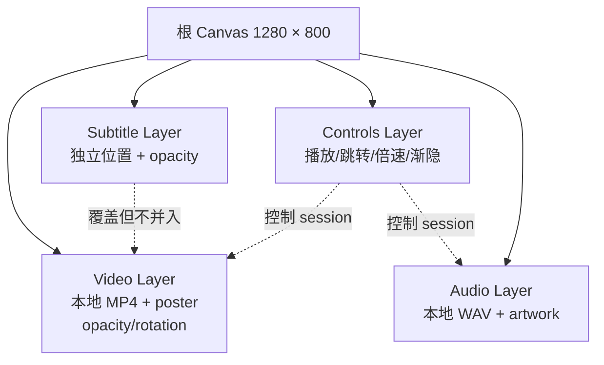

# Audio/Video Renderer 0.1 Playground 验证指南

状态：**Windows 自动验证已通过；macOS、iOS、Android 待按本指南补充真机结果**
适用目录：`examples/placeholder_demo`
演示包：`assets/documents/media-renderer-demo.agscene`

## 1. 验证目标

本演示验证 FacetWire Audio/Video Renderer 0.1 的宿主集成边界，而不是把平台播放器
对象写入插件 ABI。Playground 使用同一份 Flutter 页面和同一套本地资源，在 Windows、
macOS、iOS 与 Android 上检查以下能力：

1. 视频、字幕、控制按钮和音频会话作为四个独立 Layer 展示；
2. 各 Layer 可独立定位、覆盖和调整不透明度；
3. 不透明度严格采用 `1 = 完全不透明，0 = 完全透明`，支持 0.1、0.99 等小数；
4. 视频支持播放/暂停、前后跳转、倍速、内容旋转与视频层旋转；
5. 控制按钮 Layer 可显示、隐藏或渐隐，而对话/宿主动作仍可操作 Session；
6. 音频与视频拥有独立 Session，不共享错误的播放状态；
7. 页面关闭后播放器、订阅、临时资源与原生 token 能正确释放。

### 本章检查

- 演示行为覆盖需求文档 MDR-REN-008 和 MDR-TRK-003。
- 展示层、不透明度与播放 Session 的职责没有混合。
- 真机验证补充平台适配结果，不替代 C ABI 的 fake-service 单元测试。

## 2. 演示包与图层关系

```text
media-renderer-demo.agscene/
├─ media-renderer-demo.agscene.dis.json
└─ resources/
   ├─ facetwire-demo.mp4       # 6 秒、640×360、本地生成
   ├─ facetwire-demo.wav       # 6 秒、本地生成
   ├─ video-poster.png
   └─ audio-artwork.png
```



所有媒体资源均由项目离线生成并随演示包发布，不依赖网络、外部 URL 或第三方内容授权。
描述文件使用相对 Resource 路径；移动端由宿主将打包资源复制到应用临时目录后交给平台
媒体后端，文件路径不会进入 FacetWire 文档标准或插件 ABI。

### 本章检查

- 四种视觉/交互职责分别属于四个 Layer。
- poster、artwork 和主媒体均可从描述文件根目录确定性解析。
- 平台临时路径只是宿主实现细节，不破坏 ASP 包的跨平台性。

## 3. 自动测试

### 3.1 原生 C ABI

在仓库根目录执行：

```powershell
cmake --build build/content-renderers-msvc
ctest --test-dir build/content-renderers-msvc --output-on-failure
```

Windows PowerShell 如果没有加载 Visual Studio 开发者环境，应使用项目已安装的
`msvc-build-environment` Skill，或先进入 `VsDevCmd.bat` 后再执行同一构建。缺少
`stddef.h`、`stdint.h`、`vcruntime.h` 或 `windows.h` 通常表示 SDK 环境未加载，不能据此
修改源码 include。

### 3.2 Flutter 静态分析与单元测试

```powershell
cd examples/placeholder_demo
flutter pub get
flutter analyze
flutter test
```

`media_renderer_demo_test.dart` 使用 fake backend，不需要真实窗口、声卡或解码器，验证：

- 描述文件包含 MP4、WAV、poster、artwork；
- 四个 Layer 独立存在；
- video/audio 播放和 seek 命令不会串线；
- opacity、rate 和 controls fade 可交互；
- 内容旋转保持视频 Zone 尺寸，视频层旋转交换 Zone 宽高；
- Poster 与实时视频只占用同一视觉槽，不叠加残留；
- 页面卸载会调用 backend close。

### 3.3 内存与资源门禁

原生 ASan 必须在加载了 MSVC 开发者环境的同一进程中运行，否则测试程序可能因找不到
`clang_rt.asan_dynamic-x86_64.dll` 以 `0xc0000135` 退出。完整审计结果见
`docs/reports/media-renderer-v0.1-memory-audit.zh-CN.md`。

### 本章检查

- 自动测试覆盖正常路径、透明路径、失败清理和宿主页面卸载。
- fake backend 与真实播放器共用同一 Playground 接口。
- ASan 运行库缺失与代码内存错误被明确区分。

## 4. 平台构建与启动

### 4.1 Windows

在已加载 Visual Studio 2022 开发者环境的终端中：

```powershell
cd examples/placeholder_demo
flutter build windows --release
.\build\windows\x64\runner\Release\facetwire_placeholder_demo.exe
```

若机器存在被挂起的旧 `cl.exe`，Visual Studio Generator 可能停在 CompilerId 阶段。应先
在干净的开发者终端复测；本轮 Windows 自动验证另用新的 Ninja 构建目录完成等价 Release
编译、运行库装配和启动冒烟测试，没有修改标准 Flutter 构建目录。

### 4.2 macOS

```bash
cd examples/placeholder_demo
flutter pub get
flutter analyze
flutter test
flutter build macos --release
open build/macos/Build/Products/Release/facetwire_placeholder_demo.app
```

### 4.3 iOS

```bash
cd examples/placeholder_demo
flutter pub get
flutter analyze
flutter test
flutter build ios --release --no-codesign
flutter run -d <iPhone设备ID>
```

真机运行需在 Xcode 中为 Runner 选择开发团队和 Bundle ID；媒体依赖随应用静态注册，
不要求从外部动态加载插件代码。

### 4.4 Android

```bash
cd examples/placeholder_demo
flutter pub get
flutter analyze
flutter test
flutter build apk --release
flutter install -d <Android设备ID>
```

APK 默认位置：`build/app/outputs/flutter-apk/app-release.apk`。

### 本章检查

- 四个平台使用同一 Dart 页面、同一后端接口和同一演示包。
- 平台差异只存在于播放器适配、签名和打包环节。
- iOS 没有承诺任意外部动态代码加载。

## 5. 手工检查表

| ID | 检查项目 | 预期结果 | Windows 2026-08-27 | macOS | iOS | Android |
| --- | --- | --- | --- | --- | --- | --- |
| AV-D01 | 从基础内容页打开影片图标 | 进入“音视频渲染器 0.1”页面 | 待人工 | 待验证 | 待验证 | 待验证 |
| AV-D02 | 视频初次加载 | poster 与视频共享变换；首帧显示后 Poster 退出，不叠图，无网络请求 | 待人工 | 待验证 | 待验证 | 待验证 |
| AV-D03 | 视频播放/暂停 | 状态、进度和按钮同步变化 | 待人工 | 待验证 | 待验证 | 待验证 |
| AV-D04 | 前进/回退 2 秒 | 位置受 0 与 duration 边界约束 | 待人工 | 待验证 | 待验证 | 待验证 |
| AV-D05 | 选择 0.5×/1×/1.5×/2× | 播放速率立即更新 | 待人工 | 待验证 | 待验证 | 待验证 |
| AV-D06 | 旋转视频内容 | Zone 保持不变；90°/270° 按 9:16 contain，留白为纯黑且没有旧 Poster | 待人工 | 待验证 | 待验证 | 待验证 |
| AV-D06B | 旋转视频层 | Zone 围绕中心交换宽高；字幕/控制层重新定位并保持正向 | 待人工 | 待验证 | 待验证 | 待验证 |
| AV-D07 | 调整视频不透明度到 0/0.1/0.99/1 | 从完全透明连续变化到完全不透明 | 待人工 | 待验证 | 待验证 | 待验证 |
| AV-D08 | 调整字幕位置和不透明度 | 字幕独立移动/渐隐，视频几何不变 | 待人工 | 待验证 | 待验证 | 待验证 |
| AV-D09 | 隐藏/渐隐控制层 | 控件视觉消失，媒体 Session 不被销毁 | 待人工 | 待验证 | 待验证 | 待验证 |
| AV-D10 | 播放/暂停音频 | 音频 Session 独立，视频状态不变 | 待人工 | 待验证 | 待验证 | 待验证 |
| AV-D11 | 调整音频层不透明度 | 只改变 artwork/会话层，不改变音量 | 待人工 | 待验证 | 待验证 | 待验证 |
| AV-D12 | 反复进入、退出页面 20 次 | 无崩溃、残留音频或持续增长资源 | 待人工 | 待验证 | 待验证 | 待验证 |

“待人工”表示 Windows 的自动构建和启动冒烟已通过，但按钮、画面和声音仍需人在可见
窗口中确认，不把隐藏启动测试误记为视觉/听觉验收。

### 本章检查

- 每项手工检查具有可观察的预期结果。
- 不透明度与音量、语义可见性没有混用。
- 自动结果和人工结果分栏记录，避免过度声明。

## 6. 本轮自动验证记录

| 门禁 | 结果 |
| --- | --- |
| Core Media + 全部原生 CTest | **10/10 通过** |
| MSVC AddressSanitizer（同一开发者环境进程） | **11/11 通过** |
| Flutter `analyze` | **通过，无问题** |
| Flutter 单元测试 | **9/9 通过** |
| Windows Ninja Release 编译与媒体 DLL/资源装配 | **通过** |
| Windows 隐藏启动 8 秒、窗口线程响应、干净退出 | **通过** |

标准 Flutter Visual Studio Generator 在本机被历史遗留的挂起 `cl.exe` 阻塞于 CompilerId，
没有出现源代码编译诊断。为保持现有 `build/windows/x64` 目录不被破坏，本轮在新的
`build/windows-ninja/x64` 目录完成等价 Release 验证。建议在干净 Windows 开发者终端
再次执行标准 `flutter build windows --release`，并按第 5 节完成人工检查。

### 本章检查

- 已通过项均有命令或可重复的自动测试支撑。
- 环境阻塞没有被误报为代码失败，也没有被隐瞒。
- 进入跨平台真机验收前，没有已知的 C ABI 或 Flutter 单元测试阻塞。

## 7. 关联与扩展性检查

- 演示后端只负责平台媒体生命周期，Core Media Renderer 仍保持无状态 C ABI。
- `MediaDemoBackend` 可替换为产品宿主、远端流或 fake，而页面 Layer 结构不变。
- 将来增加字幕翻译插件时，只需更新 Subtitle Layer 的 cue 数据，不需要重建 Video Layer。
- 将来增加会话同步时，可以让远端任务更新 Session snapshot，不把临时状态回写 ASP 文件。
- 新 codec、HLS/DASH、DRM 或空间媒体应通过宿主能力协商扩展，不向 v1 ABI 传平台对象。

### 本章检查

- 演示实现没有突破需求/详细设计定义的系统边界。
- Layer、Session、Resource 与 Renderer 的关联方向单一，没有循环所有权。
- 后续平台适配和媒体能力扩展不要求改写当前演示文件结构。
