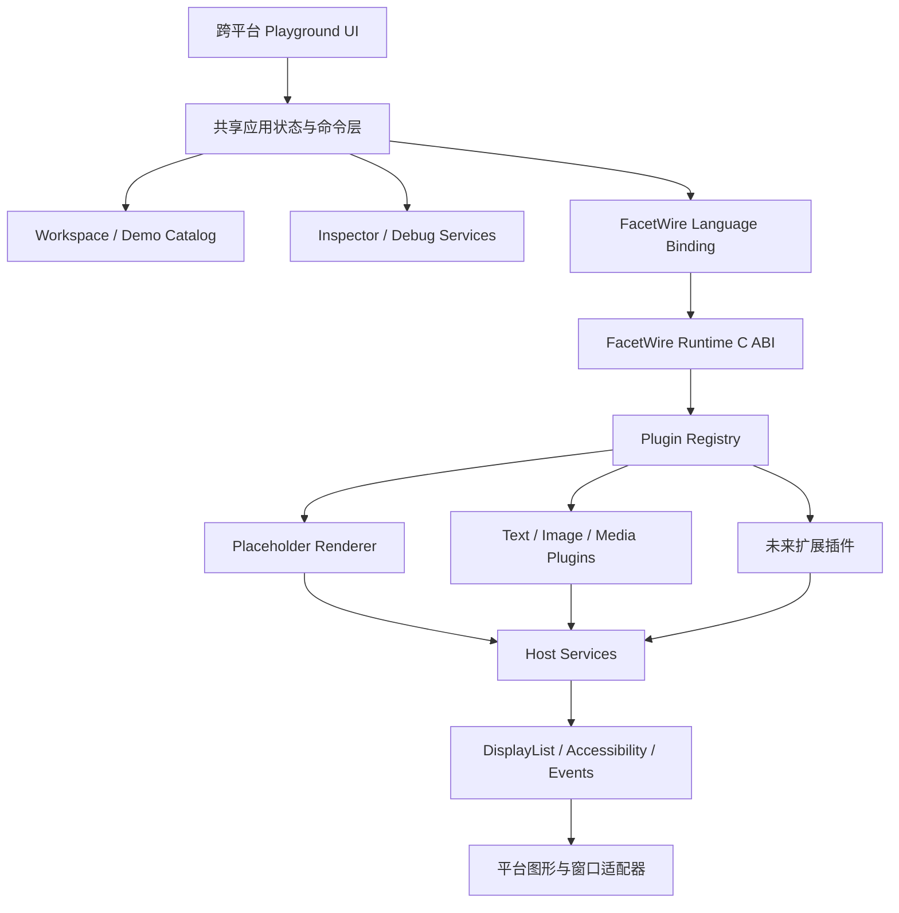

# FacetWire Playground 跨平台演示与调试应用需求文档 0.1

| 属性 | 值 |
| --- | --- |
| 文档状态 | Draft / 需求基线 |
| 文档版本 | 0.1.0 |
| 应用暂定名 | FacetWire Playground |
| 应用类型 | 跨平台参考宿主、渲染演示和插件调试工具 |
| 目标平台 | Windows、Linux、macOS、iOS、Android |
| UI 技术决策 | `docs/adr/0001-cross-platform-ui-framework.md`，Flutter 有条件接受 |
| 未来平台 | Web/Wasm、无界面自动化宿主 |
| 对应项目 | FacetWire |
| 建议许可证 | MPL-2.0 |

本文使用“必须（MUST）”“不得（MUST NOT）”“应该（SHOULD）”“不应该
（SHOULD NOT）”“可以（MAY）”表达需求强度。FacetWire Playground 是开发、
演示和验证 FacetWire 能力的参考宿主，不创建与 FacetWire 相竞争的私有协议。

## 1. 背景与产品目标

FacetWire 将逐步增加 Placeholder、文本、图片、动画、视频、字幕、控制层、图表、
文档分页和第三方格式解析插件。仅提供库和命令行测试无法直观证明渲染结果，也不
利于插件开发者观察布局、图层、输入、DisplayList、性能和错误状态。

FacetWire Playground 的目标是提供一个可以持续扩展的跨平台可视化宿主：

1. 展示当前 FacetWire Runtime 能够渲染的全部基础能力；
2. 随已安装或静态注册插件增加，自动出现新的可渲染内容和调试参数；
3. 检查 Canvas、Page、Layer、Zone、布局、合成和事件；
4. 检查插件发现、ABI 协商、Capability、生命周期、日志和失败降级；
5. 为插件作者提供可复现、可比较、可导出的调试环境；
6. 为 Windows、Linux、macOS、iOS 和 Android 提供一致的核心体验；
7. 作为 FacetWire 公共接口、规范和一致性测试的参考实现宿主。

### 本章检查

- 产品目标覆盖展示、开发、调试、验证和生态扩展，而不只是播放几个示例。
- Playground 的能力来源是 FacetWire 公共契约，不建立专用渲染旁路。
- 多平台目标包含桌面和移动端，同时允许部署机制不同。

## 2. 用户与核心使用场景

### 2.1 目标用户

| 用户 | 主要目标 |
| --- | --- |
| FacetWire Runtime 开发者 | 验证 ABI、生命周期、路由、错误和性能 |
| 插件开发者 | 调试输入参数、渲染结果、日志和跨平台差异 |
| 应用集成者 | 学习如何嵌入 Runtime、注册插件和承载渲染表面 |
| 规范维护者 | 检查规范是否可实现、可测试且不存在冲突 |
| 设计与测试人员 | 比较主题、尺寸、语言、设备和无障碍模式 |
| 普通体验用户 | 浏览示例，了解 FacetWire 能显示什么 |

### 2.2 核心场景

- 打开应用，浏览内置示例并切换已注册的渲染插件；
- 选择一个 Zone，在属性检查器中修改尺寸、透明度、状态和插件参数；
- 加载本地演示资源或场景文件并观察渲染结果；
- 开启边界、锚点、裁剪、重绘区域和命中区域调试覆盖层；
- 模拟缺少插件、解码失败、权限拒绝和资源受限；
- 比较两个插件或两个版本对同一输入的渲染差异；
- 在桌面开发插件后，将相同测试场景带到 iOS/Android 验证；
- 导出截图、DisplayList、日志和已脱敏复现包；
- 运行一致性测试集并查看通过、失败和差异详情。

### 本章检查

- 用户范围既包括开发者，也包括只查看演示的体验者。
- 场景涵盖正常渲染、参数调试、故障注入、比较和跨设备验证。
- 每个核心场景均可由后续功能模块承接。

## 3. 范围与非目标

### 3.1 0.1 范围内

- 跨平台应用外壳和共享导航；
- FacetWire Runtime 初始化和插件注册；
- 插件、Capability 和接口浏览；
- 示例目录和场景运行；
- Canvas/Page/Layer/Zone 树与渲染视图；
- 属性检查器和插件参数面板；
- Placeholder Renderer 完整演示；
- DisplayList、日志、事件、性能和可访问性调试面板；
- 主题、视口、缩放、字体、语言和无障碍模拟；
- 截图、场景快照和已脱敏调试包导出；
- 桌面动态插件与全平台静态插件接入；
- 自动化冒烟测试和视觉快照接口。

### 3.2 0.1 范围外

- 替代专业图形、视频、文档或 IDE 编辑器；
- 提供插件商店、支付和账号系统；
- 在 iOS 上下载并执行任意外部原生插件；
- 允许插件直接注入任意平台 UI；
- 提供完整 ASP/`.agscene` 创作工具；
- 保证所有第三方专有格式都可打开；
- 云端协作、评论和多人编辑；
- 自动取得未授权字体、编解码器、SDK 或示例文件；
- 把 Playground 工作区格式定义为正式内容交换标准。

### 本章检查

- 0.1 聚焦参考宿主和调试，不演变成全功能创作软件。
- 移动平台的外部代码限制被明确接受，而不是通过规避平台规则实现。
- 工作区、场景标准和插件协议之间具有清晰边界。

## 4. 产品模式

应用应提供四种可以随时切换的工作模式：

| 模式 | 目标 | 默认显示内容 |
| --- | --- | --- |
| Explore | 展示和体验 | 示例目录、渲染表面、简化参数 |
| Inspect | 检查场景 | 场景树、属性、布局和覆盖层 |
| Develop | 开发插件 | 插件列表、日志、调用跟踪、重载 |
| Compare | 比较结果 | A/B 视图、叠加、像素差异、指标 |

模式只改变界面布局和默认面板，不得改变场景或插件执行语义。同一个工作区切换模式
时，选择对象、视口、参数和日志上下文应该保持。

未来可以增加 Conformance 模式，但 0.1 可作为 Develop 模式中的独立页面实现。

### 本章检查

- 演示和专业调试使用同一应用，但复杂功能不会压倒普通体验。
- 模式切换不改变底层数据，避免产生难以复现的隐式状态。
- Compare 和一致性测试具有后续扩展位置。

## 5. 总体架构



### 5.1 分层原则

- FacetWire Runtime、场景模型、调试模型和工作区逻辑必须与 UI 框架解耦；
- 平台外壳只处理窗口、文件选择、生命周期、安全区域和系统集成；
- 插件只能通过 FacetWire 接口访问宿主服务；
- 调试器观察公共接口事件，不得依赖未声明的插件内部对象；
- UI 可以用跨平台框架实现，但技术选择必须通过 ADR 记录；
- 渲染结果由 FacetWire Render Surface 提供，不得由 Playground 重写插件逻辑。

### 5.2 共享代码目标

- Runtime 和公共渲染逻辑：目标 100% 共享；
- 场景、工作区、检查器、命令和调试模型：目标 95% 以上共享；
- 应用 UI 与交互逻辑：目标 85% 以上共享；
- 平台专用代码只限动态加载、窗口、系统文件选择、分享、权限和应用生命周期。

比例按非生成源码行数统计，仅用于防止平台实现分叉，不鼓励为了数字制造不合理
抽象。

### 本章检查

- 应用层、Runtime、插件、Host Services 和平台后端职责完整分离。
- 共享代码目标可以测量，同时允许合理的平台适配。
- 调试能力观察真实公共契约，不会形成仅 Playground 可用的隐藏 API。

## 6. 平台支持与能力分级

### 6.1 建议最低平台

| 平台 | 0.1 建议基线 | 插件部署 |
| --- | --- | --- |
| Windows | Windows 10/11，x64；后续 ARM64 | 静态 + DLL |
| Linux | 主流 64 位桌面发行版 | 静态 + SO |
| macOS | macOS 13+，Apple Silicon/x64 | 静态 + dylib/framework |
| iOS/iPadOS | iOS/iPadOS 16+ | 随应用静态注册/framework |
| Android | Android 10/API 29+ | 随应用 SO/静态注册；受策略控制的本地模块 |

具体最低版本可在首次发布前依据依赖和安全维护周期调整，但必须形成 ADR 和 CI
支持矩阵。

### 6.2 平台能力等级

| 能力 | 桌面 | iOS | Android |
| --- | ---: | ---: | ---: |
| 内置静态插件 | 必须 | 必须 | 必须 |
| 打开外部场景/资源 | 必须 | 必须 | 必须 |
| 任意本地原生动态插件 | 可以 | 不支持 | 受安装和平台策略限制 |
| 插件热重载 | 应该 | 不支持原生代码热载 | 可选，仅开发构建 |
| 日志、检查器、截图 | 必须 | 必须 | 必须 |
| 多窗口 | 应该 | 可选 | 可选 |
| 命令行启动参数 | 必须 | 不适用 | 不适用 |

各平台不能实现的部署能力必须在 UI 中明确标记，不得显示一个永远失败的相同按钮。

### 本章检查

- 五个平台都有可实现的基础路径。
- 接入体验和插件语义保持一致，但不虚构完全相同的代码装载权限。
- 平台差异通过 Capability 和 UI 状态表达。

## 7. 应用信息架构与界面布局

### 7.1 桌面布局

```text
+-----------------------------------------------------------------------+
| 菜单/工具栏：工作区  示例  插件  视口  调试  导出                  |
+------------------+--------------------------------+-------------------+
| 示例/场景树       |                                | Inspector         |
| Canvas            |       Render Surface           | Layout            |
| Page              |                                | Style             |
| Layer             |                                | Plugin Parameters |
| Zone              |                                | Accessibility     |
+------------------+--------------------------------+-------------------+
| Console | Calls | Events | DisplayList | Performance | Conformance      |
+-----------------------------------------------------------------------+
```

- 左侧负责导航和层级选择；
- 中央负责真实渲染、缩放、平移和比较；
- 右侧负责当前对象和插件参数；
- 底部负责日志、调用、事件和性能；
- 所有侧栏必须可以折叠和调整尺寸；
- 布局必须保存为用户设置，并提供“恢复默认布局”。

### 7.2 移动布局

- Render Surface 为主视图；
- 场景树、Inspector、插件和日志使用底部抽屉或独立页面；
- 手机上同一时间最多突出一个调试面板；
- 平板可以使用双栏或三栏布局；
- 必须适配横竖屏、安全区域、软键盘和系统字体放大；
- 移动端不得通过缩小桌面三栏界面来假装响应式。

### 7.3 全局导航

至少包含：Home、Workspace、Plugins、Conformance、Settings、About。当前任务、错误
和活动插件状态必须可以从任意页面访问。

### 本章检查

- 桌面高密度调试和移动渐进式展示分别定义。
- Render Surface 始终是核心，不会被调试 UI 完全遮挡。
- 面板布局可恢复、可持久化且支持不同屏幕形态。

## 8. 首页与演示目录

首页必须提供：

- “快速开始”基础演示；
- 按 Capability 分类的示例目录；
- 最近工作区和最近场景；
- 当前 Runtime 版本、ABI 和插件数量；
- 插件加载错误摘要；
- 平台能力说明；
- 内置教程入口。

示例目录应由数据驱动。插件可以通过 Manifest 声明自己的 Demo Descriptor，应用
验证后将其加入目录，而不是要求修改 Playground UI 代码。

```text
DemoDescriptor
├── id
├── title_key
├── description_key
├── required_capabilities[]
├── scene_or_factory
├── parameter_preset?
├── supported_platforms?
├── expected_result?
├── tags[]
└── license_and_asset_notices[]
```

演示资源必须可离线使用，除非示例明确标记为需要网络并取得用户许可。

### 本章检查

- 新插件可以贡献示例，不需要修改应用导航代码。
- 示例具有 Capability、平台和许可证元数据。
- 默认体验离线可用，不依赖不稳定的外部服务。

## 9. 工作区与场景管理

### 9.1 Playground Workspace

工作区是开发辅助对象，可以包含：

- 一个或多个场景/测试案例引用；
- 演示资源；
- 插件启用与首选路由设置；
- 参数预设；
- 视口、主题、语言和设备配置；
- 期望截图或指标；
- 调试断点和故障注入设置。

工作区格式不得被称为正式 FacetWire 内容交换格式。正式场景内容仍由未来 ASP/
`.agscene` 标准定义。

### 9.2 基本操作

- 新建、打开、保存、另存和关闭工作区；
- 导入单个示例或资源；
- 最近文件和缺失资源修复；
- 自动恢复未保存的调试状态；
- 明确区分“修改临时参数”和“写回场景”；
- 保存前展示将被写入的范围。

### 9.3 可复现性

工作区必须记录影响结果的 Runtime、插件、场景、主题和视口版本。打开缺少插件的
工作区时，应使用 Placeholder Renderer 并列出缺失项，而不是拒绝整个工作区。

### 本章检查

- 开发工作区与正式场景标准不会混淆。
- 调试参数、场景内容和用户界面状态具有不同持久化边界。
- 缺少插件时仍能打开并检查工作区。

## 10. Render Surface 需求

Render Surface 是应用中央真实承载 FacetWire 渲染结果的区域。

### 10.1 基础功能

- 渲染 Canvas、Page、Layer 和 Zone；
- 缩放、平移、适合窗口、实际尺寸和重置视图；
- 单击选择、框选和通过场景树定位；
- 显示透明背景、棋盘格或用户指定背景；
- 支持连续滚动、单页、双页和自由 Canvas 视图；
- 支持鼠标、触控、触控笔和键盘；
- 保持渲染内容与 Inspector 选择同步；
- 主渲染器不可用时自动路由到 Placeholder Renderer。

### 10.2 调试覆盖层

可以独立启用：

- Canvas/Page/Layer/Zone 边界；
- margin、padding、baseline 和文本行框；
- 锚点、约束和相对坐标；
- z-order 和合成组；
- 裁剪区域、溢出和遮挡区域；
- 命中区域、焦点区域和滚动容器；
- 重绘区域和脏矩形；
- Placeholder 原因；
- 插件和 Capability 标签；
- 帧率、绘制耗时和指令数量。

覆盖层必须由宿主调试管线绘制，不得污染插件输出、截图基线或正式导出；用户选择
“包含调试覆盖层”时除外。

### 10.3 媒介和设备模拟

- 自定义宽高和设备像素比；
- 桌面、手机、平板、打印页预设；
- 方向、安全区域、窗口缩放和字体缩放；
- 浅色、深色、高对比度和透明合成背景；
- 减少动态效果和不同输入设备；
- 多个视口并排查看同一场景。

### 本章检查

- Render Surface 同时支持正常展示和非侵入调试。
- 设备模拟参数均显式进入渲染上下文，结果可复现。
- 缺失能力通过统一占位路径处理，不会绕过场景层级。

## 11. 场景树与对象选择

场景树必须表示：

```text
Workspace
└── Scene
    └── Canvas
        ├── Page / Continuous Region
        │   └── Layer
        │       └── Zone
        │           └── Nested Scene / Content Reference
        └── Global Overlay Layer
```

每个节点至少显示名称、类型、可见性、锁定状态、插件状态和错误标记。场景树需要：

- 展开/折叠和按类型、ID、插件、错误过滤；
- 与 Render Surface 双向选择；
- 显示当前渲染器和占位状态；
- 支持隐藏、隔离查看和锁定调试选择；
- 大型场景使用虚拟化，不一次创建所有 UI 行；
- 递归内容检测和最大深度提示；
- 键盘导航和屏幕阅读器语义。

0.1 的隐藏和锁定可以只影响调试视图；若要写回场景必须通过独立编辑命令确认。

### 本章检查

- 场景层级与 FacetWire 设计一致。
- 调试操作和内容编辑明确分离。
- 大型、递归和无障碍场景均有处理要求。

## 12. Inspector 与可调参数

### 12.1 固定检查组

Inspector 至少包含：

- Identity：ID、类型、来源、父级；
- Geometry：位置、尺寸、约束、宽高比、变换；
- Layout：流式顺序、分页片段、锚点、滚动；
- Composition：z-order、混合、裁剪、不透明度；
- Renderer：路由、插件、Capability、接口版本；
- Content：资源和内容摘要；
- Interaction：命中、焦点、命令和事件；
- Accessibility：角色、名称、状态和操作；
- Diagnostics：原因码、耗时、警告和追踪 ID。

不透明度字段必须使用统一语义：`opacity = 100%` 完全不透明，`opacity = 0%`
完全透明。若 UI 同时提供透明度，必须显示 `transparency = 100% - opacity`，两者
不得分别存储而产生冲突。

### 12.2 插件驱动参数面板

插件可以声明参数 Schema，Playground 根据 Schema 生成一致的调试控件。0.1 必须
支持：

| 类型 | 默认控件 |
| --- | --- |
| boolean | 开关 |
| integer/number | 数字框，可选滑块 |
| string | 单行或多行输入 |
| enum | 下拉或分段选择 |
| color | 颜色和 Alpha 编辑器 |
| length | 数值、单位和约束 |
| vector/rect | 分量编辑器 |
| resource reference | 受宿主控制的资源选择器 |
| action | 明确的调试命令按钮 |
| group | 可折叠参数组 |

Schema 必须支持默认值、范围、步长、单位、只读、可见条件、说明、本地化键、是否
影响布局、是否需要重新创建插件和敏感级别。

### 12.3 参数更新

- 调整参数应尽量提供实时预览；
- 高频滑动必须合并更新，避免每个像素触发昂贵重建；
- 支持撤销、重做和恢复默认值；
- 显示参数来源和覆盖优先级；
- 失败时回滚到最后有效值并展示具体错误；
- 参数预设可以保存到工作区，但不得默认写回正式场景；
- 插件不得通过 Schema 请求任意原生 UI 或执行脚本。

### 本章检查

- 新插件加入后能够自动获得基本参数 UI。
- 参数 Schema 足以覆盖基础渲染器，同时阻止任意 UI 注入。
- 实时调节、失败回滚、持久化和透明度冲突均有规则。

## 13. 插件与 Capability 管理

### 13.1 插件列表

每个插件至少显示：

- ID、名称、版本、厂商和许可证；
- ABI 与接口版本；
- 部署类型：静态、动态、IPC、Wasm、Remote；
- 提供的 Capability；
- 当前状态：可用、禁用、不兼容、加载失败、被策略阻止；
- 来源、签名/信任信息和依赖；
- 权限声明和隔离等级；
- 关联演示、文档和一致性测试结果。

### 13.2 插件操作

- 启用、禁用和选择首选路由；
- 桌面开发构建可以加载目录、卸载和热重载动态插件；
- 查看生命周期、日志和接口查询；
- 导出插件诊断摘要；
- iOS 和受限平台只显示随应用注册的插件，不提供外部代码加载按钮；
- Android 动态能力必须遵循应用分发和平台安全规则；
- 卸载或重载失败时必须安全切换到 Placeholder Renderer。

### 13.3 路由解释

当多个插件声明同一 Capability 时，应用必须显示最终选择和理由，例如用户首选、
平台兼容、版本、策略、性能等级或回退顺序。不得只显示结果而隐藏路由依据。

### 本章检查

- 插件身份、兼容、许可、安全、依赖和测试信息完整。
- 桌面热载与移动静态注册共享管理界面语义，但操作集合按平台缩减。
- 多实现竞争具有可解释、可复现的路由结果。

## 14. 调试工具

### 14.1 Console

- 支持 Trace、Debug、Info、Warning、Error；
- 按时间、插件、Capability、Zone、线程、追踪 ID 和等级过滤；
- 暂停、清空、复制和导出；
- 长日志虚拟化；
- 敏感字段默认脱敏；
- 点击日志可以定位对应 Zone 或调用。

### 14.2 Plugin Calls

显示调用时间线：

```text
Host request
├── Capability routing
├── query_interface
├── measure
├── prepare/resource request
├── render
├── DisplayList validation
└── submit/present
```

每次调用显示开始、结束、耗时、状态、取消、线程/队列、输入大小摘要和输出指标，
但默认不记录完整用户内容。

### 14.3 Event Monitor

观察指针、触控、滚动、键盘、焦点、命令、可访问性动作和窗口生命周期事件。
支持查看捕获、冒泡、命中目标和是否被处理，不得让监视器改变事件结果。

### 14.4 DisplayList Inspector

- 指令列表、分组、裁剪、变换和合成状态；
- 单步回放和指令范围显示；
- 每条指令定位来源插件和 Zone；
- 指令数量、边界和验证警告；
- 导出规范化文本或二进制调试表示；
- 禁止执行未验证的任意 GPU/平台命令。

### 14.5 Performance

- FPS、帧时间和卡顿；
- measure/render/present 分阶段耗时；
- 插件调用次数和慢调用；
- DisplayList 指令、资源、缓存命中和内存估计；
- Layer/Zone 重绘原因；
- 记录有限时长的性能会话并导出。

### 14.6 Accessibility Inspector

- 可访问性树、角色、名称、状态、边界和操作；
- 焦点顺序和不可达节点；
- 缺失名称、重复 ID、过小命中区和对比度警告；
- 模拟屏幕阅读顺序，但不得冒充平台官方辅助技术结果。

### 本章检查

- 调试覆盖日志、调用、事件、绘制、性能和无障碍六个维度。
- 工具只观察或回放受限数据，不改变真实执行语义。
- 所有数据都有定位、过滤、导出和隐私边界。

## 15. 故障注入与降级验证

应用应允许在开发工作区中模拟：

- 缺少插件或指定 Capability；
- ABI 主版本或接口版本不兼容；
- 插件加载失败、超时、取消或崩溃；
- 资源缺失、损坏、延迟和权限拒绝；
- 内存、指令数、尺寸、递归深度和执行时间超限；
- DisplayList 非法指令；
- 字体缺失、主题令牌缺失和未知语言；
- 离线状态；
- 屏幕旋转、窗口尺寸和设备像素比变化。

故障注入必须：

- 明确显示当前启用的模拟，不得伪装成真实系统故障；
- 默认只作用于选定场景或 Zone；
- 可以一键全部关闭；
- 记录到工作区和复现包；
- 不修改原始资源；
- 不允许在非开发构建绕过系统安全策略。

### 本章检查

- 正常、错误、极限和恢复路径都可主动验证。
- 模拟状态与真实故障可区分，避免误诊。
- 故障注入不会成为权限绕过机制。

## 16. Compare 与视觉回归

Compare 模式必须支持：

- 同一场景使用插件 A/B；
- 同一插件使用参数或版本 A/B；
- 同一场景使用不同平台/视口快照；
- 左右并排、滑动分隔、闪烁和 Alpha 叠加；
- 像素差、结构差、布局差和 DisplayList 差异；
- 忽略区域和允许误差；
- 导出比较报告和差异图。

结构差异必须优先报告 Zone 几何、文本行、绘制边界和可访问性变化；像素差不能
单独判定所有平台失败，因为字体抗锯齿和颜色管理可能存在可解释差异。

视觉基线必须记录平台、架构、渲染后端、字体集合、缩放、颜色空间、主题、插件
版本和 Runtime 版本。

### 本章检查

- Compare 不局限于像素截图，也检查结构和 DisplayList。
- 跨平台允许受控差异，但所有影响因素必须记录。
- A/B 输入和版本完整，结果可以复现。

## 17. 示例插件与演示内容规划

内置演示应按迭代增加：

| 阶段 | 插件/内容 | 演示重点 |
| --- | --- | --- |
| P0 | Hello Plugin | 生命周期、日志和 Capability |
| P1 | Placeholder Renderer | 状态、占位、透明度、布局保真 |
| P2 | Solid/Debug Renderer | 矩形、裁剪、变换、DisplayList |
| P3 | Text Renderer | 字体、段落、滚动、分页和 RTL |
| P4 | Image Renderer | 缩放、裁剪、透明、颜色和资源 |
| P5 | Animated Image | GIF/帧时钟/减少动态效果 |
| P6 | Subtitle Renderer | 视频锚定、时序和文本背景 |
| P7 | Media Controls | 命令、焦点、渐隐和触控 |
| P8 | Video Renderer | 播放表面、时钟和资源生命周期 |
| P9 | Chart Renderer | 数据源、节点、缩放和交互 |

每个插件至少提供：正常、边界、错误、无障碍、性能和跨平台六类示例。受版权保护
的媒体和字体不得作为默认测试资产，除非拥有明确再分发许可。

### 本章检查

- 演示顺序与基础接口成熟度一致。
- 每个插件不仅展示理想状态，也覆盖失败和无障碍。
- 测试素材具有许可证要求。

## 18. 导入、导出与调试包

### 18.1 导入

- 工作区和演示场景；
- 本地资源副本或受控引用；
- 插件参数预设；
- 视觉基线和期望指标；
- 未来支持 `.agscene` 或解包目录。

### 18.2 导出

- PNG 截图，未来可增加无损高动态范围格式；
- 带/不带调试覆盖层的视图；
- 规范化 DisplayList；
- 场景树和 Inspector 快照；
- 日志、调用、事件、性能和一致性结果；
- Markdown/HTML 比较报告；
- 已脱敏复现包。

### 18.3 复现包

复现包必须列出包含项并在生成前扫描：

- 用户目录和绝对路径；
- URL 查询参数、Cookie、令牌和密钥；
- 未授权资源、字体和插件二进制；
- 个人信息和完整用户内容；
- 系统环境变量。

默认只引用第三方插件名称和版本，不打包其二进制。用户必须明确确认任何额外包含
内容。

### 本章检查

- 导出既支持视觉分享，也支持工程复现。
- 复现便利性不会默认覆盖隐私和再分发限制。
- 正式场景与 Playground 调试数据仍然分离。

## 19. 自动化与一致性测试

Playground 必须提供可自动化的无交互入口，用于：

- 打开指定 Demo/Workspace；
- 设置视口、主题、语言和参数预设；
- 等待稳定帧或明确超时；
- 捕获截图、结构快照和 DisplayList；
- 执行测试案例并返回标准退出码；
- 输出机器可读 JSON/JUnit 结果；
- 在 CI 中使用静态插件集合运行。

桌面可以通过命令行入口实现。移动端可以通过测试 Runner、深层链接或平台测试
框架启动同一测试描述。自动化接口不得依赖屏幕坐标点击作为唯一控制方式。

一致性页面至少显示：测试集、环境、插件版本、单项状态、实际/期望差异、日志和
重新运行操作。

### 本章检查

- GUI 演示可以转化为可重复 CI，而不是只能人工观看。
- 桌面和移动端共享测试描述，仅启动机制不同。
- 结果具有标准退出码和机器可读格式。

## 20. 可访问性与本地化

### 20.1 应用可访问性

- 所有面板、树、参数控件和调试表格支持键盘操作；
- Render Surface 与调试 UI 的焦点必须可明确切换；
- 选择、错误和插件状态不能只靠颜色；
- 触控目标符合平台最小尺寸；
- 支持系统字体放大、减少动态效果和高对比度；
- 日志和性能图表提供文本等价表示；
- 屏幕阅读器可识别场景树层级、属性名称、当前值和错误；
- 自定义快捷键不得覆盖系统辅助功能快捷键。

### 20.2 本地化

- 0.1 至少提供简体中文和英文资源框架；
- UI 字符串不得硬编码在业务逻辑和插件 Schema 中；
- 插件通过本地化键和资源包提供文案，缺失时安全回退；
- 支持 RTL、长文本伪本地化、不同数字和单位格式；
- ID、路径、错误码和代码片段保持机器方向和等宽显示规则。

### 本章检查

- 应用本身和被检查内容的可访问性职责均被覆盖。
- 调试图表、日志和 Render Surface 不会成为键盘或屏幕阅读障碍。
- 本地化架构允许插件扩展而不要求修改 Playground 核心。

## 21. 安全、隐私和许可

### 21.1 插件安全

- 动态插件默认视为具有本地原生代码风险；
- 加载前显示来源、签名、权限、许可证和兼容状态；
- 不受信任解析器应该使用进程隔离；
- Manifest 只声明能力，不等于获得操作系统权限；
- 插件 UI Schema 不得执行脚本或加载远程 UI；
- 热重载只在开发构建启用；
- 插件失败必须隔离到相关 Zone，并回退 Placeholder Renderer。

### 21.2 用户数据

- 默认离线运行；
- 遥测默认关闭，若未来加入必须明确选择加入；
- 最近文件允许关闭和清除；
- 工作区不得存储 API Key、访问令牌或系统密钥；
- 外部资源访问必须展示来源和权限；
- 日志、截图和复现包遵循最小披露。

### 21.3 许可证

- Playground 原创代码默认 MPL-2.0；
- 插件、字体、编解码器、图标、媒体和示例资源分别登记许可证；
- 应用内 About/Notices 页面展示第三方通知；
- 不可再分发依赖必须由用户或构建环境单独提供；
- 插件列表显示许可证不代表 Playground 为其合规性背书。

### 本章检查

- 原生插件风险、权限、数据、遥测和再分发均有明确边界。
- 安全声明和实际系统授权被区分。
- 开源应用可以与独立专有插件共存，但不会自动取得第三方权利。

## 22. 性能与稳定性

### 22.1 性能目标

- 调试覆盖层关闭时，Playground 对渲染帧的额外 CPU 开销目标低于 5%；
- 日志和调用跟踪关闭时不得保留完整事件历史；
- 大型场景树必须虚拟化；
- 参数滑动使用合并、节流和可取消请求；
- Render Surface 不可见时降低或暂停动画；
- 调试记录设置显式内存和时长上限；
- 主 UI 线程不得执行文件解析、插件发现或重型渲染工作。

性能百分比必须在固定基准场景、构建类型和设备上测量，不作为不同硬件间的绝对
承诺。

### 22.2 稳定性

- 单个插件错误不得导致整个工作区丢失；
- 应用崩溃后提供工作区恢复，但不得自动重新加载已导致崩溃的不受信任插件；
- 保存使用临时文件和原子替换；
- 长任务支持取消、进度和超时；
- 插件卸载前必须释放对应场景和调用；
- 移动端进入后台时保存必要状态并遵循平台资源限制。

### 本章检查

- 性能要求区分正常展示与主动调试开销。
- UI、渲染、插件和 I/O 工作线程边界清晰。
- 崩溃恢复不会形成重复加载故障插件的循环。

## 23. 配置、设置与诊断

### 23.1 用户设置

- 主题、语言、字体缩放和减少动态效果；
- 默认视口和背景；
- 面板布局和快捷键；
- 日志等级和保留上限；
- 插件目录和启用状态（支持的平台）；
- 最近文件、自动恢复和隐私选项；
- 截图和调试包默认导出位置。

### 23.2 设置优先级

安全/平台强制策略 > 当前自动化任务 > 工作区 > 用户设置 > 应用默认值。插件不能
覆盖安全、隐私、可访问性和资源上限。

### 23.3 应用诊断页

必须显示应用版本、Runtime/ABI、平台、架构、渲染后端、插件摘要、字体/颜色
能力、配置路径和最近错误。复制诊断时默认脱敏用户目录和设备标识。

### 本章检查

- 设置覆盖体验、插件、调试、隐私和恢复。
- 冲突优先级确定且安全策略最高。
- 诊断信息足够排错，同时支持脱敏复制。

## 24. 发布、打包与更新

### 24.1 发布产物

| 平台 | 建议产物 |
| --- | --- |
| Windows | 安装包及便携开发包 |
| Linux | AppImage/Flatpak 或发行版包，具体由 ADR 决定 |
| macOS | 签名、公证的 App Bundle |
| iOS/iPadOS | App Store/TestFlight 或内部测试构建 |
| Android | 签名 AAB/APK 测试与发布构建 |

### 24.2 构建类型

- Release：只包含发布插件和安全调试能力；
- Developer：允许动态目录、热重载、详细跟踪和故障注入；
- CI/Conformance：固定插件和字体集合，强调确定性；
- 不得仅通过隐藏按钮把 Developer 高风险能力留在 Release。

### 24.3 更新

应用更新和插件更新必须分离。受限平台插件随应用更新；桌面外部插件由其来源和
策略管理。更新前必须检查 ABI、许可证和签名，失败时保留可回滚版本。

### 本章检查

- 五个平台都有可发布产物和安全构建类型。
- 开发能力不会意外进入正式发布。
- 应用与插件更新生命周期符合平台差异。

## 25. 功能验收标准

| 编号 | 验收项目 |
| --- | --- |
| `FWP-ACC-001` | 五个平台均能启动并显示相同内置 Placeholder 演示 |
| `FWP-ACC-002` | 静态插件在五个平台具有一致 ID、Capability 和参数面板 |
| `FWP-ACC-003` | Windows/Linux/macOS 可加载兼容动态插件并展示失败原因 |
| `FWP-ACC-004` | 新插件仅通过 Descriptor/Manifest/Schema 即可加入目录和 Inspector |
| `FWP-ACC-005` | 场景树与 Render Surface 选择双向同步 |
| `FWP-ACC-006` | opacity 0/100% 在 UI、请求和结果中的语义一致 |
| `FWP-ACC-007` | 边界、裁剪、命中和重绘覆盖层不会污染默认截图 |
| `FWP-ACC-008` | Console、Calls、Events、DisplayList、Performance 均可定位 Zone |
| `FWP-ACC-009` | 缺少或崩溃插件自动回退占位且其他 Zone 继续显示 |
| `FWP-ACC-010` | 参数修改支持实时预览、撤销、恢复默认和失败回滚 |
| `FWP-ACC-011` | 工作区记录足够版本和环境信息以复现结果 |
| `FWP-ACC-012` | Compare 能输出结构差和像素差报告 |
| `FWP-ACC-013` | 自动化入口返回标准退出码和机器可读结果 |
| `FWP-ACC-014` | 复现包默认不包含密钥、绝对用户路径和未授权二进制 |
| `FWP-ACC-015` | 键盘、字体放大、高对比度和屏幕阅读器基础检查通过 |
| `FWP-ACC-016` | 中文、英文、RTL 和长文本伪本地化不破坏核心操作 |
| `FWP-ACC-017` | Release 构建无法启用未授权的原生插件热载 |
| `FWP-ACC-018` | 静态、共享和移动注册构建通过对应 CI |

### 本章检查

- 验收覆盖插件扩展、渲染、调试、跨平台、安全和可访问性。
- 每项均可形成自动测试或明确的人工测试步骤。
- “随插件增加自动出现内容和调节项”具有直接验收条件。

## 26. 测试矩阵

### 26.1 测试层级

- 共享模型和命令单元测试；
- FacetWire Binding 与 C ABI 集成测试；
- 插件注册、卸载、错误和路由测试；
- Render Surface、Inspector 和面板组件测试；
- 工作区读写、恢复和迁移测试；
- 视觉快照和结构快照测试；
- 键盘、触控和可访问性测试；
- 安装、签名、权限和升级测试；
- 故障注入、模糊测试和长时间稳定性测试。

### 26.2 必测维度

- 五个平台和受支持架构；
- 静态/共享/受限注册方式；
- 浅色、深色、高对比度；
- 手机、平板、桌面、打印视口；
- 100%、150%、200% 缩放和系统字体放大；
- 中文、英文、RTL、伪本地化；
- 有/无插件、兼容/不兼容版本、插件失败；
- 正常、低内存、离线、后台和恢复。

### 本章检查

- 测试从单元层一直覆盖安装和长期稳定性。
- 平台、显示、语言、插件和故障维度可以组合成发布矩阵。
- 测试不会只依赖像素快照判断正确性。

## 27. 依赖与实现前置条件

Playground 0.1 依赖以下 FacetWire 基础合同：

1. Plugin Manifest 与动态/静态发现；
2. Canvas/Page/Layer/Zone 场景模型；
3. Renderer Interface；
4. ZoneGeometry 和 RenderTargetProfile；
5. DisplayList/Draw Sink；
6. Host Services；
7. Parameter Schema；
8. Accessibility 和 Interaction Sink；
9. 标准日志、追踪和性能事件；
10. Placeholder Renderer。

当前仓库只具备生命周期、描述符和静态注册，因此应用可以先开发壳层和插件浏览，
但真实 Render Surface 不得使用一套临时私有协议冒充最终 FacetWire 接口。

### 27.1 技术选型要求

跨平台 UI 技术必须：

- 支持五个目标平台；
- 能稳定调用 FacetWire C ABI；
- 支持桌面多面板、移动响应式和无障碍；
- 允许嵌入原生渲染表面；
- 支持自动化和视觉测试；
- 许可证允许 MPL-2.0 项目分发；
- 有明确的长期维护和包体策略。

Flutter、Qt、Kotlin Multiplatform、Rust UI 等候选必须通过原型和 ADR 比较；需求
文档不直接以框架特性替代产品需求。

当前参考实现决策见
[`ADR-0001`](../adr/0001-cross-platform-ui-framework.md)：Flutter stable + Dart 为有条件
首选，Qt Quick 为第一回退。该决定只有在 ADR 的五平台 UI Spike/P0 PoC 全部通过后
才能转为“接受”；通过前允许编写 Spike、UI-neutral C Bridge 和 Fake，不允许把
Flutter 类型加入 FacetWire ABI、文件格式或插件接口。

### 本章检查

- 前置接口完整列出，能够指导仓库下一阶段工作顺序。
- 允许先做 UI 壳层，但禁止产生不可复用的私有渲染协议。
- 技术选型以平台、ABI、测试、无障碍和许可为依据。

- 当前选型有独立 ADR、量化评分、回退方案和可机器判定的 PoC Gate。
- PoC 失败会触发 Qt Quick 复评，不通过降低产品或无障碍需求规避失败。
## 28. 迭代计划

```mermaid
flowchart LR
    S["UI-Gate：ADR-0001 五平台 Spike"] --> A
    A["P0：应用壳层与 Runtime 信息"] --> B["P1：插件/Capability 浏览"]
    B --> C["P2：Render Surface + Placeholder"]
    C --> D["P3：场景树 + Inspector + Parameter Schema"]
    D --> E["P4：日志/调用/事件/DisplayList"]
    E --> F["P5：Compare + 自动化 + 调试包"]
    F --> G["P6：桌面动态插件"]
    G --> H["P7：iOS/Android 参考构建"]
    H --> I["P8：0.1 发布与一致性认证"]
```



### 28.1 每阶段交付

UI-Gate 不属于可延期的功能迭代。只有 ADR 状态从“有条件接受”变为“接受”，才进入
P0 生产代码；Spike 代码不直接复制进 `apps/playground`。

- 可运行应用，不提交长期不可构建的半成品；
- 至少一个端到端示例；
- 对应自动测试和手动验收清单；
- 文档、截图和已知限制；
- 新增依赖和许可证记录；
- 平台支持状态更新。

### 本章检查

- 迭代从可启动壳层逐渐建立真实渲染和调试闭环。
- 桌面动态加载晚于公共接口和调试能力，降低返工风险。
- 移动端不是最后临时移植，而是在 0.1 发布前形成参考构建。
- UI-Gate 先于产品迭代，避免框架关键风险在移动集成阶段才暴露。

## 29. 已决与待决技术问题

跨平台 UI 框架和 C ABI 绑定方向已由
[`ADR-0001`](../adr/0001-cross-platform-ui-framework.md) 有条件决定；在 PoC 完成前其
状态不是最终接受。以下问题仍需在实现阶段形成 ADR：

1. 应用正式名称和仓库位置采用 `apps/playground` 还是独立仓库；
2. Render Surface 长期使用 DisplayList 回放、原生纹理还是混合方式；
3. Workspace 调试格式及其版本迁移策略；
4. Parameter Schema 采用 JSON Schema 子集还是专用紧凑 Schema；
5. 桌面动态插件目录、签名和隔离默认策略；
6. DisplayList 文本调试表示和稳定序列化边界；
7. 视觉差异算法和跨平台字体基线；
8. 移动端复现包导入导出的分享机制；
9. Conformance Runner 是内嵌应用还是共享独立库；
10. 是否提供远程设备调试，以及认证和加密方式；
11. 自动更新是否由应用实现或完全交给平台商店/包管理器。

### 本章检查

- 产品需求和 ADR 被分开，Flutter 只约束当前参考应用实现，不成为 FacetWire 标准。
- 已决事项仍保留 PoC 状态和复审条件，不把有条件接受写成既成事实。
- 每个待决问题都有明确影响范围。
- 未决问题不阻止 UI-neutral Bridge/Fake；生产 UI 必须等待 UI-Gate。

## 30. 需求追踪矩阵

| 产品目标 | 主要章节 | 验证方式 |
| --- | --- | --- |
| 展示渲染结果 | 8、10、17 | 端到端 Demo 与视觉测试 |
| 随插件扩展 | 8、12、13 | Manifest/Schema 动态目录测试 |
| 调节渲染内容 | 12 | 参数生成、更新、撤销和回滚测试 |
| 调试插件 | 13、14、15 | 生命周期、调用、故障注入测试 |
| 调试场景内容 | 10、11、12 | 场景树、覆盖层和 Inspector 测试 |
| 跨平台使用 | 5、6、24、26 | 五平台构建与发布验收 |
| 可比较和复现 | 9、16、18、19 | Workspace、Diff、复现包和 CI |
| 安全开放生态 | 13、18、21 | 签名、权限、脱敏和许可检查 |
| 可访问和本地化 | 7、20 | 键盘、辅助技术、语言矩阵 |
| 长期扩展 | 5、27、28 | 接口边界与阶段交付审核 |

### 本章检查

- 每个产品目标均能追踪到功能章节和验证方式。
- “演示、调试、插件扩展、多平台”四个用户核心诉求均有直接落点。
- 没有以不可验证的“体验良好”替代验收标准。

## 31. 整体一致性与完备性检查

### 31.1 与 FacetWire 架构的一致性

- Playground 通过 FacetWire C ABI 和 Capability 接入插件；
- Render Surface 回放公共 DisplayList，不重新实现插件内容；
- Inspector 参数来自版本化 Schema，不允许插件注入任意 UI；
- Canvas/Page/Layer/Zone 作为统一场景层级；
- 缺失和失败插件统一回退 Placeholder Renderer；
- 静态、动态和未来 IPC/Wasm 使用相同逻辑描述符。

### 31.2 跨平台一致性

- 核心工作区、场景、调试和 UI 状态最大化共享；
- 平台只适配窗口、文件、权限、装载和发布；
- iOS 不承诺外部原生代码动态加载；
- Android 动态能力受应用安装和系统策略约束；
- 平台能力差异在插件管理 UI 中显式表达。
- UI 框架只约束参考宿主，FacetWire Core、插件 ABI 和文件格式保持 UI-neutral。

### 31.3 功能完备性

- 已覆盖首页、工作区、渲染、场景树、Inspector、插件、日志、事件、DisplayList、
  性能、无障碍、比较、故障注入、导入导出和自动化；
- 已覆盖普通展示、插件开发、规范验证和测试人员四类流程；
- 已覆盖正常、缺失、失败、受限、恢复和跨版本场景；
- 已覆盖安装、更新、隐私、许可和复现发布链路。

### 31.4 扩展性

- 新插件通过 Capability、Demo Descriptor 和 Parameter Schema 扩展；
- 新调试面板通过共享调试事件接入，不窥探插件内部对象；
- 新平台通过 Platform Adapter 接入，不修改插件契约；
- 新内容标准通过场景解析插件接入，不把逻辑硬编码进 Playground；
- Compare、Conformance、Remote Debug 可以独立迭代。

### 31.5 完成定义

FacetWire Playground 0.1 只有在以下条件全部满足时才能标记完成：

1. ADR-0001 的 G1～G8 和五平台 UI Spike 通过，状态已改为“接受”；
2. 五个平台均有可运行参考构建；
3. Placeholder Renderer 演示和参数调节完整；
4. 插件列表、场景树、Inspector 和六类调试面板形成闭环；
5. 新插件无需修改 Playground 核心即可贡献 Demo 和基础参数 UI；
6. 静态插件全平台通过，桌面动态插件通过；
7. 自动化、视觉对比和已脱敏复现包可用；
8. 跨平台、无障碍、安全、隐私和许可证验收通过；
9. 所有 MUST 需求已有实现、测试或正式范围变更记录；
10. 构建、开发插件和运行演示文档完整；
11. 未决关键技术问题已形成 ADR 或明确延期。

### 本章检查

- FacetWire Core、Playground、插件、场景、DisplayList 和平台 Adapter 的职责无冲突；
- 五平台一致性允许部署差异，但不降低公共语义、测试和无障碍要求；
- UI 选型具有独立 ADR、PoC、回退和完成门禁，不是隐含实现假设；
- 功能、异常、安全、许可、测试和长期扩展均有需求与验收落点；
- 完成定义包含全部关键闭环，没有把待决关键技术风险留到发布后。
