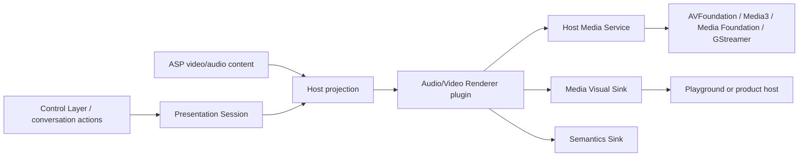

# FacetWire Audio/Video Renderer 0.1 需求规格

状态：**Experimental Draft**
目标 Capability：`facetwire.renderer.video`、`facetwire.renderer.audio`
目标 Interface：`facetwire.renderer.video.v1`、`facetwire.renderer.audio.v1`

## 1. 目标与范围

Audio/Video Renderer 将 Core Content Profile 0.1 的 `audio`、`video` 内容投影为可测量、
可播放、可访问、可降级且可测试的媒体展示。0.1 支持本地 Resource、海报/封面、片段范围、
播放初始策略、倍速、音量/静音、Timed Text Track、整体 opacity、Placement 和 Session
状态投影。

0.1 不定义 codec 实现、网络流媒体协议、DRM、后台播放策略、自动字幕/翻译算法、画中画、
投屏、专业剪辑、空间音频、立体视频或控制按钮视觉样式。

### 本章检查

- 文件格式语义复用现有 Core Content Profile，不重复定义 `video/audio` JSON。
- Renderer 负责投影，不成为播放器、下载器或控制 UI。
- 受限平台不需要加载任意外部动态代码。

## 2. 系统边界

- Document 持有 Resource 引用、label、Placement、Track 和初始播放意图。
- Presentation Session 持有当前位置、playing/buffering/seeking、用户音量、选中 Track、
  控件渐隐和媒体焦点。
- Renderer 验证请求、计算视觉布局、声明媒体表面、生成语义和缓存身份。
- Media Service 解析 Resource、探测容器/codec、创建宿主播放实例并提供只读状态快照。
- 宿主执行播放命令、线程调度、音频焦点、平台生命周期和硬件解码。

### 本章检查

- 播放器对象和平台纹理不跨插件 ABI。
- Document、Session、Renderer、宿主服务的状态所有权无重叠。
- 控制层与对话动作操作同一 Session，不直接调用平台播放器。

## 3. 输入与规范化需求

| ID | 需求 |
| --- | --- |
| MDR-IN-001 | 请求必须明确为 video 或 audio，并与 Capability 一致。 |
| MDR-IN-002 | `zone_id`、`resource_id`、`label` 必须是有效 UTF-8 非空字符串。 |
| MDR-IN-003 | opacity 接受任意有限 0–1 值，包括 0.1、0.99；0 完全透明，1 完全不透明。 |
| MDR-IN-004 | video Placement 默认 contain、居中、clip=true；audio 不把 artwork 固有尺寸反向写入 Zone。 |
| MDR-IN-005 | AV 默认值与 Core Content Schema 一致：autoplay=false、loop=false、muted=false、volume=1、rate=1、controls=auto。 |
| MDR-IN-006 | `startOffsetMs` 默认 0；存在 `endOffsetMs` 时必须大于 start。 |
| MDR-IN-007 | 最多 64 个 Track，最多一个默认 Track；Track 语言、kind、label 原样投影。 |
| MDR-IN-008 | 文件扩展名不能决定支持性；Resource mediaType 与服务 probe 共同决定。 |
| MDR-IN-009 | 当前播放位置、用户音量和选中轨道不得从 Session 回写 Document。 |
| MDR-IN-010 | 未知扩展字段保留在文档层，但不得改变 v1 行为。 |

### 本章检查

- Schema 默认值、C 枚举和运行时默认值可逐项对应。
- opacity 与 FacetWire 全局约定一致。
- 资源事实与文件名猜测已分离。

## 4. 验证与能力协商

| ID | 需求 |
| --- | --- |
| MDR-VAL-001 | `validate` 检查 struct_size、UTF-8、枚举、有限数值、范围和跨字段组合。 |
| MDR-VAL-002 | 纯结构验证不得打开资源、创建 decoder 或触发网络。 |
| MDR-VAL-003 | `probe` 返回容器、codec、时长、固有视频尺寸、Track 和输出模式能力。 |
| MDR-VAL-004 | 支持容器但不支持 codec 必须与 Resource 缺失、损坏、DRM 拒绝分开报告。 |
| MDR-VAL-005 | 宿主必须协商 `external-surface`、`decoded-frame`、`poster-only` 至少一种输出模式。 |
| MDR-VAL-006 | audio 即使没有 artwork，也必须是可渲染的语义媒体；不能因无视觉帧判为无效。 |
| MDR-VAL-007 | `target.reduce_motion` 禁止无用户动作的 autoplay；宿主将“减少数据”策略投影为 `FW_MEDIA_REQUEST_REDUCE_DATA`，可选择 poster-only。 |

### 本章检查

- 结构错误与运行时 codec 能力错误可诊断。
- 实时播放和静态导出共用一个能力协商入口。
- 无视觉音频不会错误降级为 Placeholder。

## 5. Session 与状态机需求

标准状态：`idle → preparing → ready ↔ playing/paused ↔ seeking`，任意活动状态可进入
`buffering`、`ended` 或 `failed`。`ended + loop=true` 由宿主在片段起点恢复。

| ID | 需求 |
| --- | --- |
| MDR-SES-001 | 每个媒体 Zone 在 Presentation Session 中具有稳定 session_id。 |
| MDR-SES-002 | Renderer 只读取不可变 snapshot，不持有可变播放器状态。 |
| MDR-SES-003 | snapshot 必须包含 revision、state、position、duration、buffered、rate、muted、volume、selected_track 和 `content_rotation_quarter_turns`。旋转值只允许 0、1、2、3，分别表示顺时针 0°、90°、180°、270°。 |
| MDR-SES-004 | 过期 revision 的异步结果不得覆盖新状态。 |
| MDR-SES-005 | seek、rate、volume、track 和内容旋转命令由宿主原子应用并生成新 revision。 |
| MDR-SES-006 | start/end 片段边界必须在所有 seek、loop 和 ended 判断中生效。 |
| MDR-SES-007 | 页面离开、设备锁定、音频焦点丢失的暂停策略属于宿主，不写入文件。 |

### 本章检查

- 状态机可由 fake clock 确定性测试。
- 命令竞态通过 revision 而不是插件私有锁解决。
- 文档初始策略与运行状态没有混合。

## 6. 测量与视觉布局需求

| ID | 需求 |
| --- | --- |
| MDR-MEA-001 | video measure 使用探测到的固有尺寸和 Zone constraints；旋转元数据必须在固有尺寸中体现。 |
| MDR-MEA-002 | none/contain/cover/fill 与 Core Image Placement 共同调用 `VisualTransform`，不得保留插件私有算法副本。 |
| MDR-MEA-003 | audio 默认以已分配 Zone 为 viewport；artwork/title/控件不得改变兄弟布局。 |
| MDR-MEA-004 | poster、首帧、实时视频必须使用相同 Placement、内容旋转、裁剪和 opacity，切换时不得跳动或重叠显示旧 Poster。 |
| MDR-MEA-005 | 未知固有尺寸时使用约束内确定性 fallback，并设置 normalized 标志。 |
| MDR-MEA-006 | 根 Playground 的适应窗口/固定 1:1 只属于预览视口，不改变媒体测量。 |
| MDR-MEA-007 | 内容旋转保持 Zone 不变；90°/270° 交换有效固有宽高，再按既有 none/contain/cover/fill 重新计算。contain 产生的空白由宿主表面背景策略处理，不得用未旋转的旧 Poster 填充。 |
| MDR-MEA-008 | “旋转视频层”属于场景布局/宿主合成操作：围绕 Zone 中心交换宽高并生成新 Layout Plan；Media Renderer 不得擅自移动兄弟 Layer。 |
| MDR-MEA-009 | 与视频 Zone 关联的字幕和控制 Layer 在视频层旋转后重新求解位置，但保持文字和控件自身正向，不随视频像素一起旋转。 |

### 本章检查

- 媒体固有尺寸、Zone 尺寸和 App 窗口尺寸是三个独立概念。
- poster 到首帧的几何关系稳定。
- 音频视觉外观不会反向改写排版。

## 7. 渲染与输出模式需求

| ID | 需求 |
| --- | --- |
| MDR-REN-001 | external-surface 模式只输出声明式 surface placement，不返回平台对象。 |
| MDR-REN-002 | decoded-frame 模式只把宿主拥有的 opaque frame handle 同步交回 Visual Sink。 |
| MDR-REN-003 | poster-only 用 poster/artwork 或稳定 Placeholder，适用于 `FW_MEDIA_REQUEST_REDUCE_DATA`、导出和 codec 不可播放但海报可用。 |
| MDR-REN-004 | opacity、clip、Placement 和内容旋转在三种输出模式下语义一致。 |
| MDR-REN-005 | opacity=0 可不提交视觉表面，但 Semantics 和 Session 保留。 |
| MDR-REN-006 | Renderer 不绘制未显式请求的白色/黑色背景。 |
| MDR-REN-007 | sink 拒绝后立即停止并保持 save/restore、frame acquire/release 平衡。 |
| MDR-REN-008 | 控制按钮、字幕文字和视频画面是独立 Layer；Renderer 不把它们烘焙为单一不可操作画面。 |
| MDR-REN-009 | `show_poster_until_ready` 只允许 Poster 在首个可展示视频帧之前占用同一视觉槽；视频可展示后，Poster 必须退出而不能作为透明视频下的残留底图。 |

### 本章检查

- 实时播放、软件帧和静态降级都可实现。
- 平台播放器没有泄漏进标准文件或插件接口。
- 字幕/控制层仍可独立定位和渐隐。

## 8. Audio 特有需求

| ID | 需求 |
| --- | --- |
| ADR-AUD-001 | 无 artwork 时允许零视觉命令，但必须输出 media/audio Semantics。 |
| ADR-AUD-002 | Renderer 通过 Media Visual Sink 提交 artwork/poster 请求，宿主适配器应复用 Image Service；可见 title 属于独立 Text Layer，媒体 Semantics 仍必须携带 title。 |
| ADR-AUD-003 | 文档 volume 是初始建议，不能覆盖系统音量、用户 Session 音量或音频焦点。 |
| ADR-AUD-004 | 多个音频 Session 的混音/独占策略由宿主策略决定。 |
| ADR-AUD-005 | 后台播放必须由应用权限和宿主配置显式启用。 |

### 本章检查

- Audio Renderer 不被错误设计成“没有画面的视频”。
- 系统音频策略优先级明确。
- optional artwork/title 不阻塞音频本身。

## 9. Track、字幕与控制层

| ID | 需求 |
| --- | --- |
| MDR-TRK-001 | Renderer 暴露 Track 列表和当前选择，不解析或翻译文本内容。 |
| MDR-TRK-002 | Subtitle Renderer 根据媒体 session_id 和 Track cue snapshot 独立渲染。 |
| MDR-TRK-003 | Media Controls Layer 通过标准 Intent 操作 Session；隐藏内建控件不禁用对话控制。 |
| MDR-TRK-004 | 0.1 Intent 至少预留 play、pause、toggle、seek-relative、seek-to、set-rate、set-muted、set-volume、select-track、set-content-rotation。视频层旋转使用通用布局 Intent，不混入 Media Renderer。 |
| MDR-TRK-005 | 控制权限、确认和审计由应用策略处理，Renderer 不自行授权。 |

### 本章检查

- 自动翻译可以生成新 Track，而不修改 Video Renderer。
- 控制 UI 可以替换或完全隐藏。
- 同一 Session 可同时被按钮、键盘和对话动作控制。

## 10. 可访问性需求

| ID | 需求 |
| --- | --- |
| MDR-A11Y-001 | video/audio 必须输出非空 label、role=media、bounds、当前状态和可用动作。 |
| MDR-A11Y-002 | opacity=0 不自动隐藏语义；只有明确 hidden_from_semantics 才隐藏。 |
| MDR-A11Y-003 | Track kind/language/label/default/selected 可被宿主读屏层访问。 |
| MDR-A11Y-004 | buffering、ended、failed 的状态变化不得高频骚扰读屏；宿主做节流。 |
| MDR-A11Y-005 | controls=hidden 时仍保留可访问动作入口。 |

### 本章检查

- 视觉隐藏与语义隐藏分离。
- 没有控件的媒体仍可被辅助技术识别和操作。
- 动态状态通知有节流责任方。

## 11. 安全、资源与线程

| ID | 需求 |
| --- | --- |
| MDR-NFR-001 | 插件无文件系统、网络、设备、DRM 或平台 UI 权限；只使用宿主服务。 |
| MDR-NFR-002 | 宿主限制资源字节、时长、分辨率、码率、Track 数、并发 decoder、缓冲和单帧时间。 |
| MDR-NFR-003 | Media Service 回调必须声明线程亲和；Renderer API 本身可重入。 |
| MDR-NFR-004 | opaque handle 只在所属服务和规定生命周期内有效，不可序列化。 |
| MDR-NFR-005 | 容器/codec 解析运行在宿主隔离边界，单 Zone 失败不影响兄弟 Zone。 |
| MDR-NFR-006 | DRM/受保护内容不得进入 decoded-frame/export 路径，除非平台策略明确允许。 |

### 本章检查

- 不可信媒体容器进入威胁模型。
- 受保护内容和普通本地媒体没有被混为一谈。
- 故障隔离单位仍是 Zone。

## 12. 错误与 Placeholder 映射

| 条件 | Renderer/Service 状态 | Placeholder reason |
| --- | --- | --- |
| 请求、枚举、时间范围非法 | `INVALID_ARGUMENT` | `parse_failed` |
| capability 或 codec 不支持 | `UNSUPPORTED` | `unsupported_type` |
| Resource 缺失 | `NOT_FOUND` | `resource_missing` |
| Resource 暂不可用/Session snapshot 过期 | `INVALID_STATE` | `resource_unavailable` |
| 容器/解码失败 | `PLUGIN_ERROR` | `decode_failed` |
| 超过配额 | `RESOURCE_LIMIT` | `resource_limited` |
| DRM/权限拒绝 | `UNSUPPORTED` + `media.permission_denied` diagnostic key | `permission_denied` |
| Visual Sink 拒绝 | `SINK_REJECTED` | `plugin_failed` |

### 本章检查

- 用户可恢复、设备不支持和文件损坏可以区分。
- 诊断不泄露本地路径、DRM token 或媒体内容。
- poster-only 可在部分失败时保持合理展示。

## 13. 测试矩阵与验收

| 类别 | 最低用例 |
| --- | --- |
| 输入 | 最小/完整 audio、video，UTF-8 label，未知字段 |
| 时间 | 0、片段边界、seek 越界、loop、ended、过期 revision |
| opacity | 0、0.1、0.5、0.99、1、NaN、越界 |
| Placement | none/contain/cover/fill、alignment、clip、0/90/180/270° 内容旋转、视频层宽高交换 |
| Poster 切换 | Poster、首帧、实时帧共享变换；首帧后不残留、不叠图 |
| 输出 | external-surface、decoded-frame、poster-only、sink 拒绝 |
| 服务 | probe/open/close、codec 缺失、资源缺失、DRM、配额、handle 平衡 |
| Track | 0/1/64、重复默认、选择、语言、字幕 Session 对齐 |
| a11y | label、状态、动作、透明但可访问、无控件可操作 |
| 平台 | Windows、macOS、Linux、Android、iOS；visionOS 使用受支持的二维媒体宿主 |

完成门禁：公共头文件、fake Media Service、一个共享参考插件（提供 audio/video 两个 Capability）、静态/动态注册测试、三输出模式
测试、Playground 音视频演示、跨平台构建和手工验证全部通过。

### 本章检查

- 每项规范行为有正常、边界或失败测试。
- 单元测试不依赖真实声卡、窗口或网络。
- 真机验证补充而不替代 fake 服务测试。

## 14. 关联、冲突与扩展性检查

- 与 Core Content Profile：复用资源、Playback、Track、Placement 和 Session 分界，不修改 Schema。
- 与 Image Renderer：复用公共 `VisualTransform` 实现；poster/artwork 通过 Image Service，不复制解码或几何逻辑。
- 与 Text Renderer：title/字幕排版仍由 Text Service/Subtitle Renderer 负责。
- 与 Placeholder Renderer：所有失败保持原 Zone 几何并可显示 poster/占位描述。
- 与 Playground：根预览缩放模式不进入 Renderer ABI。
- 与未来扩展：HLS/DASH、DRM、空间音频、立体视频以新 capability/service 版本加入，不向 v1 追加平台对象。

### 本章检查

- 当前标准各部分不存在职责循环。
- 0.1 可以从 poster-only 起步，再增加实时 surface，不破坏文件格式。
- 一套插件核心代码可在动态库、静态库和 framework 注册方式下复用。
