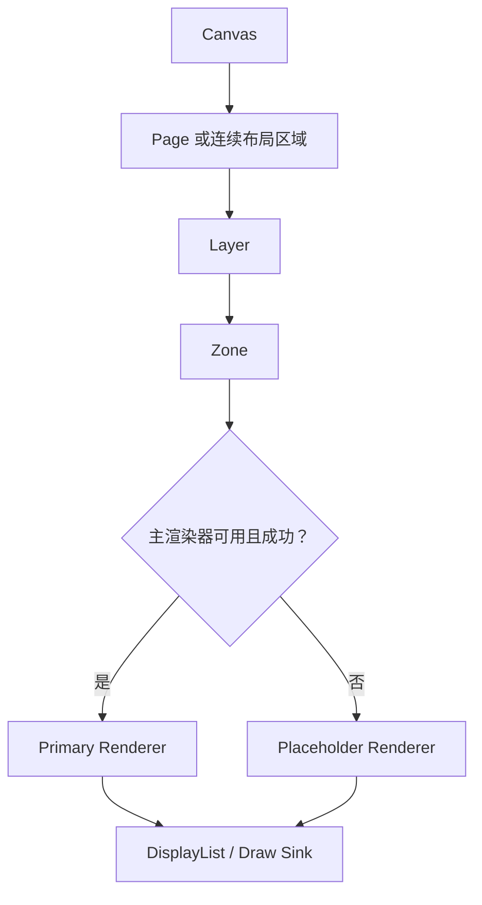
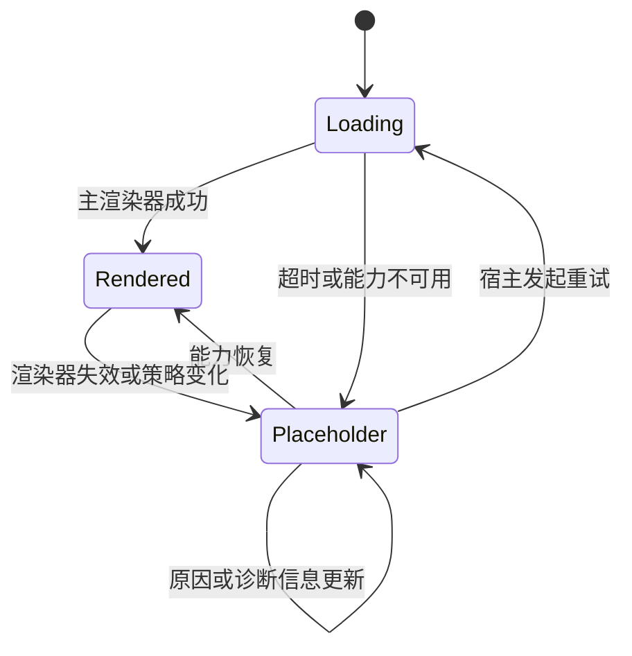
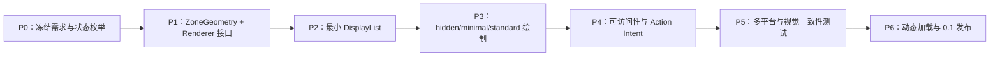

# FacetWire Placeholder Renderer 需求文档 0.1

| 属性 | 值 |
| --- | --- |
| 文档状态 | Draft / 需求基线 |
| 文档版本 | 0.1.0 |
| 目标项目 | FacetWire |
| 目标插件 | Placeholder Renderer |
| 建议插件 ID | `org.facetwire.reference.placeholder-renderer` |
| 建议 Capability ID | `facetwire.renderer.placeholder` |
| 适用平台 | Windows、Linux、macOS、iOS、Android；未来兼容 Wasm |
| 许可证 | MPL-2.0 |

本文使用“必须（MUST）”“不得（MUST NOT）”“应该（SHOULD）”“不应该
（SHOULD NOT）”“可以（MAY）”表达需求强度。0.1 阶段首先保证语义、布局和
跨平台一致性，具体 ABI 将在配套接口规范中冻结。

## 1. 背景与目标

FacetWire 场景可能引用宿主无法解析、无法解码、没有安装相应插件、被安全策略
禁止，或尚在异步加载的内容。此时如果直接删除内容节点，页面流、图层位置、
字幕锚点、控制层和周围文本都会发生错误位移。

Placeholder Renderer 的核心任务不是“显示一个错误框”，而是：

1. 在主渲染能力不可用时替代其绘制职责；
2. 保留原内容在 Canvas、Page、Layer、Zone 中应占据的空间；
3. 向用户和辅助技术表达内容为何未显示；
4. 允许宿主在能力恢复后无损切回主渲染器；
5. 为未知或未来扩展的内容提供稳定降级路径。

Placeholder Renderer 必须是基础能力插件，不应依赖某种具体 UI 框架、窗口系统
或图形后端。

### 本章检查

- 目标同时覆盖布局保真、视觉反馈和语义反馈，而不只处理错误外观。
- 降级渲染不会改变原始场景数据，也不会妨碍未来恢复真实内容。
- 目标适用于静态文档、多媒体场景和递归嵌套场景。

## 2. 范围与非目标

### 2.1 范围内

- 对任意未渲染 Zone 生成占位视觉；
- 保留已解析的宽度、高度、宽高比、流式位置、锚点和裁剪边界；
- 在尺寸尚未完全解析时提供确定性的回退测量；
- 表达加载中、不支持、缺少插件、资源缺失、解析失败、策略阻止等状态；
- 提供透明、最小、标准和诊断四种显示模式；
- 输出平台无关绘制原语或 DisplayList；
- 输出平台无关的可访问性语义和可选操作意图；
- 支持主题、缩放、字体、语言、从右到左书写和高对比度模式；
- 支持屏幕显示、打印、导出和无界面渲染策略。

### 2.2 范围外

- 解析原始媒体或专有文件格式；
- 解码图片、GIF、音频或视频；
- 决定插件是否可信或是否允许安装；
- 直接打开网络、文件系统、应用商店或插件市场；
- 实现完整页面排版引擎；
- 替代文本、图片、视频、字幕或图表的真实渲染器；
- 在占位插件内部持久化修改场景文档；
- 直接调用 Metal、Direct2D、Skia、UIKit、Android View 等平台对象。

### 本章检查

- 插件职责被限制为测量、占位绘制和语义输出。
- 安装、重试和权限修改由宿主决策，避免插件越权。
- 页面排版由布局系统负责，占位插件只在信息不足时提供测量回退。

## 3. 术语与对象关系

| 术语 | 含义 |
| --- | --- |
| Canvas | 场景的基础坐标和合成参考面 |
| Page | 可分页媒介中的虚拟页面或连续媒介中的布局分段 |
| Layer | 可独立定位、合成、交互和排序的展示层 |
| Zone | Layer 中具有边界和占位语义的内容区域 |
| Primary Renderer | 正常情况下负责内容的真实渲染器 |
| Placeholder Renderer | Primary Renderer 不可用时使用的降级渲染器 |
| Resolved Rect | 布局系统最终确定的 Zone 矩形 |
| Intrinsic Metadata | 内容声明的固有尺寸、宽高比、类型和替代文本等元数据 |
| DisplayList | 平台无关、可回放的绘制指令序列 |
| Action Intent | 插件建议宿主提供的操作，不代表操作已获授权 |

Placeholder Renderer 替代的是某个 Zone 的“内容绘制”，不是替代 Layer、Page 或
Canvas。它不得改变 Zone 的父子关系、z-order、锚点或流式排版顺序。



### 本章检查

- 占位能力位于 Zone 内容层，不会错误取代整个 Canvas。
- 主渲染器和占位渲染器共享同一最终合成路径。
- 对象关系支持一个页面包含多个文本、图片、图表和占位 Zone。

## 4. 使用场景

### 4.1 缺少插件

场景包含 Visio 图表，但宿主没有相应插件。宿主保留图表 Zone 的尺寸，在其中
显示“需要图表插件”，同时继续正确排版前后文本。

### 4.2 不支持的新内容类型

旧版宿主打开包含未来 Capability 的文档。旧宿主无法理解内容，但能根据 Zone
描述保留占位区域，避免其他内容错位。

### 4.3 资源暂不可用

图片、视频或嵌套场景正在加载。占位器显示稳定的加载状态；加载完成后宿主使用
同一个 Resolved Rect 原位替换，不得引起不必要的页面跳动。

### 4.4 解析或解码失败

资源存在但损坏。占位器显示可理解的失败状态，并可声明“重试”或“查看详情”
操作意图。

### 4.5 安全策略阻止

内容需要网络、外部插件或不受信任的解析器。宿主阻止执行，并要求占位器表达
“已被策略阻止”，但不得泄露敏感路径、令牌或内部策略详情。

### 4.6 无界面与导出

服务端导出 PDF 时无法使用某视频插件。导出策略可以保留带有替代文字的静态
占位，也可以只保留空白占位区域。

### 本章检查

- 场景覆盖缺能力、未知类型、暂时状态、永久失败和策略拒绝。
- 同一模型适用于交互式显示和无界面导出。
- 状态恢复不会要求修改文档结构。

## 5. 状态模型

占位原因必须使用稳定的机器可读枚举，显示文案由本地化层生成。

| 状态 | 建议标识 | 是否可恢复 | 默认用户语义 |
| --- | --- | ---: | --- |
| 加载中 | `loading` | 是 | 内容正在准备 |
| 缺少渲染器 | `renderer_missing` | 是 | 未安装所需能力 |
| 不支持类型 | `unsupported_type` | 取决于升级 | 当前版本不支持 |
| 资源缺失 | `resource_missing` | 是 | 找不到引用资源 |
| 资源不可访问 | `resource_unavailable` | 是 | 暂时无法访问 |
| 解析失败 | `parse_failed` | 取决于资源 | 无法读取内容 |
| 解码失败 | `decode_failed` | 取决于资源 | 无法显示内容 |
| 策略阻止 | `policy_blocked` | 取决于授权 | 内容已被安全策略阻止 |
| 权限不足 | `permission_required` | 是 | 需要用户或系统授权 |
| 资源受限 | `resource_limited` | 是 | 超过内存、时间或尺寸限制 |
| 插件崩溃/隔离终止 | `plugin_failed` | 是 | 渲染能力发生故障 |
| 未指定 | `unknown` | 未知 | 内容当前无法显示 |

状态转换由宿主控制。Placeholder Renderer 不得自行轮询资源或重新启动插件。



### 本章检查

- 状态标识与显示文案分离，支持本地化和自动化测试。
- 状态转换权限归宿主所有，避免插件产生隐藏副作用。
- 永久与暂时失败均可表达，但不会错误承诺一定可恢复。

## 6. 布局与测量需求

### 6.1 基本原则

- `PHR-LAYOUT-001`：如果宿主提供 Resolved Rect，插件必须原样使用，不得重新
  决定外部尺寸。
- `PHR-LAYOUT-002`：占位绘制必须被裁剪到 Zone 的内容裁剪范围，除非场景明确
  允许外溢效果。
- `PHR-LAYOUT-003`：占位器不得改变 z-order、文档流顺序、分页结果或锚点。
- `PHR-LAYOUT-004`：替换真实内容时，默认不得改变 Zone 尺寸。
- `PHR-LAYOUT-005`：零宽或零高 Zone 必须安全处理，不得除零或生成非法指令。

### 6.2 尺寸信息优先级

当布局尚未完全解析时，测量必须按以下顺序使用信息：

1. 文档明确指定的宽度和高度；
2. 布局约束计算出的宽度和高度；
3. 单边尺寸加可信的固有宽高比；
4. 可信的固有宽度和高度；
5. 内容类型提示对应的宿主主题回退尺寸；
6. 通用回退尺寸。

回退尺寸必须由宿主配置或主题提供。插件不得把某个桌面像素尺寸硬编码为所有
平台的标准。缺省建议仅作为参考：块级媒体采用 `16em × 9em`，行内未知对象
采用 `1em × 1em`；最终值仍需受最小、最大和可用空间约束。

### 6.3 字体相关布局

- `em` 和行高相关尺寸必须使用 Zone 的已解析字体上下文；
- 字体不可用时使用宿主提供的替代字体度量，不得自行加载系统字体；
- 字体放大不得导致占位器无限扩大；尺寸仍需遵守布局约束；
- 小尺寸 Zone 可以只显示图标或轮廓，不得强行绘制不可读文字。

### 6.4 分页与连续滚动

- 占位 Zone 可以完整位于一页，也可以由布局系统切分到多个页面片段；
- 插件只绘制宿主传入的当前片段，不得自行创建页面；
- 连续滚动场景中，离屏 Zone 可以只测量而不生成绘制指令；
- 嵌套场景无法渲染时，必须将整个嵌套场景视作一个 Zone，不得递归创建无限
  占位层。

### 本章检查

- 已解析布局具有最高优先级，避免占位器破坏真实排版。
- 未知尺寸具有确定且跨设备可缩放的回退算法。
- 行内、块级、分页、滚动和递归场景均有明确处理规则。

## 7. 绘制模式与视觉需求

### 7.1 显示模式

| 模式 | 视觉行为 | 布局占位 | 可访问性语义 |
| --- | --- | ---: | ---: |
| `hidden` | 不产生可见绘制 | 保留 | 默认保留状态语义 |
| `minimal` | 轮廓或简化状态标记 | 保留 | 保留 |
| `standard` | 图标、简短标签、可选说明 | 保留 | 保留 |
| `diagnostic` | 显示类型、Capability、原因码等调试信息 | 保留 | 保留但避免冗余朗读 |

### 7.2 默认外观

- 默认背景必须透明，不得无条件绘制不透明白底；
- 标准模式可以使用主题提供的轻量半透明填充；
- 边框、图标和文字必须使用语义化主题令牌；
- 不得依赖颜色作为唯一状态区别；
- 加载动画必须尊重“减少动态效果”设置；
- 诊断文字必须裁剪、换行或省略，不得突破 Zone；
- 插件不得绘制伪装成操作系统安全提示的界面。

透明度统一使用不透明度 `opacity`：

- `opacity = 1.0` 表示完全不透明；
- `opacity = 0.0` 表示完全透明；
- 对外若提供 `transparency`，必须满足 `transparency = 1 - opacity`；
- 输入必须被限制到 `[0, 1]`，NaN 和无穷值必须拒绝或归一化为安全默认值。

### 7.3 尺寸降级

建议按照可用尺寸逐步减少内容：

```text
足够大：图标 + 标题 + 原因 + 操作
中等：  图标 + 简短标题
较小：  图标或原因标记
极小：  仅轮廓/状态点
零尺寸：不绘制
```

阈值应基于字体度量和逻辑单位，而不是固定设备像素。

### 本章检查

- 默认视觉不会重现不透明白底问题。
- 四种模式分离“保留布局”和“是否可见”，满足导出与调试需求。
- 透明度语义唯一且与用户此前规定一致。

## 8. 输入数据需求

占位渲染请求至少需要表达以下信息：

```text
PlaceholderRequest
├── request_version
├── zone_id
├── content_kind
├── required_capability_id?
├── reason
├── resolved_rect?
├── layout_constraints
├── intrinsic_size?
├── intrinsic_aspect_ratio?
├── current_fragment?
├── display_mode
├── style_tokens
├── font_context
├── locale_and_direction
├── accessibility_metadata
├── permitted_action_kinds
├── diagnostic_metadata (已脱敏)
└── render_target_profile
```

### 8.1 必需字段

- 请求结构版本；
- Zone 稳定 ID；
- 占位原因；
- 显示模式；
- 当前布局约束或 Resolved Rect；
- 渲染目标的缩放和颜色能力；
- 宿主允许插件显示的诊断等级。

### 8.2 可选字段

- 原始内容类型和所需 Capability ID；
- 固有尺寸与宽高比；
- 安全的替代文字和标题；
- 当前分页片段；
- 允许声明的操作种类；
- 已脱敏错误编号和关联追踪 ID。

未知字段必须忽略；未知枚举必须映射为安全的 `unknown`，不得导致崩溃。

### 本章检查

- 输入足以完成测量、绘制、可访问性和诊断任务。
- 敏感原始错误对象、平台句柄和资源内容不跨越公共契约。
- 版本和未知字段规则支持向前兼容。

## 9. 输出数据需求

Placeholder Renderer 不得直接拥有平台窗口。一次请求可以产生：

```text
PlaceholderResult
├── measured_size?          # 仅测量阶段
├── display_list?           # 绘制阶段
├── accessibility_node?
├── hit_regions[]
├── action_intents[]
├── diagnostics[]
└── cache_key?
```

- `PHR-OUT-001`：绘制输出必须使用宿主提供的 DisplayList 或受限 Draw Sink。
- `PHR-OUT-002`：输出不得包含裸平台对象或由另一侧释放的内存。
- `PHR-OUT-003`：所有点击区域必须位于 Zone 边界内。
- `PHR-OUT-004`：无操作权限时不得输出操作意图。
- `PHR-OUT-005`：失败时必须返回稳定状态码；不得输出半初始化结构。
- `PHR-OUT-006`：测量和绘制在相同输入下必须保持几何一致。

DisplayList 尚未进入当前 FacetWire 代码，因此实现前必须先定义最小绘制原语：

- 保存/恢复状态；
- 裁剪矩形或圆角矩形；
- 填充和描边；
- 图标路径或宿主符号引用；
- 文本布局引用；
- 透明度和变换。

### 本章检查

- 输出与具体图形后端解耦。
- 测量、绘制、命中测试和可访问性可以由同一请求关联。
- 明确记录了实现 Placeholder Renderer 之前仍需补齐的 DisplayList 依赖。

## 10. 交互与操作意图

插件可以根据状态和宿主授权建议以下操作：

| 操作 | 标识 | 说明 |
| --- | --- | --- |
| 重试 | `retry` | 请求宿主重新加载或渲染 |
| 查看详情 | `show_details` | 请求宿主显示已脱敏诊断 |
| 定位资源 | `locate_resource` | 请求宿主让用户重新选择资源 |
| 请求权限 | `request_permission` | 请求宿主发起平台授权流程 |
| 查找插件 | `find_plugin` | 请求宿主打开受信任插件发现流程 |
| 使用替代表示 | `use_alternative` | 请求宿主切换预览图或静态表示 |

- Placeholder Renderer 只能输出 Action Intent，不得直接执行操作；
- 宿主必须根据权限、平台规则和用户确认决定是否展示或执行；
- 操作执行后由宿主提交新状态和新请求；
- 占位器不得保存授权结果；
- 拖动、滚动和焦点行为由所在 Layer/Zone 的交互策略控制。

### 本章检查

- 交互能力存在，但不会绕过宿主安全和确认流程。
- 操作结果通过重新渲染表达，保持插件无隐藏状态。
- 输入、滚动和拖动职责没有被错误塞入占位器。

## 11. 可访问性与本地化

### 11.1 可访问性

- 必须提供可读角色，例如 `image placeholder`、`media placeholder` 或通用
  `content unavailable`；
- 必须提供状态名称，但不得重复朗读同一诊断信息；
- 原内容提供替代文字时应优先保留该文字，再补充不可用状态；
- 可操作占位器必须支持键盘、开关控制和屏幕阅读器激活；
- 焦点顺序必须遵循文档或 Layer 的既有顺序；
- 高对比度模式必须由宿主主题令牌覆盖普通颜色；
- `hidden` 模式是否暴露语义由导出/显示策略决定，默认屏幕阅读场景应保留。

### 11.2 本地化

- 机器状态码不得直接作为最终用户文案；
- 文案模板、复数形式和标点由宿主本地化服务提供；
- 插件必须支持从右到左排版；
- Capability ID、插件 ID、路径和错误代码不得按自然语言重排；
- 文案变长时必须换行或省略，不能改变外部 Zone 尺寸。

### 本章检查

- 视觉不可用时仍能通过辅助技术理解内容状态。
- 本地化不会改变机器协议，也不会破坏外部布局。
- 键盘、触控、屏幕阅读器、高对比度和 RTL 均有覆盖。

## 12. 主题、颜色和合成

宿主至少应该提供以下语义令牌：

```text
placeholder.background
placeholder.border
placeholder.icon
placeholder.text.primary
placeholder.text.secondary
placeholder.action
placeholder.loading
placeholder.warning
placeholder.error
placeholder.blocked
```

- 插件必须优先使用语义令牌，不得假设浅色或深色背景；
- 颜色值必须声明颜色空间，0.1 建议使用 sRGB 输入并由宿主转换；
- 所有 alpha 必须采用预乘或非预乘中的一种明确约定；DisplayList 规范必须冻结
  该约定；
- 背景默认透明；如果启用磨砂或模糊，只能通过宿主提供的受限合成效果请求，
  插件不得捕获桌面或其他应用内容；
- 打印或不支持透明度的目标必须由宿主提供扁平化背景策略。

### 本章检查

- 颜色和透明度不依赖某个平台默认值。
- 磨砂效果被视为宿主合成能力，不会引入桌面捕获风险。
- 屏幕、打印和导出媒介的差异具有明确处理位置。

## 13. 安全、隐私与资源限制

- 插件不得读取占位目标的原始资源内容；
- 默认不得显示完整文件路径、URL 查询参数、访问令牌、用户目录或内部堆栈；
- 诊断模式也只能使用宿主明确标记为可显示的数据；
- 插件不得访问网络、文件系统、剪贴板、摄像头或麦克风；
- 文本必须视为不可信数据，不得作为富文本、HTML 或脚本直接执行；
- 极长 ID、替代文本和诊断内容必须有长度限制；
- 递归嵌套深度由宿主限制，占位器不得递归解析内容；
- 绘制指令数量、文本长度、Action Intent 数量和命中区域数量必须设置上限；
- 插件异常不得导致宿主放弃整个页面的其他 Zone。

建议 0.1 安全上限：

| 项目 | 建议默认上限 |
| --- | ---: |
| 用户可见标题 | 256 UTF-8 字节 |
| 用户可见说明 | 1,024 UTF-8 字节 |
| 诊断文本 | 4,096 UTF-8 字节 |
| Action Intent | 8 个 |
| 命中区域 | 8 个 |
| DisplayList 指令 | 64 条/Zone |

宿主可以设置更严格限制，但不得允许插件突破平台安全策略。

### 本章检查

- 占位渲染不需要接触高风险资源或权限。
- 诊断信息同时满足可排错和最小披露原则。
- 输入长度、递归和输出复杂度均有资源上限。

## 14. 性能与确定性

- 测量和绘制复杂度必须为单个 Zone 的 `O(1)`；
- 不得执行文件、网络、媒体解码或插件发现 I/O；
- 相同版本、相同主题、相同字体度量和相同输入必须产生等价输出；
- 热路径应避免无界内存分配；
- 离屏测量不得产生绘制指令；
- 动画加载状态必须由宿主时钟驱动，不得创建私有线程或计时器；
- 缓存键必须包含影响视觉或测量的版本、状态、尺寸、主题、字体、语言和缩放
  信息；
- 缓存不得包含敏感诊断正文。

参考性能目标而非跨设备硬性标准：在项目规定的桌面基准机上，生成 1,000 个
标准占位 DisplayList 的总时间应小于一帧（16.7 ms），且不包含文本栅格化时间。
移动平台应建立独立基准，不以桌面结果替代。

### 本章检查

- 性能要求避免依赖具体 GPU，同时提供可回归的参考目标。
- 确定性边界明确包含主题、字体和语言等真实影响因素。
- 动画和异步职责归宿主，插件不会隐式消耗后台资源。

## 15. 兼容性与部署方式

同一套插件源代码必须支持：

- Windows DLL 或静态库；
- Linux SO 或静态库；
- macOS dylib/framework 或静态库；
- iOS 随应用发布的静态注册/framework；
- Android NDK SO 或随应用静态注册；
- 未来通过生成适配器支持 Wasm、IPC 和远程执行。

0.1 参考插件必须首先实现静态注册，随后验证桌面动态加载。公共接口只使用固定
宽度整数、明确长度的 UTF-8 字符串、版本化结构和函数表，不跨 ABI 传递 C++
对象、异常或标准库容器。

占位器本身不得根据平台返回不同布局语义。由于字体和主题差异导致的视觉差异
必须能由输入度量解释，并由一致性测试设置允许范围。

### 本章检查

- 受限移动平台与桌面动态加载共享逻辑契约，但不虚假承诺相同部署机制。
- ABI 规则与当前 FacetWire C11 基线一致。
- 平台差异被限制在宿主适配和显式输入中。

## 16. 配置与优先级

配置来源按以下优先级合并，高优先级覆盖低优先级：

1. 安全和可访问性强制策略；
2. 当前导出或渲染任务策略；
3. 当前 Zone 的显式占位样式；
4. 当前文档或场景主题；
5. 应用用户设置；
6. 平台主题；
7. 插件安全默认值。

下列值不得被低优先级配置覆盖：

- 高对比度和减少动态效果等强制可访问性设置；
- 敏感信息脱敏规则；
- 权限和操作允许列表；
- 资源数量和长度上限；
- 导出任务要求的确定性设置。

配置变更不得修改原始场景，除非用户通过独立编辑命令明确要求写回。

### 本章检查

- 配置冲突具有确定的处理顺序。
- 安全和可访问性不会被文档样式绕过。
- 显示偏好与文档内容修改保持分离。

## 17. 错误处理与可观测性

Placeholder Renderer 自身必须能够在以下错误下安全降级：

- 无效尺寸、比例、颜色或透明度；
- 未知状态码；
- 缺失字体度量；
- 缺失主题令牌；
- DisplayList Sink 拒绝指令；
- 内存不足；
- 宿主在绘制过程中取消请求。

可恢复输入错误应转换成最小占位或隐藏占位；严重 ABI、所有权或输出 Sink 错误
必须向宿主返回失败，不得递归调用自身生成“占位器的占位器”。

日志至少应包含：

- 请求追踪 ID；
- Zone ID 的安全表示；
- 原因码；
- 选择的模式；
- 测量来源；
- 是否发生字段归一化；
- 返回状态和耗时。

默认日志不得包含原始资源路径、用户内容和完整替代文字。

### 本章检查

- 占位器自身失败不会递归失控。
- 错误既可以机器诊断，也不会默认泄露用户内容。
- 输入归一化和尺寸来源可被测试与追踪。

## 18. 功能验收标准

### 18.1 必须通过的行为测试

| 编号 | 验收项目 |
| --- | --- |
| `PHR-ACC-001` | 已有 Resolved Rect 时，占位前后外部几何完全一致 |
| `PHR-ACC-002` | 仅有宽度和比例时正确计算高度并受约束限制 |
| `PHR-ACC-003` | 完全未知尺寸时使用宿主回退令牌且结果确定 |
| `PHR-ACC-004` | 零尺寸、负数、NaN、无穷值不会崩溃 |
| `PHR-ACC-005` | hidden 模式不产生可见绘制但保留布局 |
| `PHR-ACC-006` | 默认背景不产生不透明白色矩形 |
| `PHR-ACC-007` | opacity 0 完全透明，opacity 1 完全不透明 |
| `PHR-ACC-008` | 小尺寸依序减少文字、操作、图标，不发生越界 |
| `PHR-ACC-009` | 所有状态码具有机器语义和本地化键 |
| `PHR-ACC-010` | 未授权操作不会出现在输出中 |
| `PHR-ACC-011` | 敏感路径、URL 参数和令牌不会进入视觉或日志 |
| `PHR-ACC-012` | 主渲染器恢复后原位替换且不修改场景结构 |
| `PHR-ACC-013` | 静态注册和桌面动态加载产生等价描述符 |
| `PHR-ACC-014` | Windows/Linux/macOS 的一致性测试通过 |
| `PHR-ACC-015` | iOS/Android 静态注册构建和生命周期测试通过 |

### 18.2 视觉矩阵

视觉基准至少覆盖：

- 浅色、深色、高对比度；
- 100%、150%、200% 缩放；
- 4 个显示模式；
- 11 个原因状态；
- 极小、行内、中等、宽屏、超高 Zone；
- 中文、英文、阿拉伯语和长文本伪本地化；
- 屏幕、打印和透明导出背景。

### 18.3 非功能验收

- ASan/UBSan 可用平台测试无错误；
- Windows MSVC `/W4`、GCC/Clang `-Wall -Wextra -Wpedantic` 无新增警告；
- 模糊测试覆盖请求反序列化和无效数值；
- 资源上限测试不会产生无界指令或内存增长；
- 所有公共结构都具有版本和尺寸字段；
- 第三方依赖与素材许可证已登记。

### 本章检查

- 验收覆盖布局、视觉、透明度、安全、平台和无障碍。
- 要求可以转化为自动测试、视觉快照或明确人工检查。
- 静态和动态部署均被纳入，而不是仅验证开发机示例。

## 19. 需求追踪矩阵

| 目标 | 相关章节 | 主要验证方式 |
| --- | --- | --- |
| 保留排版 | 3、6 | 几何与分页一致性测试 |
| 表达不可用原因 | 5、7、11 | 状态、本地化、可访问性测试 |
| 跨平台一致 | 9、12、15 | DisplayList 和多平台 CI |
| 安全降级 | 10、13、17 | 权限、脱敏、异常输入测试 |
| 可恢复替换 | 4、5、6 | 主/占位渲染器切换测试 |
| 不透明度语义一致 | 7、12 | Alpha 像素和合成测试 |
| 可扩展性 | 8、9、15 | 版本、未知字段和 ABI 测试 |
| 可发布性 | 13、18 | 依赖、许可证和构建检查 |

### 本章检查

- 每个核心目标都能追踪到需求章节和验证方法。
- 不存在只有设计描述、没有验收方式的核心目标。
- 安全、许可和跨平台发布被纳入完成定义。

## 20. 实现依赖与迭代计划

### 20.1 前置依赖

当前 FacetWire 已有插件生命周期和静态注册，但实现本插件前仍需最小化定义：

1. `ZoneGeometry v1`：矩形、约束、片段、裁剪和字体上下文；
2. `RenderTargetProfile v1`：缩放、颜色空间、主题、媒介和无障碍偏好；
3. `DisplayList/DrawSink v1`：占位器需要的最小绘制原语；
4. `AccessibilitySink v1`：角色、名称、状态和操作；
5. `Renderer Interface v1`：测量、绘制、取消和查询能力。

这些接口应作为独立 Capability 规范，不应全部塞入基础 `facetwire.h`。

### 20.2 建议迭代



每个阶段必须保持可构建和可测试。为了快速演示而创建的临时接口不得作为未版本
化公共 ABI 发布。

### 本章检查

- 依赖顺序避免在没有绘制契约时直接绑定平台 UI。
- Placeholder Renderer 是第一个使用公共渲染接口的参考插件，可反向验证接口
  是否足够小且可移植。
- 计划包含规范、实现、测试和发布，不把“能显示一个框”视为完成。

## 21. 待决策问题

下列问题必须在对应接口冻结前形成 ADR：

1. DisplayList 使用预乘 Alpha 还是非预乘 Alpha；
2. 逻辑单位的正式名称及其与设备像素、CSS px、dp、pt 的换算；
3. 文本布局由 Placeholder Renderer 请求宿主排版，还是接收已布局文本引用；
4. `hidden` 模式在不同导出目标中的默认可访问性策略；
5. Action Intent 的通用接口是否属于 Renderer 合同或独立 Interaction Capability；
6. 状态更新采用重新提交完整请求还是增量更新；
7. 插件 Manifest 中如何声明本地化资源和符号资源；
8. 参考插件是否内建最小矢量图标，或只使用宿主符号令牌；
9. 动态插件签名、隔离级别和受信任发布者策略如何描述；
10. 视觉一致性测试允许的字体和抗锯齿差异范围。

### 本章检查

- 尚未确定的关键技术选择被显式列出，没有伪装成既定标准。
- 每个问题都有明确的冻结时点和 ADR 归属。
- 待决策内容不阻碍先实现布局保真和最小透明占位路径。

## 22. 整体一致性检查

### 22.1 逻辑一致性

- Placeholder Renderer 只替代 Zone 内容绘制，与 Canvas 合成、Page 分页和 Layer
  排序边界一致；
- 布局系统优先提供最终几何，占位器仅在几何未知时测量，因此不会形成两个互相
  竞争的布局引擎；
- Action Intent 与实际权限操作分离，满足跨平台安全要求；
- 视觉透明度、合成 Alpha 和用户“透明/不透明”表达具有单一换算关系；
- 状态恢复始终由宿主重新调度主渲染器，不要求占位器持有资源或后台任务。

### 22.2 完备性

- 已覆盖输入、输出、状态、测量、绘制、交互、无障碍、本地化、安全、性能、
  兼容、配置、错误和测试；
- 已覆盖屏幕、打印、导出、无界面、分页、滚动、行内和嵌套场景；
- 已定义正常降级、占位器自身失败以及主渲染能力恢复三条路径；
- 已明确当前代码缺失的公共渲染依赖，避免直接写出不可复用的平台实现。

### 22.3 扩展性

- 状态枚举、请求和输出均要求版本化及未知字段处理；
- 新状态、新显示模式和新操作可以通过次版本扩展；
- DisplayList、Interaction 和 Accessibility 被拆成独立接口，可被后续文本、
  图片、视频、字幕和图表插件复用；
- 静态、动态、IPC、Wasm 和远程部署共享逻辑契约，不绑定单一平台装载方式。

### 22.4 完成定义

只有在以下条件全部满足后，Placeholder Renderer 0.1 才能标记完成：

1. 本文档中的 MUST 需求均有实现或明确的范围调整记录；
2. 配套接口规范完成并版本化；
3. 参考插件不直接依赖平台 UI 对象；
4. 静态和共享构建通过；
5. 多平台生命周期、布局、安全、无障碍和视觉测试通过；
6. 依赖、资产和许可证审查完成；
7. 未解决问题已形成 ADR 或被明确推迟到后续版本。
