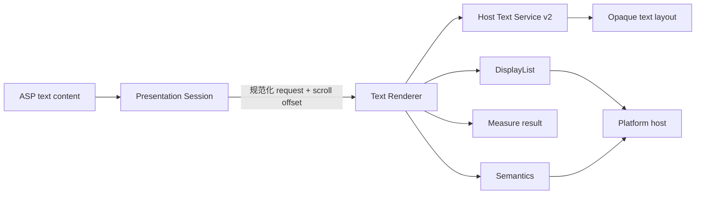

# FacetWire Text Renderer 0.1 需求规格

状态：**Experimental Draft**
目标 Capability：`facetwire.renderer.text`
目标 Interface：`facetwire.renderer.text.v1`

## 1. 目标与范围

Text Renderer 是 Core Content Profile 0.1 的第一个正式内容 Renderer。它把一个 Zone 的
`text` 内容转换为可测量、可裁剪、可滚动投影、可访问且可测试的 DisplayList；真实字形
塑形、字体回退和分行由宿主 Text Service 完成。

0.1 支持 UTF-8 纯文本、多个普通段落、统一样式、方向、字体缩放、换行、溢出、整体
opacity、选择语义和 Session 滚动位置。它不实现 Markdown/HTML、富文本 Run、编辑器、
输入法、页间断行、浮动图片、脚注、表格或 Word/PDF 级分页。

### 本章检查

- 插件职责是文本内容投影，不是通用文档排版引擎。
- 字形平台差异由受控宿主服务隔离，C ABI 不暴露平台对象。
- 0.1 能独立实现，不依赖 Agent Scene Parser。

## 2. 系统边界

- Document 持有文本、样式、layout 默认值和 `selectable`。
- Presentation Session 持有滚动位置、选择范围和当前视口；0.1 只接收滚动位置。
- Renderer 负责验证、规范化、测量、裁剪、命令生成、语义和缓存身份。
- Text Service 负责 Unicode 双向文本、字体匹配、字形塑形、换行和 layout 生命周期。
- 宿主负责解析 Resource、交互、滚动手势、选择 UI、剪贴板和平台无障碍桥接。

### 本章检查

- 每类状态只有一个所有者。
- Renderer 不访问文件、网络、系统字体 API 或平台 Widget。
- 滚动和选择不会被误写回持久文档。

## 3. 输入与规范化需求

| ID | 需求 |
| --- | --- |
| TXR-IN-001 | 输入必须是 Core Content 0.1 的 `type=text`、`format=plain` 投影。 |
| TXR-IN-002 | 字符串必须是有效 UTF-8；非法序列返回 `FW_STATUS_INVALID_ARGUMENT`。 |
| TXR-IN-003 | CRLF 和 CR 必须按 LF 语义处理；规范化不得改变原文档。 |
| TXR-IN-004 | 缺省值必须与 Core Content Schema 一致：字号 16、字重 400、行高 1.2、start/top、wrap、clip、opacity 1。 |
| TXR-IN-005 | `fontSize`、`letterSpacing`、padding 和约束使用 Canvas 逻辑单位。 |
| TXR-IN-006 | 最终字号必须是 `fontSize × target.font_scale`；无效或非正 font scale 规范化为 1 并返回诊断标志。 |
| TXR-IN-007 | opacity 接受包含 `0.1`、`0.99` 在内的任意有限 0–1 值；超界、NaN、Infinity 为非法。 |
| TXR-IN-008 | 颜色 Alpha 必须再乘以整体 opacity；不得自动绘制白色背景。 |
| TXR-IN-009 | `language` 按 BCP 47 字符串透传给 Text Service；0.1 不自行联网推断语言。 |
| TXR-IN-010 | `direction=auto` 由 Text Service 解析；Renderer 不以字符范围启发式替代 Unicode BiDi。 |
| TXR-IN-011 | 单个请求最多 16 MiB UTF-8、16 个字体族；宿主可设置更低配额。 |
| TXR-IN-012 | 未识别的扩展字段可以保留在文档层，但不得改变 0.1 Renderer 行为。 |

### 本章检查

- Schema 默认值、C 请求和运行时规范化可以一一映射。
- opacity 方向与 FacetWire 全局约定一致。
- Unicode 与字体判断没有落入插件私有启发式。

## 4. 验证需求

| ID | 需求 |
| --- | --- |
| TXR-VAL-001 | `validate` 必须检查 struct size、必需指针、UTF-8、枚举、有限数值、范围和跨字段组合。 |
| TXR-VAL-002 | `ellipsis` 必须具有有限视口宽度；`no-wrap + ellipsis` 固定为一行。 |
| TXR-VAL-003 | `maxLines` 只接受正整数；0 表示“未指定”，不能表示零行。 |
| TXR-VAL-004 | `scroll` 的当前 offset 属于 Session；负数、NaN、Infinity 规范化为 0 并暴露标志。 |
| TXR-VAL-005 | `fontResource` 缺失时返回可诊断的 `NOT_FOUND`；若允许字体 fallback，可继续测量但必须标记 fallback。 |
| TXR-VAL-006 | 不支持的样式不得静默忽略；必须返回 `UNSUPPORTED` 或明确 normalization/fallback 标志。 |
| TXR-VAL-007 | 验证不分配长期对象、不调用 Text Service、不执行 I/O。 |

### 本章检查

- 纯结构验证与字体/布局服务验证已分开。
- 可恢复 fallback 与不可恢复错误能被宿主区分。
- 每个规范化行为都有可观察标志。

## 5. 测量与布局需求

| ID | 需求 |
| --- | --- |
| TXR-MEA-001 | `measure` 必须先扣除 padding，再把内容宽度交给 Text Service v2。 |
| TXR-MEA-002 | 测量结果必须包含外部尺寸、内容 extent、baseline、line count、截断和字体 fallback 标志。 |
| TXR-MEA-003 | 结果必须满足 min/max constraints；约束冲突时使用确定性夹取并暴露 normalization。 |
| TXR-MEA-004 | 空字符串仍产生合法零内容 extent，外部尺寸至少包含 padding 和最小约束。 |
| TXR-MEA-005 | `font_scale` 必须在塑形/分行前应用，不能对已栅格化结果事后缩放。 |
| TXR-MEA-006 | `overflow=scroll` 必须返回完整内容 extent 和独立 viewport extent，不能把滚动内容裁成测量高度。 |
| TXR-MEA-007 | `overflow=visible` 可以绘制出 Zone，但测量不得移动兄弟 Zone 或改写 Zone bounds。 |
| TXR-MEA-008 | 相同规范化请求、Text Service 版本、字体解析结果和 Target 必须产生相同结构测量。 |
| TXR-MEA-009 | layout handle 必须在调用结束前释放；任何错误路径也不得泄漏。 |

### 本章检查

- intrinsic content、Zone viewport 和外部约束没有混为一个尺寸。
- 字体缩放参与真实排版，而非视觉后处理。
- 滚动内容可以超出展示区域但不破坏文档几何。

## 6. 渲染需求

| ID | 需求 |
| --- | --- |
| TXR-REN-001 | `render` 必须只通过 DisplayList Sink 输出命令，不直接创建窗口或平台控件。 |
| TXR-REN-002 | 除 `overflow=visible` 外必须裁剪到 Zone 内容框；`scroll` 还必须应用 Session offset。 |
| TXR-REN-003 | `backgroundColor` 仅在显式提供且最终 Alpha 大于 0 时绘制。 |
| TXR-REN-004 | 前景色和背景色 Alpha 均乘以 opacity；opacity 0 时可以输出零命令但仍保留 Semantics。 |
| TXR-REN-005 | 水平/垂直对齐基于 direction-aware start/end 和测量后的 content extent 计算。 |
| TXR-REN-006 | Renderer 必须在 DisplayList 已复制或消费 layout 后释放 layout handle。 |
| TXR-REN-007 | Sink 拒绝命令时立即返回 `FW_STATUS_SINK_REJECTED`，并保证 save/restore 平衡。 |
| TXR-REN-008 | 不得缓存、返回或跨调用保存 Text Service 的平台 layout handle。 |
| TXR-REN-009 | 渲染结果必须返回命令数、内容/视口 extent、实际滚动 offset、截断、fallback 和 128-bit cache key。 |
| TXR-REN-010 | 缺少 Text Service、字体资源或宿主不支持 Alpha 时必须明确失败/降级，由 Runtime 路由 Placeholder。 |

### 本章检查

- 白底只可能来自文档显式背景色，不会由 Renderer 隐式产生。
- DisplayList 生命周期和错误清理可以单元测试。
- opacity 为零时视觉与可访问性不会被混为一谈。

## 7. 滚动、选择与交互需求

| ID | 需求 |
| --- | --- |
| TXR-INT-001 | 0.1 Renderer 接收 Session 的只读 `scroll_offset_y`，并返回夹取后的实际值和最大值。 |
| TXR-INT-002 | Renderer 不保存 offset；宿主收到滚动输入后更新 Session revision 并重渲染。 |
| TXR-INT-003 | `selectable=true` 只进入 Semantics/交互能力标志，不等同于可编辑。 |
| TXR-INT-004 | 光标、选择范围、拖拽手柄、剪贴板和输入法不属于 0.1 Renderer。 |
| TXR-INT-005 | 需要字符级命中测试时使用后续 Text Interaction Service，不向 v1 临时塞入平台索引对象。 |

### 本章检查

- 滚动状态不藏在插件实例中。
- 可选择、可滚动、可输入是三个独立能力。
- 后续交互扩展无需破坏 v1 基础渲染接口。

## 8. 无障碍与语义需求

| ID | 需求 |
| --- | --- |
| TXR-A11Y-001 | 每个非装饰 text Zone 必须输出 document/text 语义、完整文本、语言、方向和 bounds。 |
| TXR-A11Y-002 | 视觉截断不得默认截断无障碍文本；必须单独暴露 `visually_truncated`。 |
| TXR-A11Y-003 | selectable、scrollable 与当前/最大滚动位置必须作为语义属性输出。 |
| TXR-A11Y-004 | opacity 0 不自动隐藏语义；只有 Document/Session 明确 hidden 才隐藏。 |
| TXR-A11Y-005 | 语义字符串引用请求内存，只在函数调用和宿主规定的消费窗口内有效。 |

### 本章检查

- 视觉裁剪不会导致读屏内容丢失。
- 透明度没有被误用为可访问性隐藏开关。
- 语义生命周期可由 C ABI 明确实现。

## 9. 性能、线程与安全需求

| ID | 需求 |
| --- | --- |
| TXR-NFR-001 | 插件必须无网络、无文件系统、无进程启动、无平台 UI 依赖。 |
| TXR-NFR-002 | API 必须可重入；同一插件 handle 可在不同线程并发调用，单次 host service 回调限当前调用线程。 |
| TXR-NFR-003 | 默认不保留跨调用可变状态；缓存由宿主按返回 cache key 管理。 |
| TXR-NFR-004 | 所有乘加和坐标必须检查有限值、溢出和资源上限。 |
| TXR-NFR-005 | 超长文本、恶意字体、双向控制字符和极端换行不得影响兄弟 Zone 或整个 Page。 |
| TXR-NFR-006 | 结构 DisplayList 必须可跨平台比较；字形像素一致性只有在字体文件和塑形后端一致时承诺。 |
| TXR-NFR-007 | 动态库、静态库和 Apple framework/static registration 必须暴露同一接口和行为测试。 |

### 本章检查

- 安全边界符合插件契约。
- 结构确定性和像素确定性没有被错误等同。
- 一套 C/C++ 插件代码可由各平台宿主接入。

## 10. 错误与 Placeholder 映射

| 条件 | Text Renderer 状态 | Placeholder reason |
| --- | --- | --- |
| 请求/UTF-8/枚举非法 | `INVALID_ARGUMENT` | `parse_failed` |
| Text Service/样式不支持 | `UNSUPPORTED` | `unsupported_type` |
| 字体 Resource 缺失且不能 fallback | `NOT_FOUND` | `resource_missing` |
| 文本或字体超过配额 | `RESOURCE_LIMIT` | `resource_limited` |
| Text Service 内部失败 | `PLUGIN_ERROR` | `plugin_failed` |
| DisplayList 拒绝命令 | `SINK_REJECTED` | `plugin_failed` |

诊断必须使用稳定 localization/diagnostic key，不得把平台错误、文件路径或敏感文本直接
写入用户可见消息。

### 本章检查

- 每类失败都有确定 Runtime 降级路径。
- 诊断和用户文本分离。
- 单个文本 Zone 失败不会终止其他内容。

## 11. 验收与测试矩阵

最低自动化测试：

| 类别 | 用例 |
| --- | --- |
| 输入 | 空文本、ASCII、中文、Emoji、组合字符、CRLF、非法 UTF-8 |
| 方向 | auto、LTR、RTL、混排、start/end 对齐 |
| 样式 | 默认值、fontScale、字重、斜体、行高、字距、装饰、透明背景 |
| opacity | 0、0.1、0.5、0.99、1、超界、NaN |
| 布局 | wrap/no-wrap、四种 overflow、maxLines、四边 padding、约束冲突 |
| Session | 负 offset、有效 offset、超过最大 offset、revision 变化 |
| 服务 | 字体命中、fallback、缺失字体、layout 失败、sink 第 N 条失败、handle 释放 |
| 语义 | 完整文本、视觉截断、透明但可读、selectable、scrollable |
| 确定性 | 同输入重复命令、cache key 稳定、跨 Windows/macOS/Linux 结构比较 |

验收门禁：单元测试全绿、ASan/UBSan（可用平台）无错误、Windows 动态/静态加载通过、
macOS/iOS/visionOS 静态注册通过、Linux 动态加载通过，且 Playground 可手工验证滚动、
字体缩放、透明度和 Semantics。

### 本章检查

- 所有规范行为都有正向、边界或失败测试。
- 平台门禁覆盖动态加载与受限平台静态注册。
- Playground 仅用于人工验证，不替代插件单元测试。

## 12. 完成定义与关联检查

Text Renderer 0.1 完成必须同时满足：公共头文件、参考插件、fake Text Service v2、fake
DisplayList Sink、单元测试、Manifest、参数 Schema、Core Content fixture、Playground
示例和中英术语说明均已提交；接口与标准文档一致。

整体关联推导：Document 提供持久文本和样式，Session 提供视口状态，Renderer 通过
Text Service 生成 layout 并通过 DisplayList 输出，宿主桥接平台 UI。字体缺失或服务失败
经 Runtime 原位进入 Placeholder；任何环节都不改变 Zone 坐标或兄弟布局。

### 本章检查

- 需求与 Core Content、ADR-0003、Plugin Contract、Placeholder Renderer 无冲突。
- Text Service v1 继续服务 Placeholder；Text Renderer 使用独立 v2，不以扩展 `sizeof(v1)` 破坏 ABI。
- 富文本、分页和字符级交互均有清晰扩展点，但未被伪装成 0.1 已支持。
