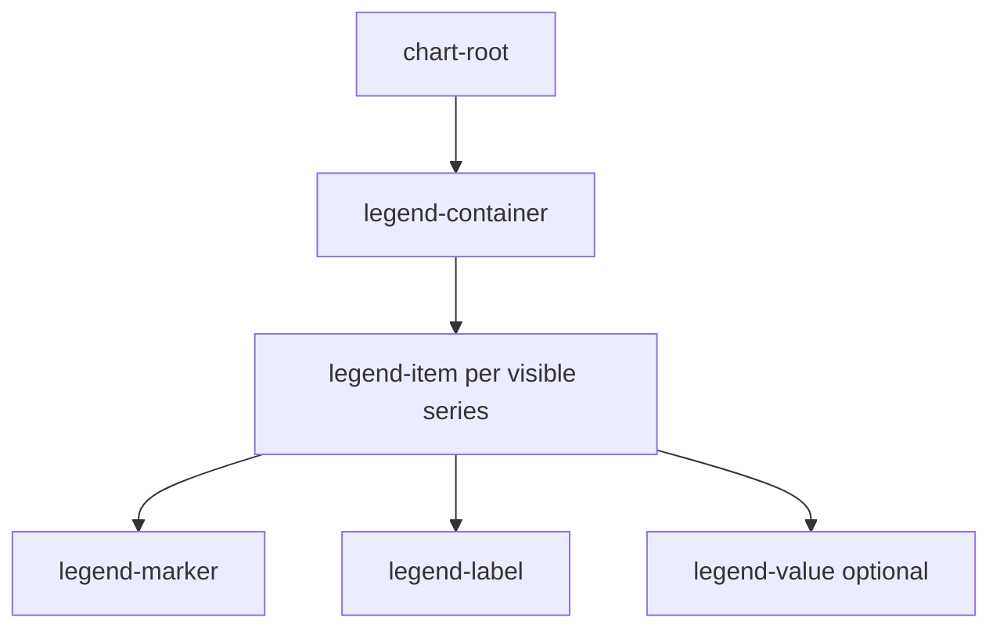

# FacetWire Chart Legend Composition Profile 0.1

Status: **Experimental Draft**
Normative schema: `schema/chart-legend-template-v0.1.schema.json`
C model: `include/facetwire/chart_legend.h`

## 1. Scope and conformance

This profile defines a renderer-neutral legend template for every FacetWire chart
profile. A conforming renderer MUST expose the same logical ownership tree and stable
element roles even when its native toolkit draws the legend with different primitives.
The profile changes presentation only; it never mutates chart data.

Core Chart Renderer 0.1 materializes a default template from visible series. Explicit
template serialization is standardized here for scene packages and future adapters;
until a request extension is negotiated, hosts modify the materialized template through
`facetwire.renderer.chart.elements.v1` overrides.

### Chapter check

- Data ownership, renderer ownership, and future Forge write-back are separated.
- Existing `chart.v1` hosts remain source and ABI compatible.

## 2. Composition and identity



The roles are `LEGEND_CONTAINER=13`, `LEGEND_ITEM=8`, `LEGEND_MARKER=14`,
`LEGEND_LABEL=15`, and `LEGEND_VALUE=16`. Existing numeric roles are unchanged.
Each item and descendant is bound to the source `seriesId`. Canonical IDs follow:

```text
chart/{chartId}/legend-container
chart/{chartId}/legend-item/{seriesId}
chart/{chartId}/legend-marker/{seriesId}
chart/{chartId}/legend-label/{seriesId}
chart/{chartId}/legend-value/{seriesId}
```

### Chapter check

- IDs do not depend on layout coordinates, array addresses, or localized labels.
- A renderer that cannot draw a value still preserves the standardized optional role.

## 3. Template model and tokens

`fw_chart_legend_template_v1` defines placement, direction, wrapping, alignment,
normalized layout tokens, items, and flags. Every struct starts with `struct_size`;
the template carries `profile_version`. Strings and arrays are borrowed for the call
and MUST NOT be retained by a renderer.

Tokens cover marker size, marker-to-label gap, label-to-value gap, item/row gaps,
padding, item width bounds, and label/value font sizes. Missing or zero auto tokens
are resolved by the theme. Authors SHOULD use design tokens rather than per-chart
pixel constants.

### Chapter check

- Layout can be reproduced by C, Swift, Kotlin, Dart, Rust, and web renderers.
- New trailing fields can be added without changing existing struct prefixes.

## 4. Layout and responsive behavior

`auto` resolves to row/bottom on wide viewports and column/right when that preserves a
larger plot area. Item order follows visible series order unless a host explicitly
reorders logical elements. Wrapping occurs only between items; marker, label, and value
of one item remain together. Collision handling MAY truncate a label, but MUST expose
the full semantic label.

The legend container participates in chart auto layout before element overrides.
Overrides then run container → item → part, so user adjustments are not overwritten by
responsive layout.

### Chapter check

- Responsive placement cannot split one item across rows or columns.
- Automatic layout and explicit element adjustment have a deterministic order.

## 5. Override and cascade contract

All five roles support visibility, opacity (`1=opaque`, `0=transparent`), color,
translation, uniform scale, rotation, z-offset, and promotion when the renderer reports
the capability. Cascade order is:

1. chart root;
2. source series;
3. legend container;
4. legend item;
5. marker, label, or value.

A legend-item transform uses the item bounds center as its implicit anchor and applies
to all descendants as one group. A narrower child override can then change only that
part. Later matching overrides replace earlier values field by field.

### Chapter check

- “Move Revenue legend item” keeps its marker, label, and value together.
- “Change only Revenue marker to orange” does not recolor its label.

## 6. Values, states, and interaction

`valueText` is optional formatted presentation text, not a numeric source of truth.
Renderers MUST NOT aggregate or rewrite data based on it. Standard item states are
normal, highlighted, muted, and disabled. Interactive legends MAY emit selection or
visibility intents to the host, but the plugin MUST NOT directly modify a scene file.

Hover/focus treatment must remain inside the item's effective bounds and must not paint
outside the chart clipping region. Hidden items remain addressable when enumerated.

### Chapter check

- Display values and source values cannot diverge silently through write-back.
- Mouse, touch, keyboard, and Agent operations use the same stable element identity.

## 7. Visual and accessibility rules

Marker color identifies the series; label/value text uses theme foreground tokens.
Muted state SHOULD lower opacity without destroying contrast. Labels use a modern
sans-serif fallback stack and dark gray rather than pure black in light themes. A
semantic label SHOULD contain series label, optional value, and state. Color MUST NOT be
the sole carrier of meaning when marker shape or text can disambiguate the series.

Logical reading order is container order, then marker, label, value for each item. Visual
z-order changes do not silently change reading order.

### Chapter check

- The profile supports high contrast and non-color identification.
- Visual and accessibility order are explicitly separated.

## 8. Validation and acceptance

Implementations MUST reject invalid enums, non-finite dimensions, dimensions outside
`[0,1]`, duplicate item IDs, missing series bindings, invalid colors, and retained
request pointers. Core conformance tests cover role counts, parent links, canonical IDs,
marker emission, item-level group transforms, child-level overrides, opacity, and cache
keys. Uncovered chart regions remain transparent.

### Chapter check

- Validation covers model, geometry, lifecycle, and deterministic output.
- The profile is extensible without requiring native widgets or dynamic loading.
