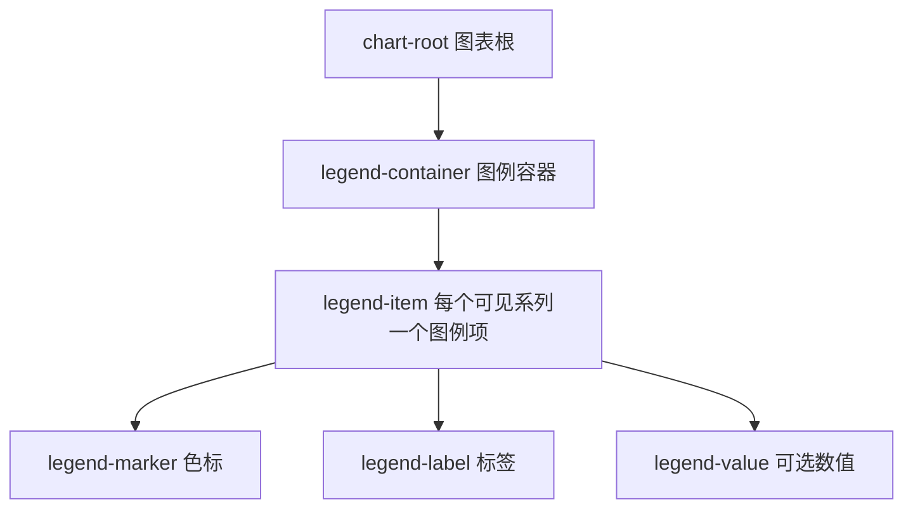

# FacetWire 图例组合规范 0.1

状态：**Experimental Draft / 实验草案**
规范 Schema：`schema/chart-legend-template-v0.1.schema.json`
C 模型：`include/facetwire/chart_legend.h`

## 1. 范围与符合性

本规范定义所有 FacetWire 图表 Profile 共用的、与渲染后端无关的图例模板。即使各平台
最终使用不同图元绘制图例，符合规范的渲染器也必须暴露相同的逻辑层级和稳定元素角色。
图例只属于展示，不得修改图表源数据。

Core Chart Renderer 0.1 会根据可见系列生成默认模板。本规范同时定义可存入 Scene Package
的显式模板；在协商出新的 request extension 之前，宿主通过
`facetwire.renderer.chart.elements.v1` 覆盖默认模板的展示。

### 本章检查

- 数据、渲染器展示和未来 Forge 写回职责已分离。
- 现有 `chart.v1` Host 的源码与 ABI 行为保持兼容。

## 2. 组合层级与稳定身份



角色值为 `LEGEND_CONTAINER=13`、`LEGEND_ITEM=8`、`LEGEND_MARKER=14`、
`LEGEND_LABEL=15`、`LEGEND_VALUE=16`，原有角色数值不变。图例项和所有子部件都绑定
源 `seriesId`。Canonical ID 如下：

```text
chart/{chartId}/legend-container
chart/{chartId}/legend-item/{seriesId}
chart/{chartId}/legend-marker/{seriesId}
chart/{chartId}/legend-label/{seriesId}
chart/{chartId}/legend-value/{seriesId}
```

### 本章检查

- ID 不依赖布局坐标、数组地址或本地化显示文字。
- 当前不显示数值的渲染器也保留可选 `legend-value` 的标准角色定义。

## 3. 模板模型与设计令牌

`fw_chart_legend_template_v1` 定义位置、方向、换行、对齐、归一化布局令牌、图例项和
flags。每个结构都以 `struct_size` 开头，模板包含 `profile_version`；字符串和数组只在
调用期间借用，渲染器不得持有其指针。

令牌包括色标大小、色标与标签间距、标签与数值间距、项/行间距、内边距、项宽范围以及
标签/数值字号。缺失或为自动值的令牌由主题解析。图表作者应复用设计令牌，避免写死平台
像素值。

### 本章检查

- C、Swift、Kotlin、Dart、Rust 与 Web 后端可复现相同模板意图。
- 后续可追加字段而不改变现有结构前缀。

## 4. 自动布局与响应式行为

`auto` 在宽屏优先解析为底部横排，在侧栏能保留更多绘图区时可解析为右侧纵排。图例项
顺序默认跟随可见系列顺序；换行只能发生在图例项之间，不能拆散同一项的色标、标签和
数值。空间不足时可截断视觉标签，但必须保留完整语义标签。

图例容器先参加图表自动布局，再应用元素覆盖，执行顺序固定为：容器 → 图例项 → 子部件。

### 本章检查

- 响应式换行不会把一个图例项拆到两行或两列。
- 自动布局不会覆盖用户或 Agent 后续施加的显式调整。

## 5. 覆盖与级联规则

当渲染器声明对应能力时，五类角色均支持 visible、opacity（`1=完全不透明`、`0=完全透明`）、
颜色、平移、统一缩放、旋转、zOffset 和 promotion。级联顺序为：

1. chart-root；
2. 源 series；
3. legend-container；
4. legend-item；
5. legend-marker、legend-label 或 legend-value。

对 `legend-item` 做变换时，以该项 bounds 中心作为默认锚点，色标、标签和数值作为整体
一起变换；之后仍可用更窄的子部件覆盖只调整其中一项。后出现的匹配覆盖按字段替换前值。

### 本章检查

- “移动 Revenue 图例项”会保持色标、标签和数值的相对关系。
- “只把 Revenue 色标改成橙色”不会误改标签文字颜色。

## 6. 数值、状态与交互

`valueText` 是可选的格式化展示文字，不是数值真值来源；渲染器不得据此聚合或写回数据。
标准状态为 normal、highlighted、muted 和 disabled。交互式图例可以向 Host 发出选择或
可见性意图，但插件不得直接改写 Scene 文件。

Hover/Focus 效果必须限制在图例项有效 bounds 与图表裁剪区内。隐藏项在枚举时仍可寻址。

### 本章检查

- 展示数值与源数值不会通过隐式写回产生不一致。
- 鼠标、触摸、键盘和 Agent 共用稳定元素身份。

## 7. 视觉与无障碍规则

色标颜色表示系列；标签和数值使用主题前景令牌。muted 状态应降低透明度但仍满足对比度。
浅色主题采用现代无衬线字体和深灰字色，不使用刺眼纯黑。语义标签应包含系列名称、可选
数值和当前状态；在可以使用形状或文字区分时，颜色不得成为唯一信息通道。

逻辑阅读顺序为容器内顺序，并按每个图例项的色标、标签、数值读取。视觉 zOffset 不得
隐式改变无障碍阅读顺序。

### 本章检查

- 规范可支持高对比度与非颜色识别。
- 视觉顺序和语义阅读顺序已明确分离。

## 8. 验证与验收

实现必须拒绝非法枚举、非有限尺寸、超出 `[0,1]` 的尺寸、重复 item ID、缺失系列绑定、
非法颜色和跨调用持有指针。Core 测试必须覆盖角色数量、父子关系、canonical ID、色标绘制、
图例项整体变换、子部件单独覆盖、透明度和缓存键。无需渲染的区域必须保持透明。

### 本章检查

- 验证涵盖模型、几何、生命周期和确定性输出。
- 规范不依赖原生 Widget 或任意动态插件加载，适用于所有目标平台。
