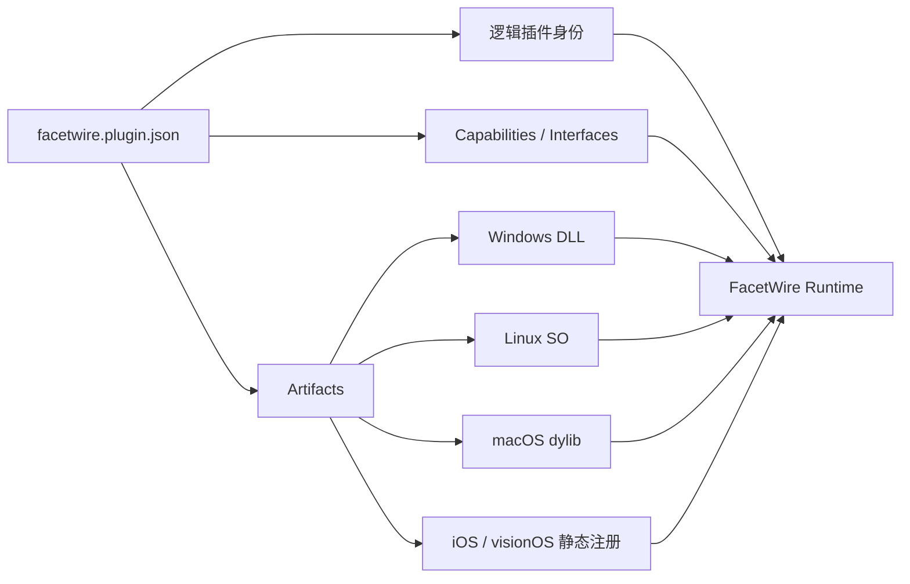
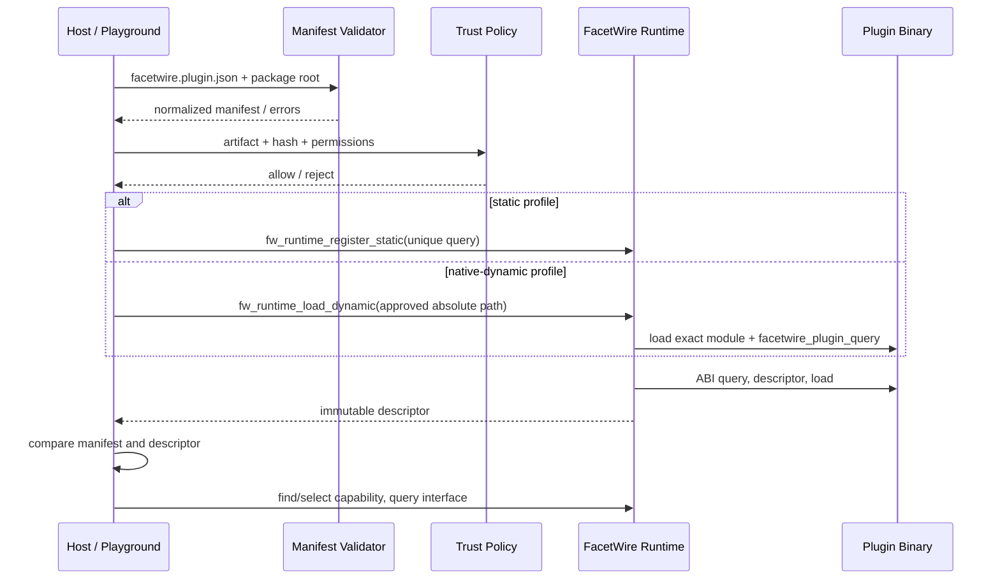

# FacetWire 插件清单规范 0.1 / Plugin Manifest 0.1

状态：**Draft**
规范性术语：必须（MUST）、不得（MUST NOT）、应该（SHOULD）、可以（MAY）。

## 1. 目标与边界

`facetwire.plugin.json` 描述一个逻辑插件的身份、ABI 范围、Capability、Interface、
许可、权限声明和各平台制品。它让同一份插件实现可以在桌面以 DLL/SO/dylib 接入，
在 iOS、visionOS 等受限平台以静态注册或随应用发布的 framework 接入。

清单不是可执行授权，也不是沙箱。Core Runtime 不自行扫描目录、不读取清单、不下载
代码；宿主先验证清单和信任策略，再把已批准的注册函数或绝对动态库路径交给 Runtime。
本规范不定义 ASP 文件解析器，也不引入 `asp-parser`。

### 本章检查

- 逻辑插件身份与平台制品已经分离。
- 清单发现、信任决策和二进制加载的责任没有混淆。
- 本阶段范围明确排除了 ASP 解析。

## 2. 文件名与编码

清单文件名必须为 `facetwire.plugin.json`，必须是 UTF-8 JSON，且必须符合
[JSON Schema](schema/plugin-manifest-v0.1.schema.json)。未知顶层字段必须拒绝；扩展只能
放入 `extensions`，其键必须使用命名空间式稳定 ID。

所有 `path` 使用 `/` 分隔且必须相对于插件包根目录。不得使用绝对路径、反斜杠、NUL
或 `..` 路径段。宿主必须将解析后的规范路径再次验证为仍位于插件包根目录内。

### 本章检查

- 文件名、编码、Schema 和未知字段策略均唯一确定。
- 路径规则可跨 Windows、macOS、Linux、Android、iOS 和 visionOS。
- Schema 检查不能替代规范路径后的目录边界检查。

## 3. 逻辑模型

同一 `plugin.id` 的各平台制品必须暴露语义一致的 Descriptor。清单中的 `plugin.id`、
`plugin.version`、ABI 和 Capability 集合必须与加载后二进制 Descriptor 相符；不符时
宿主必须拒绝该制品。

### 本章检查

- 一份清单可以描述多平台制品而不会复制逻辑身份。
- 清单只用于加载前发现；二进制 Descriptor 仍是加载后事实来源。
- 清单与 Descriptor 的防替换比对规则明确。

## 4. 字段定义

| 字段 | 必需 | 说明 |
| --- | --- | --- |
| `format` | 是 | 固定为 `facetwire.plugin-manifest` |
| `formatVersion` | 是 | 0.1 固定为 `0.1` |
| `plugin` | 是 | 稳定 ID、版本、名称、供应方、SPDX 许可表达式 |
| `abi` | 是 | `major`、`minimumMinor`、`maximumMinor` |
| `capabilities` | 是 | 可为空；每个 ID 在插件内必须唯一 |
| `artifacts` | 是 | 至少一个平台制品 |
| `permissions` | 否 | 权限需求声明；默认空，不等于授权 |
| `dependencies` | 否 | 插件依赖和版本范围；默认空 |
| `extensions` | 否 | 命名空间扩展；默认空 |

每个 Capability 的 `interfaces` 声明可查询 Interface ID 及最大实现版本。相同
Capability ID 或相同 Capability 内的 Interface ID 不得重复。`minimumMinor` 不得大于
`maximumMinor`；这些跨字段约束由语义验证器检查。

### 本章检查

- 身份、兼容性、功能、部署、许可和扩展信息均有位置。
- Schema 可检查结构，语义验证器负责唯一性和数值关系。
- Capability 广告与可调用 Interface 保持分离。

## 5. Artifact Profile

| `profile` | 必需字段 | 用途 |
| --- | --- | --- |
| `static` | `target`, `registration` | 随应用链接；注册符号必须在最终程序内唯一 |
| `native-dynamic` | `target`, `path`, `querySymbol` | 桌面及受控 Android；查询符号固定为 `facetwire_plugin_query` |
| `process` | `target`, `path` | 进程隔离适配器，后续规范定义传输 |
| `wasm` | `target`, `path` | Wasm 适配器，后续规范定义 imports/exports |
| `remote` | `target`, `endpointScheme` | 远程适配器；清单不得保存令牌或用户凭据 |

`target` 是宿主识别的平台目标键，例如 `windows-x86_64`、`linux-x86_64-gnu`、
`macos-arm64`、`android-arm64-v8a`、`ios-arm64`、`visionos-arm64`。`any` 仅适用于由
最终应用负责链接的可移植静态注册。

静态插件应该导出唯一命名的注册函数，例如 `facetwire_hello_plugin_query`；动态制品
必须导出统一符号 `facetwire_plugin_query`。这样插件开发的 API 表相同，但部署包装不会
在一个进程链接多个静态插件时发生符号冲突。

### 本章检查

- 五种部署方式共享相同逻辑契约。
- 动态统一入口与静态唯一入口的差异有明确原因。
- iOS/visionOS 不依赖运行时下载或任意外部动态加载。

## 6. Runtime 发现与路由 API

Core 0.1 提供以下与清单配合的基础函数：

| 函数 | 成功输出 | 失败输出/约束 |
| --- | --- | --- |
| `fw_runtime_register_static` | Descriptor | 重复插件 ID 返回 `ALREADY_REGISTERED` |
| `fw_runtime_load_dynamic` | Descriptor | 只接受宿主批准的 UTF-8 绝对路径 |
| `fw_runtime_unload_dynamic` | 无 | 静态插件返回 `UNSUPPORTED`；所有旧指针失效 |
| `fw_runtime_find_plugin` | 索引与 Descriptor | 未找到返回 `NOT_FOUND` |
| `fw_runtime_find_capability` | `fw_capability_match_v1` | 从指定插件索引起按注册顺序枚举 |
| `fw_runtime_select_capability` | 单个 Match | 空首选项选第一个；非空时精确选择该插件 |
| `fw_runtime_query_interface` | 版本化函数表指针 | 失败时输出指针固定为 NULL |

Runtime 不保存用户“首选插件”状态；Playground 或应用层保存策略，每次调用
`fw_runtime_select_capability` 时传入首选 ID。这保证 Core 可测试、无 UI 状态且路由结果
确定。0.1 的生命周期修改不是线程安全的，宿主必须串行化注册、加载和卸载。

### 本章检查

- 多提供者枚举、自动选择和显式选择均可表达。
- Core 与 Playground 策略分层一致。
- 指针生命周期和并发约束明确。

## 7. 加载与验证顺序

如果最终 Descriptor 与清单不符，宿主应立即卸载动态插件并记录可诊断错误。Runtime
不会验证签名、哈希或权限，因为不同发行渠道的信任根不同。

### 本章检查

- 验证、信任、加载、Descriptor 比对和路由顺序无循环依赖。
- 动态路径只在策略批准后进入 Runtime。
- 安全责任不会因存在清单而被错误转移给 ABI。

## 8. 扩展与兼容性

0.1 读取器必须拒绝未知 `formatVersion`。同版本新增私有信息只能放在 `extensions`；
扩展键必须有稳定命名空间，且不得改变基础字段语义。未来 0.x 版本可以新增可选字段，
1.0 前仍可能调整 Schema；稳定版本将定义显式迁移规则。

远程、Wasm 和进程隔离 Profile 目前只预留制品描述，不承诺其传输 ABI。它们未来必须
保持插件身份、Capability、Interface 版本、生命周期状态和错误语义可观察一致。

### 本章检查

- 私有扩展有命名空间且不会污染顶层。
- 未实现的 Profile 没有被描述成已可用能力。
- 新传输可以加入而不改变现有静态/动态插件源代码的逻辑 API。

## 9. 0.1 一致性要求

符合 0.1 的宿主必须：验证 Schema 和语义约束；规范化并约束资源路径；选择与当前平台
匹配的唯一 Artifact；执行信任策略；加载后比对 Descriptor；拒绝重复插件 ID 和插件内
重复 Capability ID。

符合 0.1 的插件包必须：保证清单身份与二进制一致；不在清单中包含秘密；为每个声明
目标提供真实可用制品或静态注册函数；在所有声称支持的平台通过相同生命周期、发现、
路由和 Interface 查询测试。

当前参考实现已经覆盖静态注册、Windows/Linux/macOS/受控 Android 的原生动态加载
API、确定性 Capability 路由和 Interface 查询。iOS/visionOS 动态加载返回
`UNSUPPORTED`，使用静态注册。进程隔离、Wasm、Remote 与 `asp-parser` 均未实现。

### 本章检查

- 文档声明与当前代码、测试能力一致。
- 受限平台的接入方式与平台规则一致。
- 下一阶段可以实现首个业务插件，而无需先实现 ASP Parser。
